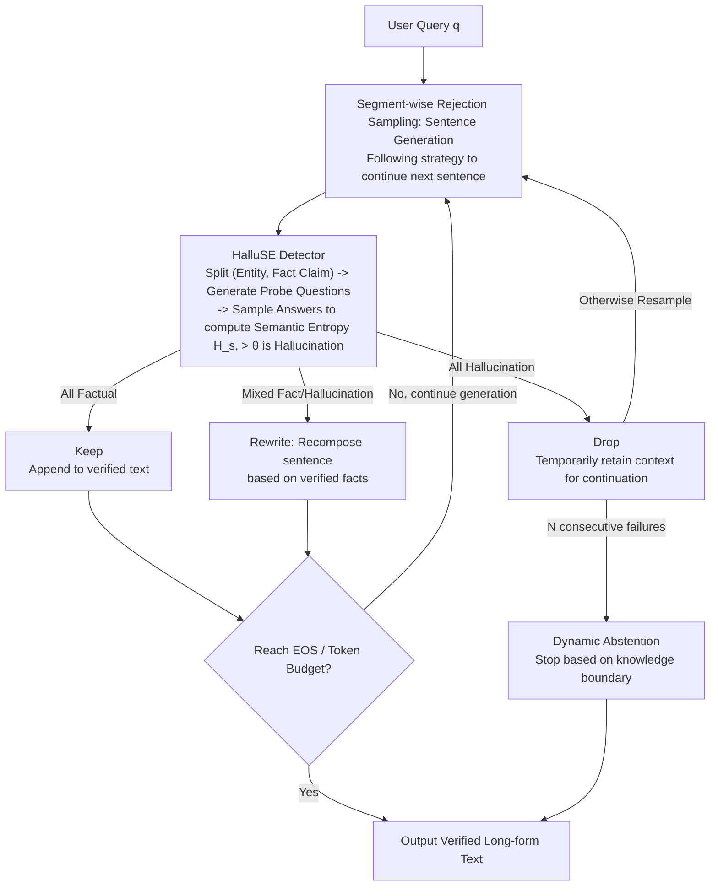

# Building Reliable Long-Form Generation via Hallucination Rejection Sampling

**Conference**: ICML 2026  
**arXiv**: [2606.03628](https://arxiv.org/abs/2606.03628)  
**Code**: https://github.com/TreeLLi/hallucination-rejection-sampling  
**Area**: Hallucination Detection  
**Keywords**: Hallucination mitigation, inference-time computation, semantic entropy, rejection sampling, long-form generation  

## TL;DR

This paper proposes the SHARS framework, which detects and rejects hallucinated content sentence-by-sentence during inference, retaining only verified factual segments to continue generation. Combined with an improved semantic entropy detector, HalluSE, it improves factual precision by approximately 20–26% on FactScore while maintaining or increasing the volume of factual information in the output.

## Background & Motivation

**Background**: Large Language Models (LLMs) perform excellently in open-ended long-form generation, but hallucination issues severely impact reliability. Existing mitigation methods are mainly divided into training-time methods (e.g., DPO preference optimization, FactAlign sentence-level rewards) and inference-time methods (e.g., DoLa contrastive decoding across layers, RAG retrieval-augmented generation).

**Limitations of Prior Work**: Long-form generation suffers from a **hallucination snowballing** effect, where early errors propagate and amplify subsequent inaccuracies. Existing inference-time methods either require external knowledge bases (RAG) or intervene only at the token level (DoLa), failing to effectively block the sentence-by-sentence accumulation of errors.

**Key Challenge**: Open-ended questions often have an infinite space of valid information, but models actually utilize only a limited subset. If hallucinated content can be filtered out and the model guided to explore truthful content within the remaining information space, the chain of error propagation can be broken.

**Goal**: Design a generic inference-time framework that can (1) detect and reject hallucinated segments sentence-by-sentence, (2) continue generation only on the basis of verified facts, and (3) operate without relying on external knowledge bases.

**Key Insight**: The authors observe that the paradigm of inference-time compute scaling has not been fully explored in the context of factuality. Furthermore, users in high-risk scenarios are willing to trade more inference time for more reliable outputs.

**Core Idea**: Use segment-wise rejection sampling to filter hallucinations sentence-by-sentence, continuing generation only on verified facts to block the hallucination snowball effect at its source.

## Method

### Overall Architecture

SHARS integrates "sentence-wise generation and sentence-wise verification" into a closed loop: given a query $q$, the model immediately passes each generated sentence to the hallucination detector HalluSE for verification. Depending on the result, the sentence is kept, rewritten, or dropped, and the model continues writing only on the verified text. This process continues until the model generates an EOS token, hits a maximum token budget, or fails to sample non-hallucinated content after $N$ consecutive attempts. This ensures errors are intercepted at the first sentence they appear, preventing them from snowballing through the context.

### Key Designs

**1. Segment-wise Rejection Sampling: Decomposing Whole-document Rejection into Sentences**

The most difficult aspect of long-form hallucination is the snowball effect—an early factual error leads to further fabrication based on that error. Traditional best-of-N approaches are too coarse, as errors have already propagated before selection. SHARS applies rejection sampling dynamically to **every sentence**: after a sentence is generated, the detector decomposes it into a set of factual claims and verifies them individually. It then handles three cases: if the whole sentence is hallucinated, it is dropped; if it is a mix, the LLM rewrites it to retain only verified parts; if it is entirely factual, it is kept. A counter-intuitive detail in rewriting: rather than "telling the model to delete hallucinations," it is more effective to "list verified facts and ask the model to re-compose the sentence." Sampling the next sentence uses a **Following strategy**—the identified hallucinated sentence is temporarily kept in the context to guide the model on what to write next (avoiding repeated attempts at the same knowledge), but it is excluded from subsequent semantic entropy calculations to prevent polluting the detection signals.

**2. HalluSE Detector: Fixing Three Flaws in Semantic Entropy for Long-form Contexts**

Naive semantic entropy is inaccurate for long-form text, so HalluSE introduces three targeted improvements. First, it decomposes text into (Entity, Fact Claim) pairs rather than just claims to avoid entity ambiguity during probing. Second, it generates $Q$ probe questions for each fact using refined prompts to ensure expected answers are unique and unambiguous. Third, when sampling $A$ answers for each question, it explicitly requires the LLM to list all valid answers, preventing "multiple correct answers" from being misidentified as high entropy. Finally, it averages the semantic entropy across questions, flagging hallucinations if the value exceeds a threshold $\theta$. Semantic entropy is defined as $H_s = -\sum_i p(C_i) \log p(C_i)$, where $C_i$ represents semantic clusters of equivalent answers, and $p(C_i) = \sum_{y \in C_i} p(y)$. If the model is certain, answers will cluster with low entropy; if it is fabricating, answers will diverge with high entropy.

**3. Dynamic Abstention: Enabling Model Awareness of Knowledge Boundaries**

When $N$ consecutive resampling attempts of a new sentence are all judged as hallucinations, SHARS terminates generation and chooses to abstain. This abstention can occur at the beginning (if the model knows nothing about the query) or mid-way (after the model finishes writing what it is certain about). It requires no additional calibration; it is a natural stop after repeated sampling failures, essentially perceiving the boundaries of the model's parameterized knowledge. Furthermore, adjusting the detection threshold $\theta$ allows for a smooth trade-off between "response rate" and "factual precision"—a tighter $\theta$ is more conservative, preferring no answer to an incorrect one.

## Key Experimental Results

### Main Results

Evaluation on the FactScore benchmark with no length constraints (Qwen3-32B):

| Method | Response Rate (%) | Unsupp. Facts | Supp. Facts | Factual Prec. (%) |
|------|-----------|-------------|-----------|------------|
| Greedy | 99.5 | 8.8 | 9.7 | 52.4 |
| DoLa | 95.6 | 9.3 | 8.2 | 53.1 |
| ChatProtect | 98.9 | 8.1 | 6.8 | 54.4 |
| Self-Endorse | 91.8 | 4.9 | 8.4 | 63.2 |
| **SHARS-Info** | **92.9** | **4.2** | **11.7** | **73.5** |
| **SHARS-Prec** | **82.4** | **3.1** | **11.1** | **78.4** |

FactualBio hallucination detection evaluation (Qwen3-32B, Major+Minor):

| Method | AUROC | AURAC | Acc@0.8 | Acc@0.9 |
|------|-------|-------|---------|---------|
| Self-Check | 57.6 | 69.3 | 73.5 | 73.5 |
| P(True) | 69.8 | 73.3 | 70.0 | 70.0 |
| Naive SE | 66.2 | 73.1 | 70.5 | 70.5 |
| **HalluSE** | **72.9** | **77.3** | **75.4** | **72.8** |

### Ablation Study

| Sampling Strategy | Rewrite | Response Rate (%) | Factual Prec. (%) | Relative Time |
|----------|------|-----------|------------|---------|
| Following | Yes | 91.8 | 69.4 | 1.00× |
| Temperature | Yes | 95.6 | 64.8 | 1.01× |
| Following | No | 54.4 | 73.5 | 1.60× |
| Temperature | No | 40.1 | 76.2 | 1.55× |

### Key Findings

- **Contributions from both Framework and Detector**: Even when replacing semantic entropy with naive token-level entropy (Ours-NE), factual precision reaches 70.1%, outperforming the strong baseline Self-Endorse (63.2%), demonstrating the effectiveness of the segment-wise rejection strategy.
- **Complementary to Training-time Methods**: Adding SHARS on top of FactAlign boosts factual precision from 53.1% to 80.6% (without length constraints), showing that inference-time and training-time methods can work synergistically.
- **Effective for Small Models**: A +16–24% precision gain was observed on Qwen3-4B, indicating the method does not rely solely on strong instruction-following capabilities.
- **Rewriting is Crucial for Response Rate**: Disabling rewriting caused the response rate to drop from 91.8% to 54.4% because mixed sentences were discarded entirely, leading to excessive abstention. The Following strategy outperformed the Temperature strategy in both supported facts and precision.

## Highlights & Insights

- **New Paradigm for Inference-Time Factuality Scaling**: For the first time, this work systematically demonstrates the scaling characteristics of inference-time compute for factuality in open-ended generation—increasing computation within reasonable bounds consistently improves precision, with efficiency 2–3x better than methods like Self-Endorse.
- **Positive Example Rewriting vs. Negative Deletion**: Asking the LLM to re-compose sentences based on a list of verified facts is more effective than providing the original sentence with labels to delete hallucinations. This is particularly significant for small and medium-sized models.
- **Spontaneous Knowledge Boundary Perception**: The abstention mechanism realizes awareness of the model's parameterized knowledge boundaries naturally, without requiring external calibration.

## Limitations & Future Work

- Does not introduce external knowledge; if the model is entirely ignorant of a topic, rejection sampling cannot generate new correct information and can only choose to abstain.
- Inference-time compute overhead remains high (approx. 10–50× Greedy); while better than baselines at equivalent precision, it remains challenging for latency-sensitive scenarios.
- Current evaluation is limited to English factuality; cross-lingual and non-factual hallucination (e.g., logical inconsistency) scenarios have not yet been validated.
- Future directions: (1) Combining with RAG to fill knowledge gaps; (2) Distilling the detector into lightweight probes; (3) Exploring more efficient batch sentence-level detection methods.

## Related Work & Insights

- **Semantic Entropy** (Farquhar et al., 2024): The foundation for HalluSE, improved here for long-form scenarios via entity decomposition, prompt refinement, and multi-answer handling.
- **FactAlign** (Huang & Chen, 2024): A training-time sentence-level factual reward method, which is orthogonal and complementary to SHARS.
- **DoLa** (Chuang et al., 2024): Contrastive decoding that operates at the token level, which is too fine-grained to block sentence-level error propagation.
- **Self-Endorse** (Wang et al., 2024): A self-consistency verification method with high precision but even greater computational overhead.

<!-- RELATED:START -->

## Related Papers

- [\[ACL 2025\] Learning Auxiliary Tasks Improves Reference-Free Hallucination Detection in Open-Domain Long-Form Generation](../../ACL2025/hallucination/learning_auxiliary_tasks_improves_reference-free_hallucination_detection_in_open.md)
- [\[ICML 2026\] TAG: Tangential Amplifying Guidance for Hallucination-Resistant Sampling](tag_tangential_amplifying_guidance_for_hallucination-resistant_sampling.md)
- [\[ICLR 2026\] Micro-Macro Retrieval: Reducing Long-Form Hallucination in Large Language Models](../../ICLR2026/hallucination/micro-macro_retrieval_reducing_long-form_hallucination_in_large_language_models.md)
- [\[ACL 2025\] Fine-grained Hallucination Detection and Mitigation in Long-form Question Answering](../../ACL2025/hallucination/localizing_and_mitigating_errors_in_long-form_question_answering.md)
- [\[ICML 2026\] Finding the Correct Visual Evidence Without Forgetting: Mitigating Hallucination in LVLMs via Inter-Layer Visual Attention Discrepancy](finding_the_correct_visual_evidence_without_forgetting_mitigating_hallucination_.md)

<!-- RELATED:END -->
