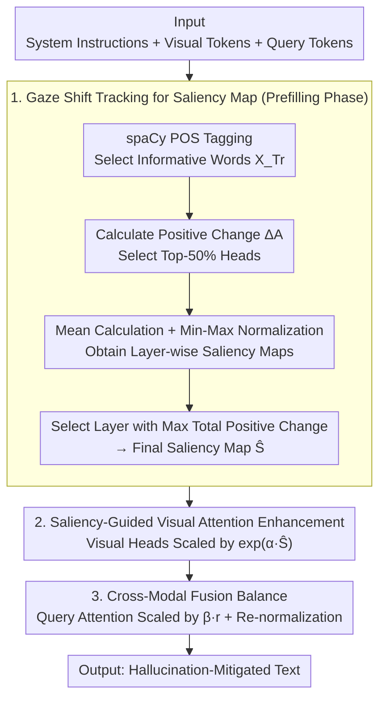

# Capturing Gaze Shifts for Guidance: Cross-Modal Fusion Enhancement for VLM Hallucination Mitigation

**Conference**: ICML 2026  
**arXiv**: [2510.22067](https://arxiv.org/abs/2510.22067)  
**Code**: https://github.com/amazon-science/GIFT  
**Area**: Hallucination Detection  
**Keywords**: VLM Hallucination Mitigation, Attention Shift, Cross-Modal Fusion, Visual Saliency, Inference-time Intervention  

## TL;DR
The GIFT method is proposed, which constructs a visual saliency map by tracking positive changes in visual attention ("gaze shifts") as the VLM interprets user queries. During the decoding stage, it simultaneously enhances attention for both visual and query tokens to maintain cross-modal fusion balance, achieving up to 20.7% improvement on CHAIR with only 1.13× latency overhead.

## Background & Motivation

**Background**: Visual Language Models (VLMs) have achieved significant progress in tasks like visual question answering and image captioning, but remain prone to hallucinations—generating content unsupported by textual or visual inputs. This poses a serious threat in high-risk domains such as medicine, autonomous driving, and robotics.

**Limitations of Prior Work**: Research indicates that hallucinations primarily stem from VLMs over-relying on language priors while ignoring visual inputs. Existing inference-time mitigation methods are categorized into three types: contrastive decoding (requires generating contrastive distributions, high computational cost), visual input modification (requires additional forward passes), and attention guidance (e.g., VAF, which scales visual token attention proportional to absolute scores). However, these methods suffer from two critical flaws: first, they ignore the **visual attention sink** problem, where attention is consistently allocated to task-irrelevant visual regions; second, they only enhance visual attention without adjusting query token attention, leading to **cross-modal fusion imbalance**.

**Key Challenge**: Simply amplifying visual token attention simultaneously scales attention in erroneous regions and weakens the model's understanding of the user query, failing to concurrently resolve the attention sink, insufficient visual contribution, and cross-modal fusion imbalance.

**Goal**: Design an inference-time method capable of (1) precisely locating task-relevant visual regions and filtering attention sink noise; and (2) simultaneously enhancing visual and query token attention to maintain cross-modal fusion balance.

**Key Insight**: Inspired by human vision—humans dynamically shift their "gaze" to capture relevant visual information while reading a question. As a VLM processes informative words in a query (nouns, verbs, adjectives, etc.), its visual attention undergoes positive changes. Tracking these "gaze shifts" naturally filters out attention sink noise, as attention changes in irrelevant regions are minimal.

**Core Idea**: Precompute a saliency map by tracking positive changes in visual attention while the VLM processes the query, and use this map during decoding to simultaneously guide attention enhancement for both visual and query tokens.

## Method

### Overall Architecture
GIFT consists of two phases: (1) The prefilling phase, where "gaze shifts" (positive changes in visual attention) are tracked as the model processes the user query to construct a visual saliency map; (2) The decoding phase, where the saliency map is utilized in key cross-modal fusion layers to simultaneously enhance both visual and query token attention. The input is a standard VLM triplet (system instruction $X_S$, visual tokens $X_V$, query tokens $X_T$), and the output is the hallucination-mitigated generated text.

### Key Designs

**1. Gaze Shift Tracking for Saliency Map: Using "Positive Change" instead of absolute values to naturally filter attention sinks**

Existing attention guidance methods (like VAF) amplify visual tokens based on absolute attention scores. However, attention is often stuck in task-irrelevant regions (visual attention sinks); amplifying absolute attention thus scales this noise. GIFT changes the signal source: when reading a question, humans shift their gaze to capture relevant visual info. VLMs also show positive changes in visual attention when processing informative words in a query—while irrelevant regions show almost no change. Thus, spaCy POS tagging is first used to select informative words (NOUN/VERB/ADJ/ADV/NUM/PROPN) to form the token set $X_{Tr}$. For each layer, the top-50% heads $\hat{\mathcal{H}}^l_{TrV}$ with the largest cumulative positive changes are chosen. The positive change is calculated as $\Delta\mathbf{A}^l_{h,i,j}=\max(\mathbf{A}^l_{h,i,j}-\mathbf{A}^l_{h,i-1,j},0)$. By averaging over selected heads and informative tokens, the saliency map $\hat{\mathcal{S}^l}$ is obtained and min-max normalized. Finally, the layer with the highest total positive change is selected. By tracking only positive shifts rather than average attention, the method uses a differential signal to automatically filter sink noise—the normalized saliency score for the shift method (11.92) is 2.2x higher than the static method (5.40).

**2. Saliency-Guided Visual Attention Enhancement: Using precomputed global saliency rather than step-wise attention**

Once the saliency map is obtained, in the selected enhancement layers $\mathcal{L}$, the top-50% visual attention heads $\mathcal{H}^l_{OV}$ are amplified according to the saliency: $\hat{\bm{A}}^l_{h,-1,j}=\bm{A}^l_{h,-1,j}\cdot\exp(\alpha\hat{\mathcal{S}}_j)$ (where $\alpha$ is a scaling factor). The saliency map is truncated at 3 standard deviations before normalization to avoid excessive focusing. The key here is using the saliency map computed during prefilling rather than the current decoding step's attention scores—the former provides a global view based on the full query context, while the latter re-introduces sink noise from step-wise attention. In other words, "where to look" is determined once during prefilling, and decoding simply follows this map to avoid being distracted by noise.

**3. Cross-Modal Fusion Balance: Scaling query attention proportionally to vision to prevent "looking right but reading wrong"**

Amplifying only visual attention carries a risk: as visual weight increases, the relative attention the model pays to the user query is diluted. This results in the model focusing on the right image region but misunderstanding the question, leading to imbalanced cross-modal fusion. GIFT compensates for this with synchronized scaling—first, the visual enhancement ratio is calculated as $r^l=\sum_{h,j}\hat{\bm{A}}^l_{h,-1,j}/\bm{A}^l_{h,-1,j}$. Then, the query token attention in query heads $\mathcal{H}^l_{OT}$ is multiplied by $\beta r^l$ (default $\beta=1.0$), followed by a re-normalization of the entire attention matrix. The enhancement layers are chosen by analyzing the attention ratio of output tokens to visual and query tokens, selecting middle layers where both trends are consistent. This "sync-scaling" mechanism is simple yet critical, preserving the original vision-text balance; ablation shows full GIFT improves up to 25.4% over vision-only enhancement.

## Key Experimental Results

### Main Results

| Model | Method | CHAIR $C_s$↓ | CHAIR $C_i$↓ | POPE F1↑ | POPE Acc↑ | MMHal Hal↓ | MMHal Score↑ |
|------|------|-------------|-------------|----------|----------|------------|-------------|
| LLaVA-1.5 7B | Greedy | 50.2 | 15.4 | 82.4 | 79.5 | 65.2 | 2.22 |
| LLaVA-1.5 7B | VAF | 49.6 | 14.3 | 81.0 | 77.2 | 66.3 | 2.16 |
| LLaVA-1.5 7B | VCD | 52.2 | 16.3 | 80.9 | 77.7 | 60.5 | 2.37 |
| LLaVA-1.5 7B | **GIFT** | **39.8** | **10.6** | **83.8** | **81.9** | **57.3** | **2.48** |
| Qwen2-VL 7B | Greedy | 24.8 | 9.1 | 86.0 | 86.5 | 32.7 | 3.53 |
| Qwen2-VL 7B | **GIFT** | **21.2** | **7.7** | **86.8** | **86.9** | **27.5** | **3.58** |
| Qwen3-VL 8B | Greedy | 51.4 | 10.6 | 88.9 | 88.5 | 28.3 | 4.80 |
| Qwen3-VL 8B | **GIFT** | **49.4** | **9.3** | **89.1** | **88.7** | **26.4** | **4.84** |

### Ablation Study

| Model | Configuration | MMHal Hal↓ | MMHal Score↑ | POPE F1↑ | POPE Acc↑ |
|------|------|------------|-------------|----------|----------|
| LLaVA-1.5 7B | Inc. V. (Vision Only) | 60.8 | 2.36 | 82.3 | 79.3 |
| LLaVA-1.5 7B | Cal. V. (Calibrate Only) | 61.5 | 2.32 | 82.4 | 79.5 |
| LLaVA-1.5 7B | **GIFT (Full)** | **57.3** | **2.48** | **83.8** | **81.9** |
| Qwen2-VL 7B | Inc. V. | 35.2 | 3.41 | 85.3 | 86.0 |
| Qwen2-VL 7B | Cal. V. | 31.9 | 3.56 | 85.8 | 86.4 |
| Qwen2-VL 7B | **GIFT (Full)** | **27.5** | **3.58** | **86.8** | **86.9** |

### Key Findings
- Both components (visual attention enhancement + cross-modal fusion balance) are indispensable; full GIFT improves performance by up to 25.4% over visual-only enhancement.
- GIFT maintains performance parity with greedy decoding on general vision-language benchmarks (MME, SEED), whereas several baseline methods suffer performance degradation.
- GIFT introduces only 1.13× latency compared to greedy decoding, significantly lower than VCD (1.99×) and VAR (11.10×).
- Layer selection for enhancement is robust, with various mid-range configurations yielding strong results.
- LLM-based informative word extraction is more accurate than POS tagging (MMHal hallucination rate 52.6% vs 57.3%), but at a higher computational cost.

## Highlights & Insights
- The "gaze shift" analogy is highly intuitive: utilizing the **positive change** in attention rather than absolute values to build a saliency map essentially uses a differential signal to replace a static one, naturally filtering attention sink noise without extra modules.
- The design of cross-modal fusion balance is a significant takeaway: solely enhancing visual attention disrupts the visual-textual attention ratio. Scaling query attention proportionally is a simple but often overlooked necessity. This "synchronized scaling" approach could be transferred to any attention intervention method requiring multi-modal balance.
- Saliency map extraction layers appear to be an intrinsic model property rather than data-dependent: peak layers remain consistent across different datasets and random seeds, suggesting that visual information integration in VLMs occurs at fixed network depths.

## Limitations & Future Work
- When queries are irrelevant to the image or largely contain non-visual content, gaze shifts may produce inaccurate saliency maps.
- POS tagging is not precise enough for extracting informative words; LLM-based methods are superior but increase overhead—a lightweight classifier might be a middle-ground solution.
- The method was validated only on LLaVA-1.5 and Qwen series, excluding other architectures like InternVL.
- Applicability to multi-turn dialogue scenarios has not been explored; the quality of saliency maps under complex query contexts needs verification.

## Related Work & Insights
- **VAF** (ClearSight): Scales visual token attention based on current-step scores but ignores attention sinks and cross-modal balance.
- **VAR**: Identifies visual sink tokens and redistributes attention but does not address insufficient visual contribution and has high latency (11.10×).
- **VCD**: Contrasts output distributions of original and disturbed visual inputs; requires generating contrastive outputs with 1.99× latency.
- The attention sink phenomenon is present in LLMs, ViTs, and VLMs; this paper's gaze shift mechanism offers a novel strategy to circumvent it.

<!-- RELATED:START -->

## Related Papers

- [\[CVPR 2026\] Cross-Modal Attention Calibration for LVLM Hallucination Mitigation](../../CVPR2026/hallucination/cross-modal_attention_calibration_for_lvlm_hallucination_mitigation.md)
- [\[AAAI 2026\] InEx: Hallucination Mitigation via Introspection and Cross-Modal Multi-Agent Collaboration](../../AAAI2026/hallucination/inex_hallucination_mitigation_via_introspection_and_cross-mo.md)
- [\[ICML 2026\] TAG: Tangential Amplifying Guidance for Hallucination-Resistant Sampling](tag_tangential_amplifying_guidance_for_hallucination-resistant_sampling.md)
- [\[ICLR 2026\] Imitating the Truth: Attention-aware Truth-Guided Enhancement for Hallucination Mitigation in Large Vision-Language Models](../../ICLR2026/hallucination/imitating_the_truth_attention-aware_truth-guided_enhancement_for_hallucination_m.md)
- [\[ICLR 2026\] Cat-PO: Cross-modal Adaptive Token-rewards for Preference Optimization in Truthful Multimodal LLMs](../../ICLR2026/hallucination/cat-po_cross-modal_adaptive_token-rewards_for_preference_optimization_in_truthfu.md)

<!-- RELATED:END -->
