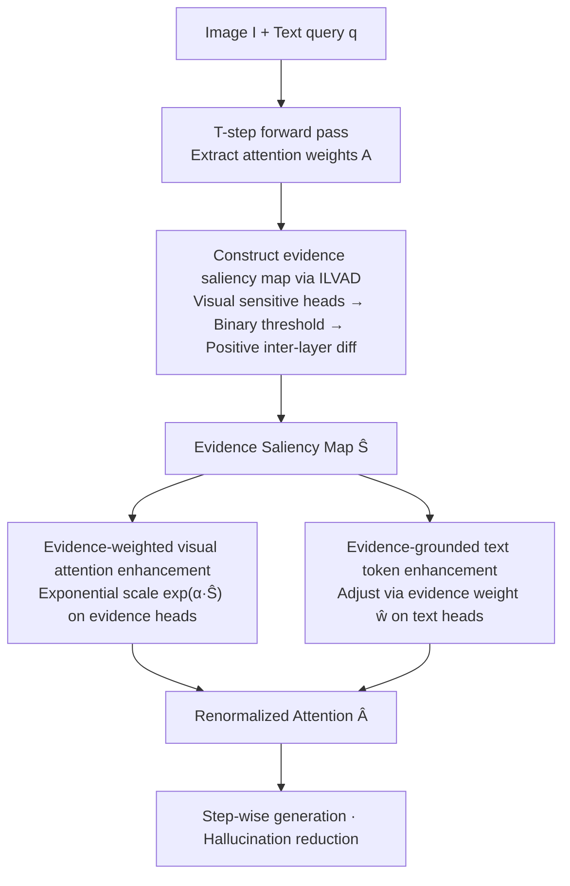

# Finding the Correct Visual Evidence Without Forgetting: Mitigating Hallucination in LVLMs via Inter-Layer Visual Attention Discrepancy

**Conference**: ICML 2026  
**arXiv**: [2605.20965](https://arxiv.org/abs/2605.20965)  
**Code**: https://github.com/ytx-ML/ILVAD (Available)  
**Area**: Hallucination Detection  
**Keywords**: Hallucination Mitigation, Visual Attention, Inter-Layer Discrepancy, Saliency Map, Train-free

## TL;DR
This paper identifies that LVLM hallucinations originate from "insufficient attention + forgetting during generation" regarding correct visual evidence. Observing a significant Inter-Layer Visual Attention Discrepancy (ILVAD) for visual evidence, the authors propose a train-free/plug-and-play method: constructing a visual evidence saliency map via inter-layer differentiation, then continuously weighting visual evidence tokens and "evidence-grounded" text tokens during generation. This consistently reduces hallucinations across 5 LVLMs and 5 hallucination/comprehensive benchmarks.

## Background & Motivation

**Background**: Existing methods to mitigate LVLM hallucinations primarily fall into four categories: alignment/fine-tuning based on external knowledge bases (high computational cost), post-processing correction, contrastive decoding (adjusting logits, e.g., VCD/CODE/AGLA/ONLY), and attention intervention (e.g., VAR/SPARC/VHR based on attention sinks or vision-sensitive heads).

**Limitations of Prior Work**: Decoding-level methods only adjust logits without forcing the model to truly "look at the image." Attention redistribution methods recognize that models allocate excessive attention to query-irrelevant visual sinks, but they do not guarantee that attention shifts to the *correct* visual evidence, often failing when linguistic priors are too strong.

**Key Challenge**: The authors empirically discover two phenomena: (i) at the sample level, the average attention on visual evidence in hallucinated samples is significantly lower than in correct samples; (ii) at the step level, attention on visual evidence decays as long-text generation progresses, synchronized with rising hallucination frequency. This suggests the issue is not "insufficient total attention" but "failure to locate correctly + failure to maintain focus."

**Key Insight**: Layer-level analysis reveals a neglected phenomenon: LVLM attention on visual evidence exhibits a strong Inter-Layer Visual Attention Discrepancy (ILVAD). While visual sinks receive high attention across almost every layer, visual evidence is only "seen" in specific layers, with large gaps between adjacent layers. This provides a natural signal to distinguish "evidence vs. sink"—the former is sparsely activated across layers, while the latter is continuously activated.

**Core Idea**: Use inter-layer differentiation (positive part of subsequent layer activation minus preceding layer activation) to accumulate a visual evidence saliency map, filtering out sinks and retaining "true evidence." This map then boosts attention to evidence tokens and amplifies "evidence-grounded" text tokens during generation.

## Method

### Overall Architecture
ILVAD addresses the dual issues of "failing to see correct evidence" and "gradual forgetting during long-text generation" by modifying attention weights without changing architecture or decoding strategies. Given an image $I$ and query $q$, the method first runs the model for the first $T$ generated tokens to extract attention weights $\mathbf{A}^{l,h}$, followed by two steps: first, **Evidence Localization**, refining "which visual tokens are true evidence" into a saliency map $\hat{\mathbf{S}} \in [0,1]^{|\mathbf{X}_v|}$; second, **Evidence Preservation**, using this map in each subsequent step to weight visual evidence tokens and "evidence-grounded" text tokens before re-normalizing to $\hat{\mathbf{A}}$. This pipeline is decoupled from specific LVLMs and is compatible with LLaVA-1.5/NeXT, Qwen2/3-VL, and InternVL3.

### Key Designs

**1. Saliency Map via Inter-Layer Differentiation: Filtering Sinks and Locating Evidence**

Visual tokens contain true evidence, visual sinks, and noise. To refine localization, the method sorts heads by total visual attention per layer $l$ and keeps the top 50% vision-sensitive heads $\mathbf{H}_v^l$. The mean attention $\bar{\mathbf{A}}_j^l$ onto visual token $j$ from the first $T$ tokens is binarized using $\tilde{\mathbf{A}}_j^l = \mathbb{1}[\bar{\mathbf{A}}_j^l > \tau \cdot \mathrm{mean}(\bar{\mathbf{A}}^l)]$. The crucial step is inter-layer differentiation: $\mathbf{S} = \sum_{l=1}^{L-1} \max(\tilde{\mathbf{A}}^{l+1} - \tilde{\mathbf{A}}^l, 0)$. This operator accumulates tokens that "light up" in layer $l+1$ but were dark in $l$. Since visual sinks are persistently active across layers, the diff $\max(\tilde A^{l+1}-\tilde A^l,0)$ approaches 0 for them, while true visual evidence is captured as "appearance events."

**2. Evidence-Weighted Visual Attention Enhancement: Proportional Scaling**

To counter attention decay during long generation, the method actively boosts evidence token attention. An "evidence ratio" $\mathbf{e}_i^{l,h} = \sum_{j \in \mathbf{X}_v} \hat{\mathbf{S}}_j \mathbf{A}_{i,j}^{l,h} / \sum_{j \in \mathbf{X}_v} \mathbf{A}_{i,j}^{l,h}$ identifies the top 50% evidence-sensitive heads $\mathbf{H}_e^l$. On these heads, attention is exponentially scaled: $\hat{\mathbf{A}}_{i,j}^{l,h} = \mathbf{A}_{i,j}^{l,h} \cdot \exp(\alpha \hat{\mathbf{S}}_j)$. Unlike methods that amplify all visual tokens (including sinks), $\hat{\mathbf{S}}_j$ ensures only legitimate evidence is boosted, preserving heads responsible for semantic modeling.

**3. Evidence-Grounded Text Token Enhancement: Prioritizing "Grounded" History**

When generating, models often "copy" from previous hallucinated text. The method calculates an "evidence weight" $\mathbf{w}_i = \frac{1}{L \cdot |\mathbf{H}_t^l|} \sum_{h,l,j} \hat{\mathbf{S}}_j \mathbf{A}_{i,j}^{l,h}$ for each generated text token $i$, representing its cumulative attention on visual evidence. These weights $\hat{\mathbf{w}} \in [0,1]^{|\mathbf{X}_t|}$ adjust text-to-text attention via $\hat{\mathbf{A}}_{i,j}^{l,h} = \mathbf{A}_{i,j}^{l,h} \cdot (\hat{\mathbf{w}}_i + \beta)$, where $\beta$ is a baseline protector. This incentivizes the model to reference tokens that were actually grounded in visual evidence while suppressing those generated based on purely linguistic priors.

### Loss & Training
**Completely train-free**. All operations directly modify attention weights during inference followed by standard softmax normalization. Key hyperparameters: $\tau$ (threshold, default $5$), $\alpha$ (visual intensity, $3$ for LLaVA-NeXT, $5$ for others), $\beta$ (text baseline, $1$ for discriminative, $0.2-0.5$ for generative benchmarks), $T$ (steps, default $10$), and head ratio $\rho=0.5$.

## Key Experimental Results

### Main Results

Evaluated on 5 LVLMs across 3 hallucination benchmarks (CHAIR / POPE / MMHal-Bench) against 10 baselines (e.g., VCD, AGLA, VHR). Data for LLaVA-1.5-7B:

| Method | CHAIR$_S$↓ | CHAIR$_I$↓ | POPE Acc↑ | POPE F1↑ | MMHal Hal.↓ | MMHal Score↑ |
|---|---|---|---|---|---|---|
| Greedy | 48.6 | 13.52 | 84.50 | 85.22 | 67.0 | 2.01 |
| VCD | 48.4 | 13.47 | 84.74 | 85.31 | 61.8 | 2.20 |
| AGLA | 46.4 | 13.27 | 85.63 | **86.38** | 63.8 | 2.14 |
| VAR | 52.5 | 14.17 | 84.82 | 85.87 | 62.2 | 2.18 |
| VHR | 34.5 | 9.86 | 84.74 | 85.45 | 65.6 | 2.10 |
| **Ours (ILVAD)** | **32.6** | **9.42** | **85.76** | 86.12 | **61.5** | **2.22** |

Compared to greedy decoding, LLaVA-1.5-7B shows a 31.6% reduction in CHAIR$_S$. Newer models such as Qwen2/3-VL and InternVL3 also show consistent gains (e.g., Qwen2-VL-7B CHAIR$_S$ 20.8→17.8).

### Ablation Study

| Configuration | CHAIR$_S$↓ | CHAIR$_I$↓ | POPE Acc↑ | POPE F1↑ |
|---|---|---|---|---|
| Baseline (greedy) | 48.6 | 13.52 | 84.50 | 85.22 |
| w/o Visual Enh. | 49.4 | 13.44 | 84.44 | 85.12 |
| w/o Text Enh. | 34.8 | 9.73 | 85.59 | 85.85 |
| Full ILVAD | **32.6** | **9.42** | **85.76** | **86.12** |

### Key Findings
- **Visual enhancement is the core driver**: Removing it results in performance near the baseline (CHAIR$_S$ 49.4 vs 48.6). Text enhancement provides a supplementary 2-point boost.
- **Negligible Inference Overhead**: ILVAD uses element-wise multiplication and normalization, maintaining a runtime comparable to greedy decoding and outperforming contrastive methods requiring two forward passes (e.g., VCD).
- **Step-level Visual Forgetting**: Empirical measurement shows visual evidence attention decays monotonically while hallucination rate rises as generation length increases.

## Highlights & Insights
- **Inter-layer Differentiation as a Sink Filter**: Translating the observation that "sinks are persistent while evidence is sparse across layers" into a simple $\max$-diff operator is elegant. It avoids external detectors or extra training.
- **Decoupling Perception and Grounding**: Visual enhancement addresses "where to look," while text enhancement addresses "which history to trust." Both are driven by the same saliency map $\hat{\mathbf{S}}$, ensuring conceptual consistency.
- **Quantifying Forgetting**: The paper provides a measurable attention metric for the synchronization of attention decay and hallucination frequency, confirming that hallucination is often a state of "drifting" away from visual input.

## Limitations & Future Work
- The saliency map is "frozen" after $T=10$ tokens. For extremely long generation where the semantic focus shifts (e.g., from foreground to background), a static map might fail. Sliding window updates could be an extension.
- Effectiveness on relation/attribute hallucinations is weaker than on object existence. MME benchmarks for position/color show limited gains, suggesting ILVAD cannot fix hallucinations caused by inherently ambiguous visual features.
- $\beta$ requires manual tuning per task type (discriminative vs. generative), lacking an automated adaptation strategy.

## Related Work & Insights
- **vs. VAR / EVAS**: VAR redistributes sink attention to *all* other tokens. ILVAD specifically targets *evidence* tokens via inter-layer diff, which is why VAR degrades on CHAIR (52.5) while ILVAD excels (32.6).
- **vs. SPARC**: SPARC focuses on differentiation across "time" (generation steps), whereas ILVAD focuses on differentiation across "layers." These are orthogonal and potentially combinable.
- **vs. AGLA / VCD**: These require contrastive decoding with dual forward passes, doubling the cost. ILVAD achieves superior or comparable results with a single forward pass and minimal tensor ops.

## Rating
- **Novelty**: ⭐⭐⭐⭐ The "inter-layer diff as sink filter" is a clean and original operator.
- **Experimental Thoroughness**: ⭐⭐⭐⭐ Extensive coverage across 5 models and 5 benchmarks, though it lacks specialized evaluation for attribute-level hallucinations.
- **Writing Quality**: ⭐⭐⭐⭐ Clear progression from observation to method; Figure 1 effectively summarizes the core evidence.
- **Value**: ⭐⭐⭐⭐ The train-free and low-overhead nature makes it highly attractive for deployment, and the inter-layer consistency perspective is insightful for explainability research.

<!-- RELATED:START -->
<!-- RELATED:END -->

## Related Papers

- [\[ICML 2026\] Learning from Fine-Grained Visual Discrepancies: Mitigating Multimodal Hallucinations via In-Context Visual Contrastive Optimization](learning_from_fine-grained_visual_discrepancies_mitigating_multimodal_hallucinat.md)
- [\[ICML 2026\] Automatic Layer Selection for Hallucination Detection](automatic_layer_selection_for_hallucination_detection.md)
- [\[CVPR 2026\] VES-RFT: Rewarding Visual Evidence Sensitivity to Mitigate Hallucinations in Large Vision-Language Models](../../CVPR2026/hallucination/ves-rft_rewarding_visual_evidence_sensitivity_to_mitigate_hallucinations_in_larg.md)
- [\[ACL 2025\] Visual Evidence Prompting Mitigates Hallucinations in Large Vision-Language Models](../../ACL2025/hallucination/visual_evidence_prompting.md)
- [\[CVPR 2026\] Same Attention, Different Truths: Put Logit-Lens over Visual Attention to Detect and Mitigate LVLM Object Hallucination](../../CVPR2026/hallucination/same_attention_different_truths_put_logit-lens_over_visual_attention_to_detect_a.md)

<!-- RELATED:END -->
