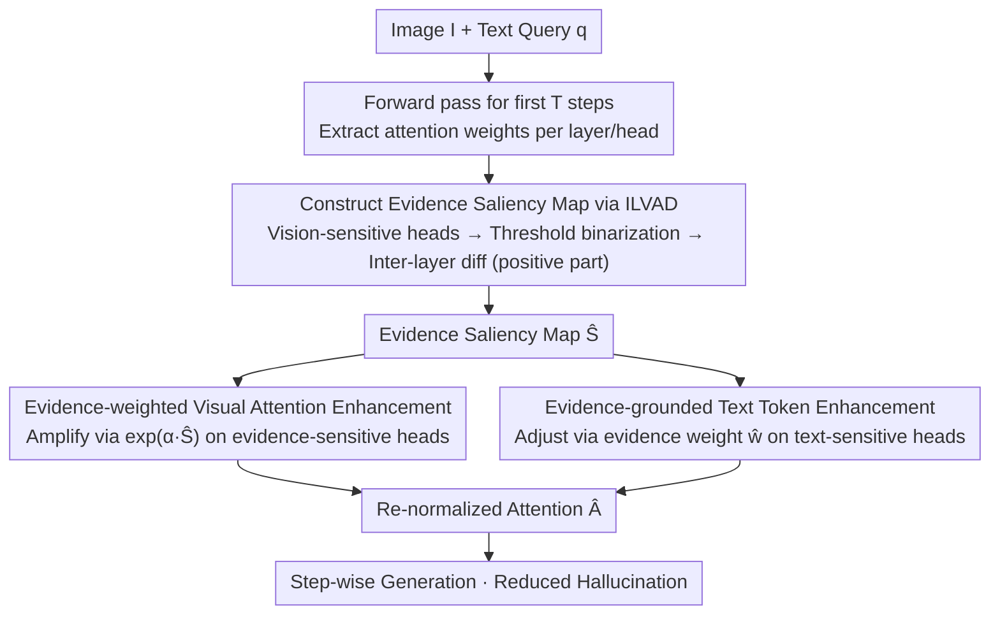

# Finding the Correct Visual Evidence Without Forgetting: Mitigating Hallucination in LVLMs via Inter-Layer Visual Attention Discrepancy

**Conference**: ICML 2026  
**arXiv**: [2605.20965](https://arxiv.org/abs/2605.20965)  
**Code**: https://github.com/ytx-ML/ILVAD (Available)  
**Area**: Hallucination Detection  
**Keywords**: Hallucination Mitigation, Visual Attention, Inter-Layer Discrepancy, Saliency Map, Training-Free

## TL;DR
This paper discovers that LVLM hallucinations stem from "under-attention to correct visual evidence + forgetting during generation." It observes a significant Inter-Layer Visual Attention Discrepancy (ILVAD) for visual evidence. Based on this, it proposes a train-free/plug-and-play method: constructing a visual evidence saliency map via inter-layer differentiation, and then continuously weighting visual evidence tokens and "evidence-grounded" text tokens during generation. This consistently reduces hallucinations across 5 LVLMs and 5 hallucination/comprehensive benchmarks.

## Background & Motivation

**Background**: Existing methods for mitigating LVLM hallucinations are categorized into four types: alignment/fine-tuning based on external knowledge bases (high computational cost), post-processing correction, contrastive decoding (e.g., VCD/CODE/AGLA/ONLY, adjusting at the logits layer), and attention intervention (e.g., VAR/SPARC/VHR, based on attention sinks or vision-sensitive heads).

**Limitations of Prior Work**: Decoding-layer methods only adjust logits and fail to make the model truly "look at the image." Attention redistribution methods recognize that models allocate too much attention to query-irrelevant visual sinks, but they do not guarantee that attention shifts to the correct visual evidence, still failing when language priors are too strong.

**Key Challenge**: The authors empirically find two things: (i) at the sample-level, hallucinated samples show significantly lower average attention to visual evidence than correct samples; (ii) at the step-level, attention to visual evidence decays as long-text generation progresses, with hallucination frequency rising synchronously. This indicates the problem is not a "lack of total attention" but rather "failing to find the right location + failing to maintain it once found."

**Key Insight**: Further layer-level analysis reveals a neglected phenomenon—ILVAD: visual sinks receive high attention in almost every layer, whereas visual evidence is only "seen" in specific layers, with large gaps between adjacent layers. This provides a natural signal to distinguish "evidence vs. sink"—the former is sparsely activated across layers, while the latter is continuously activated.

**Core Idea**: Accumulate a visual evidence saliency map using inter-layer differentiation (positive part of the difference between subsequent and preceding layer activations) to filter out sinks and retain "true evidence." This map is then used to continuously boost attention to evidence tokens and amplify "evidence-grounded" text tokens during generation.

## Method

### Overall Architecture
ILVAD addresses the issues of failing to attend to correct visual evidence and gradual forgetting during long-text generation. It avoids structural changes or decoding modifications, focusing solely on attention weights. Given an image $I$ and query $q$, the method first processes the first $T$ generated tokens to obtain attention weights $\mathbf{A}^{l,h}$ across layers and heads. It then follows two steps: first, **Evidence Localization**, refining "which visual tokens are true evidence" into a saliency map $\hat{\mathbf{S}} \in [0,1]^{|\mathbf{X}_v|}$; second, **Evidence Guarding**, using this map at each generation step to weight visual evidence tokens and "evidence-grounded" text tokens before re-normalizing to obtain $\hat{\mathbf{A}}$. This workflow is decoupled from specific LVLMs and is compatible with LLaVA-1.5/NeXT, Qwen2/3-VL, and InternVL3.

### Key Designs

**1. Saliency Map via Inter-layer Differentiation: Filtering Sinks and Locating Evidence Simultaneously**

Visual tokens consist of true evidence, visual sinks, and noise. Effective enhancement requires isolating evidence. The method first ranks heads by total visual attention in each layer $l$, keeping the top 50% vision-sensitive heads $\mathbf{H}_v^l$. It averages attention from the first $T$ generated tokens to each visual token $j$ as $\bar{\mathbf{A}}_j^l$, then binarizes "salient tokens" via $\tilde{\mathbf{A}}_j^l = \mathbb{1}[\bar{\mathbf{A}}_j^l > \tau \cdot \mathrm{mean}(\bar{\mathbf{A}}^l)]$. The critical step is $\mathbf{S} = \sum_{l=1}^{L-1} \max(\tilde{\mathbf{A}}^{l+1} - \tilde{\mathbf{A}}^l, 0)$, which only accumulates tokens "lit up" in layer $l+1$ but not in the previous layer. Finally, it is normalized to $\hat{\mathbf{S}}$. This works because visual sinks are active in almost every layer (differentiation yields near 0), while true evidence appears suddenly in specific layers—allowing a single unsupervised operator to filter sinks and locate evidence.

**2. Evidence-weighted Visual Attention Enhancement: Strictly Regulated Amplification**

Saliency maps alone are insufficient as visual attention decays during long generation. Evidence token attention must be actively boosted. An "evidence ratio" is calculated for each text token $i$ and head $(l,h)$ as $\mathbf{e}_i^{l,h} = \sum_{j \in \mathbf{X}_v} \hat{\mathbf{S}}_j \mathbf{A}_{i,j}^{l,h} / \sum_{j \in \mathbf{X}_v} \mathbf{A}_{i,j}^{l,h}$. The top 50% evidence-sensitive heads $\mathbf{H}_e^l$ are selected for exponential amplification: $\hat{\mathbf{A}}_{i,j}^{l,h} = \mathbf{A}_{i,j}^{l,h} \cdot \exp(\alpha \hat{\mathbf{S}}_j)$. Unlike VAF, which amplifies all visual tokens (including sinks), $\hat{\mathbf{S}}_j$ ensures amplification is strictly tied to "evidence-ness" and restricted to specific heads to avoid polluting semantic modeling.

**3. Evidence-grounded Text Token Enhancement: Empowering Tokens that "Actually Looked"**

Amplifying the visual side only solves "where to look." During generation, models rely heavily on previous tokens; if these tokens are hallucinations, errors propagate. An "evidence weight" is calculated for each generated text token $i$: $\mathbf{w}_i = \frac{1}{L \cdot |\mathbf{H}_t^l|} \sum_{h,l,j} \hat{\mathbf{S}}_j \mathbf{A}_{i,j}^{l,h}$, normalized to $\hat{\mathbf{w}} \in [0,1]^{|\mathbf{X}_t|}$. Attention between text tokens is adjusted via $\hat{\mathbf{A}}_{i,j}^{l,h} = \mathbf{A}_{i,j}^{l,h} \cdot (\hat{\mathbf{w}}_i + \beta)$, where $\beta$ is a baseline protection term. This scores previous tokens by how much evidence they incorporated, favoring "grounded" tokens and suppressing those based solely on "intuition."

### Loss & Training
**Completely train-free**. All operations directly modify attention weights during inference, followed by standard softmax normalization. Key hyperparameters: $\tau$ (threshold, default $5$), $\alpha$ (visual strength, $3$ for LLaVA-NeXT, $5$ for others), $\beta$ (text baseline, $1$ for discriminative benchmarks, $0.2-0.5$ for generative), $T$ ($10$ steps), and head ratio $\rho=0.5$.

## Key Experimental Results

### Main Results

Ours is compared against 10 baselines across 5 LVLMs and 3 hallucination benchmarks (results for LLaVA-1.5-7B):

| Method | CHAIR$_S$↓ | CHAIR$_I$↓ | POPE Acc↑ | POPE F1↑ | MMHal Hal.↓ | MMHal Score↑ |
|---|---|---|---|---|---|---|
| Greedy | 48.6 | 13.52 | 84.50 | 85.22 | 67.0 | 2.01 |
| VCD | 48.4 | 13.47 | 84.74 | 85.31 | 61.8 | 2.20 |
| AGLA | 46.4 | 13.27 | 85.63 | **86.38** | 63.8 | 2.14 |
| VAR | 52.5 | 14.17 | 84.82 | 85.87 | 62.2 | 2.18 |
| VHR | 34.5 | 9.86 | 84.74 | 85.45 | 65.6 | 2.10 |
| **Ours (ILVAD)** | **32.6** | **9.42** | **85.76** | 86.12 | **61.5** | **2.22** |

Ours achieves a 31.6% decrease in CHAIR$_S$ and 9.12% increase in MMHal Score relative to greedy on LLaVA-1.5-7B. Consistent improvements are seen on newer models like Qwen2-VL and InternVL3 (e.g., Qwen2-VL-7B CHAIR$_S$ 20.8→17.8). On MME, LLaVA-1.5-7B total score improved from 631.66 to 641.66.

### Ablation Study

| Configuration | CHAIR$_S$↓ | CHAIR$_I$↓ | POPE Acc↑ | POPE F1↑ |
|---|---|---|---|---|
| Baseline (greedy) | 48.6 | 13.52 | 84.50 | 85.22 |
| w/o Visual Enh. | 49.4 | 13.44 | 84.44 | 85.12 |
| w/o Text Enh. | 34.8 | 9.73 | 85.59 | 85.85 |
| Full ILVAD | **32.6** | **9.42** | **85.76** | **86.12** |

Sensitivity to $\tau$: At $\tau=1$, CHAIR$_S$=44.6 (sinks leak in). $\tau=5$ provides the best balance between benchmarks.

### Key Findings
- **Visual enhancement is critical**: Removing it (CHAIR$_S$ 49.4) yields results similar to the baseline (48.6), showing that locating and enhancing evidence is the core. Text enhancement provides an additional 2-point Gain.
- **Negligible inference overhead**: ILVAD uses element-wise multiplication and normalization, maintaining runtime parity with baseline, outperforming contrastive decoding methods (VCD/AGLA) that require double forward passes.
- **Robustness to $\alpha$**: Fixed $\alpha=5$ works for most models. $\beta$ requires task-specific tuning—$\beta=1$ for discriminative tasks and $0.2-0.5$ for long-text generation.
- **Stable Gains on modern models**: For InternVL3-8B, CHAIR$_S$ 21.2→16.8, indicating sink/forgetting issues persist in State-of-the-Art models.

## Highlights & Insights
- **"Inter-layer difference = Automatic sink filter"** is the most elegant design: it translates the observation of sink/evidence distribution into a single operator, $\max(\tilde A^{l+1}-\tilde A^l, 0)$, removing the need for external detectors.
- **Decoupling "Seeing" from "Trusting"**: Visual enhancement addresses "where to look," while text enhancement addresses "which previous tokens to trust," linked by a single saliency map $\hat{\mathbf{S}}$.
- **Quantifying "Step-level Visual Forgetting"**: Ours provides an observable metric for why hallucinations increase in long text—a monotonic decline in visual evidence attention.

## Limitations & Future Work
- The saliency map is computed from the first $T=10$ tokens and "frozen." In long generation, the semantic focus might shift, making the fixed map less adaptive.
- Evaluation focuses on object-level hallucinations (CHAIR/POPE); Gains in position/color sub-scores on MME are limited, suggesting lower effectiveness when hallucinations stem from blurry visual evidence rather than incorrect attention.
- $\beta$ requires manual tuning based on task types.
- Head selection at $\rho=0.5$ is empirical; adaptive selection using EviRatio could be a future direction.

## Related Work & Insights
- **vs. VAR / EVAS (Sink Redistribution)**: VAR redistributes sink attention to all visual tokens, potentially amplifying noise. ILVAD's refined localization prevents the degradation seen in VAR on CHAIR (52.5 vs 32.6).
- **vs. SPARC (Temporal Difference)**: SPARC uses differentiation across generation steps (temporal sparsity), while ILVAD uses the layer dimension. These are orthogonal and could be combined.
- **vs. VHR (Vision-aware Heads)**: VHR operates at the head level; ILVAD adds token-level granularity for significantly better long-text performance.
- **vs. AGLA / VCD (Contrastive Decoding)**: Contrastive methods double the computational cost. ILVAD achieves superior performance with almost zero extra cost.

## Rating
- **Novelty**: ⭐⭐⭐⭐ The inter-layer differentiation for sink filtering is clean and novel.
- **Experimental Thoroughness**: ⭐⭐⭐⭐ Broad coverage across models and baselines; lacks target evaluation for attribute/relation hallucinations.
- **Writing Quality**: ⭐⭐⭐⭐ Logical flow from observation to method is clear; Figure 1 is highly effective.
- **Value**: ⭐⭐⭐⭐ High utility for deployment due to being train-free and having near-zero overhead.

<!-- RELATED:START -->

## Related Papers

- [\[ICML 2026\] Learning from Fine-Grained Visual Discrepancies: Mitigating Multimodal Hallucinations via In-Context Visual Contrastive Optimization](learning_from_fine-grained_visual_discrepancies_mitigating_multimodal_hallucinat.md)
- [\[CVPR 2026\] HulluEdit: Single-Pass Evidence-Consistent Subspace Editing for Mitigating Hallucinations in LVLMs](../../CVPR2026/hallucination/hulluedit_subspace_editing_hallucination.md)
- [\[CVPR 2026\] Mitigating Object Hallucination in LVLMs via Attention Imbalance Rectification](../../CVPR2026/hallucination/mitigating_object_hallucinations_in_lvlms_via_attention_imbalance_rectification.md)
- [\[ICML 2026\] Automatic Layer Selection for Hallucination Detection](automatic_layer_selection_for_hallucination_detection.md)
- [\[CVPR 2026\] VES-RFT: Rewarding Visual Evidence Sensitivity to Mitigate Hallucinations in Large Vision-Language Models](../../CVPR2026/hallucination/ves-rft_rewarding_visual_evidence_sensitivity_to_mitigate_hallucinations_in_larg.md)

<!-- RELATED:END -->
