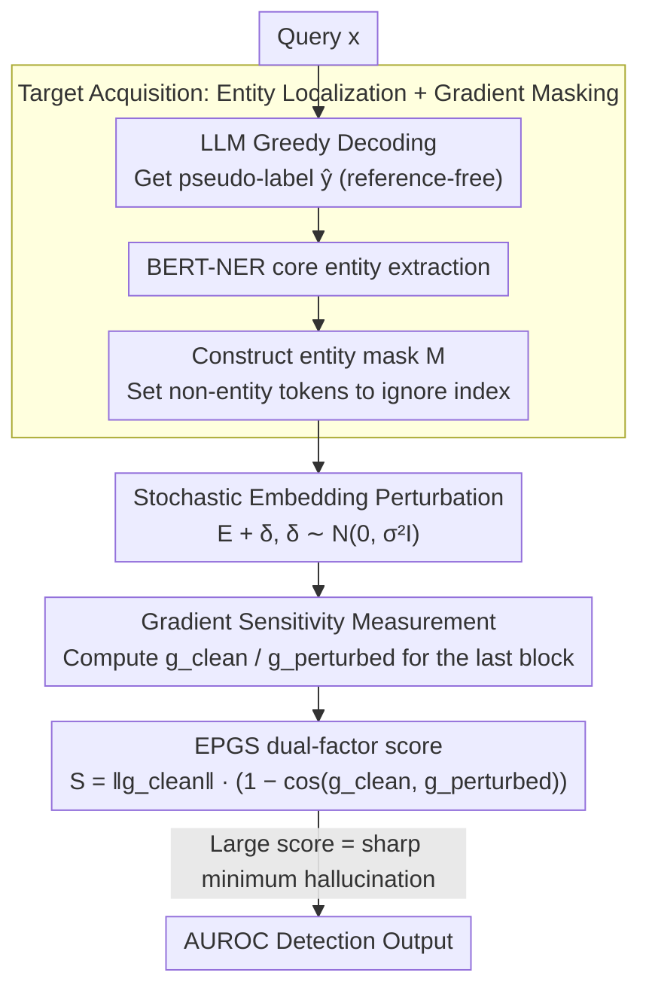

# From Flat Facts to Sharp Hallucinations: Detecting Stubborn Errors via Gradient Sensitivity

**Conference**: ICML 2026  
**arXiv**: [2605.00939](https://arxiv.org/abs/2605.00939)  
**Code**: None  
**Area**: Hallucination Detection  
**Keywords**: stubborn hallucination, loss landscape, Hessian, gradient sensitivity, embedding perturbation

## TL;DR
Ours shifts LLM hallucination detection from "analyzing output probabilities" to "analyzing loss landscape curvature"—measuring perturbations in gradient direction and magnitude by adding Gaussian noise to embeddings. Serving as a cheap proxy for the Hessian spectral radius, this method outperforms baselines like Entropy, Semantic Entropy, and EigenScore in AUROC across 12 model-dataset combinations.

## Background & Motivation

**Background**: Mainstream LLM hallucination detection methods are divided into two categories: black-box methods (LN-Entropy, Semantic Entropy, P(False), etc.) that check output consistency via multiple samplings; and white-box methods (EigenScore, Effective Rank) that examine the covariance or rank of hidden states. Both assume that "hallucination = uncertainty = high entropy / representation collapse."

**Limitations of Prior Work**: There exists a category of errors named **stubborn hallucination** by the authors—errors where the model confidently outputs incorrect facts and consistently converges to the same answer despite multiple samplings. Their output distributions are low-entropy and high-confidence, similar to true knowledge, causes entropy-based methods to fail (e.g., Semantic Entropy AUROC on Llama-2 SQuAD is only $0.4839$, near random guessing). "Static representation analysis" like EigenScore also misses these because the hidden states themselves have not collapsed.

**Key Challenge**: Zero-order quantities (output probabilities) are not **equivalent** to factual correctness—models can "confidently remember wrong information." The root cause is that existing methods measure information at or below the first order, while the true difference between hallucinations and facts lies in higher-order geometric properties.

**Goal**: (1) Formally define stubborn hallucination; (2) find a computationally cheap geometric quantity sensitive to it; (3) prove that this quantity is a reasonable proxy for the Hessian spectral radius.

**Key Insight**: Borrowing the flat vs sharp minima hypothesis from generalization theory—robust facts are supported by redundant contextual features and fall into flat minima (low curvature); stubborn errors are memorization singularities of sparse noisy patterns and fall into sharp minima (high curvature). They exhibit similar high confidence (zero-order similarity) but different curvature (second-order divergence).

**Core Idea**: Inject Gaussian noise into embeddings and measure the drift in gradient magnitude and direction as a proxy for the local Hessian spectral radius, thereby distinguishing flat facts from sharp hallucinations.

## Method

### Overall Architecture
EPGS (Embedding-Perturbed Gradient Sensitivity) aims to solve hallucinations where the "model confidently remembers wrongly," which zero-order quantities cannot detect. It achieves this by switching the detection signal from output probability to the local curvature of the loss landscape. The pipeline follows three steps: first, extracting core entities from the answer using an external NER to construct a mask that calculates loss only on entity tokens (Target Acquisition); second, injecting Gaussian noise $\delta \sim \mathcal{N}(0, \sigma^2 I)$ into the input embeddings (Stochastic Embedding Perturbation); and finally, calculating gradients $g_{\text{clean}}, g_{\text{perturbed}}$ of the parameters in the last Transformer block to formulate an EPGS score (Gradient Sensitivity Measurement). The process is purely posterior and training-free, being much cheaper than direct Hessian computation.

### Key Designs

**1. Geometric Hallucination Classification: Moving Detection from the Probability Domain to the Curvature Domain**

Entropy-based methods fail entirely for stubborn hallucinations because they only examine zero-order quantities. The authors formalize this using a $\delta$-stability condition: if the KL drift under input perturbation $\mathbb{E}_\epsilon[D_{KL}(P_{\theta^*}(\cdot|x) \| P_{\theta^*}(\cdot|x+\epsilon))] \le \delta$, the sample is considered "stable." Both robust facts and stubborn hallucinations **equally satisfy** this condition, making them indistinguishable zero-order. The true difference is hidden in higher-order geometry. The Curvature Hypothesis is proposed: robust facts are supported by redundant contextual features and fall into flat minima ($\lambda_{\max}(H)$ is small); stubborn errors are memorization singularities of sparse noisy patterns and fall into sharp minima ($\lambda_{\max}(H)$ is large); transient errors fall into unstable regions ($\|\nabla\mathcal{L}\| > 0$ or anisotropic curvature).

**2. Input-Parameter Isomorphism + Hessian Proxy: Replacing Expensive Second-order Quantities with an Extra Backward Pass**

The standard characterization of curvature is the Hessian spectral radius $\lambda_{\max}(H)$, but calculating it directly for LLMs is impractical. The authors translate this into a feasible experimental quantity in two steps. Lemma 3.3 shows that for a small embedding perturbation $\delta$, an equivalent parameter perturbation $\nu_\delta$ can always be found (simulated via a rank-1 weight update of the last block) such that $\mathcal{L}(\theta^*, E+\delta, \hat y) \approx \mathcal{L}(\theta^*+\nu_\delta, E, \hat y)$. Thus, perturbing inputs is isomorphic to perturbing parameters in terms of loss. Theorem 3.4 further applies a second-order Taylor expansion at the convergence point ($\nabla_\theta \mathcal{L}(\theta^*) = 0$) to obtain $\|\nabla_\theta \mathcal{L}(\theta^*; x+\epsilon, \hat y)\|_2 \lesssim \lambda_{\max}(H) \cdot \|\nu_\epsilon\|_2$. Intuitively, adding noise to inputs in a sharp minimum is equivalent to pushing parameters up a steep wall, causing the gradient magnitude to spike; in a flat minimum, the gradient remains nearly unchanged. "Measuring gradient surge after input noise" thus becomes a cheap proxy for $\lambda_{\max}(H)$.

**3. Magnitude × Direction Drift Dual-factor Score: Simultaneously Capturing Stubborn and Transient Errors**

A curvature proxy alone is insufficient because transient errors are characterized by directional instability rather than just high curvature. The score is defined as the product of magnitude and directional drift:

$$\mathcal{S} = \|g_{\text{clean}}\|_2 \cdot (1 - \cos(g_{\text{clean}}, g_{\text{perturbed}}))$$

The first term $\|g_{\text{clean}}\|_2$ reflects the local curvature scale, and the second term $1-\cos(\cdot)$ reflects directional fluctuation. In high-dimensional space, a large random displacement is almost certainly orthogonal to the original direction, making the directional term highly sensitive to instability. This naturally separates the three types of samples: facts stay in flat minima with small magnitude and stable direction ($\mathcal{S} \approx 0$); stubborn errors stay in sharp minima with large magnitude and noise-disrupted directions (large $\mathcal{S}$); transient errors maximize both terms (largest $\mathcal{S}$).

### Loss & Training
The method is completely posterior and requires no training. NER uses pre-trained BERT-base-NER; temperature $T=0.1$ is used for pseudo-label generation; perturbation scale $\sigma=0.1$; gradients are computed only for the last Transformer block. Evaluation reports threshold-independent AUROC. All experiments were conducted on a single RTX 4090.

## Key Experimental Results

### Main Results (General Hallucination, AUROC)
Across 3 models × 4 datasets = 12 combinations, EPGS consistently ranks first.

| Model | Dataset | SE | EigenScore | **EPGS** |
|------|--------|------|-----------|----------|
| Llama-2-7B | TriviaQA | 0.7080 | 0.7224 | **0.7629** |
| Llama-3-8B | SVAMP | 0.9004 | 0.9371 | **0.9732** |
| Mistral-7B | TriviaQA | 0.7701 | 0.7760 | **0.8289** |
| Llama-3-8B | TriviaQA | 0.7082 | 0.7226 | **0.8127** |

### Ablation Study (Gradient Extraction Location + Stubborn Subset)

| Configuration | Llama-2 SQuAD AUROC | Description |
|------|----------------------|------|
| Last Transformer Block (Default) | **Highest** | Retains final "belief" geometry |
| Middle Transformer Block | Decrease | Lacks final aggregation |
| Final Layer Norm / LLM Head | Near Random | Probability saturation masks gradients |

Stubborn subset (High-consistency samples where entropy-based methods fail):

| Method | Llama-2 SQuAD | Llama-3 SQuAD |
|------|---------------|---------------|
| Semantic Entropy | 0.5842 | 0.5918 |
| EigenScore | 0.6003 | 0.5857 |
| **EPGS** | **0.7373** | **0.7816** |

### Key Findings
- The correlation coefficient between ground-truth Hessian (calculated via power iteration for $\lambda_{\max}$) and EPGS is $r = 0.855$. In stubborn sets, $\lambda_{\max}$ is approximately $2.5\times$ larger than for robust facts, directly validating the Curvature Hypothesis.
- EPGS shows the largest advantage on reasoning tasks (SVAMP) (0.9732 vs 0.9371), as reasoning errors are predominantly transient, maximized by the directional drift term $(1-\cos)$.
- Gradient extraction must occur at the last Transformer block; the LLM Head flattens gradient signals due to Softmax saturation, resulting in near-random performance.

## Highlights & Insights
- Explaining "why entropy-based methods fail" using the geometric language of sharp/flat minima provides a highly explanatory shift in perspective.
- Using "input-perturbed gradients = Hessian proxy" to bypass second-order computation extends curvature-aware logic from training-time work (like SAM) to a **purely inference-time** application.
- The dual-factor score (Magnitude × Direction) distinguishes both stubborn (sharp) and transient (unstable) errors, covering two typical error types with a single formula.

## Limitations & Future Work
- Does the perturbation scale $\sigma=0.1$ require tuning for different model sizes/vacabularies? Only one value was provided.
- Verification was limited to 7B-8B models; whether last-block gradients in larger models (70B+) are flattened by LayerNorm remains unaddressed.
- Stubborn sets were constructed via high-consistency filtering, which contains sampling estimation noise; the boundary between stubborn and transient may blur if the model is inherently unstable at high temperatures.
- There is no discussion on integration with retrieval-based fact-checking (e.g., "detect $\rightarrow$ trigger RAG correction").

## Related Work & Insights
- **vs Semantic Entropy / DSE**: These rely on the diversity of multiple output samplings; EPGS requires a single gradient pass and does not fail on stubborn errors.
- **vs EigenScore / Effective Rank**: These analyze the covariance of "static" hidden states; EPGS actively injects perturbations to capture dynamic responses.
- **vs SAM (Sharpness-Aware Minimization)**: SAM uses sharpness as a regularizer during training; EPGS uses the same geometric quantity as a detection signal during inference.
- **vs Hessian-based uncertainty**: Calculating $\lambda_{\max}(H)$ directly is impractical for LLMs; EPGS uses input gradients as a cheap proxy.

## Rating
- Novelty: ⭐⭐⭐⭐⭐ "Stubborn hallucination + sharp minimum" is a genuine shift in conceptual perspective.
- Experimental Thoroughness: ⭐⭐⭐⭐ Covers 12 combinations + stubborn subset + Hessian ground truth, though model scales are relatively small.
- Writing Quality: ⭐⭐⭐⭐ Clear alignment between theory and experiments; the three-stage diagram is intuitive.
- Value: ⭐⭐⭐⭐ Provides a detection signal sensitive to "confident errors" for high-stakes deployment, offering high practical utility.

<!-- RELATED:START -->

## Related Papers

- [\[CVPR 2026\] Mitigating Multimodal Hallucinations via Gradient-based Self-Reflection](../../CVPR2026/hallucination/mitigating_multimodal_hallucinations_via_gradient-based_self-reflection.md)
- [\[ACL 2026\] Detecting Hallucinations in SpeechLLMs at Inference Time Using Attention Maps](../../ACL2026/hallucination/detecting_hallucinations_in_speechllms_at_inference_time_using_attention_maps.md)
- [\[ACL 2026\] FinGround: Detecting and Grounding Financial Hallucinations via Atomic Claim Verification](../../ACL2026/hallucination/finground_detecting_and_grounding_financial_hallucinations_via_atomic_claim_veri.md)
- [\[ACL 2026\] TPA: Next Token Probability Attribution for Detecting Hallucinations in RAG](../../ACL2026/hallucination/tpa_next_token_probability_attribution_for_detecting_hallucinations_in_rag.md)
- [\[ICLR 2026\] LUMINA: Detecting Hallucinations in RAG System with Context-Knowledge Signals](../../ICLR2026/hallucination/lumina_detecting_hallucinations_in_rag_system_with_context-knowledge_signals.md)

<!-- RELATED:END -->
