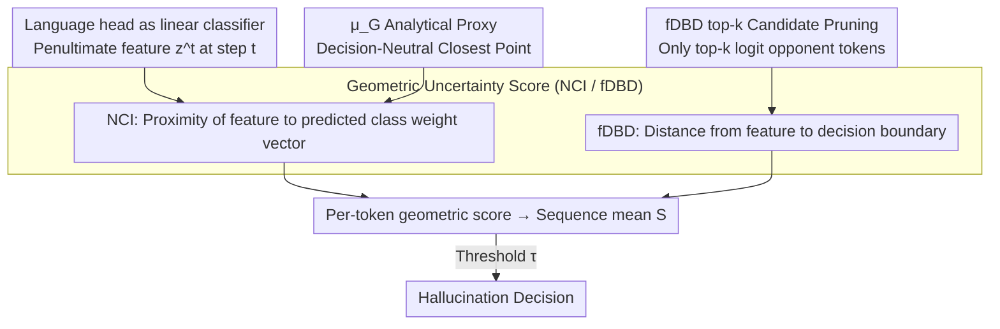

# From Out-of-Distribution Detection to Hallucination Detection: A Geometric View

**Conference**: ICML 2026  
**arXiv**: [2602.07253](https://arxiv.org/abs/2602.07253)  
**Code**: TBD  
**Area**: Hallucination Detection  
**Keywords**: Hallucination Detection, OOD Detection, Geometric Uncertainty, Decision Boundary, Single-sample training-free

## TL;DR
This paper treats LLM next-token prediction as a classification task over an extremely large vocabulary. By migrating two lightweight OOD detectors—NCI (proximity between feature and weight vectors) and fDBD (distance from feature to decision boundary)—and incorporating two adaptations ("analytical proxy $\mu_G$ for training feature mean" and "calculating boundary distance only on top-$k$ candidate tokens"), the authors derive a **training-free, single-sample** inference-time hallucination detector. It consistently outperforms baselines like Perplexity, Semantic Entropy, and SelfCheckGPT on CSQA, GSM8K, and AQuA.

## Background & Motivation

**Background**: LLM hallucination detection currently follows two main lines: one involves training classifiers to identify hallucinations (e.g., SAPLMA, INSIDE), which are sensitive to distribution shifts and computationally expensive to train; the other consists of training-free methods (e.g., Semantic Entropy, SelfCheckGPT, Lexical Similarity) that score by comparing consistency across **multiple sampled outputs**, avoiding training but incurring high inference costs.

**Limitations of Prior Work**: While training-free multi-sample methods perform well on short QA, they fail in **reasoning tasks**. Multi-step reasoning allows for multiple valid paths, making "consistency of semantic meaning across multiple outputs" conceptually difficult to determine. Additionally, sampling $N$ complete reasoning chains for every question leads to prohibitive overhead.

**Key Challenge**: Reasoning tasks simultaneously require being **training-free** (to avoid classifier drift), **single-sample** (to avoid multiple samplings), and **efficient per-token** (calculable at every step). Existing methods cannot satisfy all three.

**Goal**: Construct a training-free, single-sample hallucination detector for reasoning with controllable per-token overhead.

**Key Insight**: The authors observe that OOD detection and hallucination detection both essentially measure "how uncertain the model is about its current prediction." If the LLM language head is viewed as a $|\mathcal{V}|$-class linear classifier and the penultimate-layer features as input, mature metrics from OOD literature regarding the "geometric relationship between features and weight vectors" can be directly migrated. Such geometric measures are inherently per-token and single-sample.

**Core Idea**: Adapt OOD detectors NCI (features close to the weight vector of the predicted class $\rightarrow$ low uncertainty) and fDBD (features far from decision boundaries $\rightarrow$ low uncertainty) to LLMs. Minimal analytical and engineering fixes are applied for three LLM characteristics: unavailable training statistics, massive vocabulary, and stochastic decoding. Scores are calculated per token and averaged over the sequence as the hallucination score.

## Method

### Overall Architecture
The paper addresses hallucination detection in reasoning tasks where neither training classifiers (due to drift) nor multi-sampling (due to cost) is feasible. The mechanism treats the LLM language head as a $|\mathcal{V}|$-class linear classifier, with penultimate-layer features $\bm{z}^t$ as input. Thus, geometric uncertainty measures from OOD literature—based on feature positions relative to weight vectors and decision boundaries—can be utilized. During inference, a scalar geometric score $s(\bm{z}^t)$ is calculated for each decoding step $t$. After the sequence is generated, the sequence mean $S=\frac{1}{T}\sum_t s(\bm{z}^t)$ is taken as the hallucination score, evaluated against a threshold $\tau$. This process requires no weight updates, no training data, and only a single sample per response.

### Key Designs

**1. Geometric Uncertainty Scores: Migrating NCI / fDBD to the Language head**

Hallucination detection requires "how uncertain the model is about the current token," which OOD detection quantifies through feature geometry. The challenge lies in alignment with the language head. Viewing the head as a linear classifier, the predicted token is $\hat{c}=\arg\max_v \bm{w}_v^\top \bm{z}+b_v$. **NCI** measures the proximity of the feature to the predicted class weight vector: $s_{\text{NCI}}(\bm{z})=\cos(\bm{w}_{\hat{c}}, \bm{z}-\bm{\mu}_G)\,\|\bm{w}_{\hat{c}}\|_2$. Higher values indicate closer proximity and lower uncertainty. **fDBD** measures the distance to other tokens' decision boundaries using a first-order approximation: $\tilde{D}_f(\bm{z},c)=|(\bm{w}_{\hat{c}}-\bm{w}_c)^\top \bm{z}+(b_{\hat{c}}-b_c)|/\|\bm{w}_{\hat{c}}-\bm{w}_c\|_2$. Larger distances indicate greater separation from the boundary and lower uncertainty. These scores are naturally per-sample and per-step, satisfying the "single-sample per-token" requirement, with $O(d_{\text{model}})$ complexity per step, incurring near-zero overhead. Empirical validation on CSQA (Fig. 2) confirms that features of hallucinated answers are closer to boundaries and farther from weight vectors.

**2. Analytical Proxy for Training Feature Mean $\mu_G$: Decision-Neutral Closest Point**

The NCI formula requires the global mean of training features $\bm{\mu}_G$. Since LLM training corpora are private and vast, this cannot be estimated—a major hurdle in migrating OOD tools. The authors instead derive a "data-independent" analytical point. They prove (Lemma 4.1) that the feature point $\bm{z}_\star$ minimizing logit variance across the vocabulary is a point of maximum uncertainty, with a closed-form solution $\hat{\bm{z}_\star} = -(W^\top P W)^\dagger W^\top P \bm{b}$, where $P=I-\frac{1}{|\mathcal{V}|}\mathbf{1}\mathbf{1}^\top$. For zero-bias language heads (like Llama-3.2-3B), this point simplifies to the origin $\bm{0}$ in feature space. Substituting $\bm{z}_\star$ for $\bm{\mu}_G$ removes dependence on training data. This step is critical: on CSQA with Llama-3.2-3B (Table 1), the analytical proxy achieved AUROC=66.07, while the empirical mean from the CSQA training set only reached 62.79, underperforming even Perplexity (63.23). This indicates that LLM training features cannot be approximated by small downstream datasets.

**3. fDBD top-$k$ Candidate Pruning: Focusing on Semantic Opponents**

Naive fDBD calculates boundary distances for all $|\mathcal{V}|-1$ tokens. This has two issues: boundaries for rare tokens, punctuation, and numbers are almost always far away, diluting signals from real semantic competitors; it also incurs $O(d_{\text{model}}|\mathcal{V}|)$ computation. The solution is to select only the top-$k$ tokens $\mathcal{K}_t$ with the highest logits at each step (excluding the top-1 predicted token). The normalized average boundary distance is calculated as $s_{\text{fDBD}}^k=\frac{1}{k}\sum_{c\in\mathcal{K}_t}\tilde{D}_f(\bm{z}^t,c)/\|\bm{z}^t-\bm{\mu}_G\|_2$, with $k$ selected on a validation set. Using Quickselect, complexity reduces to $O(d_{\text{model}}k+|\mathcal{V}|)$. This highlights candidates that could realistically replace the predicted token while filtering irrelevant distant tokens. Table 2 shows that all $k$ values outperform Perplexity, with a peak at $k=1000$ (AUROC 69.24 vs. 68.15 for All), exhibiting an inverted U-shape.

### Loss & Training
**Completely training-free.** No parameters are updated. The Perplexity baseline is $\text{PPL}(\bm{y}|\bm{x})=\exp(-\frac{1}{T}\sum_t \log p(\bm{y}_t|\bm{x},\bm{y}_{<t}))$. Ours follows the same "step-wise scoring + sequence averaging" pattern, replacing log-probabilities with $s_{\text{NCI}}$ or $s_{\text{fDBD}}^k$. Evaluation uses threshold-free AUROC.

## Key Experimental Results

### Main Results
Setup: CSQA (commonsense, MCQ, 1221 questions), GSM8K (math, free-form, 1319 questions), AQuA (math, MCQ, 254 questions). Models: Llama-3.2-3B-Instruct and Qwen-2.5-7B-Instruct, CoT prompting, greedy decoding.

| Model / Method | Single Sample | CSQA | GSM8K | AQuA |
|---|---|---|---|---|
| Llama-3.2-3B / Perplexity | ✓ | 63.23 | 69.63 | 72.85 |
| Llama-3.2-3B / SelfCheckGPT NLI | ✗ | 64.18 | 74.29 | 66.01 |
| Llama-3.2-3B / Semantic Entropy | ✗ | 60.61 | 64.40 | 64.71 |
| Llama-3.2-3B / **NCI** | ✓ | 66.07 | 76.32 | 74.41 |
| Llama-3.2-3B / **fDBD (selected $k$)** | ✓ | **69.24** | **76.36** | **76.20** |
| Qwen-2.5-7B / Perplexity | ✓ | 61.94 | 71.54 | 71.66 |
| Qwen-2.5-7B / SelfCheckGPT NLI | ✗ | 60.18 | 76.22 | 70.90 |
| Qwen-2.5-7B / **NCI** | ✓ | 71.60 | 75.83 | 78.19 |
| Qwen-2.5-7B / **fDBD (selected $k$)** | ✓ | **72.47** | **77.19** | **78.22** |

Latency (Llama-3.2-3B, CSQA, ms/token): Standard 31.94, Perplexity 32.88, NCI 32.54, fDBD 32.71. Near-zero overhead.

### Ablation Study

| Configuration | CSQA AUROC | Description |
|------|-----------|------|
| Perplexity baseline | 63.23 | LLM intrinsic confidence |
| NCI w/ Empirical Mean $\bm{\mu}_G$ | 62.79 | Empirical estimation degrades performance |
| NCI w/ **Analytical Proxy $\bm{z}_\star$** | **66.07** | Proxy outperforms by +3.3 AUROC |
| fDBD $k=1$ | 68.64 | Only top-1 alternative |
| fDBD $k=1000$ | **69.24** | Peak performance |
| fDBD $k=$ All ($\approx 10^5$) | 68.15 | Full vocabulary dilution |

Robustness to Stochastic Decoding (CSQA, Llama-3.2-3B, 5 seeds mean): Across temp=0.2/0.5/0.8/1.0, Perplexity fluctuates around 62-63; NCI stabilizes at 66-68; fDBD remains at 68-69. Both consistently outperform Perplexity, proving that **sequence averaging** compensates for occasional misalignments in stochastic decoding.

## Key Findings
- The analytical proxy $\bm{z}_\star$ is the **key** for migrating OOD methods to LLMs. Empirical means are not only ineffective but worse than Perplexity, showing LLM training features cannot be approximated by small downstream sets.
- The top-$k$ pruning curve is an inverted U-shape. Values too small ($k=1$) provide insufficient information, while those too large (All) are diluted by irrelevant tokens. The peak at $k\sim 10^3$ suggests true semantic competitors are concentrated within the top thousand tokens.
- Single-sample geometric methods are particularly effective in **mathematical reasoning** (GSM8K/AQuA) compared to multi-sample methods like Semantic Entropy or SelfCheckGPT, as they require only one inference pass with minimal latency increase (<1 ms/token).

## Highlights & Insights
- **Paradigm Reformulation**: Connecting "hallucination detection" to "OOD detection" is conceptually natural, but the contribution lies in **materializing** it. Each LLM characteristic (private training data, massive vocabulary, stochastic decoding) is addressed with specific engineering/analytical fixes.
- **Decision-Neutral Closest Point as a Reusable Tool**: Any OOD/uncertainty method requiring "training feature mean" will stall when applied to LLMs. The derived path (logit variance minimization $\rightarrow$ closed-form solution $\rightarrow$ origin for zero-bias) can be reapplied to other OOD scores like Mahalanobis or Energy.
- **Per-token Geometric Score + Sequence Averaging**: A simple but effective bridge. Expanding "single-point uncertainty" to sequences via arithmetic mean remains stable even under stochastic decoding, highlighting that **cumulative geometric signals** are more important than strict step-wise alignment in reasoning.
- **Negligible Latency**: At 32.71 vs 31.94 ms/token, this detector can be embedded by default in production pipelines, unlike SelfCheckGPT which requires $N\times$ the inference budget.

## Limitations & Future Work
- The analytical proxy $\bm{z}_\star$ is the origin for zero-bias heads (Llama), but its optimality for models with non-zero bias (Qwen/MoE) was validated indirectly via AUROC without analyzing the bias-proxy error relationship.
- Simple mean aggregation might mask "local high uncertainty steps." Future work could consider **max / top-percentile / weighted aggregation**.
- Evaluation focused on reasoning/QA; the effectiveness of token-level geometric uncertainty in open-ended generation (summarization, creative writing) remains unverified.
- $k$ needs to be selected on a validation set, posing a cold-start cost for new tasks. Adaptive $k$ based on logit entropy is worth exploring.

## Related Work & Insights
- **vs Semantic Entropy (Kuhn et al., 2023)**: SE requires multiple sampled responses and semantic clustering, suitable for short QA but not long CoT. Ours is single-sample using penultimate features.
- **vs SelfCheckGPT (Manakul et al., 2023)**: Requires multiple samplings for consistency checks. Ours needs only one pass with near-zero latency.
- **vs Perplexity / Max P / P(True)**: Also single-sample training-free, but those only use scalar summaries of logits. Ours leverages the **geometric position of feature vectors**, providing richer information and higher AUROC.
- **vs INSIDE / SAPLMA (Trained Classifiers)**: Those are sensitive to distribution shifts and require labeled data. Ours is training-free and label-free.

## Rating
- Novelty: ⭐⭐⭐⭐ While the OOD ↔ Hallucination link has been suggested, this is the first to successfully migrate geometric detectors like NCI/fDBD by solving three specific LLM challenges.
- Experimental Thoroughness: ⭐⭐⭐⭐ 3 datasets × 2 models, extended in appendices to Qwen3-32B, MoE architectures, and 5-seed stochastic decoding.
- Writing Quality: ⭐⭐⭐⭐ Clear structure (three challenges $\rightarrow$ three solutions) with formal definitions and theorems.
- Value: ⭐⭐⭐⭐ Near-zero latency, training-free, and single-sample nature make it production-ready. Provides a reusable methodology for "LLM-ifying" OOD tools.

<!-- RELATED:START -->

## Related Papers

- [\[ICML 2026\] Automatic Layer Selection for Hallucination Detection](automatic_layer_selection_for_hallucination_detection.md)
- [\[ICML 2026\] Harnessing Reasoning Trajectories for Hallucination Detection via Answer-agreement Representation Shaping](harnessing_reasoning_trajectories_for_hallucination_detection_via_answer-agreeme.md)
- [\[CVPR 2026\] TriDF: Evaluating Perception, Detection, and Hallucination for Interpretable DeepFake Detection](../../CVPR2026/hallucination/tridf_evaluating_perception_detection_and_hallucination_for_interpretable_deepfa.md)
- [\[ACL 2026\] Enhancing Hallucination Detection via Future Context](../../ACL2026/hallucination/enhancing_hallucination_detection_via_future_context.md)
- [\[ICLR 2026\] Enhancing Hallucination Detection through Noise Injection](../../ICLR2026/hallucination/enhancing_hallucination_detection_through_noise_injection.md)

<!-- RELATED:END -->
