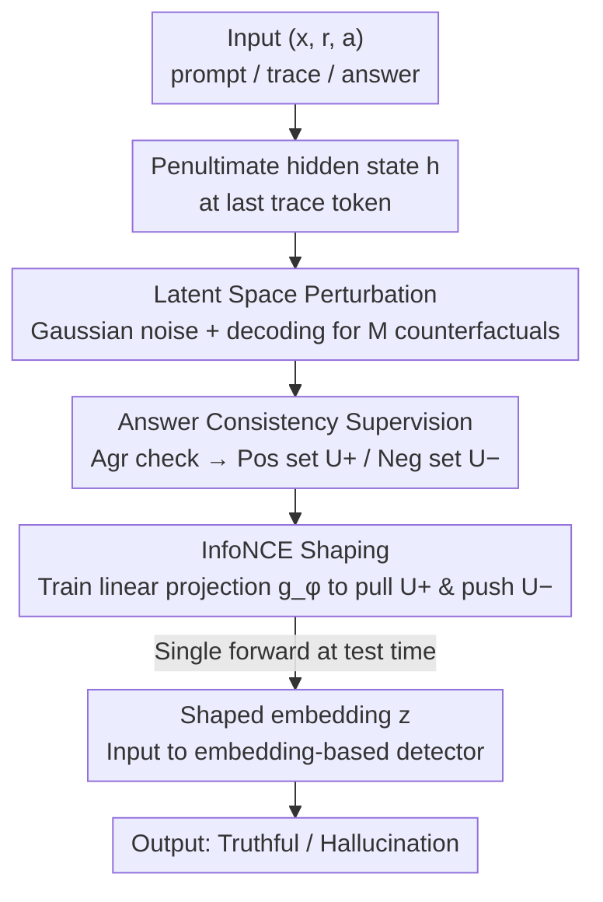

# Harnessing Reasoning Trajectories for Hallucination Detection via Answer-agreement Representation Shaping

**Conference**: ICML 2026  
**arXiv**: [2601.17467](https://arxiv.org/abs/2601.17467)  
**Code**: https://github.com/radiolab-ntu/ars_icml2026 (Available)  
**Area**: Hallucination Detection  
**Keywords**: Large Reasoning Models, Hallucination Detection, Latent Space Perturbation, Counterfactual Answers, Contrastive Representation Shaping

## TL;DR
This paper proposes ARS for hallucination detection in Large Reasoning Models (LRMs). Instead of perturbing reasoning traces in the text space, ARS applies small perturbations directly to the latent representations at the end of the trace to decode counterfactual answers. Using "answer agreement" as a label, a lightweight contrastive head is trained to shape trace-conditioned answer embeddings, enabling embedding-based detectors to better distinguish hallucinations from truthful responses ($66.85 \to 86.64$ AUROC on TruthfulQA).

## Background & Motivation
**Background**: LRMs (e.g., Qwen3, DeepSeek-R1) generate long reasoning traces before producing answers. Common hallucination detection methods include: (i) logit/perplexity-based uncertainty; (ii) consistency-based sampling (Semantic Entropy, SelfCKGPT); (iii) verbalized confidence; (iv) internal state-based probes (CCS, HaloScope, EigenScore).

**Limitations of Prior Work**: Directly using reasoning traces as signals empirically decreases performance. The author finds that for Qwen3-8B on TruthfulQA, traces mask answer-level hallucination signals (Fig. 1). There are two reasons: (1) multiple traces can support the same answer, causing detectors to overfit to style rather than validity; (2) hallucinations are answer-level properties, but traces contain irrelevant stylistic variations that drown out actual signals.

**Key Challenge**: Traces **do** contain signals regarding answer stability—the intuition is that truthful answers are stable in internal representations, while hallucinations are fragile and change with small perturbations. However, conventional embeddings fail to utilize this signal as it is mixed with stylistic noise.

**Goal**: (1) Extract answer-centric stability signals from traces; (2) Inject these signals into trace-conditioned answer embeddings; (3) Avoid reliance on human hallucination labels or multiple sampling during inference.

**Key Insight**: Focus on the boundary where the trace ends and the answer begins—specifically, the hidden state $\boldsymbol h$ of the last trace token in the penultimate layer. This state represents the model having processed all reasoning but not yet committing to an answer; counterfactual answers generated from perturbations here cleanest reflect the model's commitment.

**Core Idea**: Utilize latent space perturbations to create counterfactual answers $\rightarrow$ Use "agreement with the original answer" as a contrastive label $\rightarrow$ Train a lightweight projection to explicitly shape the stability signal into the embedding.

## Method

### Overall Architecture
ARS addresses the contradiction where reasoning traces contain stability signals that standard detectors cannot utilize due to style noise. It treats the trace as the context and targets the transition between trace and answer. By decoding with small latent perturbations, it generates counterfactual answers. Using answer agreement as a supervision signal, a lightweight linear projection is trained to shape stability into the embedding. The LRM $\pi_\theta$ is frozen. For a sample $(\boldsymbol x, \boldsymbol r, \boldsymbol a)$ (prompt / trace / answer), the penultimate hidden state of the last trace token is taken, Gaussian noise is added, and counterfactual answers are decoded. These are split into positive and negative sets based on agreement. A linear mapping $g_\phi$ is trained via InfoNCE. During testing, only a single forward pass is performed, and the shaped embedding $\boldsymbol z$ is fed into any embedding-based detector.

### Key Designs

**1. Latent Space Perturbation at Trace Boundaries: Creating Cheap Counterfactuals**

Hallucination is an answer-level property. ARS avoids text-space perturbations (which are complex to design) and multi-output sampling (which is computationally expensive). It targets the decision geometry of the LRM: take the penultimate hidden state $\boldsymbol h = \boldsymbol h_L(\boldsymbol x\oplus\boldsymbol r)$, add isotropic Gaussian noise $\tilde{\boldsymbol h}=\boldsymbol h + \boldsymbol\delta,\ \boldsymbol\delta\sim\mathcal N(0,\sigma^2\boldsymbol I)$, and decode $\tilde{\boldsymbol a}=\text{Decode}_\theta(\boldsymbol x\oplus\boldsymbol r;\tilde{\boldsymbol h})$ to get a counterfactual answer $\tilde{\boldsymbol a}$ and its embedding $\tilde{\boldsymbol u}$.

The trace boundary is chosen because other locations fail: perturbations mid-trace cause the reasoning to rewrite, while perturbations mid-answer are too constrained by preceding answer tokens. The trace boundary offers the "maximum degrees of freedom" for the answer, reflecting the model's commitment.

**2. Answer Agreement as zero-label Automatic Supervision**

ARS uses "is the counterfactual answer equivalent to the original" as a signal, bypassing human labels. For $M$ counterfactuals $\tilde{\boldsymbol a}_j$, $\text{Agr}(\boldsymbol a, \tilde{\boldsymbol a}_j)\in\{0,1\}$ is used (via text similarity or LLM-as-judge). The consistency set $\mathcal U^+=\{\tilde{\boldsymbol u}_j: \text{Agr}=1\}$ and inconsistency set $\mathcal U^-=\{\tilde{\boldsymbol u}_j:\text{Agr}=0\}$ are formed. Truthful samples tend to have dominant $\mathcal U^+$, while hallucinations have larger $\mathcal U^-$. This distills the model's internal stability into a training signal.

**3. InfoNCE Shaping: Encoding Stability into Embedding Geometry**

A contrastive loss encodes the stability signal into the shaped representation $\boldsymbol z$. With $\boldsymbol z = g_\phi(\boldsymbol u)$ as the anchor, positive sample $\tilde{\boldsymbol z}^+ \sim g_\phi(\mathcal U^+)$, and negative set $\mathcal Z^- = g_\phi(\mathcal U^-)$:

$$\mathcal L_{\text{ARS}}=-\frac{\text{sim}(\boldsymbol z,\tilde{\boldsymbol z}^+)}{\tau}+\log\sum_{\tilde{\boldsymbol z}'\in\{\tilde{\boldsymbol z}^+\}\cup\mathcal Z^-}\exp\Big(\frac{\text{sim}(\boldsymbol z,\tilde{\boldsymbol z}')}{\tau}\Big),$$

where $\text{sim}$ is cosine similarity and $g_\phi$ is a bias-free linear projection. This transforms stability from a sampling-heavy metric into a geometric property readable in one forward pass.

### Loss & Training
- $\mathcal L_{\text{ARS}}$ as defined above; Adam optimizer, lr $1\text{e-}4$, weight decay $1\text{e-}5$, batch size 128.
- $g_\phi$ is a single linear projection; input is the embedding of the last answer token from the penultimate layer.
- Hyperparameters $\sigma, k, \tau, M$ are selected on a 100-sample validation split.

## Key Experimental Results

### Main Results

| Model | Dataset | Detector | Vanilla AUROC | ARS-Shaped AUROC | Gain |
|------|--------|----------|--------------|------------------|------|
| Qwen3-8B | TruthfulQA | CCS | 66.85 | **86.64** | $+19.79$ |
| Qwen3-8B | TriviaQA | CCS | 59.24 | **88.54** | $+29.30$ |
| Qwen3-8B | GSM8K | CCS | 57.98 | **90.37** | $+32.39$ |
| Qwen3-8B | MATH-500 | CCS | 55.64 | **78.66** | $+23.02$ |
| Qwen3-8B | TruthfulQA | Probing | 78.66 | **83.66** | $+5.00$ |
| Qwen3-8B | MATH-500 | Probing | 67.03 | **78.17** | $+11.14$ |

| Dataset | Model | ARS | TSV (Park 2025) | G-Detector (Zhang 2026) | Semantic Entropy |
|--------|------|-----|----------------|-------------------------|-----------------|
| TruthfulQA | Qwen3-8B | **86.64** | 77.08 | 71.86 | 65.60 |
| TriviaQA | Qwen3-8B | **91.62** | 89.67 | 90.52 | 58.37 |
| MATH-500 | Qwen3-8B | **78.66** | 63.12 | 57.67 | 56.13 |

### Ablation Study

| Configuration | TruthfulQA AUROC | Description |
|------|----------------|------|
| ARS (trace-boundary intervention) | **86.64** | Default |
| Mid-trace perturbation | Significant drop | Entanglement of answer change and style |
| Mid-answer perturbation | Significant drop | Answer tokens too constrained |
| Text deletion (10–90%) | Worse than ARS | Sensitive to perturbation design |
| Cross-dataset (GSM8K→TriviaQA) | 87.80 | Strong transferability |

### Key Findings
- **The trace boundary is the optimal intervention point**: Ablations confirm trace-end perturbations outperform mid-trace/mid-answer or text-space perturbations.
- **CCS (Unsupervised) + ARS outperforms Probing (Supervised) + ARS**: In some cases, CCS-ARS yields better results, suggesting shaped embeddings are well-separated.
- **Strong Cross-domain Transfer**: $g_\phi$ trained on GSM8K performs well on TriviaQA, indicating ARS captures dataset-agnostic stability geometry.
- **Inference with Zero Extra Sampling**: Unlike Semantic Entropy, ARS requires only one forward pass at test time.

## Highlights & Insights
- **Latent Perturbation over Text Perturbation**: Directly adding noise to hidden states avoids complex text design and is highly clean.
- **Expensive Training, Cheap Inference**: This pattern is ideal for LLM deployment.
- **Self-Supervised Stability**: Using agreement as a signal enables zero-label implementation.
- **Theoretical Alignment**: Proposition 4.2 links the contrastive loss directly to the detection error bound.

## Limitations & Future Work
- Quality of $\text{Agr}$ depends on the judge model; hallucinating judges may pollute contrastive pairs.
- Isotropic Gaussian noise may be sub-optimal compared to adaptive perturbations (e.g., Fisher information).
- Effectiveness for long-form summarization or generation tasks is not yet verified.
- Linear projection may reach capacity limits if internal representations are geometrically collapsed.

## Related Work & Insights
- **vs Semantic Entropy (Kuhn 2023)**: SE requires $M$ inference samples; ARS moves this cost to training and reshapes the embedding.
- **vs HaloScope/CCS/Probing**: ARS acts as an *upstream* enhancer for these embedding-based detectors.
- **vs TSV (Park 2025)**: ARS is zero-supervised via answer agreement, outperforming TSV by ~9.5 points on TruthfulQA.

## Rating
- Novelty: ⭐⭐⭐⭐⭐ 
- Experimental Thoroughness: ⭐⭐⭐⭐ 
- Writing Quality: ⭐⭐⭐⭐ 
- Value: ⭐⭐⭐⭐⭐ 

<!-- RELATED:START -->

## Related Papers

- [\[ICML 2026\] From Out-of-Distribution Detection to Hallucination Detection: A Geometric View](from_out-of-distribution_detection_to_hallucination_detection_a_geometric_view.md)
- [\[ACL 2026\] The Reasoning Trap: How Enhancing LLM Reasoning Amplifies Tool Hallucination](../../ACL2026/hallucination/the_reasoning_trap_how_enhancing_llm_reasoning_amplifies_tool_hallucination.md)
- [\[ICML 2026\] Automatic Layer Selection for Hallucination Detection](automatic_layer_selection_for_hallucination_detection.md)
- [\[CVPR 2026\] Understanding the Role of Hallucination in Reinforcement Post-Training of Multimodal Reasoning Models](../../CVPR2026/hallucination/understanding_the_role_of_hallucination_in_reinforcement_post-training_of_multim.md)
- [\[NeurIPS 2025\] Reasoning Models Hallucinate More: Factuality-Aware Reinforcement Learning for Large Reasoning Models](../../NeurIPS2025/hallucination/reasoning_models_hallucinate_more_factuality-aware_reinforcement_learning_for_la.md)

<!-- RELATED:END -->
