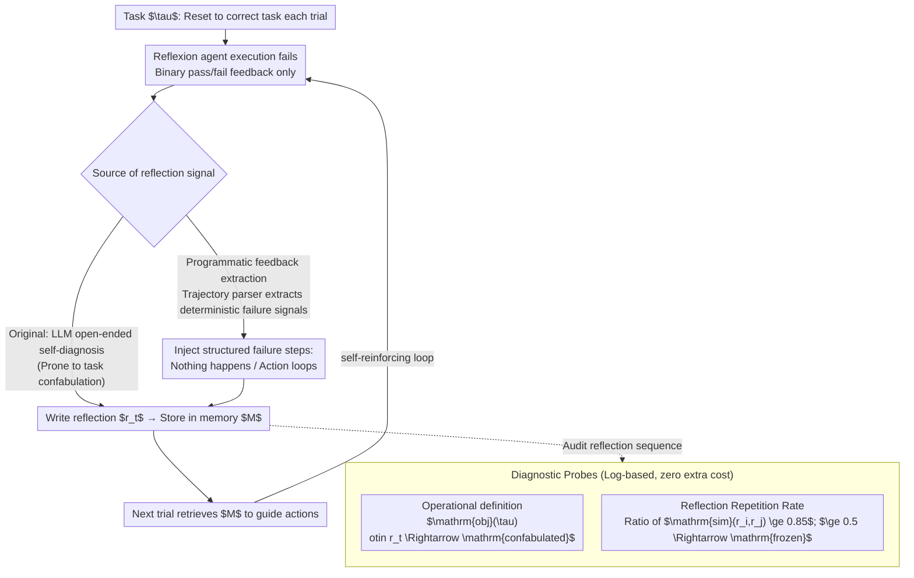

# Honest Lying: Understanding Memory Confabulation in Reflexive Agents

**Conference**: ICML 2026  
**arXiv**: [2605.29463](https://arxiv.org/abs/2605.29463)  
**Code**: None (Log repository only)  
**Area**: Hallucination Detection  
**Keywords**: Reflexion, Memory Confabulation, RRR, Grounded Feedback, Self-diagnosis Failure

## TL;DR
This paper uncovers a systematic failure mode in Reflexion-style agents termed "memory confabulation": agents write incorrect task understandings into reflective memory and reuse them across trials. The authors quantify this phenomenon using the Reflection Repetition Rate (RRR) and replace open-ended self-diagnosis with programmatic feedback extraction, which increases the correct object mention rate from 0% to 86% and reduces RRR from 0.64 to 0.10 on ALFWorld.

## Background & Motivation
**Background**: "Reflective agents" such as Reflexion (Shinn et al., 2023) "learn" without gradient updates by having an LLM write a natural language reflection after a failure, which is then appended to the context of the next trial. This paradigm improved the GPT-4 pass@1 on HumanEval from 80% to 91% and is considered representative of "introspective self-improvement" for LLM agents. Works like ExpeL extend single-task reflection to cross-task shared rule libraries.

**Limitations of Prior Work**: The **fundamental assumption** of this pipeline is that "the agent can correctly diagnose why it failed." However, the authors find that when feedback signals are sparse (binary pass/fail) and tasks require multi-step operations, agents **confidently write incorrect diagnoses** and permanently store them in memory—reinforcing the error in subsequent trials, forming a self-reinforcing false belief. This differs from hallucination: hallucination is a single-generation error, while confabulation is a **persistent misuse across trials**.

**Key Challenge**: While reflective memory is designed as a "fix mechanism," it empirically acts as an "error amplifier." Specifically, under binary feedback without step-level signals to support causal attribution, reflection degenerates into a repetition of the same incorrect diagnosis.

**Goal**: (1) Formalize and measure this failure mode; (2) Confirm it is not unique to ALFWorld across different domains; (3) Provide a cheap mitigation strategy that does not require updating LLM weights.

**Key Insight**: The authors borrow the concept of "confabulation" from cognitive science (failure of reality monitoring where internal generation is mistaken for observation) to name this phenomenon. They realize **it can be detected using existing Reflexion logs**—requiring only the gamefile name (containing the ground-truth target object) and the reflection text, with no new experiments needed.

**Core Idea**: Use the "approximate repetition rate between reflections" as a probe for frozen memory and replace LLM self-diagnosis with "programmatic extraction of trajectory failure signals" to turn uninformative feedback into informative signals.

## Method

### Overall Architecture
The proposed method consists of three components: (1) **Concept**: Providing an operational definition of memory confabulation; (2) **Diagnosis**: Proposing the RRR metric as a log-based detector for frozen memory; (3) **Mitigation**: Using grounded reflection and programmatic feedback extraction to break the cycle of "frozen memory → repeated false diagnosis → repeated failure" without changing model weights or increasing trial counts. These three components form a closed loop—falsifying the original hypothesis, quantifying the harm, and providing a fix.

The following diagram illustrates the "Reflexion loop + diagnostic probe + grounded intervention": The top section shows the self-reinforcing loop where the agent diagnoses itself, writes reflections, stores them, and retrieves them in the next trial (where confabulation occurs). The two bottom-left probes audit whether the loop is "frozen" by reading logs. Mitigation occurs at the "source of reflection signal" by replacing open-ended self-introspection with deterministic failure signals extracted by a trajectory parser.

### Key Designs

**1. Operational Definition of Memory Confabulation: Turning "Task Imagining" into an Automated Boolean Label**

To study a failure mode, one must first be able to identify it at scale. The authors convert the event of an "agent imagining the wrong task in its reflection" into a string-check label: For a reflection $r_t$ generated for task $\tau$ at the $t$-th failure (stored in memory $M_{t+1}=M_t\cup\{r_t\}$), $r_t$ is defined as **confabulated** if and only if $\mathrm{obj}(\tau)\notin r_t$, meaning the target object explicitly stated in the task description does not appear in the reflection text. $\mathrm{obj}(\tau)$ is extracted directly from ALFWorld gamefile directory names (e.g., `Mug` from `pick_cool_then_place_in_recep-Mug-None-CoffeeMachine-10`). On HumanEval, this is replaced by the "specific test case of the failed assertion." Relying on string checks instead of an LLM judge avoids the circular bias of "using LLM to evaluate LLM" and allows existing Reflexion logs to be reused with zero additional API cost.

**2. Reflection Repetition Rate (RRR) and Frozen Memory Threshold: Measuring Memory Stagnation with a Scalar**

The harm of confabulation lies in the repeated iteration of false diagnoses until the memory "freezes." The authors propose a probe to quantify this. For environmental memory $M=\{r_0,\dots,r_n\}$, they define:

$$\mathrm{RRR}=\frac{\big|\{r_i:i\geq 1,\ \exists j<i,\ \mathrm{sim}(r_i,r_j)\geq 0.85\}\big|}{|M|-1},$$

where $\mathrm{sim}$ is the SequenceMatcher character similarity. $\mathrm{RRR}=0$ indicates all reflections contain new content, while $\mathrm{RRR}=1$ indicates everything except the first reflection is an approximate copy. The paper defines $\mathrm{RRR}\geq 0.5$ as a frozen environment. This scalar is inexpensive, reproducible, and decoupled from cost. Empirically, the Spearman correlation between RRR and trials-to-solve is $r=0.808$ ($p<0.0001$), confirming that memory freezing delays problem-solving. The thresholds are empirical—0.85 corresponds to "near-total reuse," and 0.5 ensures at least half of the new reflections are near-duplicates before signaling an alert.

**3. Programmatic Feedback Extraction instead of Open-ended Self-diagnosis: Breaking the Cycle with Deterministic Signals**

The first two steps quantify the "frozen memory → repeated false diagnosis → failure" cycle caused by lack of step-level signals for causal attribution. The fix addresses the root cause: instead of letting the LLM recall what went wrong, a trajectory parser automatically extracts deterministic failure signals—identifying (a) actions that received "Nothing happens" and (b) repeating action loops in ALFWorld, or failed `assert` statements and exception types in HumanEval—and injects these structured failure steps directly into the reflection prompt. A weaker version, grounded reflection, was also tested where the LLM fills a `FAILED STEP / ROOT CAUSE / NEW PLAN` template but must still identify the failed step itself. Results confirm that only programmatic extraction (environment-side signals) pulls the correct object mention rate from 0% to 86% and reduces RRR from 0.64 to 0.10, essentially porting the unit-test feedback paradigm of HumanEval to ALFWorld.

### Loss & Training
No training was performed. All experiments used published Reflexion logs + gpt-3.5-turbo / gpt-4o-mini. The 16 frozen ALFWorld environments were re-run with a 10-trial budget (original was 15).

## Key Experimental Results

### Main Results
The frozen memory phenomenon was reproduced across four domains: ALFWorld, WebShop, HotpotQA, and HumanEval. Five conditions were then compared on 16 frozen ALFWorld environments.

| Domain | Feedback Type | Frozen Ratio | Avg. RRR |
|----|----------|--------------|-----------|
| ALFWorld | Binary | 32% (16/50) | 0.64 |
| WebShop | Binary | 82% (55/67) | 0.83 |
| HotpotQA | Binary | 46% (46/100) | 0.059 |
| HumanEval | Unit tests | 17% (4/23) | 0.59 |

| Condition (16 frozen env) | Solved | Obj Mention Rate | Avg. RRR |
|----------------------|--------|-------------|----------|
| Original Reflexion (All confabulated) | 0/16 | 0% (0/121) | 0.64 |
| No memory ablation | 2/16 | — | — |
| Grounded reflection (Template-based) | 2/16 | — | — |
| **Programmatic extraction** | **3/16** | **86% (134/156)** | **0.10** |
| gpt-4o-mini swap | 2/16 | 100% | 0.53 |

### Ablation Study

| Key Comparison | Finding | Meaning |
|----------|------|------|
| Memory-harmful vs Task-hard | 2 environments (env_31, env_97) solved in 1 trial without memory; original took 7–8 | Reflective memory can **actively harm** performance rather than being passively useless. |
| env_22 (Mug→CoffeeMachine) | 14/14 reflections cited tomato + microwave (entirely wrong task) | Wrong task identities can remain stable and persistent across trials. |
| env_35 case study | Grounded / No-mem both DNF; Programmatic extraction solved at trial 4 | Programmatic signals can unlock environments that self-introspection alone cannot solve. |
| HumanEval Programmatic Ext. | 18/18 reflections included specific error types; RRR 0.59→0.44 | The mechanism is not limited to navigation; it holds for code generation as well. |
| gpt-4o-mini upgrade | Object mention rate 100% but only 2/16 solved | Model capability improvements can eliminate confabulation but cannot solve gaps in problem-solving ability itself. |

### Key Findings
- **Feedback granularity determines confabulation frequency**: Binary feedback domains (ALFWorld/WebShop/HotpotQA) show frozen rates of 32–82%, whereas unit-test feedback in HumanEval is only 17%, supporting the hypothesis that feedback quality dictates self-diagnosis quality.
- **Symptom confabulation in WebShop**: 56% (121/218) of frozen reflections only describe "clicking the wrong thing" without diagnosing which size/color/price constraint was violated—a different surface form of the same root cause.
- **Capability gaps and confabulation are independent axes**: 14/16 tasks could not be solved even without memory, but the 0/16 → 3/16 improvement came from samples like env_31/97/35 that were solvable but led astray by memory; gpt-4o-mini results further separate these factors.
- **Intervention risks**: In HumanEval/77, performance degraded from "solved" to "unsolved" after programmatic extraction, reminding that any memory intervention may disrupt an originally working solution path.

## Highlights & Insights
- **From concept to metrics**: The authors transform "memory confabulation"—an abstract concept—into an engineering problem that can be audited at scale using two log-only metrics: RRR and object mention rate.
- **Zero-cost replication**: All findings are based on published Reflexion logs, providing evidence across 134 environments and 4 domains without re-running experiments, making it a very efficient methodology.
- **Duality of diagnosis and mitigation**: Identifying frozen environments with RRR and then feeding back correct signals via programmatic extraction creates a clean closed loop; this "quantify failure mode, then targeted grounding" approach is valuable for all memory-augmented agent research.
- **Cognitive science grounding**: Using "confabulation" (failure of reality monitoring) aptly captures the essence of LLM agents mistaking generation for observation, facilitating interdisciplinary discussion.

## Limitations & Future Work
- The similarity threshold (0.85) and frozen threshold (0.5) for RRR are empirical and lack robustness testing across other task families; semantic repetitions (different wording, same meaning) might be missed by SequenceMatcher.
- Programmatic extraction relies on **domain-specific parables** like "nothing happens" or `AssertionError`; defining similar hooks for open-ended tasks (writing, multi-turn dialogue) remains an open challenge.
- Experiments were primary conducted on gpt-3.5-turbo; the gpt-4o-mini replication was limited to 16 ALFWorld environments. It is unknown if confabulation remains dominant in stronger models like Claude 3.5 or GPT-5.
- The sample size of 16 frozen environments is small; the generalizability of "unlocked" cases like env_35 requires larger-scale verification.

## Related Work & Insights
- **vs Reflexion (Shinn 2023)**: This work is not a replacement for Reflexion but a **surgical patch**—retaining the reflection mechanism while replacing the signal source. Reflexion's failures are explicitly exposed under binary feedback.
- **vs ExpeL (Zhao 2024)**: ExpeL distills single-task reflections into a global rule library. This paper points out that such architectures risk magnifying a **single confabulated reflection into a global false rule**, implying higher risk.
- **vs Hallucination (Ji 2023)**: Explicitly distinguishes memory confabulation from single-generation hallucination—the former is multi-trial and self-reinforcing, requiring memory-aware evaluation rather than existing hallucination benchmarks.
- **vs Memory Survey (Du 2026)**: Confirms theoretical expectations regarding the "risk of reflective memory = self-reinforcing errors," providing the first cross-domain empirical evidence and mitigation strategy.

## Rating
- Novelty: ⭐⭐⭐⭐ The naming and formalization are novel; the mitigation strategy (programmatic extraction) is straightforward but had not been systematically tested.
- Experimental Thoroughness: ⭐⭐⭐⭐ Solid evidence across 4 domains, 5 conditions, and different model comparisons; sample size and threshold ablations are slightly weaker.
- Writing Quality: ⭐⭐⭐⭐⭐ Clear argumentation; case studies (env_22/35) make abstract phenomena tangible.
- Value: ⭐⭐⭐⭐ Provides immediately adoptable diagnostic metrics and mitigation strategies for all memory-augmented LLM agents.

<!-- RELATED:START -->

## Related Papers

- [\[ICML 2026\] When Hallucination Costs Millions: Benchmarking AI Agents in High-Stakes Adversarial Financial Markets (CAIA)](when_hallucination_costs_millions_benchmarking_ai_agents_in_high-stakes_adversar.md)
- [\[CVPR 2026\] Understanding and Mitigating Hallucinations in Multimodal Chain-of-Thought Models](../../CVPR2026/hallucination/understanding_and_mitigating_hallucinations_in_multimodal_chain-of-thought_model.md)
- [\[ACL 2026\] Parametric Knowledge is Not All You Need: Toward Honest Large Language Models via Retrieval of Pretraining Data](../../ACL2026/hallucination/parametric_knowledge_is_not_all_you_need_toward_honest_large_language_models_via.md)
- [\[ACL 2026\] Understanding New-Knowledge-Induced Factual Hallucinations in LLMs: Analysis and Interpretation](../../ACL2026/hallucination/understanding_new-knowledge-induced_factual_hallucinations_in_llms_analysis_and_.md)
- [\[CVPR 2026\] Understanding the Role of Hallucination in Reinforcement Post-Training of Multimodal Reasoning Models](../../CVPR2026/hallucination/understanding_the_role_of_hallucination_in_reinforcement_post-training_of_multim.md)

<!-- RELATED:END -->
