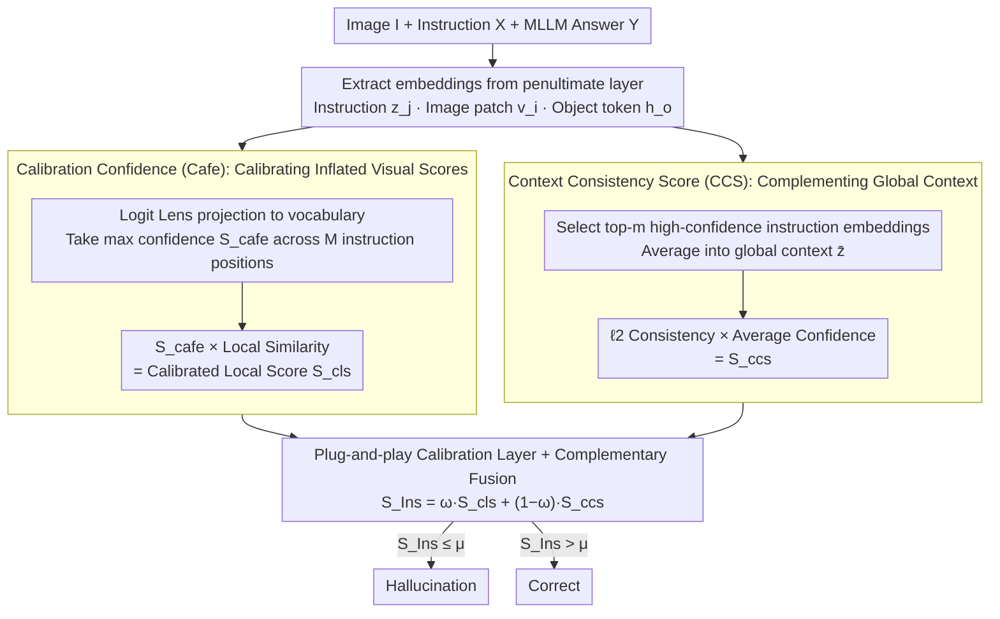

# Instruction Lens Score: Your Instruction Contributes a Powerful Object Hallucination Detector for Multimodal Large Language Models

**Conference**: ICML 2026  
**arXiv**: [2605.12258](https://arxiv.org/abs/2605.12258)  
**Code**: https://github.com/Fraserlairh/Instruction-Lens-Score (Available)  
**Area**: Hallucination Detection  
**Keywords**: Object Hallucination, Instruction Embedding, Logit Lens, Training-free Detection, MLLM

## TL;DR
The study identifies that middle-layer embeddings of instruction tokens in MLLMs naturally filter out misleading information from the visual side. Based on this, a training-free InsLen score (Calibrated Local Score + Context Consistency Score) is proposed, which improves the AUROC of object hallucination detection by up to 13.81% across 5 MLLMs and 4 benchmarks.

## Background & Motivation

**Background**: Object hallucination (generating non-existent objects in an image) is a core obstacle to the reliable deployment of MLLMs. Existing detection methods follow two lines: one relies on external models like GPT-4 for scoring, which is costly; the other mines internal model signals, such as visual token attention weights (SVAR) or the similarity between answer token embeddings and image patch embeddings (GLSIM).

**Limitations of Prior Work**: Internal signal methods rely almost entirely on "visual evidence." However, visual encoders or cross-modal attention can introduce misleading visual features (e.g., misidentifying a silver spoon as a silver knife), leading hallucinated objects to receive artificially high scores. Furthermore, patch-level representations are local and fail to incorporate global object context.

**Key Challenge**: Using "visual evidence" to detect "visual hallucinations" introduced by the visual side essentially involves using homologous signals to detect homologous noise. An independent pathway is required to calibrate visual signals.

**Goal**: (1) Identify internal signals capable of suppressing misleading visual information; (2) Provide both patch-level local evidence and global context consistency.

**Key Insight**: By projecting the middle-layer embeddings of instruction tokens onto the vocabulary using Logit Lens, the authors discovered that instruction embeddings exhibit high confidence for real objects and low confidence for hallucinated ones (e.g., "bag" in Figure 1). Statistics on MSCOCO show that AUROC provided by instruction embeddings is $\geq 8\%$ higher than that of image embeddings. This overlooked filtering effect can serve as an independent calibration pathway.

**Core Idea**: Use instruction embeddings to calibrate visual scores and provide global object context, merging these two signals for hallucination detection.

## Method

### Overall Architecture
The input consists of an image $I$, a user instruction $\mathbf{X}$ (defaulting to "Please describe the image in detail."), and an MLLM-generated answer $Y$. From the penultimate layer of the MLLM language model, all instruction token embeddings $\{\mathbf{z}_j\}_{j=1}^{M}$, all image patch embeddings $\{\mathbf{v}_i\}$, and embeddings for each object token $\mathbf{h_o}$ in the answer are extracted. The entire InsLen process requires no training. For each object token, two complementary scores are calculated: $S_{\rm cls}$ (Calibrated Local Score) and $S_{\rm ccs} $ (Context Consistency Score). These are weighted to obtain $S_{\rm Ins}(\mathbf{o})=\omega S_{\rm cls}+(1-\omega)S_{\rm ccs}$. Binary classification is performed using a threshold $\mu$, where scores below the threshold are considered hallucinations.

### Key Designs

**1. Calibration Confidence (Cafe): Calibrating Inflated Visual Evidence via Instruction-side Certainty**

As previously discussed, pure visual scores can be misled by features like "silver spoon misidentified as silver knife," giving hallucinated objects high scores. Cafe introduces an independent pathway for "voting": each instruction embedding $\mathbf{z}_j$ is projected via Logit Lens to get the probability of the object token $\mathbf{o}$. The maximum value across $M$ positions is taken: $S_{\rm cafe}(\mathbf{o})=\max_{j}{\rm softmax}(\mathbf{W}_u\mathbf{z}_j/\tau)[\mathbf{o}]$ (where $\tau$ is temperature). The maximum is used instead of the average because statistical observations show that if any single instruction position is "certain" about the object, that certainty is reliable and should not be diluted. Cafe is integrated into existing visual scores via **multiplication**, such as $S_{\rm cls}(\mathbf{o})=S_{\rm cafe}(\mathbf{o})\cdot\frac{1}{K}\sum_k\cos(\mathbf{h_o},\mathbf{v}_k)$. Multiplication is preferred over addition because scores like SVAR, Internal Conf, and LSS have different scales; multiplication is naturally compatible and "discounts" inflated visual scores based on instruction-side confidence.

**2. Context Consistency Score (CCS): Incorporating Global Object Context to Bridge Local Blind Spots**

Visual scores rely on local patches and struggle with highly similar local textures (e.g., "silver spoon vs. silver knife"). CCS utilizes the fact that instruction embeddings aggregate information across the whole image through cross-attention, thus acting as a global view. First, instruction embeddings are projected to the vocabulary to select the top-$m$ embeddings $\{\hat{\mathbf{z}}_n\}$ with the highest confidence for object token $\mathbf{o}$. These are averaged into a global object context $\overline{\mathbf{z}}=\frac{1}{m}\sum_n\hat{\mathbf{z}}_n$. Normalized $\ell_2$ distance measures the consistency between the answer's object token $\mathbf{h_o}$ and this context: $S_{\rm con}(\mathbf{o})=\alpha-\|\mathbf{h_o}-\overline{\mathbf{z}}\|/\|\mathbf{h_o}\|$. Finally, this is multiplied by the average confidence $\overline{p}$ of these selected embeddings to get $S_{\rm ccs}=S_{\rm con}\cdot\overline{p}$. Selecting top-$m$ positions filters out irrelevant noise, and $\ell_2$ is used over cosine to capture both orientation and magnitude differences—critical for distinguishing objects with similar textures but different scales.

**3. Plug-and-play Calibration Layer + Complementary Fusion of Local and Global Scores**

InsLen does not replace existing detectors but acts as an orthogonal calibration layer. Cafe can be multiplied with any visual score (SVAR, Internal Conf, LSS), while CCS provides global object-level signals that visual scores lack. These two components complement each other by capturing patch-level local evidence and object-level global context, respectively. They are fused using $\omega\in[0,1]$ into the final score $S_{\rm Ins}=\omega S_{\rm cls}+(1-\omega)S_{\rm ccs}$ (default $\omega=0.4, \alpha=2, \tau=10, m=4$). The process is training-free and model-agnostic, with negligible overhead as it only requires an extra pass through the unembedding matrix, allowing for immediate deployment on existing MLLMs.

### Loss & Training
Ours is entirely training-free. All embeddings are directly extracted from the penultimate layer of frozen MLLMs (Layer 31 for LLaVA, Layer 35 for Qwen3-VL). No new parameters are introduced, and the four hyperparameters $\omega, \alpha, \tau, m$ use a shared setting across various MLLMs.

## Key Experimental Results

### Main Results
Evaluation across 5 MLLMs (LLaVA-1.5-7B, InstructBLIP-7B, mPLUG-Owl3-8B, LLaVA-OneVision1.5-8B, Qwen3-VL-8B) and 4 benchmarks (MSCOCO, Objects365, POPE, CLEVR) using AUROC / AUPR.

| Model / Dataset | Metric | Strongest Baseline | InsLen | Gain |
|--------|------|------|----------|------|
| Qwen3-VL / MSCOCO | AUROC | 75.36 (SVAR) | 81.02 | +5.66 |
| LLaVA-1.5 / POPE | AUROC | 70.13 (GLSIM) | 83.94 | +13.81 |
| Qwen3-VL / Objects365 | AUROC | 70.84 (SVAR) | 77.44 | +6.60 |
| mPLUG-Owl3 / CLEVR | AUROC | 70.71 (SVAR) | 74.01 | +3.30 |

### Ablation Study

| Configuration | LLaVA-1.5 AUROC | Qwen3-VL AUROC | Description |
|------|---------|---------|------|
| Only $S_{\rm local}$ | 74.20 | 65.43 | Pure visual baseline |
| Only $S_{\rm cafe}$ | 80.41 | 77.06 | Calibration using instruction confidence only |
| $S_{\rm local}+S_{\rm cafe}$ (CLS) | 84.31 | 79.83 | Cafe adds 10 points to visual score |
| Only $S_{\rm con}$ | 80.69 | 71.94 | Global consistency only |
| Only Conf. Weighting | 79.44 | 78.12 | Average confidence alone contains signals |
| Full InsLen | **86.93** | **81.02** | All four components enabled |

### Key Findings
- Cafe is the primary contributor: Adding Cafe to any visual score (SVAR/Internal Conf/LSS) on LLaVA-1.5 yields an average gain of 7–10 AUROC points, validating that "visual-side inflation" is a core pain point.
- CCS and CLS are highly complementary: Using CCS alone on LLaVA gives 80.69 AUROC, CLS alone gives 84.31, and merging them yields 86.93, indicating that patch-level local and object-level global signals capture different information.
- Longer instructions lead to better detection: Longer instructions on LLaVA result in a 2.40% AUROC increase due to more redundant visual information being backed up across instruction positions.
- Minimal inference overhead: On Qwen3-VL, InsLen takes 564.5ms, accounting for only 2.9% of the 19550ms answer generation time; this is significantly lower than EAZY's 40293ms.
- Effective on post-trained models: On LLaVA-RLAIF-V (where easy hallucinations are already suppressed, HR only 6.72%), InsLen remains effective with 80.14 AUROC, 7.78 higher than GLSIM.

## Highlights & Insights
- The counter-intuitive observation that "instruction embeddings understand the image better than image embeddings" is statistically supported and powerful—misleading visual information is "denoised" by semantic priors on the instruction side after multiple attention layers. This insight is transferable to VQA and grounding tasks.
- The paradigm using Logit Lens + top-$k$ high-confidence tokens is lightweight and can be reused as an "internal diagnostic" tool for VLM debugging and prompt engineering.
- Calibration via multiplication is an underrated technique—it avoids new scaling coefficients and remains stable during method combinations.

## Limitations & Future Work
- Logit Lens only translates internal signals into "literal tokens," potentially missing information stored as synonyms (e.g., "puppy" for "dog").
- Representation drift affects deep layer embeddings, leading to performance variance across different MLLM architectures (e.g., mPLUG-Owl3 vs. LLaVA).
- This method only detects hallucinations and does not repair them; integration with contrastive decoding for a closed-loop system would be valuable.
- Evaluation is limited to static image description tasks; multi-turn dialogues and video understanding remain unexplored.

## Related Work & Insights
- **vs GLSIM (Park & Li 2025)**: GLSIM also fuses global-local signals, but global signals come from image summary tokens; Ours uses instruction tokens, which provide a natural filtering effect, leading to a 13.81 AUROC improvement on POPE.
- **vs SVAR (Jiang et al. 2025b)**: SVAR uses attention ratios (visual evidence); Ours shows that multiplying Cafe with SVAR yields an additional 7.47 AUROC gain, serving as a complement rather than a replacement.
- **vs EAZY (Che et al. 2025)**: EAZY uses "zeroing out image tokens" for contrast, which is extremely costly (40s+ per sentence); InsLen is training-free and inference is almost free, making it more suitable for online deployment.

## Rating
- Novelty: ⭐⭐⭐⭐ Using instruction embeddings for hallucination detection is novel and statistically validated, though the underlying tools (Logit Lens, cosine similarity) are standard.
- Experimental Thoroughness: ⭐⭐⭐⭐⭐ Covers 5 MLLMs × 4 benchmarks + post-trained variants + instruction length sensitivity + combinations with multiple visual scores.
- Writing Quality: ⭐⭐⭐⭐ Formulas are clear, but naming conventions for Cafe and CCS can be confusing; some chart explanations could be more intuitive.
- Value: ⭐⭐⭐⭐ Training-free + plug-and-play + near-zero overhead, suitable for direct integration as a hallucination gate in production MLLMs.

<!-- RELATED:START -->

## Related Papers

- [\[CVPR 2026\] PAS: Prelim Attention Score for Detecting Object Hallucinations in Large Vision-Language Models](../../CVPR2026/hallucination/pas_prelim_attention_score_for_detecting_object_hallucinations_in_large_vision-l.md)
- [\[ICML 2026\] Revis: Sparse Latent Steering to Mitigate Object Hallucination in Large Vision-Language Models](revis_sparse_latent_steering_to_mitigate_object_hallucination_in_large_vision-la.md)
- [\[CVPR 2026\] Same Attention, Different Truths: Put Logit-Lens over Visual Attention to Detect and Mitigate LVLM Object Hallucination](../../CVPR2026/hallucination/same_attention_different_truths_put_logit-lens_over_visual_attention_to_detect_a.md)
- [\[CVPR 2026\] First Logit Boosting: Visual Grounding Method to Mitigate Object Hallucination in Large Vision-Language Models](../../CVPR2026/hallucination/first_logit_boosting_visual_grounding_method_to_mitigate_object_hallucination_in.md)
- [\[ICLR 2026\] PostAlign: Multimodal Grounding as a Corrective Lens for MLLMs](../../ICLR2026/hallucination/postalign_multimodal_grounding_as_a_corrective_lens_for_mllms.md)

<!-- RELATED:END -->
