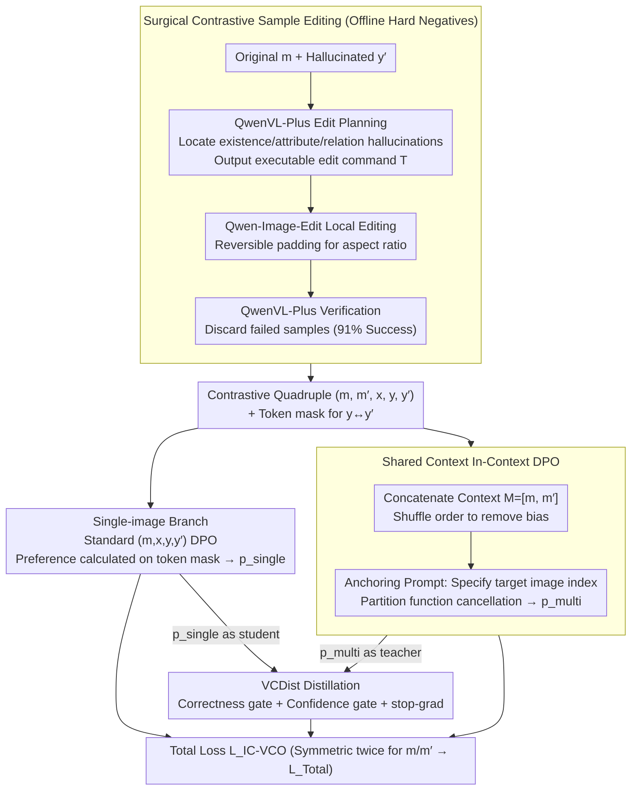

# Learning from Fine-Grained Visual Discrepancies: Mitigating Multimodal Hallucinations via In-Context Visual Contrastive Optimization

**Conference**: ICML 2026  
**arXiv**: [2605.31312](https://arxiv.org/abs/2605.31312)  
**Code**: https://github.com/OPPO-Mente-Lab/IC-VCO (Available)  
**Area**: Hallucination Detection  
**Keywords**: Multimodal Hallucination, Preference Optimization, Visual Contrast, DPO, Hard Negatives

## TL;DR
By concatenating the original image and a contrastive negative image into a shared multi-image context and using anchoring instructions to specify which image to observe, the partition function of visual preference DPO is automatically aligned to achieve a theoretically consistent contrastive objective. Combined with surgically edited hard negatives, this significantly reduces multimodal hallucinations in VLMs.

## Background & Motivation

**Background**: Aligning VLMs using DPO is currently a mainstream post-training approach. However, standard DPO only compares $y$ and $y'$ on the text side, treating the image $m$ as a static condition, which fails to provide explicit supervision on whether the model is truly "looking at the image." To inject visual signals into DPO, recent works (mDPO, V-DPO, S-VCO, SymMPO, etc.) introduced "visual preference pairs": fixing the textual response $y$ and swapping the positive image $m$ with a negative image $m'$ to form $r(m,x,y)\succ r(m',x,y)$, followed by the standard DPO loss.

**Limitations of Prior Work**: The authors identify two critical flaws in this mainstream approach. First is **theoretical inconsistency**—DPO cancels out the intractable partition function $Z$ because the positive and negative samples share the same condition. Once the image in the condition is changed, $Z(m,x)$ and $Z(m',x)$ become normalization constants across two different distributions that cannot be cancelled, leaving a residual term $\beta\log\frac{Z(m,x)}{Z(m',x)}$ as an uncontrollable bias during training. Second is **coarse negative samples**: most existing $m'$ are derived from image-text synthesis or retrieval, introducing significant global style shifts. The model can easily minimize the DPO loss by capturing these low-level differences without learning fine-grained visual facts, leading to typical shortcut learning.

**Key Challenge**: Injecting visual supervision within the DPO framework requires changing the conditional distribution, yet such changes break DPO's theoretical guarantees while the "easy discriminability" of negative samples induces shortcuts. These issues constrain each other.

**Goal**: The problem is decoupled into two sub-problems: (a) designing a visual preference objective that cancels the partition function and maintains DPO's theoretical consistency; (b) generating visually indistinguishable hard negatives to concentrate contrastive signals on true semantic discrepancies.

**Key Insight**: The authors observe that the partition function automatically aligns if the positive and negative samples share the **same image context**. Thus, the original and contrastive images are placed into a single multi-image sequence $M=[m,m']$. Anchoring prompts (e.g., "Please answer based on the first/second image") are used to specify the target image, transforming visual contrast from "changing conditions" to "textual preference under the same condition," thereby resolving the theoretical flaw.

**Core Idea**: In-Context Visual Contrastive Optimization (IC-VCO) applies DPO within a shared multi-image context for visual contrast, uses Visual Contrast Distillation to distill multi-image supervision back to the single-image inference branch, and generates hard negatives via "surgical" image editing to address multimodal hallucinations.

## Method

### Overall Architecture
The input for IC-VCO is a contrastive quadruple $(m, m', x, y, y')$: the original image $m$, a negative image $m'$ with subtle semantic differences, a shared prompt $x$, and the corresponding correct response $y$ and contrastive response $y'$. Three pipelines operate simultaneously during training. First is the **multi-image branch**: $m$ and $m'$ are concatenated into context $M$. Location anchoring instructions (e.g., "answer based on the first image") are appended to the prompt to get $\hat{x}$, and DPO is applied such that $y\succ y'$. To eliminate positional bias, the image order is randomly shuffled for each sample. Second is the **single-image branch**: standard $(m, x, y, y')$ DPO is maintained to preserve performance during the inference phase. Third is **VCDist distillation**: the preference probability $p_{\text{multi}}$ from the multi-image branch serves as a soft target to calibrate the single-image branch $p_{\text{single}}$, bridging the training–inference context gap. The final loss includes symmetric terms and fine-grained token masks to focus on edited visual evidence. Negative images $m'$ are generated offline using a "surgical contrastive sample editing" pipeline.

### Key Designs

**1. Shared Context In-Context DPO: Replacing "Image Swapping" with "Prompt Swapping" for Partition Function Alignment**

Previous visual preference DPO methods relied on "swapping images"—fixing the text response and swapping $m$ and $m'$. This changes the conditional distribution, introducing a bias term $\beta\log\frac{Z(m,x)}{Z(m',x)}$ that drifts with samples and distorts the decision boundary. The solution here is to fix the condition and only swap the prompt: $m$ and $m'$ are concatenated into a sequence $M=[m,m']$ as a unified visual condition. Anchoring prompts $\hat{x}$ ("Please answer based on the first image") specify the target image, transforming the visual preference $r(m,x,y)\succ r(m',x,y)$ into a textual preference under the same condition $r(M,\hat{x},y)\succ r(M,\hat{x},y')$. The partition function $Z(M,\hat{x})$ cancels out perfectly, yielding a clean $p_{\text{multi}}=\sigma\big(\beta\log\tfrac{\pi_\theta(y\mid M,\hat{x})}{\pi_{\text{ref}}(y\mid M,\hat{x})}-\beta\log\tfrac{\pi_\theta(y'\mid M,\hat{x})}{\pi_{\text{ref}}(y'\mid M,\hat{x})}\big)$. A symmetric pair $r(M,\hat{x}',y')\succ r(M,\hat{x}',y)$ is optimized jointly with random shuffling. This places visual preference DPO on the same theoretical foundation as original DPO.

**2. VCDist: Distilling Multi-image Teacher to Single-image Student with Reliability Gating**

Using multiple images during training creates a context gap during single-image inference. Naive KL divergence might degrade single-image performance. VCDist treats the multi-image preference distribution as a teacher and the single-image branch as a student, using dual gates to filter signals: a correctness gate $\mathbb{I}(p_{\text{multi}}>0.5)$ filters untrustworthy teachers, and a confidence gate $\mathbb{I}(p_{\text{single}}<\mathrm{sg}(p_{\text{multi}}))$ passes gradients only when the student is less certain than the teacher, avoiding "reverse punishment." With stop-gradient for stability, the loss is: $\mathcal{L}_{\text{VCDist}}=-\mathbb{E}\big[\mathbb{I}(\cdot)\big(\mathrm{sg}(p_{\text{multi}})\log p_{\text{single}}+(1-\mathrm{sg}(p_{\text{multi}}))\log(1-p_{\text{single}})\big)\big]$. The total objective is $\mathcal{L}_{\text{IC-VCO}}=\tfrac{1}{2}\big[\lambda_1(\mathcal{L}_{\text{Multi}}+\eta_1\mathcal{L}_{\text{MultiAnc}})+\lambda_2(\mathcal{L}_{\text{Single}}+\eta_2\mathcal{L}_{\text{SingleAnc}})+\gamma\mathcal{L}_{\text{VCDist}}\big]$.

**3. Surgical Contrastive Sample Editing: Creating Hard Negatives to Force Semantic Focus**

Old methods using synthesis or retrieval for $m'$ introduce global style shifts $P(C_{ctx},U\mid m)\neq P(C_{ctx},U\mid m')$. Models exploit these shortcuts instead of learning fine-grained facts. The generation factors are decomposed into target concept $c_{tgt}$, context $C_{ctx}$, and environment $U$. Only a fine-grained intervention $do(c_{tgt}\to c'_{tgt})$ is performed while maintaining $\{C_{ctx},U\}_m\approx\{C_{ctx},U\}_{m'}$. The pipeline uses QwenVL-Plus as an "edit planner" to identify hallucination points in $y'$ and output executable commands $\mathcal{T}$. Qwen-Image-Edit performs local modifications with aspect-ratio-preserving reversible padding, followed by verification. Token-level differences between $y$ and $y'_{\text{new}}$ serve as masks to focus preference scores on edited visual evidence.

### Loss & Training
The final objective $\mathcal{L}_{\text{Total}}=\mathcal{L}_{\text{IC-VCO}}+\mathcal{L}'_{\text{IC-VCO}}$ is applied symmetrically for both $m$ and $m'$. Anchoring terms $\mathcal{L}_{\text{SingleAnc}}$ and $\mathcal{L}_{\text{MultiAnc}}$ are used to prevent the chosen likelihood from dropping relative to the reference policy. Using 21.4k seeds from SymMPO, the pipeline produced 19,453 edited negative samples with a 91% success rate.

## Key Experimental Results

### Main Results
Compared across five mainstream visual preference optimization methods on LLaVA-NeXT-Interleave-Qwen-7B using both synthesized and edited negative samples.

| Data Source | Method | Overall | HallusionBench aAcc | AMBER Attr | CRPE Exist | BLINK |
|----------|------|---------|---------------------|------------|------------|-------|
| — | LLaVA-NeXT Baseline | 59.14 | 55.59 | 79.97 | 92.01 | 45.13 |
| Synthetic | mDPO | 61.64 | 61.51 | 80.27 | 91.79 | 44.87 |
| Synthetic | SymMPO | 61.50 | 60.79 | 80.41 | 91.83 | 44.88 |
| Synthetic | **IC-VCO (Ours)** | **62.83** | 61.94 | 81.81 | 93.16 | **48.93** |
| Edited | mDPO | 62.02 | 60.25 | 80.31 | 92.27 | 45.66 |
| Edited | SymMPO | 62.11 | 60.57 | 80.39 | 92.47 | 45.19 |
| Edited | **IC-VCO (Ours)** | **63.35** | **63.51** | **82.24** | **94.15** | **49.44** |

On LLaVA-OneVision-Qwen2-7B, IC-VCO also leads strong baselines such as SymMPO and S-VCO, with notable gains in BLINK and HallusionBench fAcc.

### Ablation Study
The component-level ablation confirms all three modules are essential.

| Configuration | Overall | Note |
|------|---------|------|
| Full IC-VCO | 63.35 | Complete model |
| Synthetic Negatives Only | 62.83 | Data "hardness" contributes ~0.5 points |
| w/o VCDist | Decrease | Single-image branch loses supervision; HallusionBench metrics drop most |
| Single-image DPO Only | ≈ mDPO level | No shared context → return of partition function bias |

### Key Findings
- Edited negatives benefit all methods (mDPO/SymMPO/S-VCO), improving Overall score by +0.4~0.8, showing data "hardness" is an independent improvement dimension.
- Gains are largest in anti-hallucination (HallusionBench fAcc, AMBER Exist) and fine-grained reasoning (BLINK), consistent with the motive of "eliminating theoretical bias + fine-grained contrast."
- CRPE Relation is an outlier: IC-VCO is slightly lower than mDPO/SymMPO, suggesting local edits for relationship hallucinations require more granularity.

## Highlights & Insights
- The shift from "changing conditions" to "changing prompts" is the most ingenious aspect, placing visual differences explicitly in context while using anchoring instructions to navigate. This provides a clean path to bypass the theoretical flaws of mDPO/S-VCO without changing the DPO formula.
- VCDist serves as a valuable template for any task where "training uses multi-images but inference uses one," such as temporal video contrast or cross-view consistency training.
- The combination of surgical editing and token-level masking can be decoupled for any contrastive learning route to upgrade coarse negatives into hard negatives.

## Limitations & Future Work
- The editing pipeline depends heavily on QwenVL-Plus and Qwen-Image-Edit; the 91% success rate means ~9% of samples are discarded. Generalizability to low-resource or non-natural domains (medical, satellite) needs verification.
- Training costs and context lengths double due to the multi-image branch; scalability for high-resolution images or larger model sizes is not fully discussed.
- Relational hallucinations (CRPE Relation) show limited improvement, indicating that "relationship" edits (position/interaction) are harder than "existence/attribute" edits.

## Related Work & Insights
- **vs mDPO / S-VCO / SymMPO**: These change images but ignore the bias from $Z(m,x)\neq Z(m',x)$. IC-VCO cancels the partition function via shared context.
- **vs V-DPO**: V-DPO attempts visual preference modeling but remains within single-image conditions. IC-VCO leverages the existing multi-image interfaces of LVLMs without architectural changes.
- **vs SymMPO Synthesis**: SymMPO's text-to-image synthesis causes global style shifts. Ours uses local editing to keep CLIP similarity high, fundamentally addressing shortcut learning.

## Rating
- Novelty: ⭐⭐⭐⭐⭐ Resolves both "theoretical" and "data" gaps in visual preference DPO simultaneously.
- Experimental Thoroughness: ⭐⭐⭐⭐ Five benchmarks across two base models with comprehensive ablations.
- Writing Quality: ⭐⭐⭐⭐⭐ Excellent coupling of math and motivation.
- Value: ⭐⭐⭐⭐⭐ VCDist and surgical editing are modular and reusable.

<!-- RELATED:START -->

## Related Papers

- [\[NeurIPS 2025\] Mitigating Hallucination Through Theory-Consistent Symmetric Multimodal Preference Optimization](../../NeurIPS2025/hallucination/mitigating_hallucination_through_theory-consistent_symmetric_multimodal_preferen.md)
- [\[ICML 2026\] Finding the Correct Visual Evidence Without Forgetting: Mitigating Hallucination in LVLMs via Inter-Layer Visual Attention Discrepancy](finding_the_correct_visual_evidence_without_forgetting_mitigating_hallucination_.md)
- [\[CVPR 2025\] Stop Learning It All to Mitigate Visual Hallucination, Focus on the Hallucination Target](../../CVPR2025/hallucination/stop_learning_it_all_to_mitigate_visual_hallucination_focus_on_the_hallucination.md)
- [\[CVPR 2026\] Zina: Multimodal Fine-grained Hallucination Detection and Editing](../../CVPR2026/hallucination/zina_multimodal_fine-grained_hallucination_detection_and_editing.md)
- [\[CVPR 2026\] FINER: MLLMs Hallucinate under Fine-grained Negative Queries](../../CVPR2026/hallucination/finer_mllms_hallucinate_under_fine-grained_negative_queries.md)

<!-- RELATED:END -->
