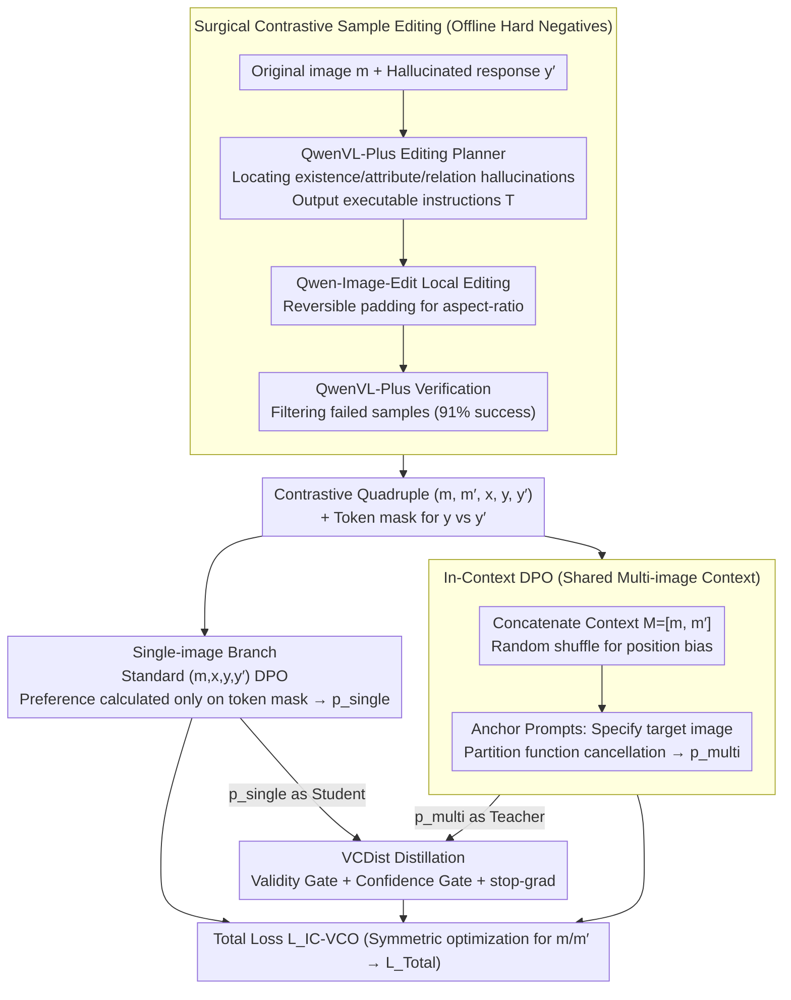

# Learning from Fine-Grained Visual Discrepancies: Mitigating Multimodal Hallucinations via In-Context Visual Contrastive Optimization

**Conference**: ICML 2026  
**arXiv**: [2605.31312](https://arxiv.org/abs/2605.31312)  
**Code**: https://github.com/OPPO-Mente-Lab/IC-VCO (Available)  
**Area**: Hallucination Detection  
**Keywords**: Multimodal Hallucination, Preference Optimization, Visual Contrast, DPO, Hard Negatives

## TL;DR
By concatenating the original image and a contrastive negative image into a shared multi-image context and using anchor instructions to specify which image to observe, the partition functions of visual-preference DPO are automatically aligned to produce a theoretically consistent contrastive objective. Combined with surgically edited hard negative samples, this significantly reduces multimodal hallucinations in VLMs.

## Background & Motivation

**Background**: Aligning VLMs via DPO is a mainstream post-training approach. However, standard DPO only compares $y$ and $y'$ on the text side, treating the image $m$ as a static condition, thus lacking explicit supervision on "whether the model is actually looking at the image." To inject visual signals into DPO, recent works (e.g., mDPO, V-DPO, S-VCO, SymMPO) introduce "visual preference pairs": fixing the text response $y$ and swapping the positive image $m$ with a negative image $m'$ to form $r(m,x,y)\succ r(m',x,y)$, then applying the standard DPO loss.

**Limitations of Prior Work**: The authors identify two critical flaws in this mainstream route. First is **theoretical inconsistency**—DPO eliminates the intractable partition function $Z$ because positive and negative samples share the same condition. Once the image in the condition is changed, $Z(m,x)$ and $Z(m',x)$ become normalization constants over two different distributions that cannot be canceled out, leaving a residual term $\beta\log\frac{Z(m,x)}{Z(m',x)}$ as an uncontrollable bias during training. Second is **coarse negative samples**: most existing $m'$ come from image-text synthesis or retrieval, introducing obvious global style shifts. Models can easily minimize DPO loss by capturing these low-level differences without learning fine-grained visual facts, leading to typical shortcut learning.

**Key Challenge**: Injecting visual supervision within the DPO framework requires changing the conditional distribution; however, changing the conditional distribution breaks DPO's theoretical guarantees, while "easily distinguishable" negative samples induce shortcuts. Both ends hinder each other.

**Goal**: Split into two sub-problems: (a) design a visual preference objective that eliminates the partition function and maintains DPO's theoretical consistency; (b) generate surgically edited hard negative samples that are visually almost indistinguishable to focus contrastive signals on true semantic differences.

**Key Insight**: The authors observe that by letting positive and negative samples share the **same image context**, the partition function automatically becomes consistent. Thus, the original and contrastive images are placed into a multi-image sequence $M=[m,m']$, and anchor prompts like "Please answer based on the first/second image" are used to designate the target image. This converts visual contrast from "changing conditions" to "text preference under the same condition," resolving the theoretical flaw.

**Core Idea**: Use In-Context Visual Contrastive Optimization (IC-VCO) to run DPO within a shared multi-image context, distill multi-image supervision back to the single-image inference branch via Visual Contrast Distillation (VCDist), and create hard negative samples through "surgical" image editing to address multimodal hallucinations.

## Method

### Overall Architecture
The input for IC-VCO is a contrastive quadruple $(m, m', x, y, y')$: the original image $m$, a negative image $m'$ with subtle differences in target semantics, a shared prompt $x$, and the corresponding correct response $y$ and contrastive response $y'$. During training, three pipelines operate simultaneously. First is the **multi-image branch**: $m$ and $m'$ are concatenated into context $M$, followed by anchor instructions (e.g., "Answer based on the 1st image") to get $\hat{x}$, running DPO such that $y \succ y'$; image order is randomized to eliminate position bias. Second is the **single-image branch**: maintaining standard $(m, x, y, y')$ DPO to ensure inference-stage capability. Third is **VCDist**: treating the preference probability $p_{\text{multi}}$ from the multi-image branch as a soft target to calibrate the single-image branch $p_{\text{single}}$, narrowing the training-inference context gap. The final loss includes symmetric terms and focus on edited visual evidence via "fine-grained token masks." The negative image $m'$ is generated offline via a "Surgical Contrastive Sample Editing" pipeline.

### Key Designs

**1. In-Context DPO with Shared Multi-image Context: Replacing "Swapping Images" with "Swapping Prompts" to align partition functions**

Prior visual preference DPO works relied on "swapping images"—fixing the text and swapping $m$ with $m'$. This changes the conditional distribution, introducing a bias term $\beta\log\frac{Z(m,x)}{Z(m',x)}$ that drifts with samples and distorts the decision boundary. The solution here is to keep the condition and change only the prompt: $m$ and $m'$ are concatenated into $M=[m,m']$ as a unified visual condition. Using anchor prompts $\hat{x}$ ("Answer based on the 1st image"), the visual preference $r(m,x,y)\succ r(m',x,y)$ is rewritten as a text preference under the same condition $r(M,\hat{x},y)\succ r(M,\hat{x},y')$. The partition function $Z(M,\hat{x})$ cancels out, yielding a clean $p_{\text{multi}}=\sigma\big(\beta\log\tfrac{\pi_\theta(y\mid M,\hat{x})}{\pi_{\text{ref}}(y\mid M,\hat{x})}-\beta\log\tfrac{\pi_\theta(y'\mid M,\hat{x})}{\pi_{\text{ref}}(y'\mid M,\hat{x})}\big)$. Symmetric pairs $r(M,\hat{x}',y')\succ r(M,\hat{x}',y)$ are also optimized, with randomized image ordering. This places visual preference DPO on the same theoretical foundation as original DPO.

**2. VCDist: Gated Distillation from Multi-image Teacher to Single-image Student**

Using multi-image context for training but single-image for inference creates a context gap. Naive KL divergence would degrade the high-quality single-image distribution. VCDist treats the multi-image preference as a teacher and the single-image branch as a student, using dual gates: a Validity Gate $\mathbb{I}(p_{\text{multi}}>0.5)$ to filter unreliable teacher signals, and a Confidence Gate $\mathbb{I}(p_{\text{single}}<\mathrm{sg}(p_{\text{multi}}))$ to only pass gradients when the student is less certain than the teacher. Stop-gradient is used for stability: $\mathcal{L}_{\text{VCDist}}=-\mathbb{E}\big[\mathbb{I}(\cdot)\big(\mathrm{sg}(p_{\text{multi}})\log p_{\text{single}}+(1-\mathrm{sg}(p_{\text{multi}}))\log(1-p_{\text{single}})\big)\big]$. The final objective is $\mathcal{L}_{\text{IC-VCO}}=\tfrac{1}{2}\big[\lambda_1(\mathcal{L}_{\text{Multi}}+\eta_1\mathcal{L}_{\text{MultiAnc}})+\lambda_2(\mathcal{L}_{\text{Single}}+\eta_2\mathcal{L}_{\text{SingleAnc}})+\gamma\mathcal{L}_{\text{VCDist}}\big]$.

**3. Surgical Contrastive Sample Editing: Generating Distribution-Aligned Hard Negatives**

Older methods using synthesized or retrieved images introduce global style shifts $P(C_{ctx},U\mid m)\neq P(C_{ctx},U\mid m')$, allowing models to minimize DPO loss via low-level shortcuts. By decomposing image generation into target concept $c_{tgt}$, context $C_{ctx}$, and environment $U$, this method performs a precise intervention $do(c_{tgt}\to c'_{tgt})$ while maintaining $\{C_{ctx},U\}_m\approx\{C_{ctx},U\}_{m'}$. The pipeline uses QwenVL-Plus as an "Editing Planner" to identify hallucination points in $y'$ (existence, attribute, or relation) and output executable instructions $\mathcal{T}$; Qwen-Image-Edit then performs local modifications while preserving aspect ratios. Finally, token-level differences between $y$ and $y'_{\text{new}}$ are recorded as a fine-grained mask for the single-image branch, focusing preference scores on edited visual evidence.

### Loss & Training
The final objective $\mathcal{L}_{\text{Total}}=\mathcal{L}_{\text{IC-VCO}}+\mathcal{L}'_{\text{IC-VCO}}$ is applied symmetrically for both $m$ and $m'$. Anchor terms $\mathcal{L}_{\text{SingleAnc}}$ and $\mathcal{L}_{\text{MultiAnc}}$ prevent the likelihood of chosen samples from dropping relative to the reference policy. Based on 21.4k seed samples from SymMPO, the pipeline produced 19,453 edited negative samples with a 91% success rate.

## Key Experimental Results

### Main Results
Evaluated on LLaVA-NeXT-Interleave-Qwen-7B across five benchmarks. Overall macro-averages are as follows:

| Data Source | Method | Overall | HallusionBench aAcc | AMBER Attr | CRPE Exist | BLINK |
|:---:|:---|:---:|:---:|:---:|:---:|:---:|
| — | LLaVA-NeXT-Interleave-Qwen-7B Baseline | 59.14 | 55.59 | 79.97 | 92.01 | 45.13 |
| Synthetic | mDPO | 61.64 | 61.51 | 80.27 | 91.79 | 44.87 |
| Synthetic | SymMPO | 61.50 | 60.79 | 80.41 | 91.83 | 44.88 |
| Synthetic | **IC-VCO (Ours)** | **62.83** | 61.94 | 81.81 | 93.16 | **48.93** |
| Edited | mDPO | 62.02 | 60.25 | 80.31 | 92.27 | 45.66 |
| Edited | SymMPO | 62.11 | 60.57 | 80.39 | 92.47 | 45.19 |
| Edited | **IC-VCO (Ours)** | **63.35** | **63.51** | **82.24** | **94.15** | **49.44** |

On LLaVA-OneVision-Qwen2-7B, IC-VCO also leads strong baselines like SymMPO / S-VCO, with notable gains in BLINK and HallusionBench fAcc.

### Ablation Study
Component-level ablation confirms all parts are necessary:

| Configuration | Overall | Note |
|:---|:---:|:---|
| Full IC-VCO (Multi-image + VCDist + Edited Negatives + Token Mask) | 63.35 | Full Model |
| Synthetic Negatives Only (No Editing) | 62.83 | Hard negatives contribute ~0.5 points |
| Without VCDist | Decrease | Single-image branch loses multi-image supervision; high degradation in HallusionBench |
| Single-image DPO Only (No Multi-image Branch) | ≈ mDPO | No shared context → Partition function bias returns |

### Key Findings
- Edited negative samples benefit not only IC-VCO but also mDPO/SymMPO/S-VCO (Overall +0.4~0.8), proving "data hardness" is an independently effective dimension.
- The relative improvement of IC-VCO is greatest in anti-hallucination metrics and fine-grained visual reasoning (BLINK), consistent with the motivation of "eliminating theoretical bias + enhancing fine-grained contrast."
- CRPE Relation is an exception: IC-VCO is slightly lower than mDPO/SymMPO, suggesting local editing for relation hallucinations needs further refinement.

## Highlights & Insights
- The shift from "changing conditions" to "changing prompts" is the most ingenious aspect: explicitly putting visual differences in context allows anchor instructions to designate target images while keeping the DPO formula intact, canceling out partition functions.
- VCDist treats the multi-image branch as a teacher and uses confidence-gated distillation for the single-image branch. This has transfer value for any preference work where training uses multi-image/video context but inference uses single-image.
- The "surgical editing + token-level mask" data pipeline can be used independently: as long as target concepts vs. context can be defined, coarse negatives can be upgraded to hard negatives for any contrastive learning route.

## Limitations & Future Work
- The editing pipeline depends heavily on QwenVL-Plus and Qwen-Image-Edit; the 91% success rate means ~9% of samples are discarded. Generalizability to low-resource or non-natural images (medical, remote sensing) needs verification.
- Training costs and context length double with the multi-image branch; scalability for ultra-high resolution or larger model sizes was not fully discussed.
- Improvements in CRPE Relation are limited, reflecting that "relationship" editing (involving relative positions and interactions of two objects) is harder than "existence/attribute" editing.

## Related Work & Insights
- **vs mDPO / S-VCO / SymMPO**: These works use "swapping images" but ignore the bias from $Z(m,x)\neq Z(m',x)$; IC-VCO uses shared context to eliminate this bias theoretically.
- **vs V-DPO**: V-DPO also attempts visual preference modeling but remains within single-image conditions; IC-VCO utilizes the existing multi-image input interface of modern LVLMs without modifying architecture.
- **vs SymMPO (Synthetic Negatives)**: SymMPO uses text-to-image for negatives, causing global style shifts; this paper uses Qwen-Image-Edit for local interventions, resulting in CLIP similarity distributions concentrated in the high-similarity range, solving the root cause of shortcut learning.

## Rating
- Novelty: ⭐⭐⭐⭐⭐ Simultaneously addresses both the "theoretical gap" and "data gap" of visual preference DPO with a unified, elegant approach.
- Experimental Thoroughness: ⭐⭐⭐⭐ Five benchmarks × two base models × multiple baselines + data ablations; limited only by model scale (7B).
- Writing Quality: ⭐⭐⭐⭐⭐ Theoretical derivations are tightly coupled with the narrative; the diagram of partition function residuals is particularly clear.
- Value: ⭐⭐⭐⭐⭐ Both VCDist and surgical editing serve as plug-and-play modules for the community.

<!-- RELATED:START -->

## Related Papers

- [\[NeurIPS 2025\] Mitigating Hallucination Through Theory-Consistent Symmetric Multimodal Preference Optimization](../../NeurIPS2025/hallucination/mitigating_hallucination_through_theory-consistent_symmetric_multimodal_preferen.md)
- [\[ICML 2026\] Finding the Correct Visual Evidence Without Forgetting: Mitigating Hallucination in LVLMs via Inter-Layer Visual Attention Discrepancy](finding_the_correct_visual_evidence_without_forgetting_mitigating_hallucination_.md)
- [\[CVPR 2025\] Stop Learning It All to Mitigate Visual Hallucination, Focus on the Hallucination Target](../../CVPR2025/hallucination/stop_learning_it_all_to_mitigate_visual_hallucination_focus_on_the_hallucination.md)
- [\[ICLR 2026\] Visual Multi-Agent System: Mitigating Hallucination Snowballing via Visual Flow](../../ICLR2026/hallucination/visual_multi-agent_system_mitigating_hallucination_snowballing_via_visual_flow.md)
- [\[CVPR 2026\] Zina: Multimodal Fine-grained Hallucination Detection and Editing](../../CVPR2026/hallucination/zina_multimodal_fine-grained_hallucination_detection_and_editing.md)

<!-- RELATED:END -->
