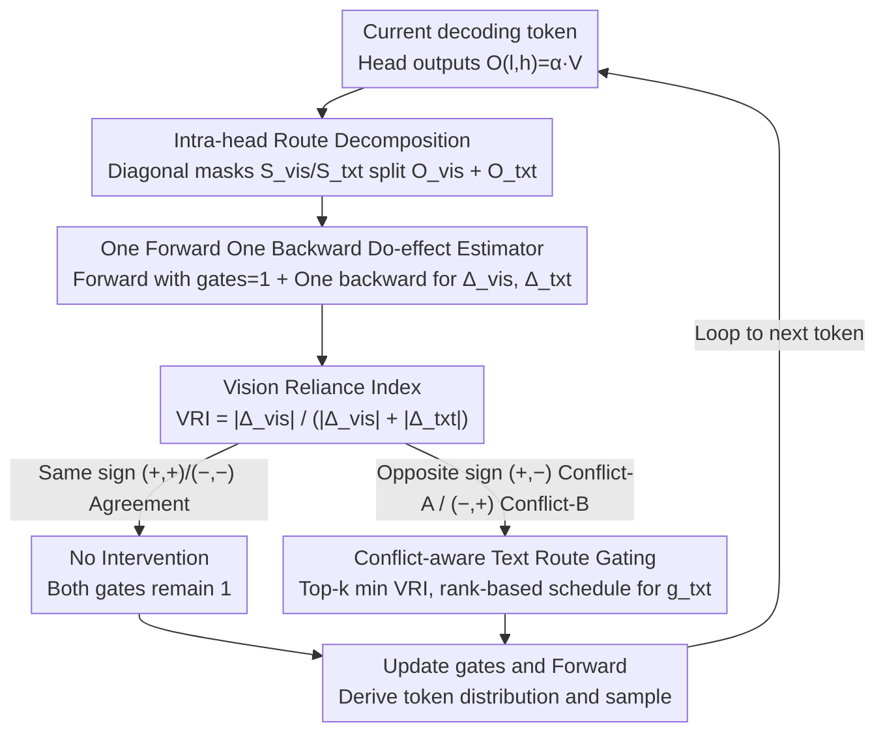

# Mitigating Hallucinations in Large Vision-Language Models via Causal Route Gating

**Conference**: ICML 2026 Spotlight  
**arXiv**: [2605.24024](https://arxiv.org/abs/2605.24024)  
**Code**: None  
**Area**: Hallucination Detection  
**Keywords**: LVLM Hallucination, Causal Intervention, Attention Head Gating, Route Decomposition, Training-free  

## TL;DR
CRG performs a precise linear decomposition of each attention head's output into vision and text routes. It utilizes one forward and one backward pass to estimate the causal "do-effect" of both routes on the current token. By suppressing only the text routes of heads where visual and textual signs conflict and the Vision Reliance Index (VRI) is low (i.e., prior-dominated), CRG systematically weakens language prior hallucinations in LVLMs without requiring retraining.

## Background & Motivation
**Background**: Large Vision-Language Models (LVLMs) have become the mainstream interface for image question answering and description generation. However, "hallucination"—generating content unrelated to the image yet semantically fluent—remains the major reliability bottleneck for deployment. Training-free inference-time interventions have become a popular direction as they require no additional computing power or data. Mainstream approaches fall into two categories: output-level decoding strategies like VCD/OPERA/MaskCD, and internal interventions based on attention proxies like PAI/VTI.

**Limitations of Prior Work**: Decoding-level interventions treat the model as a black box, failing to locate "which components caused the model to choose an incorrect token." Conversely, internal interventions based on "Visual Attention Ratio" (VAR) assume that "more attention equals stronger visual evidence." This assumption often fails due to softmax normalization and the coupling of value vector content—a head can have high visual attention while its value vector is nearly orthogonal to the gradient direction, contributing nothing to the decision. Moreover, these methods typically scale the head as a whole, suppressing useful visual routes alongside harmful text routes.

**Key Challenge**: Correlation (attention quality) $\neq$ Causal contribution (the actual change in decision score under do-intervention). To truly locate heads where "language priors override visual evidence," one must perform decision-aligned causal interventions rather than merely observing attention maps.

**Goal**: (1) Provide a tool to distinguish the "causal effect of the visual route" from the "causal effect of the text route" on decisions without retraining; (2) Precisely identify "prior-dominated" heads using sign conflicts between the two; (3) Suppress only the text route while preserving the visual route, operating online synchronously with decoding.

**Key Insight**: Observing the multi-head attention output $O_{l,h} = \alpha_{l,h}V_{l,h}$, the value matrix $V_{l,h}$ can be precisely split into $O_{l,h}^{\mathrm{vis}} + O_{l,h}^{\mathrm{txt}}$ using diagonal masks based on the index sets of visual and text tokens. This allows for a "do-intervention" on an individual route without modifying the attention weights.

**Core Idea**: Split the interior of each head into two routes and quantify their respective do-effects on the current token's decision. Suppress the text route only for "conflicting heads" where signs (positive/negative) differ between vision and text, thereby cutting off the influence of language priors token-by-token.

## Method

### Overall Architecture
CRG (Causal Route Gating) is an inference-time module integrated into the decoding loop. For each generated token, it performs three steps: (1) Precise decomposition of each head's output into a visual route $O^{\mathrm{vis}}_{l,h}$ and a text route $O^{\mathrm{txt}}_{l,h}$ based on token modality; (2) Estimation of causal effects $\widehat{\Delta}^{\mathrm{vis}}_{l,h}$ and $\widehat{\Delta}^{\mathrm{txt}}_{l,h}$ using one forward and one backward pass to derive the Vision Reliance Index ($\mathrm{VRI}_{l,h}$); (3) Classification of heads into Agreement, Conflict-A, or Conflict-B based on the signs of $(\widehat{\Delta}^{\mathrm{vis}}, \widehat{\Delta}^{\mathrm{txt}})$, suppressing the text gate $g^{\mathrm{txt}}_{l,h}$ of conflict heads with the lowest top-$k$ VRI using a rank-correlated smooth schedule. Model weights, visual routes, and KV-cache remain unchanged throughout.

### Key Designs

**1. Intra-head Route Decomposition + Decision-aligned Causal Route Effect (CRE): Replacing "Correlation" with "Causality"**

Attention quality proxies like VAR look at weights but ignore values and suffer from softmax competition pollution—as text logits decrease, VAR increases, even if visual evidence remains unchanged. CRG ignores attention maps and asks: "How would the decision score change if this route were turned off?" The key observation is that the value matrix in the head output $O_{l,h} = \alpha_{l,h}V_{l,h}$ can be split using complementary diagonal selection matrices $S_{\mathrm{vis}}, S_{\mathrm{txt}}$ (satisfying $S_{\mathrm{vis}} + S_{\mathrm{txt}} = I_L$, $S_{\mathrm{vis}}S_{\mathrm{txt}} = 0$). By masking non-target rows, one obtains $O^{\mathrm{vis}}_{l,h} = \alpha_{l,h}(S_{\mathrm{vis}}V_{l,h})$ and $O^{\mathrm{txt}}_{l,h} = \alpha_{l,h}(S_{\mathrm{txt}}V_{l,h})$, maintaining the identity $O_{l,h} = O^{\mathrm{vis}}_{l,h} + O^{\mathrm{txt}}_{l,h}$ without altering attention weights or $W^O_l$. By attaching a scalar gate to each route and intervening on a single head while keeping others baseline, the do-effect is defined via task score $\ell$: $\Delta^{\mathrm{vis}}_{l,h} = \ell(1,1) - \ell(0,1)$ and $\Delta^{\mathrm{txt}}_{l,h} = \ell(1,1) - \ell(1,0)$. These are aggregated into $\mathrm{VRI}_{l,h} = |\Delta^{\mathrm{vis}}_{l,h}| / (|\Delta^{\mathrm{vis}}_{l,h}| + |\Delta^{\mathrm{txt}}_{l,h}| + \varepsilon)$ for ranking. This identifies prior-dominated heads based on actual decision changes rather than attention magnitude.

**2. First-order Do-effect Estimator: Online Causal Intervention Synchronized with Decoding**

Calculating exact two-point do-effects would require an additional forward pass for every gate being "turned off" for every $(l,h)$, resulting in $O(LH)$ times the decoding cost. The authors prove that if $\ell$ is a differentiable function of the gates, a first-order expansion provides a strict estimate. One standard forward pass (gates=1) is performed to cache $O^{\mathrm{vis}}_{l,h}, O^{\mathrm{txt}}_{l,h}$; then, a single backward pass on the decision score provides the sensitivity $G_{l,h} = \partial \ell / \partial \tilde{O}_{l,h}$ at the pre-$W^O_l$ position. The directional derivatives along the gate axes, $\widehat{\Delta}^{\mathrm{vis}}_{l,h} = \langle G_{l,h}, O^{\mathrm{vis}}_{l,h} \rangle$ and $\widehat{\Delta}^{\mathrm{txt}}_{l,h} = \langle G_{l,h}, O^{\mathrm{txt}}_{l,h} \rangle$, align with the first-order term of the do-difference. The KV-cache remains static, with only one backward pass per token added to the cost. Since the downstream task only requires signs and rankings rather than exact values, this coarse estimate is sufficient, consistent with theory suggesting rough effect estimation suffices for near-optimal resource allocation.

**3. Conflict-aware Text Route Gating (Conflict-A / Conflict-B + Rank Schedule): Suppressing Text Routes of Conflicting Heads Only**

With the signs of do-effects for both routes, heads are classified into four quadrants. Same-sign heads ($+,+$ or $-,-$) indicate Agreement, where both routes push the decision in the same direction, likely representing correct multimodal fusion. Intervention here would damage performance. Heads with $(+,-)$ are Conflict-A (Vision supports, Text opposes), treated as text noise and mildly suppressed. Heads with $(-,+)$ are Conflict-B (Vision opposes, Text supports), the strongest indicator of hallucination, and are strongly suppressed. Specifically, the top-$k$ heads with the lowest VRI in sets $\mathcal{H}_A, \mathcal{H}_B$ are selected for $\mathcal{S}$ (low VRI indicates the head is almost exclusively text-driven). Gates are applied using normalized ranks $s_i = i/(|\mathcal{S}|-1)$, where $g^{\mathrm{txt}}_{(i)} = g_{\min} + (g_{\max} - g_{\min}) \cdot \mathrm{clip}(s_i^\gamma, \epsilon, 1-\epsilon)$. Conflict-A uses a mild range $(0.5, 1.0)$, while Conflict-B uses strong suppression $(0, 0.5)$. Using rank-based smoothing instead of a uniform scalar prevents decoding degradation from hard thresholds and protects heads performing grounded reasoning.

### Loss & Training
**Ours** is entirely training-free: no parameters are updated, no supervision signals are required, and there is no additional training phase. All hyperparameters (top-$k, \gamma, \epsilon, g_{\min/\max}^{A/B}$) are determined once on a small validation set and kept fixed across models. The only overhead is one autograd backward pass per token. Specifically, for the current token, a standard forward pass is run to get logits and select $y^*$, caching relevant tensors. A backward pass computes $\widehat{\Delta}$ and $\widehat{\mathrm{VRI}}$. After applying gates to conflicting heads according to the rank schedule, a final "actual decoding" forward pass is performed. The KV-cache is fully reusable because only scalar gates before $W^O_l$ are modified, leaving internal attention structures untouched.

## Key Experimental Results

### Main Results
On LLaVA-1.5-7B, Qwen-VL-Chat, and Qwen2.5-VL-7B-Instruct, CRG systematically outperforms Regular, VCD, OPERA, PAI, and VTI across five benchmarks (POPE, CHAIR, MME, MMHal-Bench, AMBER).

| Dataset / Setting | Metric | Regular | Strongest Baseline | CRG | Gain over Regular |
|---|---|---|---|---|---|
| POPE-Random / LLaVA-1.5-7B | Acc / F1 | 83.29 / 81.33 | VTI 89.50 / 88.89 | **90.30 / 89.51** | +7.01 / +8.18 |
| POPE-Adv / Qwen2.5-VL-7B | Acc / F1 | 82.79 / 83.15 | VTI 85.78 / 85.14 | **86.98 / 87.07** | +4.19 / +3.92 |
| CHAIR / LLaVA-1.5-7B | $C_S\downarrow$ / $C_I\downarrow$ / Recall↑ | 52.8 / 15.9 / 77.3 | VTI 37.6 / 12.9 / 79.3 | **34.2 / 11.2** / 77.8 | $C_S$ −18.6 |
| AMBER / LLaVA-1.5-7B | CHAIR↓ / F1↑ / Score↑ | 8.3 / 73.7 / 82.70 | — | **4.6 / 77.5 / 86.45** | Score +3.75 |

### Ablation Study

| Config | POPE-Avg↑ | $C_S$↓ | MMHal↑ | MME↑ | Context |
|---|---|---|---|---|---|
| Regular | 81.37 | 52.8 | 2.23 | 1640 | No intervention baseline |
| CRG w/o A (Conflict-B only) | Med | Med | Med | Med | Suppress prior-dominated heads only |
| CRG w/o B (Conflict-A only) | Slightly lower than w/o A | Slightly higher | — | — | Suppress noise-type text routes only |
| **CRG (A+B)** | **Best** | **34.2** | **Best** | **Best** | Full conflict-aware strategy |

### Key Findings
- Conflict-B (Vision opposes, Text supports) is the strongest single signal for hallucination. Intervention on Conflict-B alone yields higher gains than Conflict-A, though combining them maximizes hallucination reduction without degrading MME performance.
- Visualization of heads indicates that while VAR and VRI show similar patterns in early layers, they misalign significantly in middle layers. Middle-layer VAR is mostly flat while VRI maintains significant structure, proving that attention quality is not a reliable proxy for visual grounding.
- Only modifying text gates while keeping visual gates at 1 allows MME to improve in grounding-sensitive categories (Existence, Count, Position, Color) and high-level reasoning categories (Commonsense, Numerical Calculation) simultaneously, demonstrating that CRG reduces hallucinations with minimal damage to general multimodal capabilities.
- On CHAIR, $C_S$ dropped from 52.8 to 34.2 (LLaVA-1.5-7B), while Recall remained stable or increased (76.4→81.6), indicating that hallucination reduction comes from "being correct" rather than "saying less."

## Highlights & Insights
- Using complementary diagonal masks ($S_{\mathrm{vis}} + S_{\mathrm{txt}} = I_L$) to strictly split $V_{l,h}$ allows for precise do-intervention without retraining or altering attention weights—the fundamental reason CRG works.
- The theoretical support for "first-order do-effect estimation" plus the downstream use of signs and rankings transforms causal intervention from an offline analysis tool into an online decoding component, keeping deployment costs comparable to gradient backpropagation.
- Explicitly defining hallucinations as a sign conflict (Vision $-$, Text $+$) is closer to the essence of the problem than "visual attention ratio." Distinguishing between Conflict-A (noise) and Conflict-B (prior-dominated) allows for differentiated intervention.
- The counterfactual analysis of VAR in Section 4.2 provides a clean counterexample to the "attention is explanation" hypothesis, showing that text logit decreases cause VAR increases as a spurious correlation.

## Limitations & Future Work
- The bias of first-order estimation under large gate changes is not strictly characterized. While the paper provides a bias bound under Lipschitz conditions, only sign-consistency was empirically verified.
- The overhead of one backward pass per token is termed "moderate," but absolute latency numbers for long-generation scenarios are missing. This cost may be non-negligible in production systems with batch decoding.
- Gate intervals are manually set for fixed design. An adaptive version that automatically learns top-$k$ and gate ranges as models scale could further release potential.

## Related Work & Insights
- **vs VCD / OPERA / MaskCD**: While decoding-level heuristics adjust output distributions without touching internal mechanisms, CRG performs fine-grained intra-head intervention with stronger localization.
- **vs PAI / VTI**: While PAI uses spatial guidance in hidden layers and VTI performs latent space direction control, CRG operates at the "intra-head route" level and uses do-effects for selection instead of representation distance.
- **vs VAR-style Selection**: Prior works used attention quality proxies to scale entire heads. CRG demonstrates that VAR misaligns with decision-related visual grounding and that head-level scaling inadvertently suppresses visual routes.
- **vs CHG (Causal Head Gating)**: While CHG learns head-level gates, CRG pushes intervention to the "intra-head route" level during decoding via training-free do-effects.

## Rating
- Novelty: ⭐⭐⭐⭐⭐ First to use "intra-head vision/text routes" as the unit of causal intervention with an online first-order estimator.
- Experimental Thoroughness: ⭐⭐⭐⭐ Extensive testing across benchmarks and models with ablation; however, lacks testing on much larger models (e.g., 70B+).
- Writing Quality: ⭐⭐⭐⭐⭐ Very clear chain of logic from motivation to theory and algorithm.
- Value: ⭐⭐⭐⭐⭐ Training-free, plug-and-play, and maintains general performance; highly practical for LVLM deployment.

<!-- RELATED:START -->

- **VCD**: Mitigating Object Hallucinations in Large Vision-Language Models through Visual Contrastive Decoding (ICLR 2024)
- **OPERA**: Alleviating Hallucination in Multi-Modal Large Language Models via Over-Trust Penalty and Retrospection-Allocation (CVPR 2024)
- **PAI**: Proactive Attention Intervention for Mitigating Hallucination in LVLMs (arXiv 2024)

<!-- RELATED:END -->

## Related Papers

- [\[CVPR 2026\] CausalLens: Sensitivity-Guided Multi-Head Causal Intervention for Hallucination Mitigation in Large Vision-Language Models](../../CVPR2026/hallucination/causallens_sensitivity-guided_multi-head_causal_intervention_for_hallucination_m.md)
- [\[ACL 2026\] Mitigating Hallucinations in Large Vision-Language Models without Performance Degradation](../../ACL2026/hallucination/mitigating_hallucinations_in_large_vision-language_models_without_performance_de.md)
- [\[NeurIPS 2025\] Causal-LLaVA: Causal Disentanglement for Mitigating Hallucination in Multimodal Large Language Models](../../NeurIPS2025/hallucination/causalllava_causal_disentanglement_for_mitigating_hallucinat.md)
- [\[CVPR 2026\] HulluEdit: Single-Pass Evidence-Consistent Subspace Editing for Mitigating Hallucinations in Large Vision-Language Models](../../CVPR2026/hallucination/hulluedit_single-pass_evidence-consistent_subspace_editing_for_mitigating_halluc.md)
- [\[CVPR 2026\] Prefill-Time Intervention for Mitigating Hallucination in Large Vision-Language Models](../../CVPR2026/hallucination/prefill-time_intervention_for_mitigating_hallucination_in_large_vision-language_.md)

<!-- RELATED:END -->
