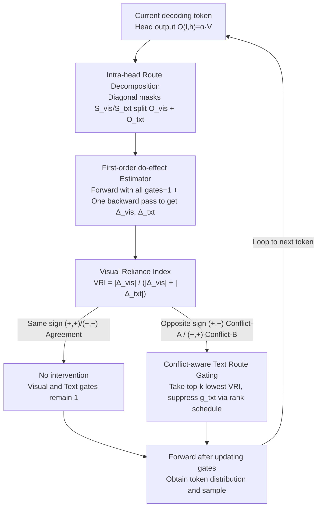

# Mitigating Hallucinations in Large Vision-Language Models via Causal Route Gating

**Conference**: ICML 2026 Spotlight  
**arXiv**: [2605.24024](https://arxiv.org/abs/2605.24024)  
**Code**: None  
**Area**: Hallucination Detection  
**Keywords**: LVLM Hallucination, Causal Intervention, Attention Head Gating, Route Decomposition, Training-free

## TL;DR
CRG performs a precise linear decomposition of each attention head's output into visual and textual routes. It estimates the causal "do-effect" of both routes on the current token through one forward and one backward pass. It then systematically mitigates language prior hallucinations in LVLMs without training by suppressing only the textual routes of heads where visual and textual signs conflict and the VRI is low (i.e., prior-dominated).

## Background & Motivation
**Background**: Large Vision-Language Models (LVLMs) have become the mainstream interface for image question answering and description generation. However, "hallucinations"—generating content that is semantically fluent but unrelated to the image—remain the biggest reliability bottleneck for deployment. Training-free inference-stage interventions have become a popular direction as they require no additional computing power or data. Mainstream routes include output-level decoding strategies like VCD/OPERA/MaskCD and internal interventions based on attention proxies like PAI/VTI.

**Limitations of Prior Work**: Decoding-level interventions treat the model as a black box and cannot locate "which components caused the model to select the wrong token." Internal interventions based on "Visual Attention Ratio" (VAR) assume that "more attention equals stronger visual evidence." This assumption often fails under softmax normalization and value vector coupling—a head might have high visual attention, but if its value vector is nearly orthogonal to the gradient direction, it may still not contribute positively to the decision. Furthermore, such methods usually scale at the head level, suppressing useful visual routes along with the problematic ones.

**Key Challenge**: Correlation metrics (attention quality) $\neq$ Causal contribution (the actual change in decision score under do-intervention). Truly locating heads where language priors override visual evidence requires decision-aligned causal intervention rather than inspecting attention maps.

**Goal**: (1) Provide a tool that distinguishes the "causal effect of the visual route" from the "causal effect of the textual route" on decisions without retraining; (2) Use sign conflicts between the two to accurately identify "prior-dominated" heads; (3) Suppress only the textual route while preserving the visual route, operating online synchronously with decoding.

**Key Insight**: It is observed that in the multi-head attention output $O_{l,h}=\alpha_{l,h}V_{l,h}$, the value matrix $V_{l,h}$ can be precisely split into $O_{l,h}^{\mathrm{vis}}+O_{l,h}^{\mathrm{txt}}$ via diagonal masking according to the index sets of visual and textual tokens. This means a "do-intervention" can be performed on either route individually without modifying the attention weights.

**Core Idea**: Each head is split internally into two routes to quantify their respective do-effects on the current token's decision. The textual route is suppressed only for conflict heads (where visual is positive and textual is negative, or vice versa), effectively cutting off the influence of language priors token-by-token.

## Method

### Overall Architecture
CRG (Causal Route Gating) is an inference-stage module embedded in the decoding loop. For each generated token, it executes three steps: (1) Precisely split each head's output into a visual route $O^{\mathrm{vis}}_{l,h}$ and a textual route $O^{\mathrm{txt}}_{l,h}$ based on token modality; (2) Estimate the causal effects $\widehat{\Delta}^{\mathrm{vis}}_{l,h}$ and $\widehat{\Delta}^{\mathrm{txt}}_{l,h}$ using one forward and one backward pass, and normalize them to obtain the Visual Reliance Index ($\mathrm{VRI}_{l,h}$); (3) Categorize heads into Agreement, Conflict-A, or Conflict-B based on the signs of $(\widehat{\Delta}^{\mathrm{vis}},\widehat{\Delta}^{\mathrm{txt}})$, and suppress the textual gate $g^{\mathrm{txt}}_{l,h}$ for the top-$k$ conflict heads with the lowest VRI using a rank-correlated smoothing schedule. Model weights, visual routes, and KV-cache remain unchanged throughout.

### Key Designs

**1. Intra-head Route Decomposition + Decision-Aligned Causal Route Effect (CRE): Replacing Correlation with Causality**

Attention quality proxies like VAR only look at weights, ignore values, and are contaminated by softmax competition—if the text logit drops, VAR rises even if visual evidence remains unchanged. CRG ignores attention maps and asks directly: "How would the decision score change if this route were turned off?" The key observation is that the value matrix in the head output $O_{l,h}=\alpha_{l,h}V_{l,h}$ can be precisely partitioned by token modality. By using a pair of complementary diagonal selection matrices $S_{\mathrm{vis}}, S_{\mathrm{txt}}$ (satisfying $S_{\mathrm{vis}}+S_{\mathrm{txt}}=I_L$ and $S_{\mathrm{vis}}S_{\mathrm{txt}}=0$), we get $O^{\mathrm{vis}}_{l,h}=\alpha_{l,h}(S_{\mathrm{vis}}V_{l,h})$ and $O^{\mathrm{txt}}_{l,h}=\alpha_{l,h}(S_{\mathrm{txt}}V_{l,h})$. The identity $O_{l,h}=O^{\mathrm{vis}}_{l,h}+O^{\mathrm{txt}}_{l,h}$ holds strictly, without touching attention weights or $W^O_l$. By attaching a scalar gate to each route and intervening on a single head while keeping others at baseline, the do-effect is defined using the task score $\ell$: $\Delta^{\mathrm{vis}}_{l,h}=\ell(1,1)-\ell(0,1)$ and $\Delta^{\mathrm{txt}}_{l,h}=\ell(1,1)-\ell(1,0)$ (where $\ell=\log p(y^*)$ for generation or $\ell=\log p(\mathrm{Yes})-\log p(\mathrm{No})$ for binary QA). These are aggregated into $\mathrm{VRI}_{l,h}=|\Delta^{\mathrm{vis}}_{l,h}|/(|\Delta^{\mathrm{vis}}_{l,h}|+|\Delta^{\mathrm{txt}}_{l,h}|+\varepsilon)$ for ranking. This locates "prior-dominated" heads based on actual decision changes rather than attention magnitude.

**2. First-order do-effect Estimator: Synchronous Online Causal Intervention**

Calculating exact two-point do-effects requires a separate forward pass for every $(l,h)$ with the gate turned off, which costs $O(LH)$ times the decoding cost. The authors prove that if $\ell$ is a differentiable function of the gates, a first-order expansion provides a rigorous estimate. A single standard forward pass (gates at 1) is performed to cache $O^{\mathrm{vis}}_{l,h}$ and $O^{\mathrm{txt}}_{l,h}$. A single backward pass on the decision score provides the sensitivity $G_{l,h}=\partial\ell/\partial\tilde O_{l,h}$ at each head pre-$W^O_l$. The directional derivatives along the gate axes yield $\widehat{\Delta}^{\mathrm{vis}}_{l,h}=\langle G_{l,h},O^{\mathrm{vis}}_{l,h}\rangle$ and $\widehat{\Delta}^{\mathrm{txt}}_{l,h}=\langle G_{l,h},O^{\mathrm{txt}}_{l,h}\rangle$, consistent with the first-order term of the do-difference. The KV-cache remains untouched, adding only one backward pass per token. Since the downstream task cares about sign and ranking rather than exact values, this coarse estimate is sufficient.

**3. Conflict-aware Textual Route Gating (Conflict-A / Conflict-B + Rank Schedule): Targeted Suppression**

Using the signs of the do-effects for the two routes, heads are categorized into four quadrants. Same-sign $(+,+)$ / $(-,-)$ heads are "Agreement" cases, where both routes push the decision in the same direction, likely indicating correct multimodal fusion; these are left untouched. $(+,-)$ is "Conflict-A" (visual supports, text opposes), treated as text noise and mildly suppressed. $(-,+)$ is "Conflict-B" (visual opposes, text supports), the strongest characteristic of hallucination, which is heavily suppressed. Specifically, the top-$k$ heads with the lowest VRI (indicating reliance on text priors) are selected from $\mathcal{H}_A$ and $\mathcal{H}_B$ to form $\mathcal{S}$. These are assigned normalized ranks $s_i=i/(|\mathcal{S}|-1)$, and gate values are set as $g^{\mathrm{txt}}_{(i)}=g_{\min}+(g_{\max}-g_{\min})\cdot\mathrm{clip}(s_i^\gamma,\epsilon,1-\epsilon)$. Conflict-A uses a mild range $(0.5, 1.0)$, while Conflict-B uses a strong range $(0, 0.5)$. Using a rank-based schedule instead of a uniform scalar avoids decoding degradation or misidentifying heads performing grounded reasoning.

### Loss & Training
**Training-free**: No parameters are updated, no supervision signals are used, and there is no additional training phase. All hyperparameters (top-$k, \gamma, \epsilon, g_{\min/\max}^{A/B}$) are determined once on a small validation set and kept fixed across models. The only overhead is one autograd backward pass per token. Specifically, a standard forward pass is made to select $y^*$ and cache $O^{\mathrm{vis}}_{l,h}, O^{\mathrm{txt}}_{l,h}$. A backward pass yields $G_{l,h}$, and gates are applied according to the rank schedule. A final forward pass with updated gates provides the token distribution for sampling. The KV-cache is fully reusable as only scalar gates before $W^O_l$ are modified.

## Key Experimental Results

### Main Results
On LLaVA-1.5-7B, Qwen-VL-Chat, and Qwen2.5-VL-7B-Instruct, CRG consistently outperforms Regular, VCD, OPERA, PAI, and VTI across five benchmarks (POPE, CHAIR, MME, MMHal-Bench, AMBER).

| Dataset / Setting | Metric | Regular | Strongest Baseline | CRG | Gain vs Regular |
|---|---|---|---|---|---|
| POPE-Random / LLaVA-1.5-7B | Acc / F1 | 83.29 / 81.33 | VTI 89.50 / 88.89 | **90.30 / 89.51** | +7.01 / +8.18 |
| POPE-Adv / Qwen2.5-VL-7B | Acc / F1 | 82.79 / 83.15 | VTI 85.78 / 85.14 | **86.98 / 87.07** | +4.19 / +3.92 |
| CHAIR / LLaVA-1.5-7B | $C_S\downarrow$ / $C_I\downarrow$ / Recall↑ | 52.8 / 15.9 / 77.3 | VTI 37.6 / 12.9 / 79.3 | **34.2 / 11.2** / 77.8 | $C_S$ −18.6 |
| AMBER / LLaVA-1.5-7B | CHAIR↓ / F1↑ / Score↑ | 8.3 / 73.7 / 82.70 | — | **4.6 / 77.5 / 86.45** | Score +3.75 |

### Ablation Study

| Config | POPE-Avg↑ | $C_S$↓ | MMHal↑ | MME↑ | Meaning |
|---|---|---|---|---|---|
| Regular | 81.37 | 52.8 | 2.23 | 1640 | No intervention baseline |
| CRG w/o A | Mid | Mid | Mid | Mid | Only Conflict-B suppressed |
| CRG w/o B | Low | High | — | — | Only Conflict-A suppressed |
| **CRG (A+B)** | **Best** | **34.2** | **Best** | **Best** | Full conflict-aware strategy |

### Key Findings
- **Conflict-B** (visual opposes, text supports) is the strongest single source of hallucinations. Its individual suppression yields higher gains than Conflict-A, though both are complementary for maximizing reduction without dropping MME scores.
- **VRI vs. VAR**: Head-wise visualization shows that VAR and VRI are similar in early layers but diverge significantly in middle layers. Middle-layer VAR is often flat, while VRI retains structural significance, validating that attention quality is an unreliable proxy for visual grounding.
- **Preservation of Reasoning**: Suppressing only the text gate while keeping the visual gate at 1 allows for improvements in grounding-sensitive categories (Existence, Count) and high-level reasoning (Commonsense, Numerical) simultaneously.
- **CHAIR Performance**: $C_S$ dropped from 52.8 to 34.2 (LLaVA-1.5) while Recall remained stable or improved, proving that the method reduces hallucinations by "speaking correctly" rather than "speaking less."

## Highlights & Insights
- Using complementary diagonal masks to strictly partition $V_{l,h}$ allows for precise route-level do-intervention without retraining or modifying the attention mechanism.
- Scaling causal intervention down to a single backward pass makes it an online component, reducing deployment costs to be comparable with gradient backpropagation.
- Defining hallucinations as a sign conflict $(-, +)$ is more aligned with the root cause than "low visual attention ratio."
- The theoretical counter-analysis of VAR in Section 4.2 provides a clean counterexample to the "attention is explanation" assumption.

## Limitations & Future Work
- **First-order Bias**: The approximation bias under large gate changes is bounded theoretically under Lipschitz conditions, but empirical verification was limited to sign consistency. Non-linear effects in larger models remain an open question.
- **Latency**: While the overhead is "moderate," absolute latency for long-generation scenarios with batch decoding or complex KV-cache management was not explicitly detailed.
- **Heuristic Design**: Gating intervals and top-$k$ selection are manually tuned. Dynamic versions that automatically learn these parameters for different model scales could further unlock potential.

## Related Work & Insights
- **vs. VCD/OPERA**: Decoding heuristics only adjust output distributions; CRG intervenes on internal mechanisms, providing stronger localization.
- **vs. PAI/VTI**: While those use latent space control, CRG operates at the "intra-head route" level and uses do-effects for selection rather than feature distance.
- **vs. CHG**: CHG learns head-level gates; CRG advances this to route-level online do-effect estimation without training.

## Rating
- **Novelty**: ⭐⭐⭐⭐⭐ First to use "intra-head visual/textual routes" as the unit for causal intervention with an online first-order estimator.
- **Experimental Thoroughness**: ⭐⭐⭐⭐ Five benchmarks and three LVLMs with thorough ablations; however, lacks evaluation on ultra-large models or broader multimodal tasks.
- **Writing Quality**: ⭐⭐⭐⭐⭐ Clear progression from motivation to theory to algorithm.
- **Value**: ⭐⭐⭐⭐⭐ Training-free, plug-and-play, and maintains general performance; high practical value for hallucination control in deployment.

<!-- RELATED:START -->

1. **VCD**: Mitigating Object Hallucinations in Large Vision-Language Models through Visual Contrastive Decoding (CVPR 2024)
2. **OPERA**: Alleviating Hallucination in Multi-Modal Large Language Models via Over-Trust Penalty and Retrospection-Allocation (CVPR 2024)
3. **VTI**: Visual-Textual Intervention for Hallucination Mitigation (NeurIPS 2024)
4. **PAI**: Probing and Alleviating Hallucination in Large Vision-Language Models (arXiv 2024)

<!-- RELATED:END -->

## Related Papers

- [\[CVPR 2026\] CausalLens: Sensitivity-Guided Multi-Head Causal Intervention for Hallucination Mitigation in Large Vision-Language Models](../../CVPR2026/hallucination/causallens_sensitivity-guided_multi-head_causal_intervention_for_hallucination_m.md)
- [\[ACL 2026\] Mitigating Hallucinations in Large Vision-Language Models without Performance Degradation](../../ACL2026/hallucination/mitigating_hallucinations_in_large_vision-language_models_without_performance_de.md)
- [\[NeurIPS 2025\] Causal-LLaVA: Causal Disentanglement for Mitigating Hallucination in Multimodal Large Language Models](../../NeurIPS2025/hallucination/causalllava_causal_disentanglement_for_mitigating_hallucinat.md)
- [\[CVPR 2026\] HulluEdit: Single-Pass Evidence-Consistent Subspace Editing for Mitigating Hallucinations in Large Vision-Language Models](../../CVPR2026/hallucination/hulluedit_single-pass_evidence-consistent_subspace_editing_for_mitigating_halluc.md)
- [\[CVPR 2026\] Prefill-Time Intervention for Mitigating Hallucination in Large Vision-Language Models](../../CVPR2026/hallucination/prefill-time_intervention_for_mitigating_hallucination_in_large_vision-language_.md)

<!-- RELATED:END -->
