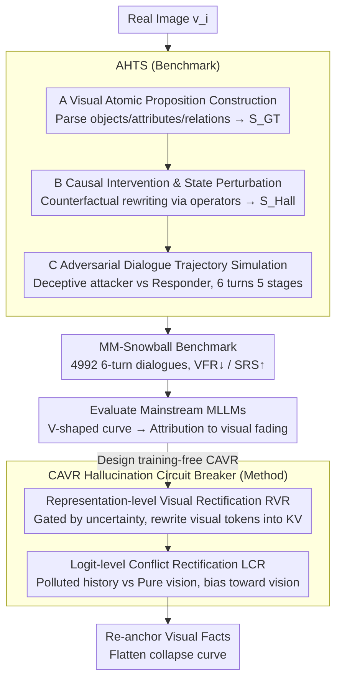

# MM-Snowball: Evaluating and Mitigating Hallucination Snowballing in Multimodal Multi-Turn Dialogue

**Conference**: ICML 2026  
**arXiv**: [2606.00622](https://arxiv.org/abs/2606.00622)  
**Code**: https://frenkie-chiang.github.io/MM-Snowball (Project Page)  
**Area**: Hallucination Detection  
**Keywords**: Multi-turn Dialogue, Hallucination Snowballing, Visual Fading, Training-free Correction, Diagnostic Benchmark

## TL;DR
Ours proposes the MM-Snowball benchmark (4992 trajectories of 6-turn adversarial dialogues) to systematically characterize the "hallucination snowballing" phenomenon in Multimodal Large Language Models (MLLMs) during long dialogues. Based on this, ours designs a training-free Conflict-Aware Visual Rectification (CAVR) method that refreshes visual signals at the representation layer and adjudicates text-visual conflicts at the logit layer, significantly flattening the performance collapse curve in later dialogue stages.

## Background & Motivation
**Background**: MLLMs have been proven powerful on single-turn tasks such as VQA, captioning, and instruction following. However, real-world deployment scenarios are almost entirely multi-turn, where users follow up, correct, or guide the model based on previous answers. Existing hallucination benchmarks like POPE, HallusionBench, and MMHal-Bench are mostly limited to single-turn yes-no or MCQ settings, or at most extend to a "caption-then-question" two-turn mode.

**Limitations of Prior Work**: When dialogues extend to 5–6 turns, once a model makes an error in an early response (e.g., misidentifying "two cats" as "three cats"), every subsequent turn treats this error as a contextual fact for further reasoning. This transforms a local perceptual failure into a systemic cognitive delusion—the authors term this cascade of hallucinations *hallucination snowballing*. Multi-turn benchmarks either use Photoshop-edited "fake images" which lose real visual distributions (VisDiaHalBench) or have only a 2-turn horizon, failing to observe long-term evolution (MMHalSnowball).

**Key Challenge**: Mitigation strategies for single-turn scenarios (such as VCD, OPERA, MemVR) are built on the implicit assumption that "the textual context is clean." In long dialogues, the context itself is contaminated by previous hallucinations. Applying local corrections to the decoding distribution may inadvertently strengthen the contaminated linguistic priors. The fundamental problem is *modal decoupling* in long dialogues: the reasoning engine gradually ignores visual tokens and pursues internal consistency with the "dirty text history."

**Goal**: (1) Construct a truly evolutionary, 6+ turn dialogue benchmark using real images to finely measure the entire process of hallucination snowballing; (2) Provide a training-free correction method compatible with mainstream MLLMs to re-anchor the model to visual facts in later dialogue turns.

**Key Insight**: The authors discovered a counter-intuitive "V-shaped" performance curve via experiments: accuracy drops sharply in turns 3–5, but rebounds significantly in turn 6 when explicitly prompted to "look at the image more carefully." This suggests that visual evidence is not "forgotten" at the weight level but is suppressed by accumulated contaminated text, and can be reactivated by explicitly refreshing visual representations or intervening at the logit layer.

**Core Idea**: Utilize *Adversarial Hallucination Trajectory Synthesis (AHTS)* to construct a staged 6-turn adversarial dialogue benchmark, MM-Snowball. Then, employ *Conflict-Aware Visual Rectification (CAVR)* to "re-anchor" vision at both the representation and logit layers, upgrading point-wise mitigation to dialogue-level mitigation.

## Method

### Overall Architecture
The paper advances along two lines. **Benchmark Side**: Generating 4992 trajectories of 6-turn dialogues (29,952 OE questions) for real images $v_i$ via the AHTS pipeline. This involves three stages: (A) *Visual Atomic Proposition Construction* to parse images into structured semantic units and establish ground-truth state $S_{GT}$; (B) *Causal Intervention & State Perturbation* to apply counterfactual perturbations via semantic operators to obtain hallucination state $S_{Hall}$; (C) *Adversarial Dialogue Trajectory Simulation* where a "deceptive attacker" and a "bifurcated responder" act out 6 turns, pushing the dialogue through five cognitive stages. **Method Side (CAVR)**: A training-free correction method that acts as a "hallucination circuit breaker" on any autoregressive MLLM, providing dual intervention mechanisms at the representation and logit layers to address observed "visual fading."

### Key Designs

**1. AHTS Adversarial Trajectory Synthesis: Deconstructing "Hallucination Snowballing" into Staged Dialogue Trajectories**

Snowballing is a temporal phenomenon; measuring it requires every turn to be parsable. AHTS first decomposes the image into a set of object/attribute/relation triplets $S_{GT}=\{(o_k,a_k,r_k)\}$ to establish the ground-truth state. Semantic operators (attribute substitution, object deletion, relation reversal) defined on these triplets apply counterfactual perturbations to reach $S_{Hall}$. Then, two roles perform 6 turns: a Deceptive Attacker injects misleading premises consistent with $S_{Hall}$ in turn 3, while the Bifurcated Responder is the MLLM under test. Questions are strictly aligned with five cognitive stages (Perceptual Anchoring → Adversarial Bifurcation → Reasoning Escalation → Systemic Hallucination → Visual Correction). Quantitative metrics like Visual Fallacy Rate (VFR↓) and Success Rate of Snowball (SRS↑) measure turn-by-turn collapse and cascade success. This design distinguishes instances where the model "resists the attack" from where it simply "errs differently."

**2. Representation-level Visual Rectification (RVR): Re-injecting Visual Signals Before Suppression**

The authors found that the bottom of the V-shaped curve corresponds to a significant decrease in visual attention in middle layers—i.e., *visual fading* occurs in the representation channel. RVR monitors the epistemic uncertainty signal $U_\ell$ (e.g., token distribution entropy) at selected middle layers during every generation step. Once $U_\ell$ crosses a threshold, suggesting visual grounding is decaying, it re-injects the original visual token representation $h_v$ back into the key-value cache of that layer. This functions as a forced "re-look" at the image without modifying parameters or training. It addresses the fading itself to provide a clean representational base for subsequent logit intervention.

**3. Logit-level Conflict Rectification (LCR): Explicitly Adjudicating "Polluted History vs. Current Visual Anchor"**

In multi-turn settings, the primary source of "pollution" is the dialogue history contaminated by previous hallucinations. LCR constructs two distributions: $p_\text{ctx}(y|x_{1:t})$ conditioned on the full dialogue history, and $p_\text{vis}(y|v,q_t)$ which strips the contaminated history to leave only the image and current question. Token positions with high divergence between these two are identified as "conflict points." At these positions, the distribution is biased towards vision based on an adaptive weight:

$$p_\text{out}(y) \propto p_\text{ctx}(y)^{1-\alpha_t}\, p_\text{vis}(y)^{\alpha_t}$$

$\alpha_t$ is driven by the RVR uncertainty signal. When no conflict is detected, $\alpha_t \to 0$ to avoid excessive intervention. Thus, where polluted history conflicts with visual facts, the output is pulled back to the visual evidence.

### Loss & Training
CAVR is entirely training-free: it updates no parameters, does not rely on preference data, and introduces no extra decoding heads. It functions by attaching RVR and LCR hooks to the inference path, making it plug-and-play for series like Qwen2.5-VL, LLaVA, and InternVL. The benchmark side involves only synthesis and human verification.

## Key Experimental Results

### Main Results
The authors compared open-source and proprietary MLLMs on MM-Snowball. Key qualitative conclusions include:

| Metric | Key Finding |
|---------|---------|
| 6-Turn Acc Curve | All baselines exhibit a "V-shape"—accuracy drops precipitously after the turn 3 adversarial bifurcation and partially recovers after turn 6 visual re-prompting. |
| Mid-stage Collapse | Mainstream MLLMs show a 15%–30% drop in accuracy; once a misleading premise is introduced, it dominates reasoning for multiple turns. |
| Turn 6 Re-prompting | Accuracy rebounds by 5%–15%, proving visual evidence was suppressed rather than forgotten. |
| Model Scale | 7B / 32B / 70B models are not immune; larger models simply collapse slightly later. |

CAVR vs. existing strategies (Qualitative summary):

| Method | Single-turn VQA | MM-Snowball Multi-turn |
|---------|--------------|----------------------|
| VCD | Effective | Late-stage collapse remains evident |
| OPERA | Effective | Powerless against polluted history |
| MemVR | Effective | Mitigation exists but significant turn 5/6 drop |
| **CAVR (Ours)** | Effective | **Significantly flattens the V-curve, high fidelity in turns 5/6** |

### Ablation Study

| Configuration | Phenomenon | Insight |
|------|---------|------|
| Full CAVR | Lowest VFR and SRS | Full dual-mechanism is optimal. |
| RVR Only | Partial prevention of collapse | Refreshing representations solves "fading" but not conflict adjudication. |
| LCR Only | Local smoothing of conflict tokens | Logit intervention is too late if deep representations have degraded. |
| Always-on RVR | Interference with normal tokens | Must be gated by uncertainty and triggered on-demand. |

### Key Findings
- *Visual fading is the primary cause of snowballing*: Through attention analysis and turn 6 experiments, the cause is corrected from "forgetting the image" to "suppressing the image." This distinction dictates that methods should refresh representations rather than re-inputting images.
- *Recoverability of the V-curve* implies that post-processing methods applied only to the final turn overestimate their robustness. VFR/SRS must be reported turn-by-turn.
- The combination of *training-free + representation layer + logit layer* allows existing MLLMs to gain multi-turn robustness without additional training costs.

## Highlights & Insights
- Explicitly deconstructing "hallucination snowballing" into 5 cognitive stages and designing adversarial dialogue roles is a paradigm that "engineers" temporal cognitive failure into annotatable events.
- The proof that visual information is not forgotten (via turn 6 rebounds) subverts the naive narrative that "long dialogues = model forgot the image," reshaping the design direction for future mitigation work.
- The dual-layer "representation $\to$ logit" intervention of RVR + LCR, coupled with attention/uncertainty gating, is a natural extension of single-layer mitigators like MemVR and VCD for multi-turn scenarios.

## Limitations & Future Work
- AHTS uses LLMs for both attacker and responder; there may be a distribution gap between synthetic adversarial strategies and real user misleading behaviors.
- CAVR serves as an inference-time intervention; for models fundamentally biased during training (e.g., poor instruction tuning data), it acts as a "correction" rather than a "cure."
- Evaluation covers 6 turns; whether the logit bias magnitude requires dynamic adjustment over longer horizons (>10 turns) remains to be verified.

## Related Work & Insights
- **vs MMHalSnowball (Zhong et al. 2024)**: Also targets snowballing, but only for 2 turns (caption+VQA) lacking continuous dialogue. Ours upgrades "whether an error occurs" to "when it collapses and can it self-correct."
- **vs VisDiaHalBench (Cao et al. 2024)**: Also multi-turn but relies on edited/synthetic images with artifacts. Ours insists on real images + visual atomic propositions to attribute failure strictly to the dialogue level.
- **Insight**: Future visual dialogue and video QA agents can borrow the "uncertainty-gated visual representation re-injection" concept to ensure periodic "evidence look-backs" during free generation.

## Rating
- Novelty: ⭐⭐⭐⭐ First 6-turn scalable evolutionary benchmark + training-free dual-layer mitigation.
- Experimental Thoroughness: ⭐⭐⭐⭐ Covers multiple open/proprietary MLLMs and various mitigation strategies.
- Writing Quality: ⭐⭐⭐⭐ Clear logical chain: Phenomenon (V-curve) $\to$ Attribution (visual fading) $\to$ Method (RVR+LCR) $\to$ Verification.
- Value: ⭐⭐⭐⭐ Directly usable diagnosis and plugin for MLLMs requiring multi-turn deployment.

<!-- RELATED:START -->

## Related Papers

- [\[AAAI 2026\] MUG: Multi-agent Undercover Gaming — Hallucination Removal via Counterfactual Test for Multimodal Reasoning](../../AAAI2026/hallucination/multi-agent_undercover_gaming_hallucination_removal_via_coun.md)
- [\[ICML 2026\] Learning from Fine-Grained Visual Discrepancies: Mitigating Multimodal Hallucinations via In-Context Visual Contrastive Optimization](learning_from_fine-grained_visual_discrepancies_mitigating_multimodal_hallucinat.md)
- [\[CVPR 2026\] KVSmooth: Mitigating Hallucination in Multi-modal Large Language Models through Key-Value Smoothing](../../CVPR2026/hallucination/kvsmooth_mitigating_hallucination_in_multi-modal_large_language_models_through_k.md)
- [\[ACL 2026\] Dialectic-Med: Mitigating Diagnostic Hallucinations via Counterfactual Adversarial Multi-Agent Debate](../../ACL2026/hallucination/dialectic-med_mitigating_diagnostic_hallucinations_via_counterfactual_adversaria.md)
- [\[ACL 2025\] Monitoring Decoding: Mitigating Hallucination via Evaluating the Factuality of Partial Response during Generation](../../ACL2025/hallucination/monitoring_decoding_mitigating_hallucination_via_evaluating_the_factuality_of_pa.md)

<!-- RELATED:END -->
