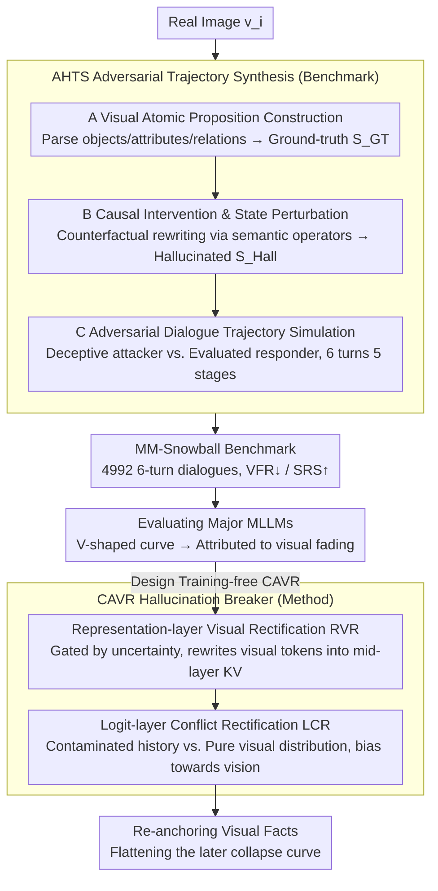

# MM-Snowball: Evaluating and Mitigating Hallucination Snowballing in Multimodal Multi-Turn Dialogue

**Conference**: ICML 2026  
**arXiv**: [2606.00622](https://arxiv.org/abs/2606.00622)  
**Code**: https://frenkie-chiang.github.io/MM-Snowball (Project Page)  
**Area**: Hallucination Detection  
**Keywords**: Multi-turn dialogue, Hallucination snowballing, Visual fading, Training-free correction, Diagnostic benchmark

## TL;DR
This paper introduces the MM-Snowball benchmark (4,992 6-turn adversarial dialogues) to systematically characterize the "hallucination snowballing" phenomenon in multimodal large language models (MLLMs) during long dialogues. Based on this, the training-free CAVR method is designed to refresh visual signals at the representation layer and arbitrate text-visual conflicts at the logit layer, significantly flattening the performance collapse curve in later dialogue stages.

## Background & Motivation
**Background**: MLLMs have demonstrated strong performance on single-turn tasks such as VQA, captioning, and instruction following. However, real-world deployment scenarios are almost entirely multi-turn dialogues where users follow up, correct, or guide based on previous model responses. Existing benchmarks like POPE, HallusionBench, and MMHal-Bench are largely limited to single-turn yes-no or MCQ settings, at most extending to a two-turn "caption-then-question" mode.

**Limitations of Prior Work**: When dialogues extend to 5–6 turns, once a model makes an error in an early response (e.g., miscounting "two cats" as "three"), every subsequent turn treats this error as a contextual fact for reasoning. This amplifies local perceptual failures into systemic cognitive delusions—a cascade termed *hallucination snowballing* by the authors. Multi-turn benchmarks either induce hallucinations using edited "fake" images that lose real visual distributions (VisDiaHalBench) or only have a 2-turn horizon, failing to observe long-term evolution (MMHalSnowball).

**Key Challenge**: Mitigation strategies for single-turn scenarios (e.g., VCD, OPERA, MemVR) are built on the implicit assumption that "textual context is clean." In long dialogues, the context itself is contaminated by previous hallucinations. Applying local corrections to the decoding distribution in such cases can actually strengthen the contaminated linguistic prior. The root cause is *modal decoupling* in long dialogues: the reasoning engine gradually ignores visual tokens and instead pursues internal consistency with the "dirty textual history."

**Goal**: (1) Construct a truly evolutionary, 6+ turn dialogue benchmark oriented towards real images to finely measure the process of hallucination snowballing; (2) Provide a training-free correction method compatible with mainstream MLLMs to anchor the model back to visual facts in later dialogue turns.

**Key Insight**: The authors discovered a counter-intuitive "V-shaped" performance curve: accuracy drops sharply in turns 3–5 but rebounds significantly in turn 6 when explicitly prompted to "look at the image again carefully." This indicates that visual evidence is not "forgotten" at the weight level but is suppressed by accumulated contaminated text, which can be reactivated by refreshing visual representations or intervening at the logit level.

**Core Idea**: Construct the stage-wise 6-turn adversarial dialogue benchmark MM-Snowball using *Adversarial Hallucination Trajectory Synthesis (AHTS)*; then use *Conflict-Aware Visual Rectification (CAVR)* to "re-anchor" vision at both the representation and logit layers, upgrading point-wise mitigation to dialogue-level mitigation.

## Method

### Overall Architecture
The paper advances through two main lines. **First main line (Benchmark)**: The AHTS pipeline generates 4,992 6-turn dialogue trajectories (29,952 OE questions) for real images $v_i$. The pipeline consists of three stages: (A) *Visual Atomic Proposition Construction* parses images into structural semantic units to establish a ground-truth state $S_{GT}$; (B) *Causal Intervention & State Perturbation* applies counterfactual perturbations to $S_{GT}$ via semantic operators to obtain a hallucinated state $S_{Hall}$; (C) *Adversarial Dialogue Trajectory Simulation* uses a "deceptive attacker" and a "bifurcated responder" to play out 6 turns, pushing the dialogue through five cognitive stages: Perception Anchoring → Adversarial Bifurcation → Reasoning Escalation → Systemic Hallucination → Visual Correction. **Second main line (CAVR Method)**: A training-free correction method applied during inference. It targets two types of "visual fading" observed by the authors through dual-mechanism intervention at the representation and logit layers, acting as a "hallucination circuit breaker."

### Key Designs

**1. AHTS Adversarial Trajectory Synthesis: Decomposing "Hallucination Snowballing" into Controllable, Annotated, Stage-wise Trajectories**

Snowballing is a temporal phenomenon. To measure it, each turn must be parsable. AHTS first decomposes the image into sets of object/attribute/relation triples $S_{GT}=\{(o_k,a_k,r_k)\}$ to establish the ground-truth state. It then applies counterfactual perturbations (attribute replacement, object deletion, relation reversal) to the triples to obtain the hallucinated state $S_{Hall}$. Two roles then enact a 6-turn dialogue: the Deceptive Attacker injects a misleading premise consistent with $S_{Hall}$ in turn 3, while the Bifurcated Responder is the MLLM under test. Each turn's question is strictly aligned with one of five cognitive stages (Perception Anchoring → Adversarial Bifurcation → Reasoning Escalation → Systemic Hallucination → Visual Correction). The trajectory length can be extrapolated beyond 6 turns. Finally, Visual Fallacy Rate (VFR↓) and Success Rate of Snowball (SRS↑) quantify turn-by-turn collapse and cascade success rates. The explicit attacker and stage labels distinguish whether a model "withstood the attack" or "just made a different error."

**2. Representation-layer Visual Rectification (RVR): Sustaining Visual Signals Before the Model Suppresses the Image**

The authors found that the bottom of the V-shaped curve corresponds to a significant drop in mid-layer visual attention—meaning *visual fading* occurs within the representation channels. Restoring it at the logit layer is often too late. RVR monitors the epistemic uncertainty signal $U_\ell$ (e.g., token distribution entropy or a proxy for the visual/textual attention ratio) at selected intermediate layers during generation. Once $U_\ell$ crosses a threshold, suggesting that visual grounding is decaying, the original visual token representation $h_v$ is rewritten into the key-value cache of that layer (extending the idea of "visual memory re-injection" from MemVR). This forces the model to "look at the image again" mid-dialogue without changing parameters or introducing training.

**3. Logit-layer Conflict Rectification (LCR): Explicitly Arbitrating "Contaminated History vs. Current Visual Anchor"**

A major source of "dirt" in multi-turn dialogues is the history contaminated by previous hallucinations. Contrastive decoding against just a language prior (like VCD/OPERA) is insufficient. LCR constructs two distributions: $p_\text{ctx}(y|x_{1:t})$ conditioned on the full dialogue history and $p_\text{vis}(y|v,q_t)$ which strips away the contaminated history, keeping only the image and the current question. Discrepancies between the two identify "conflict points," where the distribution is biased towards the visual one using adaptive weights:

$$p_\text{out}(y) \propto p_\text{ctx}(y)^{1-\alpha_t} \cdot p_\text{vis}(y)^{\alpha_t}$$

Where $\alpha_t$ is driven by the RVR uncertainty signal. When there is no conflict, $\alpha_t \to 0$ to avoid excessive intervention. Thus, wherever the contaminated history clashes with visual facts, the output is pulled back towards vision. Together, RVR (representation survival) and LCR (logit arbitration) form a "hallucination circuit breaker."

### Loss & Training
CAVR is completely training-free: it updates no parameters, does not rely on preference data, and introduces no additional decoding heads. It attaches as hooks (RVR and LCR) to the inference path, making it plug-and-play for models like Qwen2.5-VL, LLaVA, and InternVL. The benchmark side involves no training, only synthesis and human verification.

## Key Experimental Results

### Main Results
The authors compared the 6-turn accuracy of open-source and proprietary MLLMs on MM-Snowball, summarizing hallucination behavior via VFR↓ and SRS↑. Key qualitative conclusions:

| Evaluation Dimension | Key Finding |
|---------|---------|
| 6-Turn Accuracy Curve | All baselines exhibit a "V-shape"—accuracy collapses after the Turn 3 adversarial bifurcation and partially recovers after the Turn 6 visual re-prompting. |
| Mid-stage Collapse (Turns 3–5) | Major MLLMs drop 15%–30% in accuracy; once an adversarial premise is introduced, it dominates reasoning long-term. |
| Turn 6 Visual Re-prompting | Accuracy rebounds by 5%–15%, proving visual evidence is not forgotten but suppressed. |
| Model Scale | 7B, 32B, and 70B models are not immune; larger models merely collapse slightly later. |

Comparison of CAVR with existing mitigation strategies (qualitative summary):

| Mitigation Method | Single-turn VQA Effect | MM-Snowball Long Dialogue Effect |
|---------|--------------|----------------------|
| VCD (Contrastive Decoding) | Effective | Later collapse remains obvious |
| OPERA (Penalty on Summary Tokens) | Effective | Ineffective against contaminated history |
| MemVR (Visual Re-injection) | Effective | Mitigated, but Turn 5/6 still drop significantly |
| **CAVR (Ours)** | **Effective** | **Significantly flattens the V-curve, maintains high fidelity at Turn 5/6** |

### Ablation Study

| Configuration | Key Phenomenon | Insight |
|------|---------|------|
| Full CAVR | Lowest VFR and SRS in later dialogue | Full dual-mechanism is optimal |
| RVR Only | Mid-stage collapse partially blocked, but logits still lean toward dirty history | Representation refresh solves "visual fading" but not conflict arbitration |
| LCR Only | Conflict tokens locally smoothed, but deep representations already degraded | Logit intervention occurs after representation decay |
| Constant RVR (No Gating) | Interferes with normal tokens, overall drop | Must be uncertainty-gated and triggered on-demand |

### Key Findings
- *Visual fading is the primary cause of snowballing*: Through attention analysis and Turn 6 re-prompting experiments, the root cause of snowballing was refined from "forgetting the image" to "suppressing the image." This distinction determines that mitigation should refresh representations rather than just re-inputting images.
- *The recoverability of the V-shaped curve* indicates that post-processing methods applied only to the final turn overestimate their actual capability. Robustness should be reported turn-by-turn via VFR/SRS.
- The *training-free + representation-layer + logit-layer* combination allows existing MLLMs to gain multi-turn robustness without extra training costs—a property lacking in many single-turn SOTA mitigators.

## Highlights & Insights
- Explicitly decomposing "hallucination snowballing" into five cognitive stages and designing adversarial dialogue roles represents a paradigm for "engineering" temporal cognitive failures into annotatable events.
- The use of the "Turn 6 visual re-prompting rebound" to prove visual information is not forgotten subverts the simple narrative of "long dialogue = forgotten image," reshaping the design direction for future mitigation work.
- The "representation → logit" dual-layer intervention of RVR + LCR, coupled with attention/uncertainty gating, is a natural extension of single-layer mitigators like MemVR / VCD for multi-turn scenarios.

## Limitations & Future Work
- AHTS uses an LLM-based attacker-responder setup; there may be a distribution gap between the LLM's adversarial strategies and real-world user misleading.
- CAVR only intervenes during inference; it "rectifies" but does not "cure" models biased during training (e.g., those trained on instruction tuning data that neglects vision). RVR uncertainty signals could potentially be used as training-time regularization.
- The evaluation covers 6 turns; whether logit bias magnitudes need dynamic adjustment over longer horizons (>10 turns) remains to be verified.

## Related Work & Insights
- **vs MMHalSnowball (zhong2024)**: Both focus on snowballing, but the latter is limited to 2 turns (caption+VQA) and lacks continuous dialogue. This work upgrades "whether a mistake is made" to "when it collapses and whether it self-corrects" via 6-turn evolvable dialogues.
- **vs VisDiaHalBench (cao2024)**: Uses multi-turn dialogues but relies on edited/synthetic images with potential artifacts. This work uses real images + visual atomic propositions to isolate failures to the dialogue level.
- **vs VCD / OPERA / MemVR**: Single-turn mitigators assume clean context. This work reveals failures in "self-contaminated" contexts. CAVR moves these tools into multi-turn settings via representation re-anchoring and logit arbitration.

## Rating
- **Novelty**: ⭐⭐⭐⭐ First 6-turn evolvable multimodal hallucination benchmark + training-free dual-layer mitigation.
- **Experimental Thoroughness**: ⭐⭐⭐⭐ Covers various MLLMs and mitigation strategies.
- **Writing Quality**: ⭐⭐⭐⭐ Clear logical chain: Phenomenon (V-curve) → Attribution (visual fading) → Method (RVR+LCR) → Validation.
- **Value**: ⭐⭐⭐⭐ A directly applicable diagnosis and plugin for all multi-turn MLLM deployments.

<!-- RELATED:START -->

## Related Papers

- [\[AAAI 2026\] MUG: Multi-agent Undercover Gaming — Hallucination Removal via Counterfactual Test for Multimodal Reasoning](../../AAAI2026/hallucination/multi-agent_undercover_gaming_hallucination_removal_via_coun.md)
- [\[ICML 2026\] Learning from Fine-Grained Visual Discrepancies: Mitigating Multimodal Hallucinations via In-Context Visual Contrastive Optimization](learning_from_fine-grained_visual_discrepancies_mitigating_multimodal_hallucinat.md)
- [\[CVPR 2026\] KVSmooth: Mitigating Hallucination in Multi-modal Large Language Models through Key-Value Smoothing](../../CVPR2026/hallucination/kvsmooth_mitigating_hallucination_in_multi-modal_large_language_models_through_k.md)
- [\[ACL 2026\] Dialectic-Med: Mitigating Diagnostic Hallucinations via Counterfactual Adversarial Multi-Agent Debate](../../ACL2026/hallucination/dialectic-med_mitigating_diagnostic_hallucinations_via_counterfactual_adversaria.md)
- [\[ACL 2025\] Monitoring Decoding: Mitigating Hallucination via Evaluating the Factuality of Partial Response during Generation](../../ACL2025/hallucination/monitoring_decoding_mitigating_hallucination_via_evaluating_the_factuality_of_pa.md)

<!-- RELATED:END -->
