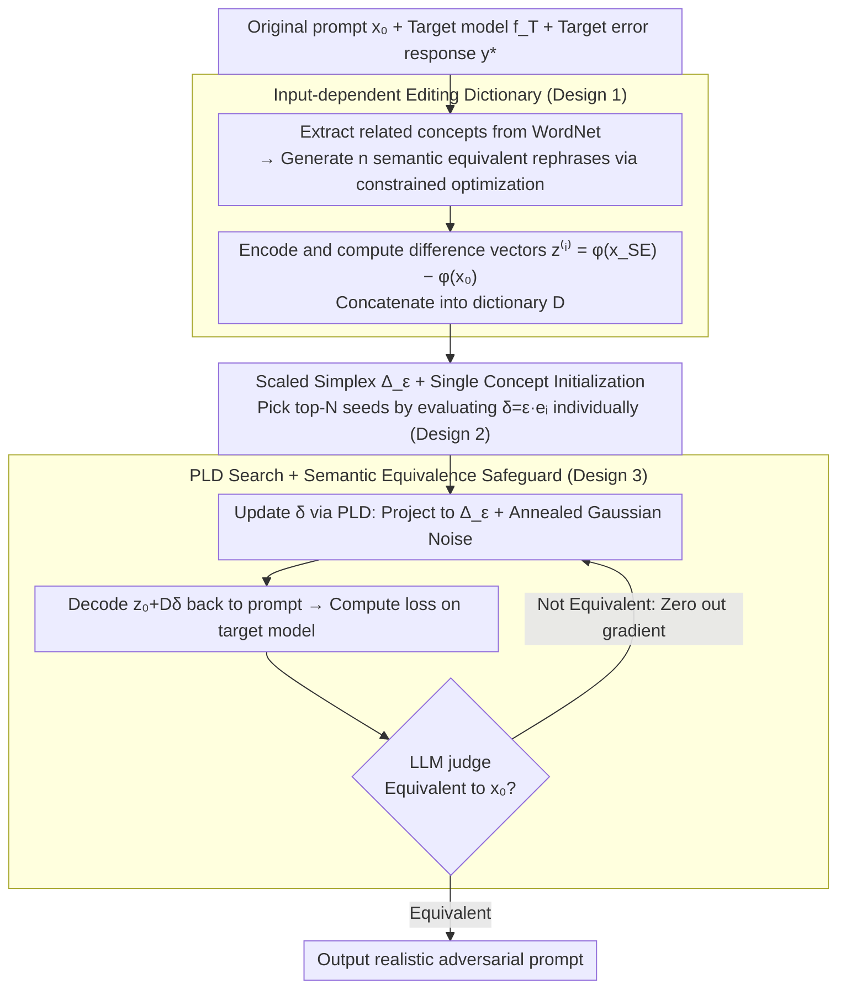

# REALISTA: Realistic Latent Adversarial Attacks that Elicit LLM Hallucinations

**Conference**: ICML 2026  
**arXiv**: [2605.12813](https://arxiv.org/abs/2605.12813)  
**Code**: https://github.com/Buyun-Liang/REALISTA  
**Area**: Hallucination Detection  
**Keywords**: Hallucination induction, latent space attack, semantic preservation, simplex constraint, concept editing

## TL;DR
REALISTA constructs an "input-dependent editing direction dictionary" in the LLM latent space, transforming adversarial prompt optimization into a continuous problem under simplex constraints. This approach maintains the semantic equivalence and coherence of discrete methods like SECA while offering the search flexibility of continuous methods like LARGO, successfully inducing hallucinations in the free-form outputs of closed-source reasoning models like GPT-5 for the first time.

## Background & Motivation

**Background**: LLMs exhibit hallucinations even on benign user queries. A typical example provided in the paper shows a model correctly calculating "Simplify $(2+5)^2-42$" as 7, yet failing on the synonymous "Compute the result after squaring the sum of 2 and 5, then subtracting 42," yielding 16. Systematically exposing such failures requires "realistic adversarial attacks"—prompts that induce hallucinations while appearing to be written by real users.

**Limitations of Prior Work**: Existing attacks are divided into two categories, both with shortcomings. One comprises discrete prompt attacks (e.g., SECA), which rely on an LLM to rephrase candidate prompts and pick the worst-performing ones; these guarantee semantic equivalence and coherence but suffer from low diversity as the search space is locked by the limited candidates of the rephrasing model. The other consists of continuous latent attacks (e.g., LARGO, Sheshadri et al.), which add arbitrary perturbations to LLM hidden states; these have a large search space, but their decoded prompts often drift semantically—LARGO's SEE (Semantic Equivalence Error) is nearly 100%. Other methods modify prompt numbers using fictional stories (changing "$-42$" to "$-33$") to elicit incorrect results like 16, which does not represent a hallucination on the original prompt but rather a modification of the problem itself.

**Key Challenge**: Search flexibility vs. semantic realism. Discrete methods preserve realism but have limited search capabilities, while continuous methods have strong search capabilities but often produce "false successes" that are no longer the same problem.

**Goal**: To search within the LLM latent space while restricting the search to a "semantically equivalent" subspace—specifically, a linear combination of "interpretable editing directions" where each direction corresponds to a semantically equivalent rephrase of the original prompt.

**Key Insight**: Prior work by Park, Zou, et al. found that high-level semantic concepts in the LLM latent space are approximately linearly additive. If an "input-dependent dictionary" can be prepared for each original prompt $x_0$, where each column is a direction $z^{(i)} = \phi(x_{\text{SE}}^{(i)}) - \phi(x_0)$ corresponding to a synonymous rephrase, then continuous optimization of the editing coefficients $\delta$ becomes both flexible and safe.

**Core Idea**: Formulate the hallucination induction problem as $\min_\delta \mathcal{L}_{\text{hall}}(f_T(\psi(z_0 + D\delta)), y^*)$ s.t. $\delta \in \Delta_\varepsilon$, utilizing an editing direction dictionary, scaled simplex constraints, and the LLM's own encoder/decoder.

## Method

### Overall Architecture

REALISTA aims to solve the problem of freely searching for adversarial prompts in the LLM latent space that induce hallucinations while ensuring the searched prompts remain semantically equivalent to the original. The approach consists of two stages. Given an original prompt $x_0$, a target model $f_T$, and a desired incorrect response $y^*$, an "input-dependent editing direction dictionary" is first built on-the-fly for $x_0$. This involves using WordNet and concept optimization to generate $n$ semantically equivalent rephrases $x_{\text{SE}}^{(i)}$, encoding them into the latent space, and taking the difference vectors $z^{(i)} = \phi(x_{\text{SE}}^{(i)}) - \phi(x_0)$ to form the dictionary $D^{(z_0)} \in \mathbb{R}^{L \times d \times n}$. Subsequently, the coefficient $\delta$ is optimized over a scaled simplex $\Delta_\varepsilon$. At each step, $z_0 + D\delta$ is decoded back into a prompt using the LLM decoder $\psi$, fed into the target model to calculate loss, and verified for semantic equivalence by an LLM judge. This ensures "searching" only happens within the semantically equivalent subspace spanned by the dictionary, making the output naturally realistic.

### Key Designs

**1. Input-dependent Editing Direction Dictionary: Hard-constraining the Search Domain to the "Semantic Equivalence Subspace"**

The fatal flaw of continuous attacks like LARGO is that they perturb arbitrary latent directions, with no guarantee that the result will fall within a region decodable into a valid prompt, leading to a SEE near 100%. REALISTA prevents $\delta$ from moving freely by first constructing a set of semantically equivalent directions as a basis for each $x_0$. Specifically, concept words related to $x_0$ are extracted from WordNet and a constrained concept optimization is performed to ensure these directions are orthogonalized, maintain a moderate distance from $x_0$, and decode into valid rephrases. Finally, $z^{(i)} = c^{(i)} - z_0$ is used to form the dictionary $D^{(z_0)}$. By restricting the search to $z_0 + D\delta$, the optimization geometrically stays near the valid prompt manifold. This is the core difference from LARGO: semantic constraints are no longer a post-hoc filter but are parameterized into the search space. The dictionary must be input-dependent because the latent implementation of an abstract operation (e.g., "inversion") varies significantly across different prompts.

**2. Scaled Simplex Constraint + Single Concept Initialization: Modifying a Few Concepts per Attack**

A dictionary alone is insufficient; if $\delta$ pushes all concept directions to their limits simultaneously, the combined effect will likely collapse the semantics. Thus, $\delta$ is restricted to a scaled simplex $\Delta_\varepsilon = \{\delta \succeq 0 : \|\delta\|_1 \leq \varepsilon\}$. The $\ell_1$ norm is used as a sparsity proxy to force the solution to activate only a few concepts, while the non-negativity constraint is applied because negative directions often lack clear semantics and decode into gibberish. Since $\mathcal{L}_{\mathcal{T}}$ is non-convex and starting from $\delta=0$ often leads to local optima, the algorithm initializes by testing each concept $i$ individually with $\delta = \varepsilon \cdot e_i$. The top-$N$ seeds with the highest loss are used as starting points, significantly increasing the probability of finding a good solution. Table 3 confirms this constraint's effectiveness: on average, only 1-2 concepts are activated for open-source LLMs and fewer than one for closed-source reasoning models.

**3. Projected Langevin Dynamics + Semantic Equivalence Safeguard: Searching Across Piece-wise Flat Landscapes**

The decoder is discrete; adjacent $z$ values often decode into the same prompt $x$, resulting in a piece-wise flat optimization landscape where gradients are zero over large regions. Standard PGD is ineffective here, as steps are either too small to move or too large and overshoot. REALISTA employs Projected Langevin Dynamics (PLD) to update $\delta_{k+1} \leftarrow \text{Proj}_{\Delta_\varepsilon}[\delta_k - \eta \tilde{\nabla}_\delta \mathcal{L}_{\mathcal{T}} + \sqrt{2\eta T}\,\xi_k]$, where the annealed temperature is $T = T_0 \cdot \gamma^k$ and noise is $\xi_k \sim \mathcal{N}(0, I)$. Gradients are obtained via Gumbel-Softmax reparameterization. The injected Gaussian noise allows the algorithm to jump between regions, while annealing ensures late-stage convergence. The final safeguard uses an LLM judge to check if the decoded prompt $x$ remains equivalent to $x_0$; if not, the gradient signal is zeroed out to prevent further movement in that direction. This safeguard ensures the "REALISTic" nature of the final output.

### Loss & Training

Two objective functions address different deployment scenarios. For open-ended MCQA, the loss is $\mathcal{L}_{\mathcal{T}}(\cdot) = -\log P_T(y^* \mid \cdot)$, where $y^*$ is the token of the incorrect option. For free-form responses, an LLM-based hallucination scorer $J$ is used: $\mathcal{L}_{\mathcal{T}}(\cdot) = -J(R_T(\cdot))$. The latter is designed for models like GPT-5 that neither provide logits nor fixed formats. In such cases, gradients are transferred from an open-source surrogate model, which experiments show is surprisingly effective.

## Key Experimental Results

### Main Results

Evaluated on a subset of 347 MMLU questions (16 subjects). ASR@30 indicates success rate within 30 independent trials.

| Target LLM | Raw | SECA | LARGO | ICD | **Ours (REALISTA)** |
|------------|-----|------|-------|-----|--------------|
| Llama-3-3B ASR↑ | 45.48 | 79.61 | 84.71 | 90.77 | **97.11** |
| Llama-3-3B SEE↓ | 0.00 | 0.87 | 97.42 | 100.00 | 0.86 |
| Llama-3-8B ASR↑ | 54.40 | 82.97 | 57.92 | 87.32 | **93.60** |
| Llama-3-8B SEE↓ | 0.00 | 2.59 | 96.45 | 100.00 | 3.48 |
| Qwen-2.5-7B ASR↑ | 6.40 | 32.47 | 23.89 | 11.50 | **41.61** |

While LARGO and ICD show high ASR, their SEE is nearly 100% (meaning they completely change the semantics, failing as "realistic" attacks). REALISTA is the only method achieving both high ASR and low SEE, outperforming SECA by 10-20% on Llama-3.

| Reasoning LLM (free-form) | Raw | ICD | **Ours (REALISTA)** | SECA/LARGO |
|---------------------------|-----|-----|--------------|------------|
| GPT-5-Nano ASR↑ | 4.02 | 6.32 | **23.61** | N/A |
| GPT-5-Mini ASR↑ | 2.01 | 2.57 | **20.72** | N/A |
| GPT-5-Mini SEE↓ | 1.58 | 100.00 | 0.72 | – |

SECA and LARGO cannot be applied to GPT-5 (one requires token-level logits, the other requires target latents). REALISTA successfully transfers gradients from open-source surrogates.

### Ablation Study

| Configuration | Key Finding |
|------|----------|
| Top-20 active concepts | "Polarity inversion" categories like counterfactual, inverted, and opposite are most frequently activated; followed by "logical structure" categories like conditional and disjunctive. |
| Active concepts per attack | 1-2 on open-source LLMs, <1 on closed-source reasoning models (many attacks succeeded by maintaining the original prompt). |
| Human Evaluation (100 samples) | REALISTA's SEE was ≈5% according to two human annotators, consistent with the LLM judge (5.27%); LARGO reached nearly 100%, and SECA was between 5-11%. |

### Key Findings
- Successful "realistic attacks" primarily act by modifying framing and logical structure rather than changing factual content. This suggests that LLM defense should prioritize robustness against these structural transformations.
- Attack Success Patterns: Polarity inversion is the most common, as it preserves entities and correctness criteria while subtly flipping the framing. Logical structure modifications (adding conditionals/disjunctives) create ambiguity by expanding the reasoning space.
- Gradient transfer succeeds on GPT-5, implying that the score landscapes of open-source surrogates and closed-source reasoning models overlap significantly.
- Convergence: Approximately 100 steps for open-source LLMs; closed-source reasoning models require more steps due to the larger free-form output space.

## Highlights & Insights
- **"Geometrically Embedding Semantic Constraints into the Search Space"**: Unlike previous latent attacks that used semantic checks as post-hoc filters, REALISTA's dictionary parameterization makes the prior that "any feasible $\delta$ corresponds to a semantically equivalent prompt." This insight can be transferred to jailbreaking or controllable generation.
- **Input-dependent Dictionary**: More suitable for attacks than input-agnostic universal directions (used in representation engineering), because abstract concepts are implemented differently in the latent space depending on the prompt.
- **PLD for Piece-wise Flat Landscapes**: An engineering highlight. Since the decoder's discreteness often yields zero gradients, PLD with annealed Gaussian noise successfully escapes stagnation.
- **Gradient Transfer to Closed-source Models**: Demonstrates that red-teaming tools do not necessarily need internal access to the target model, which has important implications for security audits.

## Limitations & Future Work
- Dictionary construction relies on WordNet and LLM collaboration; coverage for non-English or specialized domain prompts is unverified.
- ASR@30 is a "best-of-30" metric, meaning it requires 30 trials in practice to achieve this success rate.
- REALISTA is slightly weaker than SECA on Qwen-2.5-14B (27.24 vs 27.51), suggesting larger models have some inherent robustness to paraphrase-based attacks.
- The simplex and linear combination assumptions are strong; future work could explore non-convex constraints (similar to perceptual constraints in vision) to represent more complex semantic transformations.
- Successful attacks have a SEE of 1-3% rather than 0%, indicating that LLM judges are imperfect and some "successful" prompts may not be fully equivalent to a human eye.

## Related Work & Insights
- **vs SECA (Liang 2025b)**: Both enforce semantic equivalence and coherence, but SECA is limited to discrete LLM rephrasing candidates. REALISTA's continuous search on a simplex results in 10-20% higher ASR and the ability to attack reasoning models.
- **vs LARGO (Li 2025a)**: Both perform continuous optimization in the latent space and invert back to the prompt space, but LARGO lacks semantic equivalence constraints, leading to a SEE near 100%.
- **vs ICD (Zhang 2024)**: ICD uses template-based attacks to prompt the model to "hallucinate," essentially modifying the problem. REALISTA tests inconsistency across equivalent prompts.
- **vs Zou 2025 (Representation Engineering)**: Both use linear combinations of latent concepts, but RE focuses on alignment and safety steering, while REALISTA performs adversarial attacks.

## Rating
- Novelty: ⭐⭐⭐⭐ The idea of "transforming semantic constraints into a geometric subspace" is clean, though individual components (latent linear concepts, PLD, Gumbel reparam) have been explored.
- Experimental Thoroughness: ⭐⭐⭐⭐⭐ Covers 4 open-source and 2 closed-source LLMs, 5 baselines, multiple ASR@K values, human evaluation, convergence analysis, and concept visualization.
- Writing Quality: ⭐⭐⭐⭐⭐ Clear correspondence between formulas and illustrations; the $(2+5)^2$ example is used effectively throughout.
- Value: ⭐⭐⭐⭐ Provides a truly "realistic" red-teaming tool that transfers to closed-source models, which is highly valuable for LLM safety assessments.

<!-- RELATED:START -->

## Related Papers

- [\[NeurIPS 2025\] SECA: Semantically Equivalent and Coherent Attacks for Eliciting LLM Hallucinations](../../NeurIPS2025/hallucination/seca_semantically_equivalent_and_coherent_attacks_for_eliciting_llm_hallucinatio.md)
- [\[ICML 2026\] Revis: Sparse Latent Steering to Mitigate Object Hallucination in Large Vision-Language Models](revis_sparse_latent_steering_to_mitigate_object_hallucination_in_large_vision-la.md)
- [\[CVPR 2026\] HalluGen: Synthesizing Realistic and Controllable Hallucinations for Evaluating Image Restoration](../../CVPR2026/hallucination/hallugen_synthesizing_realistic_and_controllable_hallucinations_for_evaluating_i.md)
- [\[ICML 2026\] When Hallucination Costs Millions: Benchmarking AI Agents in High-Stakes Adversarial Financial Markets (CAIA)](when_hallucination_costs_millions_benchmarking_ai_agents_in_high-stakes_adversar.md)
- [\[CVPR 2026\] Thinking in Uncertainty: Mitigating Hallucinations in MLRMs with Latent Entropy-Aware Decoding](../../CVPR2026/hallucination/thinking_in_uncertainty_mitigating_hallucinations_in_mlrms_with_latent_entropy-a.md)

<!-- RELATED:END -->
