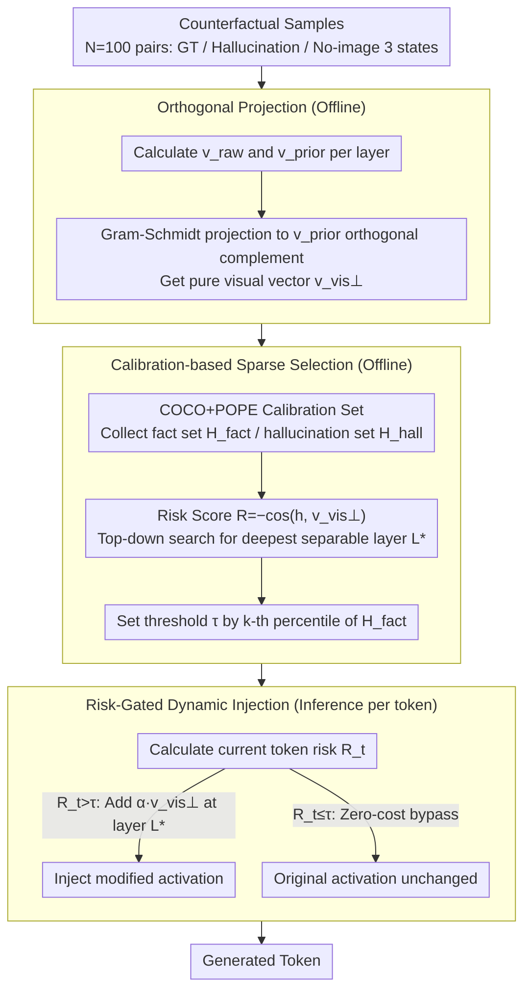

# Revis: Sparse Latent Steering to Mitigate Object Hallucination in Large Vision-Language Models

**Conference**: ICML 2026  
**arXiv**: [2602.11824](https://arxiv.org/abs/2602.11824)  
**Code**: https://github.com/antgroup/Revis (Available)  
**Area**: Hallucination Detection  
**Keywords**: Object Hallucinations, Latent Steering, Orthogonal Projection, Sparse Intervention, Mechanistic Interpretability

## TL;DR
This paper redefines LVLM hallucination as "missing visual information suppressed by language priors." It uses orthogonal projection to extract a "pure visual vector" by stripping language priors from the raw visual direction. Then, via a risk-gating mechanism, it performs sparse intervention on a single layer at the optimal depth. This training-free approach reduces the CHAIRS hallucination rate by ~19% while preserving the general reasoning capabilities of MM-Vet.

## Background & Motivation
**Background**: LVLMs have demonstrated strong multimodal reasoning capabilities, but the persistent reliability issue is "object hallucination"—where the model describes plausible details not present in the image. Existing mitigation methods focus on training-time alignment (LLaVA-RLHF, HA-DPO, OPA-DPO) and inference-time intervention (Contrastive Decoding like VCD/M3ID, Logit correction like AGLA/ONLY, and Activation Steering like VTI).

**Limitations of Prior Work**: Training alignment is heavy and relies on large-scale preference data; contrastive decoding requires at least double the forward passes to suppress hallucinations; logit correction uses heuristic probes with poor robustness. VTI, the only method requiring neither retraining nor double forward passes, injects static offsets into all layers, which reduces CHAIRS from 14% to 9% but crashes the MM-Vet score from 70.18 to 56.38, significantly damaging general reasoning.

**Key Challenge**: Current intervention directions are actually "fact-hallucination" difference vectors. While they point toward visual information, they are entangled with "language priors" (the direction the model guesses when the image is missing). Amplifying this entangled vector by a factor $\alpha$ also amplifies the language prior, causing the model to collapse into repetitive or empty outputs at $\alpha \approx 0.7$.

**Goal**: To find an intervention method that "only activates vision without amplifying priors" and precisely selects the intervention depth, reducing hallucinations without sacrificing general capabilities—all without retraining or double forward passes.

**Key Insight**: The authors analyzed the $[\text{EOS}]$ hidden states of 5 counterfactual states (GT / Hallucination / No-image GT / No-image Hallucination / No-image Unknown) using latent space geometry. While facts vs. hallucinations are linearly separable in deep layers, the raw $\mathbf{v}_{\text{raw}} = \mathbf{h}_{\text{gt}} - \mathbf{h}_{\emptyset\_\text{gt}}$ has a high cosine similarity with the "language prior vector" $\mathbf{v}_{\text{prior}} = \mathbf{h}_{\emptyset\_\text{hall}} - \mathbf{h}_{\emptyset\_\text{unk}}$ in deep layers. This confirms that entanglement is the root cause of VTI's failure.

**Core Idea**: Use Gram-Schmidt to project $\mathbf{v}_{\text{raw}}$ onto the orthogonal complement of $\mathbf{v}_{\text{prior}}$, obtaining the "pure visual vector" $\mathbf{v}_{\text{vis}}^\perp$. Then, use a calibration-based risk score to identify the deepest separable layer $L^*$. During inference, corrective steering is only injected if the "hallucination risk score exceeds a threshold"—making the intervention a "sparse + single-layer + orthogonal" surgical operation.

## Method

### Overall Architecture
A three-stage training-free pipeline: Stage 1 calculates $\mathbf{v}_{\text{raw}}^{(\ell)}$ and $\mathbf{v}_{\text{prior}}^{(\ell)}$ using $N=100$ sample pairs across all layers, obtaining $\mathbf{v}_{\text{vis}}^{\perp(\ell)}$ via Gram-Schmidt. Stage 2 uses 100 images from COCO to construct POPE-style Q&A to collect sets of fact/hallucination hidden states. It searches top-down for the deepest layer $L^*$ that satisfies $R(\mathcal{H}_{\text{hall}}) > R(\mathcal{H}_{\text{fact}})$ based on the risk score $R(\mathbf{h}) = -\cos(\mathbf{h}, \mathbf{v}_{\text{vis}}^{\perp(\ell)})$, and sets the threshold $\tau$ based on the $k$-th percentile of the fact set. Stage 3 calculates $R_t$ for each token during inference; if $R_t > \tau$, it adds $\alpha\,\mathbf{v}_{\text{vis}}^{\perp(L^*)}$ to layer $L^*$, otherwise the original activation is kept. The first two stages are one-time offline computations.

### Key Designs

**1. Orthogonal Projection to Purify Visual Vectors: Stripping language priors from raw visual directions to obtain a "non-collapsing" steer direction.**

The reason VTI destroys general capabilities as intensity increases is that the "fact-hallucination difference vector" is mixed with language priors—the direction the model guesses without an image. When $\alpha$ increases, both vision and priors are amplified, causing collapse at $\alpha \approx 0.7$. Revis decouples these forces: first defining $\mathbf{v}_{\text{raw}}^{(\ell)}=\mathbb{E}[\mathbf{h}_{\text{gt}}^{(\ell)}-\mathbf{h}_{\emptyset\_\text{gt}}^{(\ell)}]$ and $\mathbf{v}_{\text{prior}}^{(\ell)}=\mathbb{E}[\mathbf{h}_{\emptyset\_\text{hall}}^{(\ell)}-\mathbf{h}_{\emptyset\_\text{unk}}^{(\ell)}]$, then projecting the former onto the orthogonal complement of the latter:

$$\mathbf{v}_{\text{vis}}^{\perp(\ell)}=\mathbf{v}_{\text{raw}}^{(\ell)}-\frac{\mathbf{v}_{\text{raw}}^{(\ell)}\cdot\mathbf{v}_{\text{prior}}^{(\ell)}}{\|\mathbf{v}_{\text{prior}}^{(\ell)}\|^2}\mathbf{v}_{\text{prior}}^{(\ell)}$$

Causal probe experiments prove that this pure visual vector maintains generation stability even at very high $\alpha$, as orthogonalization separates "adding vision" from "adding priors."

**2. Calibration-based Sparse Layer Selection: Selecting a single "deepest + still separable" surgical entry point.**

t-SNE analysis shows that fact and hallucination states are mixed in shallow layers and only become linearly separable in deep layers. Revis uses a calibration set $\mathcal{D}_{\text{cal}}$ to extract $\mathcal{H}_{\text{fact}}$ and $\mathcal{H}_{\text{hall}}$ per layer, defines $R(\mathbf{h})=-\cos(\mathbf{h},\mathbf{v}_{\text{vis}}^{\perp(\ell)})$, and searches backward from the deepest layer $L$ to find the first layer satisfying $R(\mathcal{H}_{\text{hall}})-R(\mathcal{H}_{\text{fact}})>0$. It then determines $\tau$ as the $k$-th percentile of the fact set on that layer. This ensures the intervention is at the deepest layer that can distinguish facts from hallucinations, maximizing geometric separability with zero compute waste.

**3. Risk-Gated Dynamic Injection: Fixing only when the model "starts to drift."**

Previous methods injected activations at every step, contaminating even correct tokens. Revis adds a gate: for every step, it calculates $R_t=R(\mathbf{h}_t^{(L^*)})$ and $\lambda(t)=\alpha\cdot\mathbb{1}(R_t>\tau)$. Correction $\tilde{\mathbf{h}}_t^{(L^*)}=\mathbf{h}_t^{(L^*)}+\lambda(t)\,\mathbf{v}_{\text{vis}}^{\perp(L^*)}$ is only applied if the risk exceeds the threshold. For the majority of tokens, Revis acts as a zero-cost bypass, performing a sparse surgical intervention only at high-risk moments.

### Loss & Training
Completely training-free. The two hyperparameters $\alpha$ (intensity) and $k$ (fact percentile threshold) are set per model. For Qwen2.5-VL-7B, $\alpha=1.6, k=0.8$.

## Key Experimental Results

### Main Results

| Dataset | Metric | Best Baseline | Revis | Gain |
|--------|------|----------|-------|------|
| POPE Random | F1 ↑ | 88.61 (VCD) | 91.43 | +2.82 |
| POPE Adversarial | F1 ↑ | 86.19 (VCD) | 87.63 | +1.44 |
| CHAIR | $C_S$ ↓ | 29.00 (AGLA) | 25.00 | ~14% Relative |
| MME Total Score | ↑ | 2328.59 (AGLA) | 2345.30 | Improved |
| MM-Vet Total | ↑ | 70.18 (Regular) | 72.16 | +1.98 (VTI: 56.38) |

### Ablation Study

| Configuration | CHAIRS ↓ | MM-Vet ↑ | Description |
|------|---------|---------|------|
| Regular | 14.00 (max=64) | 70.18 | Original Decoding |
| VTI (Entangled + All-layer) | 9.00 | 56.38 | Hallucination down, but general ability collapses |
| $\mathbf{v}_{\text{raw}}$ direct injection | Better than VTI at $\alpha < 0.4$ | Collapse at $\alpha \approx 0.7$ | Confirms entanglement as root cause |
| Orthogonal Vector $\mathbf{v}_{\text{vis}}^\perp$ | Stable at high $\alpha$ | MM-Vet preserved | Orthogonalization is necessary |
| Revis Full (Orthogonal + Single-layer + Gating) | 25.00 (max=512) | 72.16 | Final Method |

### Key Findings
- Decomposing the "fact vs. hallucination difference vector" reveals that the root cause of hallucination is "language priors" squeezing out visual info in deep layers.
- A single layer + risk gating is sufficient to outperform all-layer VTI and double-forward VCD/M3ID.
- Consistent results across seven VLM backbones (Qwen2.5-VL 7B/32B, Qwen3-VL-8B, LLaVA-1.5, LLaVA-NeXT, InternVL3, InternVL3.5), suggesting language prior entanglement is a universal issue in LVLMs.

## Highlights & Insights
- Using counterfactual state space (GT/Hallucination/No-image) to explicitly define "language prior vectors" and then removing them via Gram-Schmidt is a brilliant paradigm of applying mechanistic interpretability to engineering optimization.
- The "single layer + risk gating" approach is similar to gating in mixture-of-experts but applied to hidden state intervention with nearly zero overhead.
- Observing "image.jpg" visual placeholders at extreme $\alpha$ values provides strong causal evidence that the pure visual direction truly pushes the model toward image-grounded generation.

## Limitations & Future Work
- Intervention is restricted to a single layer, potentially missing complex hallucinations that require multi-layer coordination.
- The calibration set uses only 100 COCO images; threshold stability across domains (medical, satellite, docs) needs validation.
- Risk gating relies on cosine similarity; combining it with object-level confidence might further reduce false positives.

## Related Work & Insights
- **vs VCD/M3ID**: They perform contrastive decoding at the logit layer (double forward); Revis performs orthogonal injection at the hidden layer (zero overhead).
- **vs AGLA/ONLY**: They rely on heuristic probes or auxiliary detection; Revis uses principled geometry and risk scores for layer/threshold selection.
- **vs VTI**: Both are latent steering, but VTI's entangled vectors + all-layer injection crash performance; Revis improves both hallucinations and general ability via "orthogonal + sparse" steps.
- **vs RLHF / DPO**: Training is expensive; Revis is an inference-time-only intervention with minimal deployment cost.

## Rating
- Novelty: ⭐⭐⭐⭐⭐ "Counterfactuals + Orthogonalization + Risk Gating" is the first to push latent steering to a level where general capabilities do not degrade.
- Experimental Thoroughness: ⭐⭐⭐⭐ 5 datasets × 7 backbones + multiple baselines + causal probes; missing some cross-domain evaluation.
- Writing Quality: ⭐⭐⭐⭐⭐ Extremely rigorous logic from mechanism analysis to methodology.
- Value: ⭐⭐⭐⭐ Training-free, zero extra forward passes, plug-and-play; highly practical for LVLM deployment.

<!-- RELATED:START -->

## Related Papers

- [\[ICML 2026\] Adaptive Residual-Update Steering for Low-Overhead Hallucination Mitigation in Large Vision Language Models](adaptive_residual-update_steering_for_low-overhead_hallucination_mitigation_in_l.md)
- [\[CVPR 2026\] First Logit Boosting: Visual Grounding Method to Mitigate Object Hallucination in Large Vision-Language Models](../../CVPR2026/hallucination/first_logit_boosting_visual_grounding_method_to_mitigate_object_hallucination_in.md)
- [\[ICLR 2026\] Dynamic Multimodal Activation Steering for Hallucination Mitigation in Large Vision-Language Models](../../ICLR2026/hallucination/dynamic_multimodal_activation_steering_for_hallucination_mitigation_in_large_vis.md)
- [\[ACL 2025\] Retrieval Visual Contrastive Decoding to Mitigate Object Hallucinations in Large Vision-Language Models](../../ACL2025/hallucination/retrieval_visual_contrastive_decoding_to_mitigate_object_hallucinations_in_large.md)
- [\[ICML 2026\] Instruction Lens Score: Your Instruction Contributes a Powerful Object Hallucination Detector for Multimodal Large Language Models](instruction_lens_score_your_instruction_contributes_a_powerful_object_hallucinat.md)

<!-- RELATED:END -->
