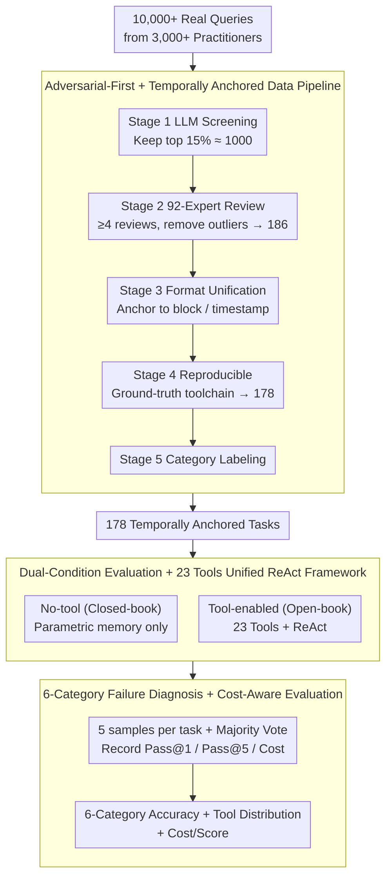

# When Hallucination Costs Millions: Benchmarking AI Agents in High-Stakes Adversarial Financial Markets (CAIA)

**Conference**: ICML 2026  
**arXiv**: [2510.00332](https://arxiv.org/abs/2510.00332)  
**Code**: https://github.com/SurfAI/CAIA (Available, including Leaderboard and HuggingFace dataset)  
**Area**: Hallucination Detection  
**Keywords**: Adversarial Evaluation, Cryptocurrency, Tool Selection, Pass@k Trap, Temporally Anchored Benchmark

## TL;DR
CAIA establishes the first "adversarial high-stakes" agent benchmark using 17 frontier LLMs across 178 temporally anchored real-world cryptocurrency tasks. Key findings: without tools, all models achieve only 12–28% accuracy (near random guess); with tools, the strongest GPT-5 reaches only 67.4% vs. 80% for junior human analysts. Critically, 55.5% of tool calls are biased toward "unreliable web searches" bypassing authoritative on-chain data, and the Pass@k metric systematically masks dangerous "trial-and-error" behaviors.

## Background & Motivation

**Background**: Over the past year, LLMs have repeatedly broken records on challenging closed-form benchmarks like ICPC and IMO, making "autonomous AI agent deployment" seem ready. However, existing benchmarks (SWE-Bench, AppWorld, TheAgentCompany, etc.) mostly assume "tools are available, information is trustworthy, and other agents are cooperative," measuring *competence* (upper bounds) rather than *resilience* (survival in hostile environments).

**Limitations of Prior Work**: Real-world domains like finance, governance, and critical infrastructure are rife with active deception, misinformation, and irreversible operations. An agent capable of winning an IMO gold medal might still trust a phishing link or purchase a compromised asset. Existing evaluations were never designed for "survival in environments surrounded by attackers." Furthermore, established metrics like Pass@k assume "multiple attempts are fine," whereas in high-stakes scenarios, the first error can result in irreversible multi-million dollar losses.

**Key Challenge**: (1) Training data originates from organized Web2 sources, while deployment occurs in Web3/real financial markets full of malicious inducements; (2) Increasing benchmark difficulty does not equate to increased robustness; (3) Pass@k metrics represent "exploration victory" in controlled tasks but "gambling luck" in irreversible decision-making.

**Goal**: Construct a benchmark capable of directly quantifying agent performance under adversarial, high-stakes, and multi-source data conditions, while characterizing specific failure modes (especially tool selection behavior) to establish "adversarial robustness" as a measurable prerequisite for deployment.

**Key Insight**: The authors identify cryptocurrency as a "natural laboratory" that simultaneously possesses: (i) active attackers (honeypot contracts, flash loans, coordinated social engineering), (ii) high stakes ($30B losses in 2024, irreversible on-chain transactions), and (iii) verifiable ground truth (transparent and immutable blockchain data). This "3-in-1" combination is unavailable in other financial scenarios.

**Core Idea**: A four-pronged design integrating "Adversarial-first + Real Financial Loss + Temporal Anchoring + Fine-grained Diagnosis" to upgrade agent benchmarks from "task completion" to "safe completion under active hostility."

## Method

### Overall Architecture
CAIA aims to evaluate whether agents can operate safely in active adversarial environments. It leverages cryptocurrency as a natural lab to construct 178 temporally anchored real-world analysis tasks. The pipeline extracts high-quality, verifiable, and contamination-resistant questions from over 10,000 queries by 3,000+ practitioners via a 5-stage workflow. Each model is tested under "no-tool (closed-book)" and "tool-enabled (open-book, 23 professional tools + unified ReAct framework)" conditions. For each task, 5 independent samples are taken for majority voting, reporting Pass@1/Pass@5 alongside token and dollar costs. Finally, accuracy is decomposed into 6 categories, tool call distributions, and cost/score for deployment-level failure diagnosis.

### Key Designs

**1. 5-Stage Adversarial-first + Temporally Anchored Data Pipeline: Ground truth is objective, reproducible, and contamination-resistant**
Traditional static benchmarks suffer from training data contamination and "unexecutable" questions. CAIA addresses both via a 5-stage pipeline. Stage 1 uses LLM-as-judge to screen queries for relevance and answerability, retaining the top 15% (~1000). Stage 2 involves 92 experts providing at least 4 reviews per question to filter out outliers, resulting in 186 prototypes. Stage 3 reformats tasks to anchor them to specific block numbers or timestamps, ensuring answers are reproducible. Stage 4 constructs a "reproducible ground-truth toolchain," providing both the answer and the sequence of tool calls required to reach it; non-reproducible tasks are discarded (final count: 178). Stage 5 classifies questions into On-Chain Analysis (43.3%), Project Discovery (27.5%), Tokenomics (12.9%), Overlap (7.9%), Trend Analysis (4.5%), and General Knowledge (3.9%). This design leverages blockchain immutability to ensure ground truth remains objective and reproducible.

**2. Dual-Condition Evaluation + 23 Tools Unified ReAct Framework: Decoupling model knowledge from tool orchestration**
Prior benchmarks often conflate tool capability, reasoning, and prompt engineering. CAIA decouples these by testing under two conditions. The no-tool condition measures basic understanding using only parametric memory. The tool-enabled condition provides 23 tools (Etherscan, CoinGecko, DefiLlama, market APIs, web search, Python, etc.). Significantly, the authors ensure the "correct answer is always reachable via a suitable tool," thus isolating the challenge to *tool selection + synthesis*. Failures are attributed to "incorrect source selection" rather than "missing information." All tool experiments utilize a standardized ReAct-style framework to ensure cross-model comparability.

**3. 6-Category Failure Diagnosis + Cost-aware Evaluation: Moving beyond single accuracy metrics to detect "luck"**
A single accuracy score fails to reveal "why" or "the cost" of errors. CAIA implements multi-dimensional diagnosis using a 5-round majority vote to mitigate variance. It reports Pass@1 and Pass@5, highlighting that Pass@k is "dangerous" in high-stakes scenarios—DeepSeek R1's Pass@5 is significantly higher than its Pass@1 (54.5% vs 26.4%), suggesting it relies on random attempts that would be fatal in irreversible environments. Every task also tracks token and dollar costs to calculate cost/score. Results show cost does not correlate perfectly with accuracy (GPT-OSS 120B nears frontier performance at ~100x lower cost than some closed-source models). Failure analysis shows 55.5% of tool calls shift toward unreliable web searches, misled by SEO-optimized misinformation even when specialized APIs provide the truth.

### Loss & Training
CAIA is a benchmark, not a training methodology. Every task is run 5 times independently for majority voting. The human baseline was established by 16 junior analysts from blockchain clubs and startups on a 10% subset, achieving an 80% average accuracy.

## Key Experimental Results

### Main Results
Evaluation of 17 models across dual conditions:

| Model | No-Tool (Majority) | Tool-Enabled (Majority) | Tool-Enabled Pass@5 | Tool-Enabled Cost ($) |
|---|---|---|---|---|
| **GPT-5** | **0.275** | **0.674** | 81.5 (≈) | 0.021 |
| Claude Opus 4 | 0.135 | 0.573 | 71.9 | 1.114 |
| Claude Opus 4.1 | 0.135 | 0.563 | 69.0 | 0.936 |
| Claude Sonnet 4 | 0.118 | 0.567 | 66.9 | 0.229 |
| DeepSeek V3.1 | 0.157 | 0.492 | 71.2 | 0.022 |
| GPT-4.1 | 0.197 | 0.466 | 60.7 | 0.091 |
| Gemini 2.5 Pro | 0.225 | 0.449 | 61.2 | 0.041 |
| GPT-4o | 0.169 | 0.303 | 55.6 | 0.091 |
| **DeepSeek R1** | 0.208 | 0.174 | **54.5** | 0.012 |
| GPT-OSS 120B | 0.146 | (Pareto) | – | **0.0003** |
| **Junior Human Analyst** | – | **0.80** | – | – |

*Significant contrast*: DeepSeek R1's Pass@1 is only 26.4% while Pass@5 hits 54.5%, indicating high dependence on trial-and-error. GPT-OSS 120B represents the cost-accuracy Pareto frontier at \$0.0003/query.

### Ablation Study

| Dimension | Key Observation | Explanation |
|---|---|---|
| Tool Availability | 12–28% (No-tool) → 67.4% (Tool) | Tools are effective but do not bridge the gap to human performance. |
| Tool Selection Behavior | 55.5% of calls are web search | Models prefer unreliable sources even when specialized tools are available. |
| Pass@1 vs Pass@5 | Pass@5 ≫ Pass@1 for many models | Reveals trial-and-error behavior, which is equivalent to "gambling" in high-stakes settings. |
| Category Distribution | On-Chain 43.3% / Discovery 27.5% | Transaction analysis is the dominant and most tool-intensive category. |
| Human Baseline | 80% vs GPT-5 67.4% | A 12.6pp gap exists even for the strongest models with full tool access. |

### Key Findings
- **Tool selection catastrophe**: Models systematically prefer web search (55.5%) even when specialized on-chain tools provide ground truth; failure is due to an inability to assess source reliability (architectural flaw) rather than a knowledge gap.
- **Pass@k is misleading in high-stakes**: The gap between Pass@5 and Pass@1 reveals "pseudo-competence"—in finance or medicine, the first mistake is fatal, making traditional metrics irrelevant.
- **Closed-source is not always better**: GPT-OSS 120B provides competitive performance at \$0.0003/query, nearly 1000x cheaper per score than Claude Opus 4.
- **Fundamental Web2 training limitations**: Failures in Web3/Crypto stem from "out-of-distribution" training—models haven't internalize on-chain data structures or SEO-style attack patterns, suggesting similar collapses in cybersecurity or content moderation.
- **Economic cost of hallucination**: By anchoring questions to real block heights and amounts, hallucinations map directly to quantifiable financial losses.

## Highlights & Insights
- **Robust Argument for Crypto as Testbed**: The transition from adversariality to irreversibility to verifiability is well-argued, providing a strong motivation template for subsequent benchmarks.
- **Rigorous Data Curation**: The 5-stage pipeline with 92 expert reviewers provides significantly more credibility than synthetic benchmarks.
- **Quantifying Tool Selection as Behavior**: Treating the frequency distribution of 23 tools as an evaluation dimension (rather than just accuracy) is a profound methodological contribution to agent evaluation.
- **Critique of Pass@k**: The call to replace Pass@k with majority voting + cost-aware metrics in irreversible decision scenarios is a necessary correction for the agent benchmark community.

## Limitations & Future Work
- **Sample Size**: 178 tasks is relatively small compared to SWE-Bench (2294), though quality per task is higher.
- **Crypto-centricity**: While crypto is an extreme adversarial case, attack patterns in other domains (e.g., medical misdiagnosis) may differ.
- **Active Attacks**: The benchmark focuses on a hostile information environment rather than proactive attacks like prompt injection or tool poisoning.
- **Framework Constraints**: The unified ReAct framework might limit models that perform better under "plan-then-execute" architectures.
- **Human Baseline**: The baseline involves only 16 individuals on a 10% subset; the 80% figure is a ballpark rather than an exact threshold.
- **Dynamic Evolution**: Adversaries iterate quickly; the benchmark requires continuous updates to remain relevant.

## Related Work & Insights
- **Comparison to SWE-Bench / AppWorld**: While those measure task completion in controlled environments, CAIA introduces "adversarial + high-stakes + irreversible" dimensions.
- **Comparison to FinanceBench / FinQA**: CAIA avoids the "proprietary vs synthetic" data dilemma by leveraging blockchain transparency.
- **Comparison to τ-Bench / WebArena**: CAIA moves beyond tool-use engineering to tool-selection preference as a behavioral metric.
- **Insights**: (1) "Correct answers reachable but requiring correct source selection" is a portable design for other tool-rich domains; (2) Pass@k should be replaced by cost-aware and first-attempt accuracy in deployment-oriented evaluations.

## Rating
- Novelty: ⭐⭐⭐⭐ (Strong combination of existing elements tailored to a deep testbed).
- Experimental Thoroughness: ⭐⭐⭐⭐⭐ (Excellent coverage across models, categories, and costs).
- Writing Quality: ⭐⭐⭐⭐⭐ (Highly compelling arguments and terminology).
- Value: ⭐⭐⭐⭐⭐ (Crucial guidance for deploying agents in high-stakes sectors).

<!-- RELATED:START -->

## Related Papers

- [\[AAAI 2026\] When Hallucination Costs Millions: Benchmarking AI Agents in High-Stakes Adversarial Financial Markets](../../AAAI2026/hallucination/when_hallucination_costs_millions_benchmarking_ai_agents_in_high-stakes_adversar.md)
- [\[ICML 2026\] Honest Lying: Understanding Memory Confabulation in Reflexive Agents](honest_lying_understanding_memory_confabulation_in_reflexive_agents.md)
- [\[ICML 2026\] REALISTA: Realistic Latent Adversarial Attacks that Elicit LLM Hallucinations](realista_realistic_latent_adversarial_attacks_that_elicit_llm_hallucinations.md)
- [\[ICML 2026\] Automatic Layer Selection for Hallucination Detection](automatic_layer_selection_for_hallucination_detection.md)
- [\[ICML 2026\] From Out-of-Distribution Detection to Hallucination Detection: A Geometric View](from_out-of-distribution_detection_to_hallucination_detection_a_geometric_view.md)

<!-- RELATED:END -->
