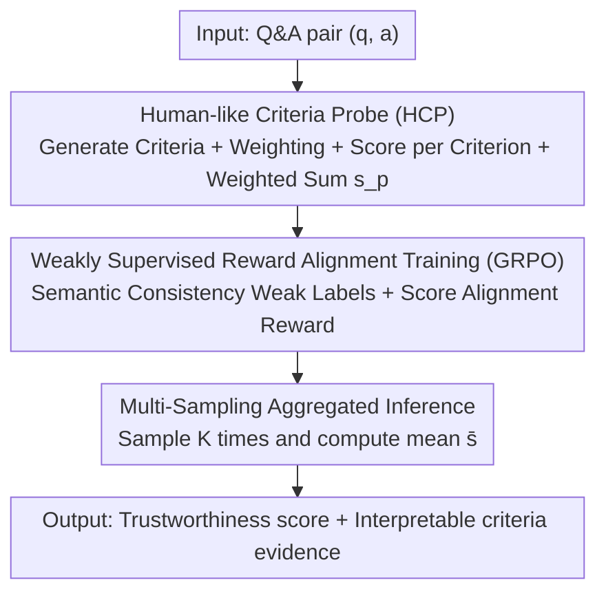

# Zero-source LLM Hallucination Detection with Human-like Criteria Probing

**Conference**: ICML2026  
**arXiv**: [2606.12900](https://arxiv.org/abs/2606.12900)  
**Code**: https://github.com/TRISKEL10N/HCPD  
**Area**: Hallucination Detection / LLM Safety  
**Keywords**: Hallucination Detection, Zero-source constraints, Multi-criteria probing, GRPO, Weakly supervised alignment

## TL;DR
HCPD treats "zero-source hallucination detection" (where only Q&A pairs are available, without access to internal model states or external knowledge bases) as a multi-criteria probe mimicking human evaluation. An LLM agent adaptively generates a set of interpretable evaluation criteria, assigns weights, scores per criterion, and computes a weighted trustworthiness score. Using weakly supervised semantic consistency and GRPO to train the agent, and multi-sampling aggregation during inference, the method significantly outperforms existing approaches in AUROC across four QA datasets and multiple target models.

## Background & Motivation
**Background**: LLMs suffer from "hallucinations"—generating factually incorrect, unsubstantiated, or unfaithful content. Reliable hallucination detection is a prerequisite for safe deployment. Existing methods generally fall into four categories: retrieval/fact-checking (requires external knowledge), confidence/internal-state based (requires token logits or hidden representations), self-consistency (multi-sampling comparison), and direct classifier training.

**Limitations of Prior Work**: Real-world open scenarios often operate under strict **zero-source constraints**. Third-party auditors (social platforms, news agencies) must audit massive user-uploaded texts without knowing the underlying LLM. Most end-users also receive only plain text via web interfaces. Consequently, commercial APIs, internal states, and external knowledge bases are all unavailable, forcing detection to rely solely on observed $(q, a)$ pairs. Under these constraints: retrieval-based methods lack knowledge bases; confidence-based methods lack logits; and self-consistency utilizes static, task-agnostic heuristics that fail to capture fine-grained, context-dependent nuances. Furthermore, most detectors provide only binary labels or scalar scores, lacking interpretability.

**Key Challenge**: Zero-source constraints cut off all "external signals," leaving only the text. However, hallucinations are heterogeneous—ranging from factual errors to logical fallacies or semantic misalignment. A single static criterion cannot cover all cases. There is a tension between the "text-only" constraint and the "need for multi-dimensional, context-adaptive judgment."

**Goal**: To achieve adaptive, interpretable, and stable hallucination judgment under pure $(q, a)$ input constraints.

**Key Insight**: The authors observe that human experts never use a single rigid rule to judge correctness. Instead, they decompose the evaluation into multiple dimensions (factuality, logic, temporal consistency, context faithfulness, etc.), dynamically adjust weights based on the content, and provide evidence-based judgments. This "context-dependent weighted multi-criteria" approach offers two benefits: adaptivity (focusing on the most relevant points for each instance) and interpretability (identifying which specific criteria were violated).

**Core Idea**: Let an LLM agent imitate a human evaluator—adaptively generating criteria, assigning weights, scoring per criterion, and summarizing. This replaces "single-score judgment" with a "multi-criteria probe."

## Method

### Overall Architecture
The core of HCPD (Human-like Criteria Probing for zero-source hallucination Detection) is an HCP probe mechanism. Given a Q&A pair $(q, a)$, an LLM agent $f_\theta$ first adaptively generates a set of fine-grained criteria $\{c_i\}$ and context-aware weights $\{w_i\}$, then scores each criterion individually $\{s_i\}$, and finally aggregates them into a weighted total trustworthiness score $s_p$. To equip the agent with this adaptive judgment capability, it is trained using weakly supervised semantic consistency and GRPO reinforcement learning (without human-labeled hallucination tags). During inference, $K$ independent samples are averaged to mitigate generation stochasticity. The paper provides theoretical guarantees for alignment, concentration, and ranking errors.

### Key Designs

**1. Human-like Criteria Probing (HCP): Replacing Single Scoring with Interpretable Multi-dimensional Evaluation**

Existing zero-source methods either provide a single scalar score or follow a static rule, making them incapable of capturing heterogeneous hallucinations and lacking interpretability. HCP enables agent $f_\theta$ to output a structured, criterion-by-criterion assessment. Specifically, it adaptively derives fine-grained criteria $\{c_i\}_{i=1}^m$ from a predefined set of general categories $\mathcal{C}=\{\text{Factual},\text{Logical},\text{Semantic},\text{Temporal},\text{Social}\}$. It then assigns context-dependent weights $\{w_i\}$ (e.g., temporal accuracy for historical questions, logical rigor for scientific explanations), assigns integer scores $s_i$ from 1–10, and computes the weighted total:

$$s_p=\sum_{i=1}^m w_i\cdot s_i,\quad \{(c_i,w_i,s_i)\}_{i=1}^m\leftarrow f_\theta(q,a;\mathcal{C})$$

where $w_i\ge 0$ and $\sum_i w_i=1$. The agent is constrained to output in a strictly structured format, reporting weights, evidence supporting or refuting the answer for each criterion, and the corresponding scores. For example (Table 1 in the paper): For the question "Which country hosted the 1948 Winter Olympics?" and answer "Norway," the agent derives Factual Grounding (60%), Temporal Consistency (20%), and Semantic Precision (20%). The analysis notes the actual host was St. Moritz, Switzerland, identifying a clear factual error and yielding a low final score of 1.

**2. Weakly Supervised Reward Alignment Training (GRPO): Teaching the Agent to Score Without Hallucination Labels**

Training signals are needed to teach the agent precise judgment, but manual hallucination severity labels are expensive and scarce. HCPD uses semantic consistency as weak supervision. Starting from a QA dataset with human-verified answers (e.g., TriviaQA), an auxiliary LLM generates candidate answers $\{a^{(n)}\}$ ranging from correct to clearly hallucinated for each question $q$. An consistency metric such as BLEURT computes the similarity $\text{sim}(\hat{a},a^{(n)})\in[0,1]$ between each candidate and the reference answer $\hat{a}$, which is then discretized into 1–10 weak labels:

$$s_l^{(n)}=\text{clip}\big(\lfloor 10\cdot\text{sim}(\hat{a},a^{(n)})\rceil,\,1,\,10\big)$$

The training employs GRPO (Group Relative Policy Optimization), which samples a group of outputs for the same input and uses the group mean reward as an implicit baseline to construct relative advantages. The reward $r$ directly compares the predicted score $s_p$ with the weak label $s_l$:

$$r=\begin{cases}1-\dfrac{|s_p-s_l|}{9},&\text{if format is valid}\\[4pt]0,&\text{otherwise}\end{cases}$$

A perfect match ($s_p=s_l$) yields $r=1$, with the reward decreasing linearly as the deviation increases. The choice of **differentiable scoring** rather than binary "True/False" classification is intentional: ① Graduated scoring better fits the continuous spectrum of hallucination severity; ② Penalizing based on error magnitude provides denser signals for policy optimization; ③ Scalar scores allow flexible precision-recall tradeoffs during inference.

**3. Multi-sampling Aggregation and Theoretical Guarantees: Mitigating Randomness with Provable Reliability**

LLM generation is stochastic, leading to non-negligible variance in single evaluations. HCPD performs $K$ independent inferences for the same $(q, a)$ pair, obtaining a set of scores $\{s_p^{(k)}\}_{k=1}^K$, and computes the robust estimate $\bar{s}=\frac{1}{K}\sum_k s_p^{(k)}$. This "train + inference" framework is supported by three theoretical results: Theorem 1 (Expected Training Alignment) shows that the GRPO objective with KL regularization pushes the expected score distributions toward the weak labels $s_l(x)$; Proposition 1 (Multi-sampling Concentration) provides a Hoeffding bound $\mathbb{P}(|\bar{s}(x)-\mathbb{E}[S_\theta(x)]|\ge u)\le 2\exp\big(-\frac{2Ku^2}{(10-1)^2}\big)$, showing variance is suppressed exponentially with $K$; Corollary 1 (Ranking Error Decomposition) decomposes the ranking error upper bound into intrinsic separability, training alignment loss, and sampling concentration terms.

## Key Experimental Results

### Main Results
Evaluated using AUROC (%) on TriviaQA, SciQ, NQ Open, and CoQA datasets across LLaMA-3.1-8b and Qwen-3-8b; ♣ denotes methods trained on fully labeled data.

| Target Model | Method | TriviaQA | SciQ | NQ Open | CoQA | Avg. |
|----------|------|----------|------|---------|------|------|
| LLaMA-3.1-8b | SelfCKGPT | 74.58 | 59.68 | 62.13 | 70.61 | 66.75 |
| LLaMA-3.1-8b | SAPLMA♣ | 78.51 | 85.63 | 76.23 | 71.58 | 77.99 |
| LLaMA-3.1-8b | TSV♣ | 79.78 | 80.01 | 70.17 | 69.31 | 74.82 |
| LLaMA-3.1-8b | **HCPD** | **86.25** | **86.04** | **90.38** | **90.07** | **88.19** |
| Qwen-2.5-7b | SAPLMA♣ | 78.11 | 86.63 | 72.86 | 80.28 | 79.47 |
| Qwen-2.5-7b | **HCPD** | **93.69** | **92.63** | **87.35** | **84.80** | **89.62** |

HCPD achieves an average AUROC of 88.19% on LLaMA-3.1-8b using only $(q, a)$ input, surpassing the second-best method (SAPLMA 77.99%) by 10.20%. In cross-model transfer experiments, HCPD remains stable while feature-based methods like HaloScope and TSV degrade significantly due to distribution shift.

### Ablation Study

| Configuration | TriviaQA AUROC | Description |
|------|----------------|------|
| Self-evaluation (baseline) | 56.07 | Standard self-assessment |
| HCPD (HCP only, Pre-RL) | 66.54 | HCP probe only, +10.47 |
| HCPD (HCP + GRPO, Post-RL) | 86.25 | Added reward alignment training, +19.71 |

| Design Choice | TriviaQA | CoQA | Description |
|----------|----------|------|------|
| Differentiable Scoring (-D) | 86.25 | 90.07 | Full design |
| Binary Scoring (-B) | 79.06 | 51.75 | Degraded to binary classification |

### Key Findings
- **Both components are effective, training contributes more**: The HCP probe alone improves AUROC from 56.07 to 66.54 (+10.47). Adding GRPO alignment further improves it to 86.25 (+19.71), indicating that the probe provides the framework while training provides the calibration.
- **Differentiable scoring vastly outperforms binary classification**: Switching to binary rewards caused performance on CoQA to drop from 90.07 to 51.75, as binary signals lose information about hallucination severity.
- **Sample size $K$ improves stability at a cost**: Increasing $K$ from 1 to 5 improved NQ Open AUROC from 86.89 to 90.38, but increased inference time from 0.23s to 1.13s per sample.

## Highlights & Insights
- **Reformulating Zero-source Detection**: The authors are the first to explicitly formalize hallucination detection under zero-source constraints and use "adaptive criteria generation + weighting" to mimic human judgment, providing inherent interpretability.
- **Semantic Consistency as Weak Supervision**: By discretizing BLEURT similarities into 1–10 weak labels, the method bypasses the need for expensive human hallucination labels.
- **Correspondence between Theory and Design**: The theorems directly support the design choices—Theorem 1 explains GRPO alignment, Proposition 1 justifies multi-sampling, and Corollary 1 identifies optimizable error terms.

## Limitations & Future Work
- **Weak Label Ceiling**: Supervision comes from consistency metrics like BLEURT, which are biased proxies. When these metrics fail (e.g., correct answers with different phrasing), they provide incorrect signals.
- **Transfer Gaps in QA Formats**: HCPD shows degradation on CoQA during cross-dataset transfer, likely due to differences in conversational interaction patterns.
- **Inference Cost**: Multi-sampling is stable but increases latency. At $K=5$, the latency is ~1.13s per sample, which may be a constraint in high-throughput auditing scenarios.

## Related Work & Insights
- **vs. Confidence/Internal-state methods (SAPLMA, TSV)**: These depend on token logits or hidden states, making them unusable for black-box systems and prone to degradation during model transfer. HCPD works in the language space and is model-agnostic.
- **vs. Self-consistency (SelfCKGPT)**: These use static heuristics; HCPD uses adaptive multi-criteria probes that adjust weights per question.
- **vs. Retrieval/Fact-checking**: These require external knowledge bases; HCPD relies purely on the internal reasoning of the $(q, a)$ pair.

## Rating
- Novelty: ⭐⭐⭐⭐⭐ 
- Experimental Thoroughness: ⭐⭐⭐⭐ 
- Writing Quality: ⭐⭐⭐⭐ 
- Value: ⭐⭐⭐⭐⭐

<!-- RELATED:START -->

## Related Papers

- [\[ACL 2026\] MultiHaluDet: Multilingual Hallucination Detection via LLM Hidden State Probing](../../ACL2026/hallucination/multihaludet_multilingual_hallucination_detection_via_llm_hidden_state_probing.md)
- [\[ICML 2026\] From Out-of-Distribution Detection to Hallucination Detection: A Geometric View](from_out-of-distribution_detection_to_hallucination_detection_a_geometric_view.md)
- [\[ICML 2025\] Steer LLM Latents for Hallucination Detection](../../ICML2025/hallucination/steer_llm_latents_for_hallucination_detection.md)
- [\[ACL 2026\] Rethinking Evaluation for LLM Hallucination Detection: A Desiderata, A New RAG-based Benchmark, New Insights](../../ACL2026/hallucination/rethinking_evaluation_for_llm_hallucination_detection_a_desiderata_a_new_rag-bas.md)
- [\[ICML 2026\] Automatic Layer Selection for Hallucination Detection](automatic_layer_selection_for_hallucination_detection.md)

<!-- RELATED:END -->
