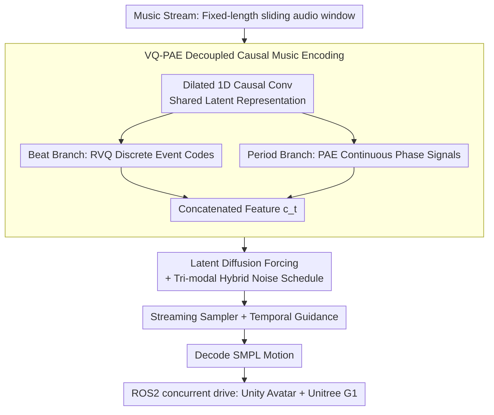

# DiscoForcing: A Unified Framework for Real-Time Audio-Driven Character Control with Diffusion Forcing

**Conference**: ICML 2026  
**arXiv**: [2605.28491](https://arxiv.org/abs/2605.28491)  
**Code**: https://discoforcing.github.io/ (Available)  
**Area**: Human Understanding / Music-driven Motion Generation / Streaming Diffusion  
**Keywords**: Audio-driven character control, Diffusion Forcing, Streaming generation, VQ-PAE, Temporal Guidance

## TL;DR
DiscoForcing reformulates the "music $\to$ full-body dance" offline generation problem into a strictly causal, bounded-latency streaming task. It utilizes a VQ-PAE causal music encoder, latent-space Diffusion Forcing, hybrid temporal noise scheduling, and Temporal Guidance sampling to translate music streams into 30 FPS full-body motions that directly drive Unity avatars and Unitree G1 humanoid robots in real-time.

## Background & Motivation
**Background**: Existing music-to-motion systems (FACT, Bailando, EDGE, Lodge, MEGADance) mostly operate in offline settings: they either require full future context of the music, use long time windows, or allow non-causal backtracking of history. While achieving impressive offline metrics, they cannot be directly deployed in real-time loops like VR avatars, animated interactions, or humanoid robots where "music arrives as it plays."

**Limitations of Prior Work**: Directly deploying these offline models for streaming results in three types of issues: significant beat synchronization latency, cumulative drift and jitter over long horizons, and slow response to sudden changes (e.g., drum entries, style shifts, user edits). These are not merely engineering issues but stem from the structural redefinition of the task in streaming: only causal observations are allowed, decisions must be final without backtracking, and per-frame computational budgets are strictly capped.

**Key Challenge**: Streaming music-driven control inherently involves a trade-off between stability and responsiveness. Over-reliance on motion history ensures smoothness but slows down reactions; aggressive overwriting of history enables fast responses but leads to jumps and jitter. Compounded by exposure bias in autoregressive rollouts, small prediction errors contaminate future conditioning history and are amplified under non-stationary music.

**Goal**: To formulate music-driven character control as bounded-latency streaming motion generation—predicting the next short motion segment given causal music features $\mathbf{c}_t$ and finite motion history $\mathbf{m}_{t-h:t-1}$, while building a matched "model + real-time system" to align metric evaluation with real interactive experiences.

**Key Insight**: Diffusion Forcing (Chen et al., 2024a) uses token-wise heterogeneous noise scheduling to train sequence diffusion, making it inherently more robust to imperfect autoregressive history. By adapting it into a "latent-space + streaming + music-conditioned" version with a tailored sampling schedule, the structural challenges of streaming can be addressed.

**Core Idea**: Designing a music encoder that is strictly causal and decoupled into beat tokens and periodic phases, implementing a latent-space Diffusion Forcing backbone with hybrid noise scheduling, and utilizing Temporal Guidance during sampling to replace CFG—allowing distant history to be actively "diluted with noise." This triplets-based approach jointly solves causality, long-term stability, and responsiveness to sudden changes.

## Method

### Overall Architecture
DiscoForcing addresses the streaming control problem where music is provided incrementally and motion must follow immediately. The core approach reformulates offline music-to-motion into a strictly causal pipeline with a fixed per-frame compute cap. At each streaming step $t$, the system extracts causal features from a fixed-length sliding audio window. A Diffusion Forcing model then generates clean latents for the current frame within a latent-space denoising window. Finally, these are decoded into SMPL motions and transmitted via ROS2 to concurrently drive Unity avatars and Unitree G1 humanoid robots at a consistent 30 FPS.

### Key Designs

**1. VQ-PAE Decoupled Causal Music Encoding: Causal conditioning capturing "Events" and "Phase"**

Real-time deployment forbids "looking ahead," requiring strictly causal music encoding. However, music contains two distinct types of information: discrete "sudden events" (e.g., drum drops, chorus entries) and continuous "phase flow" (beat cycles). Using a single representation often results in either coarse granularity that loses rhythm or excessive smoothing that misses triggers. VQ-PAE processes each sliding window $\mathbf{w}_t$ through dilated 1D causal convolutions to obtain a shared latent representation $\mathbf{f}^{causal}=\mathrm{Conv1D}(\mathbf{w}_t)$, which is then explicitly split. The beat branch uses Residual Vector Quantization $\mathbf{f}^{vq}=\mathrm{RVQ}(\mathrm{FFN}_{vq}(\mathbf{f}^{causal}))$ to provide discrete style/trigger codes. The period branch estimates amplitude $\mathbf{A}$, offset $\mathbf{B}$, frequency $\mathbf{F}$, and phase $\boldsymbol{\phi}=\tan^{-1}(\mathrm{FC}_{phase}(\mathbf{f}^{causal}))$ in the frequency domain to reconstruct a smooth phase-aligned signal $\mathbf{f}^{pae}(t)=\mathbf{A}\sin(2\pi(\mathbf{F}\cdot t-\boldsymbol{\phi}))+\mathbf{B}$. These are concatenated as the final condition $\mathbf{c}_t=[\mathbf{f}_t^{vq};\mathbf{f}_t^{pae}]$. This decoupling reduced FIDk from 25.49 (using Librosa features) to 23.23 and FIDg from 13.30 to 12.28, demonstrating that learned semantic conditions support motion realism better than manual beat features.

**2. Latent Diffusion Forcing + Tri-modal Hybrid Noise Schedule: Matching training distribution to streaming noise patterns**

Autoregressive rollouts suffer because the history fed to the model during inference is not perfectly clean. Vanilla Diffusion Forcing uses a "Random" schedule during training, which creates a mismatch with the actual streaming pattern (where history is mostly clean, the current frame is in the denoising window, and distant history needs active dilution). DiscoForcing first compresses 272-dimensional SMPL frames into a latent space using a motion VAE (which also acts as a low-pass filter to remove jitter and reduce compute). It defines independent noise levels for each token via a probability path $p(\mathbf{x}_t^{k_t}|\mathbf{x}_t^0)=\mathcal{N}(\alpha_{k_t}\mathbf{x}_t^0,\sigma_{k_t}^2\mathbf{I})$, where $k_t\in[0,1]$ is the token-wise diffusion time. Flow matching is used to learn the velocity field $\mathbf{v}_t=\dot\alpha_{k_t}\mathbf{x}_t^0+\dot\sigma_{k_t}\boldsymbol{\epsilon}_t$, with the loss aggregated only on tokens where $k_t>0$. Crucially, training samples are drawn from three schedules: Random ($k_t\sim\mathcal{U}(0,1)$ for general robustness), Monotonic (linear increase from 0 to 1 within a window $[\tau-l,\tau]$ for standard sliding window denoising), and Trapezoid (adding noise to the distant history based on Monotonic, $k_t^{trap}=\max(k_t^{hist},k_t^{mono})$ for guidance-enabled inference). Including these inference-time patterns in the training distribution eliminates the train-test gap.

**3. Streaming Sampler and Temporal Guidance (TG): Turning the stability-responsiveness trade-off into a knob**

Streaming requires overlaying changing music conditions onto a changing history within strict latency constraints. The sampler maintains a FIFO denoising window of length $l$. At each streaming step $\tau$, it runs the solver once for all tokens in the window (step size $\delta=1/l$ ensures one large step per frame). Denoised frames at the left edge ($k_t=0$) are output, while a new pure noise token is appended at the right. TG replaces CFG by substituting "conditioned vs. unconditioned" with "music cond + trapezoid history vs. no cond + monotonic history": $\mathbf{v}^{guided}=\mathbf{v}_\theta(\hat{\mathbf{x}}^{k^{mono}},k^{mono},\varnothing)+\omega[\mathbf{v}_\theta(\hat{\mathbf{x}}^{k^{trap}},k^{trap},\mathbf{c})-\mathbf{v}_\theta(\hat{\mathbf{x}}^{k^{mono}},k^{mono},\varnothing)]$. Applying trapezoid noise to the distant history filters out high-frequency motion priors that conflict with current music. Consequently, the guidance scale $\omega$ becomes a knob for reaction intensity—higher values follow drum entries instantly, while lower values preserve the mid-term context stability. TG further reduced FIDk from 23.23 to 18.87 and FSR from 0.097 to 0.059, outperforming standard CFG.

### Loss & Training
A two-stage strategy is used: first, train the motion VAE with $\mathcal{L}_{VAE}=\|\mathbf{m}_\mathcal{T}-\hat{\mathbf{m}}_\mathcal{T}\|_2^2+\lambda D_{KL}(q(\mathbf{z}|\mathbf{m})\|\mathcal{N}(0,I))$; then freeze the VAE to train the Diffusion Forcing transformer with $\mathcal{L}_{DF}=\mathbb{E}_{k_\mathcal{T},\mathbf{z}_\mathcal{T},\boldsymbol{\epsilon}_\mathcal{T}}[\|\mathbf{v}_\theta(\mathbf{x}^{k_\mathcal{T}}_\mathcal{T},k_\mathcal{T},\mathbf{c})-\mathbf{v}_\mathcal{T}\|_\mathcal{K}^2]$, where the masked norm is only computed for tokens $k_t>0$. Inference uses 10 denoising steps to ensure 30 FPS.

## Key Experimental Results

### Main Results

| Dataset | Metric | DiscoForcing | Prev. SOTA (Method) | Gain |
|--------|------|------|----------|------|
| FineDance | FIDk ↓ | 23.84 | 50.00 (Lodge/MEGA) | −52% |
| FineDance | FIDg ↓ | 8.62 | 13.02 (MEGA) | −34% |
| FineDance | FSR ↓ | 0.142 | 0.028 (Lodge) | Slightly Worse |
| FineDance | BAS ↑ | 0.225 | 0.226 (Lodge/MEGA) | Comparable |
| AIST++ | FIDk ↓ | 18.87 | 25.89 (MEGA) | −27% |
| AIST++ | FIDg ↓ | 11.57 | 9.62 (Bailando) | Slightly Worse |
| AIST++ | BAS ↑ | 0.244 | 0.242 (Lodge) | +0.002 |

Ours significantly leads in the primary motion quality metric (FIDk) across both datasets. BAS is comparable to top beat-sync methods, while Ours is the only system achieving all five capabilities: online, long-horizon, music-transition, physical platform compatibility, and user-interactivity.

### Ablation Study (AIST++)

| Config | FIDk ↓ | FSR ↓ | BAS ↑ | Latency (ms/frame) | Description |
|------|--------|-------|-------|--------------|------|
| 263d (HumanML3D) | 26.47 | 0.060 | 0.245 | 26.60 | Lacks joint rotation; needs IK |
| 272d (Ours) | 25.49 | 0.115 | 0.247 | 26.68 | Direct FK; supports retargeting |
| Librosa Encoder | 25.49 | 0.115 | 0.247 | 26.68 | Hand-crafted beat features |
| VQ-PAE Encoder | 23.23 | 0.097 | 0.238 | 26.73 | Learned semantic conditions |
| CFG Guidance | 23.23 | 0.097 | 0.238 | 26.73 | Standard unconditional dropout |
| Temporal Guidance | **18.87** | **0.059** | **0.244** | 26.26 | Trapezoid noise on history |
| 5-step Denoising | 28.63 | 0.062 | 0.242 | 14.02 | Too fast, loses realism |
| 10-step (Ours) | 18.87 | 0.059 | 0.244 | 26.26 | 30 FPS real-time sweet spot |
| 100-step | 17.58 | 0.080 | 0.248 | 261.91 | Diminishing returns; high latency |

### Key Findings
- Relative contribution of the three core modules: Temporal Guidance > VQ-PAE > 272d representation. TG alone reduced FIDk from 23.23 to 18.87 (−19%) while improving FSR and BAS, proving that "how to handle history" is more critical than "how to encode music" in streaming.
- 10 steps of denoising is the Pareto sweet spot for latency-quality: there is a huge jump from 5 to 10 steps, but increasing to 100 steps only yields a 7% reduction in FIDk while multiplying latency by 10x.
- While BAS (beat alignment score) is only "comparable" to mainstream methods, the authors highlight that baselines effectively "cheat" by using future context. Achieving parity under strict causal constraints is a structural victory.

## Highlights & Insights
- **Paradigm Shift: Temporal Guidance over CFG**: Whereas CFG treats conditions as static global variables, TG treats "distant history" as a controllable "condition strength." This transforms the stability-responsiveness conflict into a single $\omega$ knob, offering a blueprint for any generation task involving dynamic conditions and AR history (e.g., streaming video, TTS, robot policies).
- **Training Noise must Pre-visualize Deployment Patterns**: The failure of vanilla Diffusion Forcing in streaming stems from it never seeing the "clean history + denoising window + trapezoid-noised distant history" combination during training. This generalizes: the training distribution must actively cover the deployment schedule rather than relying on pure generalization.
- **Deployment-faithful Evaluation**: The authors emphasize matched causality and latency, demonstrating a complete end-to-end pipeline driving Unity and Unitree G1. This "benchmark + real interactive system" dual-track design should become the new standard for streaming generative models to avoid "good metrics, poor real-time performance."

## Limitations & Future Work
- **Ours Acknowledgments**: Robustness to out-of-distribution (extreme beat shifts, noisy audio), richer user control signals, stronger physical feasibility constraints, and more extensive real-world testing are needed.
- **Observations**: FSR (foot sliding) on FineDance (0.142) is significantly higher than Lodge (0.028), indicating unresolved foot contact consistency under streaming constraints. FIDg on AIST++ also lags behind offline Bailando (9.62), showing room for improvement in geometric dance vocabulary. The 26ms per-frame budget for 30 FPS strictly depends on 10 steps of denoising; scalability to larger models or higher resolutions remains to be validated.
- **Humanoid Robotics**: Details on the GMR retargeting and WBC tracking stability are sparse; quantitative metrics for physical deployment are not provided.

## Related Work & Insights
- **vs Bailando / FACT (Autoregressive Transformer)**: Traditional AR models accumulate drift and exhibit weakening beats over long rollouts; Ours uses Diffusion Forcing’s token-wise heterogeneous noise and latent VAE to mitigate exposure bias and high-frequency jitter.
- **vs EDGE / Lodge (Offline Diffusion)**: These rely on future audio context and non-causal backtracking for consistency; Ours uses the Hybrid Schedule + TG to compensate for missing future information under strict causality.
- **vs MEGADance (MoE Mamba-Transformer)**: MEGA focuses on stronger backbones for expressivity; Ours focuses on "correct streaming condition management," outperforming MEGA on FIDk with a smaller model. These routes are orthogonal and could be combined.
- **vs Self Forcing / Rolling Forcing**: While focusing on streaming diffusion, these assume static or slowly changing global conditions; Ours treats "non-stationary real-time music streams" as a first-class citizen.

## Rating
- **Novelty**: ⭐⭐⭐⭐ Adapting Diffusion Forcing for streaming music-driven control and replacing CFG with TG is a clear and transferable innovation.
- **Experimental Thoroughness**: ⭐⭐⭐⭐ Dual datasets (FineDance + AIST++), comprehensive ablations, and detailed latency data; lacks quantitative evaluation for the physical robot link.
- **Writing Quality**: ⭐⭐⭐⭐⭐ Clear problem statement, motivation, and solution structure; formulas and pseudo-code are well-integrated.
- **Value**: ⭐⭐⭐⭐⭐ Beyond SOTA numbers, it provides a complete "model + real-time system + dual frontend deployment" paradigm, serving as a practical reference for animation, VR, and humanoid robotics.

<!-- RELATED:START -->

## Related Papers

- [\[CVPR 2026\] Avatar Forcing: Real-Time Interactive Head Avatar Generation for Natural Conversation](../../CVPR2026/human_understanding/avatar_forcing_real-time_interactive_head_avatar_generation_for_natural_conversa.md)
- [\[CVPR 2026\] UniLS: End-to-End Audio-Driven Avatars for Unified Listening and Speaking](../../CVPR2026/human_understanding/unils_end-to-end_audio-driven_avatars_for_unified_listening_and_speaking.md)
- [\[CVPR 2026\] FloodDiffusion: Tailored Diffusion Forcing for Streaming Motion Generation](../../CVPR2026/human_understanding/flooddiffusion_tailored_diffusion_forcing_for_streaming_motion_generation.md)
- [\[CVPR 2026\] MimicTalker: A Multimodal Interactive and Memory-Enhanced Framework for Real-Time Dyadic 3D Head Generation](../../CVPR2026/human_understanding/mimictalker_a_multimodal_interactive_and_memory-enhanced_framework_for_real-time.md)
- [\[CVPR 2026\] PC-Talk: Precise Facial Animation Control for Audio-Driven Talking Face Generation](../../CVPR2026/human_understanding/pc-talk_precise_facial_animation_control_for_audio-driven_talking_face_generatio.md)

<!-- RELATED:END -->
