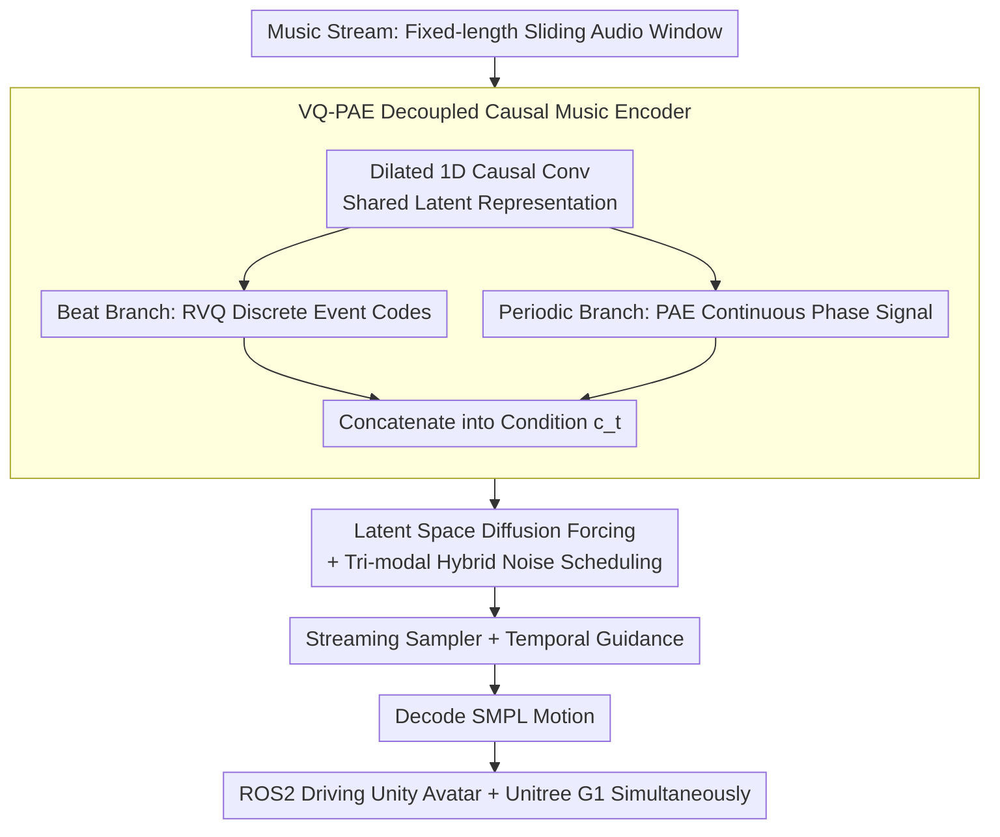

# DiscoForcing: A Unified Framework for Real-Time Audio-Driven Character Control with Diffusion Forcing

**Conference**: ICML 2026  
**arXiv**: [2605.28491](https://arxiv.org/abs/2605.28491)  
**Code**: https://discoforcing.github.io/ (Available)  
**Area**: Human Understanding / Music-Driven Motion Generation / Streaming Diffusion  
**Keywords**: Audio-driven character control, Diffusion Forcing, Streaming generation, VQ-PAE, Temporal Guidance

## TL;DR
DiscoForcing reformulates the offline "music-to-full-body dance" generation problem into a strictly causal, bounded-latency streaming task. By employing a VQ-PAE causal music encoder, latent-space Diffusion Forcing, hybrid temporal noise scheduling, and Temporal Guidance sampling, it translates music streams in real-time into 30 FPS full-body motions that directly drive Unity avatars and Unitree G1 humanoid robots.

## Background & Motivation
**Background**: Existing music-to-motion frameworks (FACT, Bailando, EDGE, Lodge, MEGADance) are almost entirely set in offline scenarios: they either require full future context of the music, use long-duration windows, or allow non-causal backtracking of history. While these achieve impressive offline metrics, they cannot be directly deployed in real-time loops like VR avatars, animated interactions, or humanoid robots where "music arrives as it is played."

**Limitations of Prior Work**: Deploying these offline models directly into streaming environments results in three main issues: significant beat synchronization lag, cumulative drift and jitter over long horizons, and sluggish response to sudden changes (e.g., drum entries, style shifts, or user edits). This is not due to poor engineering but because streaming structurally redefines the task: it must rely solely on causal observations, produce irreversible predictions, and adhere to strict frame-wise computational budgets.

**Key Challenge**: Streaming music-driven control inherently involves a trade-off between stability and responsiveness. Over-reliance on motion history ensures smoothness but slows down reactions; aggressive history overwriting enables fast response but leads to discontinuities and jitter. Compounded by the exposure bias of autoregressive rollouts, minor prediction errors contaminate the conditioning history, which is further amplified under non-stationary music.

**Goal**: To formulate music-driven character control as bounded-latency streaming motion generation—predicting the next short motion segment given causal music features $\mathbf{c}_t$ and finite motion history $\mathbf{m}_{t-h:t-1}$—while building a "model + real-time system" suite to align metric evaluation with real-world interactive experiences.

**Key Insight**: Diffusion Forcing (Chen et al., 2024a) employs token-wise heterogeneous noise for sequence diffusion training, making it inherently more robust to imperfect autoregressive histories. By adapting it into a "latent-space + streaming + music-conditioned" version and coupling it with a sampling schedule tailored for streaming, the structural difficulties of the streaming task can be addressed directly.

**Core Idea**: Design the music encoder to be strictly causal and decoupled into beat tokens and periodic phases; replace the diffusion backbone with latent-space Diffusion Forcing using hybrid noise scheduling; and utilize Temporal Guidance during sampling instead of CFG to actively "dilute" distant history with noise. These three components jointly resolve causality, long-range stability, and responsiveness to transitions.

## Method

### Overall Architecture
DiscoForcing addresses the streaming control problem where "music arrives on the fly and motion must follow immediately." Its core approach is to rewrite offline music-to-motion into a strictly causal pipeline with capped per-frame computational costs. At each streaming timestep $t$, the system extracts causal features from a fixed-length sliding audio window, uses Diffusion Forcing within a latent-space tail denoising window to output the clean latent for the current frame, and finally decodes it into SMPL motions. These are driven via ROS2 to simultaneously control Unity avatars and Unitree G1 physical humanoid robots, maintaining a 30 FPS causal streaming output.

### Key Designs

**1. VQ-PAE Decoupled Causal Music Encoding: Causal Conditions Capturing Both "Events" and "Phases"**

Real-time deployment prohibits looking into the future, necessitating strictly causal music encoding. However, music contains two distinct types of information: discrete "sudden events" like drum entries or chorus transitions, and continuous "phase flows" like beat periodicity. A single representation either loses rhythm due to coarse granularity or smoothes out triggers. VQ-PAE first processes each sliding window $\mathbf{w}_t$ through dilated 1D causal convolutions to obtain a shared latent $\mathbf{f}^{causal}=\mathrm{Conv1D}(\mathbf{w}_t)$, then explicitly splits it into two paths: the beat branch uses Residual Vector Quantization $\mathbf{f}^{vq}=\mathrm{RVQ}(\mathrm{FFN}_{vq}(\mathbf{f}^{causal}))$ to output discrete style/trigger codes; the periodic branch estimates amplitude $\mathbf{A}$, offset $\mathbf{B}$, frequency $\mathbf{F}$, and phase $\boldsymbol{\phi}=\tan^{-1}(\mathrm{FC}_{phase}(\mathbf{f}^{causal}))$ in the frequency domain to reconstruct a smooth phase-aligned signal $\mathbf{f}^{pae}(t)=\mathbf{A}\sin(2\pi(\mathbf{F}\cdot t-\boldsymbol{\phi}))+\mathbf{B}$. These are concatenated as the final condition $\mathbf{c}_t=[\mathbf{f}_t^{vq};\mathbf{f}_t^{pae}]$. This "discrete event + continuous phase" decoupling reduces FIDk from 25.49 (using Librosa features) to 23.23 and FIDg from 13.30 to 12.28 in ablations, demonstrating that learned semantic conditions capture motion realism better than manual beat features.

**2. Latent Space Diffusion Forcing + Tri-modal Hybrid Noise Scheduling: Pre-simulating Streaming Noise Patterns during Training**

The difficulty with autoregressive rollouts is that history fed to the model during inference is not clean. Vanilla Diffusion Forcing only uses a Random schedule for training, where the sampled noise patterns mismatch the actual streaming scenario: "recent past is mostly clean, current frame is in the denoising window, and distant past should be actively diluted." Consequently, streaming results often jitter or drift. DiscoForcing first compresses 272D SMPL frames into a latent space using a motion VAE (implicitly low-pass filtering jitter and reducing computation). It defines individual noise level probability paths for each token $p(\mathbf{x}_t^{k_t}|\mathbf{x}_t^0)=\mathcal{N}(\alpha_{k_t}\mathbf{x}_t^0,\sigma_{k_t}^2\mathbf{I})$, where $k_t\in[0,1]$ is the token-wise diffusion time. Flow matching is used to learn the velocity field $\mathbf{v}_t=\dot\alpha_{k_t}\mathbf{x}_t^0+\dot\sigma_{k_t}\boldsymbol{\epsilon}_t$, with the loss aggregated only on tokens where $k_t>0$. Crucially, training samples noise from three schedules: Random ($k_t\sim\mathcal{U}(0,1)$ for general robustness), Monotonic (linearly increasing from 0 to 1 within window $[\tau-l,\tau]$, corresponding to standard window denoising), and Trapezoid (adding noise to the distant past on top of Monotonic, $k_t^{trap}=\max(k_t^{hist},k_t^{mono})$, corresponding to guided history dilution). Incorporating patterns that actually occur during inference into the training distribution eliminates the train-test gap.

**3. Streaming Sampler and Temporal Guidance (TG): Turning the Stability-Responsiveness Trade-off into a Dial**

Streaming generation is not about "denoising on static global conditions" as CFG assumes, but "superimposing dynamic music conditions on evolving history." The sampler maintains a FIFO denoising window of length $l$. At each streaming step $\tau$, a solver runs once for all tokens in the window (step size $\delta=1/l$ ensures one large step per output frame); the left end is denoised to $k_t=0$ and output, while the right end adds a new pure noise token. For guidance, TG replaces the "cond vs. uncond" of CFG with "music cond + trapezoid history vs. no cond + monotonic history": $\mathbf{v}^{guided}=\mathbf{v}_\theta(\hat{\mathbf{x}}^{k^{mono}},k^{mono},\varnothing)+\omega[\mathbf{v}_\theta(\hat{\mathbf{x}}^{k^{trap}},k^{trap},\mathbf{c})-\mathbf{v}_\theta(\hat{\mathbf{x}}^{k^{mono}},k^{mono},\varnothing)]$. Applying trapezoid noise to distant history filters out high-frequency motion priors that conflict with current music within the guidance term. Thus, the guidance scale $\omega$ becomes a dial for reaction intensity: increasing it allows immediate follow-up to drum entries, while decreasing it preserves mid-term context stability. Ablations show TG further pushes FIDk from 23.23 to 18.87, reduces FSR from 0.097 to 0.059, and increases BAS from 0.238 to 0.244, outperforming CFG across all metrics.

### Loss & Training
Two stages: First, train the motion VAE with total loss $\mathcal{L}_{VAE}=\|\mathbf{m}_\mathcal{T}-\hat{\mathbf{m}}_\mathcal{T}\|_2^2+\lambda D_{KL}(q(\mathbf{z}|\mathbf{m})\|\mathcal{N}(0,I))$. Second, freeze the VAE and train the Diffusion Forcing transformer with $\mathcal{L}_{DF}=\mathbb{E}_{k_\mathcal{T},\mathbf{z}_\mathcal{T},\boldsymbol{\epsilon}_\mathcal{T}}[\|\mathbf{v}_\theta(\mathbf{x}^{k_\mathcal{T}}_\mathcal{T},k_\mathcal{T},\mathbf{c})-\mathbf{v}_\mathcal{T}\|_\mathcal{K}^2]$, where the masked norm is computed only on tokens with $k_t>0$. 10-step denoising is used during inference to ensure 30 FPS.

## Key Experimental Results

### Main Results

| Dataset | Metric | DiscoForcing | Prev. SOTA (Method) | Gain |
|--------|------|------|----------|------|
| FineDance | FIDk ↓ | 23.84 | 50.00 (Lodge/MEGA) | −52% |
| FineDance | FIDg ↓ | 8.62 | 13.02 (MEGA) | −34% |
| FineDance | FSR ↓ | 0.142 | 0.028 (Lodge) | Slightly Worse |
| FineDance | BAS ↑ | 0.225 | 0.226 (Lodge/MEGA) | Comparable |
| AIST++ | FIDk ↓ | 18.87 | 25.89 (MEGA) | −27% |
| AIST++ | FIDg ↓ | 11.57 | 9.62 (Bailando) | Slightly Worse |
| AIST++ | BAS ↑ | 0.244 | 0.242 (Lodge) | +0.002 |

Ours significantly leads in FIDk (motion quality) across both datasets. BAS is comparable to the best beat-based methods. Ours is the only system in the table possessing all five capabilities: online / long-horizon / music-transition / physical platform / user-interactive.

### Ablation Study (AIST++)

| Configuration | FIDk ↓ | FSR ↓ | BAS ↑ | Latency (ms/frame) | Description |
|------|--------|-------|-------|--------------|------|
| 263d (HumanML3D) | 26.47 | 0.060 | 0.245 | 26.60 | Lacks joint rotation, requires IK |
| 272d (Ours) | 25.49 | 0.115 | 0.247 | 26.68 | Direct FK, real-time retargetable |
| Librosa Encoding | 25.49 | 0.115 | 0.247 | 26.68 | Manual beat features |
| VQ-PAE Encoding | 23.23 | 0.097 | 0.238 | 26.73 | Learned semantic conditions |
| CFG Guidance | 23.23 | 0.097 | 0.238 | 26.73 | Standard unconditional dropout |
| Temporal Guidance | **18.87** | **0.059** | **0.244** | 26.26 | History trapezoid noising |
| 5-step Denoising | 28.63 | 0.062 | 0.242 | 14.02 | Too fast, loses realism |
| 10-step (Ours) | 18.87 | 0.059 | 0.244 | 26.26 | Sweet spot for 30 FPS |
| 100-step | 17.58 | 0.080 | 0.248 | 261.91 | Diminishing returns, violates RT |

### Key Findings
- Relative contribution of the three core modules: Temporal Guidance > VQ-PAE > 272d representation. TG alone reduces FIDk from 23.23 to 18.87 (−19%) while simultaneously improving FSR and BAS, representing the most critical innovation. This suggests that "how to handle history" is more important than "how to encode music" in streaming scenarios.
- 10-step denoising is the latency-quality Pareto sweet spot: quality jumps significantly from 5 to 10 steps, while 10 to 100 steps only yield -7% FIDk at a 10x latency cost. This sets a clear boundary for future work—further increasing step counts offers extremely low ROI.
- Regarding BAS (beat alignment), a metric long pursued in the music generation community, Ours is only "comparable" to mainstream methods (0.225 vs 0.226). However, the authors emphasize that baselines effectively "cheat" by using future context under streaming settings, making this parity a structural victory.

## Highlights & Insights
- **Paradigm Shift from CFG to Temporal Guidance**: While CFG treats conditions as static global variables, TG treats "distant history" as another controllable "condition intensity." This transforms the core stability vs. responsiveness conflict of streaming generation into a single $\omega$ dial. This concept provides a template for guidance design in any "dynamic condition + autoregressive history" task (e.g., streaming video, streaming TTS, robot policies).
- **Training Noise Schedules Must Pre-simulate Inference Patterns**: The instability of vanilla Diffusion Forcing in streaming arises because it never encountered the inference-time combination of "clean past, noisy future, trapezoid-noised distant past." This lesson is universal: training distributions must actively cover deployment schedules rather than relying on pure generalization.
- **Deployment-Faithful Evaluation**: The authors repeatedly stress "matched causality and latency" and actually implemented an end-to-end Unity + Unitree G1 dual-frontend. This dual-track design (benchmarks + real-world interactive systems) should become the new standard for streaming generation models to avoid the "good metrics, broken real-time performance" pitfall.

## Limitations & Future Work
- Acknowledged limitations: Robustness in out-of-distribution scenarios (extreme beat changes, noisy music), richer user control signals, stronger physical feasibility constraints, and broader real-world testing need strengthening.
- Personal Observations: FSR (foot sliding rate) on FineDance (0.142) is much higher than Lodge (0.028), indicating that foot contact consistency remains unresolved under streaming constraints. FIDg on AIST++ is also inferior to offline Bailando (9.62), showing a gap in geometric dance vocabulary. Furthermore, the 26 ms per-frame budget for 30 FPS relies strictly on 10-step denoising; whether this holds for larger models or higher-resolution motions remains to be verified.
- The physical humanoid link provides few details: GMR retargeting and WBC tracking stability might actually be the weakest link in the end-to-end experience, but quantitative metrics were not provided.
- Potential improvements: Incorporating foot contact and physical feasibility into the Diffusion Forcing objective (via contact loss or physics simulator-in-the-loop), making $\omega$ adaptive based on music change rates, and extending TG to a "soft-causal" version with a lightweight future buffer (e.g., 100 ms lookahead) to further approach offline quality without breaking interactivity.

## Related Work & Insights
- **vs. Bailando / FACT (Autoregressive Transformer)**: These use token-level AR, leading to cumulative drift and weakened beats over long rollouts. Ours uses token-wise heterogeneous noise in Diffusion Forcing + Latent VAE to address both exposure bias and high-frequency jitter, significantly improving long-horizon stability.
- **vs. EDGE / Lodge (Offline Diffusion)**: These rely on future audio context and non-causal backtracking for global consistency. Ours compensates for missing future information using Hybrid Scheduling + TG under strict causal constraints, making it more suitable for real-time interaction.
- **vs. MEGADance (MoE Mamba-Transformer)**: MEGA focuses on stronger backbones for expressivity. Ours focuses on "correct streaming condition management" with a standard backbone, surpassing MEGA in FIDk with a smaller model. These two paths are orthogonal and could be combined.
- **vs. Self Forcing / Rolling Forcing**: While both focus on streaming diffusion, they assume static or slowly changing global conditions. Ours treats "non-stationary real-time music streams" as first-class citizens, providing a viable template for streaming + dynamic condition scenarios.

## Rating
- Novelty: ⭐⭐⭐⭐ The adaptation of Diffusion Forcing for streaming music-driven control and replacing CFG with TG are clear, transferable innovations.
- Experimental Thoroughness: ⭐⭐⭐⭐ Comprehensive testing on FineDance and AIST++, full ablations, and detailed latency data; slight deduction for missing quantitative evaluation of the physical humanoid link.
- Writing Quality: ⭐⭐⭐⭐⭐ Extremely clear problem statement, motivation, and methodology. Formulae and pseudo-code are well-integrated; a model for streaming generation papers.
- Value: ⭐⭐⭐⭐⭐ Beyond SOTA numbers, it provides a complete paradigm: "model + real-time system + dual-frontend deployment." An immediately usable engineering reference for animation, VR, and humanoid robotics.

<!-- RELATED:START -->

## Related Papers

- [\[CVPR 2026\] Avatar Forcing: Real-Time Interactive Head Avatar Generation for Natural Conversation](../../CVPR2026/human_understanding/avatar_forcing_real-time_interactive_head_avatar_generation_for_natural_conversa.md)
- [\[ACL 2026\] Hybrid Autoregressive-Diffusion Model for Real-Time Sign Language Production](../../ACL2026/human_understanding/hybrid_autoregressive-diffusion_model_for_real-time_sign_language_production.md)
- [\[CVPR 2026\] FloodDiffusion: Tailored Diffusion Forcing for Streaming Motion Generation](../../CVPR2026/human_understanding/flooddiffusion_tailored_diffusion_forcing_for_streaming_motion_generation.md)
- [\[CVPR 2026\] UniLS: End-to-End Audio-Driven Avatars for Unified Listening and Speaking](../../CVPR2026/human_understanding/unils_end-to-end_audio-driven_avatars_for_unified_listening_and_speaking.md)
- [\[CVPR 2026\] PC-Talk: Precise Facial Animation Control for Audio-Driven Talking Face Generation](../../CVPR2026/human_understanding/pc-talk_precise_facial_animation_control_for_audio-driven_talking_face_generatio.md)

<!-- RELATED:END -->
