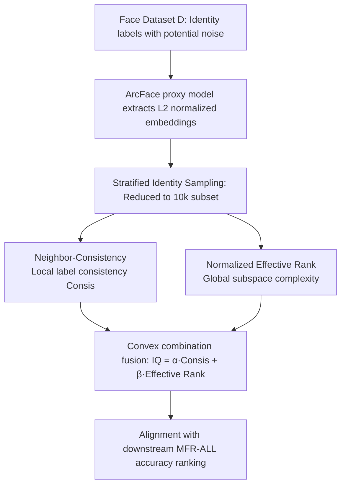

# Efficient, Validation-Free Intrinsic Quality Estimation for Large-Scale Face Recognition Datasets

**Conference**: ICML 2026  
**arXiv**: [2605.29720](https://arxiv.org/abs/2605.29720)  
**Code**: None  
**Area**: Face Recognition / Dataset Quality Assessment / Representation Learning Diagnosis  
**Keywords**: Intrinsic Quality, Effective Rank, Neighborhood Consistency, Face Recognition Datasets, Validation-Free Evaluation

## TL;DR
Ours proposes Intrinsic Quality (IQ): after extracting embeddings using a proxy model, it weightedly fuses "Neighborhood Label Consistency (Consis)" and "Normalized Spectral Entropy Effective Rank $\tilde{r}_{\mathrm{ent}}$". It provides a "trainability" score for million-scale face recognition datasets without full training or clean validation sets. On WebFace4/12/42M and noise-injected settings, the ranking consistency with downstream MFR-ALL validation accuracy reaches Spearman = 1.0.

## Background & Motivation

**Background**: Modern face recognition (FR) training relies heavily on million-scale weakly supervised web data (MS-Celeb-1M, VGGFace2, WebFace260M/42M). Combined with angular margin classification losses like ArcFace, performance is strongly coupled with data scale. The research paradigm is shifting from "model-centric" to "data-centric."

**Limitations of Prior Work**: To determine if a dataset variant is worth the computational cost of large-scale training, traditional methods are limited to two options: performing full training to observe downstream validation accuracy, or relying on a clean held-out validation set. The former consistently consumes thousands of GPU·h, while the latter is often unavailable due to privacy and licensing restrictions. Simultaneously, automatic cleaning pipelines like those for WebFace still contain residual noise, identity merges/splits, and long-tail distributions. Although training-time denoising methods (Co-Mining, Global-Local GCN, etc.) can mitigate these, they ultimately require training for verification.

**Key Challenge**: A critical confounder exists in weakly supervised web data: global spectral complexity (effective rank) increases under both "benign data scaling" and "label contamination" scenarios. Therefore, a global metric alone (such as RankMe) cannot distinguish whether data is "more diverse" or simply "dirtier." A diagnostic signal capable of decoupling these two sources is required.

**Goal**: Provide a "trainability" proxy metric to rank candidate FR datasets without full training, reliance on clean validation sets, or tuning dataset-specific hyperparameters, and verify its correlation and ranking consistency with downstream MFR-ALL validation accuracy.

**Key Insight**: The authors observe that local signals (label consistency within k-NN neighborhoods) and global signals (effective rank of the embedding covariance spectrum) respond differently to "data scaling" versus "noise injection." Under clean scaling, neighborhood consistency remains stable while the spectrum expands; under noise, the spectrum still expands but neighborhood consistency collapses. These constitute complementary dimensions that geometrically separate the two regimes.

**Core Idea**: Use a convex combination of "Local Consis × Global Normalized Effective Rank" as a dataset-level intrinsic quality score, letting Consis act as a correction term to suppress noise-induced "pseudo-complexity."

## Method

### Overall Architecture
The problem addressed is: providing a scalar "trainability" score IQ for a training set $\mathcal{D}=\{(x_i,y_i)\}_{i=1}^N$ with potentially noisy identity labels to rank candidate dataset variants without full training or clean validation sets. The authors transform the expensive training problem into a calculation of two complementary geometric statistics on proxy embeddings. First, a lightweight proxy model is trained on $\mathcal{D}$ using ArcFace to extract $\ell_2$ normalized embeddings. Then, stratified identity sampling is used to reduce the computational load to the $10^4$ scale. Finally, "Local Neighbor-Consistency" and "Global Subspace Complexity" are measured and fused via a convex combination to align with downstream MFR-ALL ground truth accuracy rankings.

### Key Designs

**1. Neighbor-Consistency: Probing noise with local label consistency**

Targeting the pain points of label flips and identity merges/splits in weakly supervised web data—which disrupt the local structure of "same identity in the neighborhood" while the global spectrum remains insensitive—this metric calculates the k-nearest neighbors (excluding self, default $k=10$) for each sampled embedding $e_i$ based on cosine similarity. The proportion of neighbors with the same label as $y_i$ is computed as $c_i=\frac{1}{k}\sum_{j\in\mathcal{N}_k(i)}\mathbf{1}\{y_j=y_i\}$, and the average $\bar c$ is taken over the subset. This is effective because clean scaling rarely disperses "locally compact clusters," whereas contamination directly reduces the same-label proportion in the neighborhood. Thus, $\bar c$ is sensitive to contamination but largely invariant to scale increases, accurately supplementing the dimension where global spectral complexity lacks directionality.

**2. Normalized Effective Rank $\tilde{r}_{\mathrm{ent}}$: Measuring global subspace expansion via spectral entropy**

This term characterizes "how many dimensions the embeddings occupy," reflecting data diversity and representation richness. After mean-centering the subset embeddings, the covariance $C=\frac{1}{n}\tilde E^\top \tilde E$ is computed. Eigenvalues $\{\lambda_\ell\}$ are normalized into probabilities $p_\ell$. Using the spectral entropy effective rank definition from Roy & Vetterli, $r_{\mathrm{ent}}=\exp\left(-\sum_\ell p_\ell\log p_\ell\right)$ is calculated. Logarithmic normalization $\tilde{r}_{\mathrm{ent}}=\log r_{\mathrm{ent}}/\log Q$ (where $Q=\min(n,d)$) is applied to ensure comparability across different $(n,d)$ and to compress near-saturation regions. Benign scaling causes the spectrum to expand from a few principal directions to many, leading to a monotonic increase in $\tilde{r}_{\mathrm{ent}}$. However, noise also injects "pseudo-variance" that flattens the spectrum and inflates the effective rank—making its direction ambiguous when used alone, which is the fundamental reason it must be combined with Consis.

**3. Convex Combination Fusion IQ: Correcting pseudo-complexity with consistency**

Finally, the local and global signals are synthesized into a single scalar $\mathrm{IQ}=\alpha\cdot\bar c+\beta\cdot\tilde{r}_{\mathrm{ent}}$ ($\alpha+\beta=1$). The weights are fixed at $\alpha=0.2, \beta=0.8$ across all datasets, noise rates, and proxies without tuning. The weight bias toward $\tilde{r}_{\mathrm{ent}}$ is due to the fact that under clean scaling, Consis is near saturation with a small dynamic range, requiring subspace expansion for differentiation. In the contamination regime, Consis provides a negative correction to prevent $\tilde{r}_{\mathrm{ent}}$ from being falsely inflated by pseudo-complexity. Critically, this weight is not tuned per-dataset; Section 5.4 sweeps $\beta$ to prove the existence of a wide plateau of high correlation rather than a sharp peak.

### Loss & Training
The proxy model $f_\theta$ is trained directly on $\mathcal{D}$ using standard ArcFace (ResNet-50 or ResNet-100, $d=1024$). For main trend analysis, ResNet-100 is fixed. IQ contains no learnable parameters and is a post-hoc geometric statistic of the embeddings.

## Key Experimental Results

### Main Results: Clean Scaling + Noise Injection

Under clean scaling (WebFace 4M → 12M → 42M), IQ increases in alignment with downstream MFR-ALL. When closed-set label flips are injected into WebFace12M at rates of {2%, 5%, 10%, 20%, 40%}, downstream accuracy monotonically decreases. While $\tilde{r}_{\mathrm{ent}}$ is inflated by noise, Consis collapses significantly, allowing IQ to follow the downstream ranking.

| Dataset | Noise | Acc(MFR-ALL) | $\tilde{r}_{\mathrm{ent}}$ | Consis | IQ |
|:---|:---|:---|:---|:---|:---|
| WebFace4M | 0 | 90.36 | 0.882 | 0.980 | 0.902 |
| WebFace12M | 0 | 94.37 | 0.916 | 0.987 | 0.930 |
| WebFace42M | 0 | 96.26 | 0.964 | 0.986 | 0.968 |
| WebFace12M | 5% | 94.21 | 0.927 | 0.897 | 0.921 |
| WebFace12M | 20% | 90.76 | 0.959 | 0.676 | 0.903 |
| WebFace12M | 40% | 72.01 | 0.994 | 0.401 | 0.875 |

### Comparison with validation-free baselines (Scaling + Noise Union)

| Metric | Spearman | Pearson | Kendall τ |
|:---|:---|:---|:---|
| RankMe | 0.418 | 0.752 | 0.300 |
| ER-only ($\tilde{r}_{\mathrm{ent}}$) | 0.286 | 0.398 | 0.190 |
| Consis-only ($\bar c$) | 0.607 | 0.491 | 0.429 |
| **IQ (ours)** | **1.000** | **0.891** | **1.000** |

### Key Findings
- Spectral complexity used in isolation is directionally ambiguous: WebFace12M with 40% noise shows the highest $\tilde{r}_{\mathrm{ent}}=0.994$ in the table, yet downstream accuracy is only 72.01%. This confirms that "noise also inflates effective rank," which is the root cause of failure for RankMe / ER-only.
- Sensitivity sweeps for $\beta$ show that Spearman/Pearson correlations remain near the peak of IQ across a wide interval, proving that the weight is not over-tuned. Stability tests for sampling sizes from 2k to 100k show that $\tilde{r}_{\mathrm{ent}}$ and Consis converge after ≥10k, ensuring controllable estimation costs.
- Absolute values shift between ResNet-50 and ResNet-100 proxies, but relative rankings across datasets remain consistent, indicating that IQ captures intrinsic dataset structure rather than proxy architecture artifacts.
- In subset ranking experiments on WebFace12M / HighVar / LowVar, IQ maintains alignment with downstream accuracy (HighVar 94.45 > 12M 94.37 > LowVar 93.04 vs IQ 0.932 > 0.930 > 0.913), supporting its utility for "rank-before-training."

## Highlights & Insights
- The observation that "global spectral complexity increases in both data scaling and noise injection regimes" is very clean, revealing why single spectral metrics (RankMe / Effective Rank) fail on weakly supervised data. De-coupling these two directions using a local k-NN consistency rate creates unique visual trajectories in the $(\tilde{r}_{\mathrm{ent}}, \mathrm{Consis})$ plane.
- The metric fixes weights at $\alpha=0.2, \beta=0.8$ without per-dataset parameter tuning. The existence of a broad correlation plateau rather than a sharp peak makes it highly reliable for real-world data iteration.
- Using a "lightweight proxy + 10k stratified identity subset" reduces costs to a level feasible for million-scale data. Since IQ is a post-hoc statistic, it achieves "diagnosis-training decoupling." This paradigm is transferable to other fields relying on large-scale weakly supervised data (e.g., retrieval, re-ID, video identity understanding) where "local label homogeneity + global subspace expansion" complementary axes exist.
- The distribution information of per-sample $c_i$ (shifting from a near-saturated peak to a long-tail distribution under noise) naturally provides a data debugging perspective, which can guide automated cleaning—serving as an entry point for turning diagnosis into a cleaning loop.

## Limitations & Future Work
- Dependency on proxy embeddings: Extremely weak proxies or strong domain shifts may distort IQ. The paper lacks a minimum required threshold for proxy capability, leaving a gap for practical deployment criteria.
- Artificial noise models: Experiments only utilized uniform closed-set label flips, failing to cover more realistic web data issues such as identity merges/splits, near-duplicate clusters, structural confusion between visually similar identities, and long-tail bias. Thus, the conclusion "IQ outperforms RankMe" strictly holds for controlled noise.
- Downstream evaluation was limited to the MFR-ALL benchmark. The definition of "trainability" is tied to a fixed training/evaluation protocol; generalizability across different benchmarks or architectures remains a hypothesis. The authors explicitly state IQ is not a "universal dataset quality score."
- In the main correlation table, IQ's Spearman/Kendall τ reaching 1.000 simultaneously is suspicious—it likely relates to the finite number of settings compared, where monotonicity is easier to satisfy perfectly. Robustness should be reassessed by adding more mixed-regime points (finer noise grids + different base scales).

## Related Work & Insights
- **vs RankMe (Garrido et al., 2023)**: RankMe is also a validation-free effective rank metric but only considers global spectra. Ours shows a Spearman gap of 0.418 (RankMe) vs 1.000 (IQ), stemming from RankMe being deceived by "pseudo-complexity" in noisy settings. This emphasizes that spectral analysis requires local consistency supplementation.
- **vs SER-FIQ / MagFace (Image-level quality)**: Those methods provide sample-level recognizability scores targeting "good image selection." Ours is a dataset-level trainability score targeting "dataset selection." The granularities are complementary and can be combined for data curation.
- **vs Co-Mining / Global-Local GCN / RepFace (Robust training)**: These methods mitigate noise during training but still require full training to evaluate dataset variants. IQ moves judgment to the pre-training stage as a diagnostic tool rather than a treatment, serving as a pre-filtering module.
- **vs LEEP / TransRate (Transfer learning metrics)**: Similar philosophy (using low-cost intrinsic signals for downstream prediction), but LEEP/TransRate focus on transferability of source-target task pairs. IQ focuses on trainability of dataset variants within the same task, specifically addressing weakly supervised label noise in FR.

## Rating
- Novelty: ⭐⭐⭐⭐ The explicit de-coupling of the confounder where global spectral complexity increases under both scaling and noise, supplemented by k-NN local consistency, is insightful. The fusion is simple but the perspective is fresh.
- Experimental Thoroughness: ⭐⭐⭐ Conducted clean scaling on WebFace4/12/42M, 6 levels of noise injection, proxy robustness, sampling stability, $\beta$ sensitivity, and subset ranking. Comprehensive within its scope, though limited to one downstream benchmark and idealized noise models.
- Writing Quality: ⭐⭐⭐⭐ The link from motivation to hypothesis to signals to fusion to verification is very smooth. Every design choice is supported by a "why it is needed" argument. Consistent notation and tables make the main narrative easy to follow.
- Value: ⭐⭐⭐⭐ Provides a lightweight diagnostic tool for cost-sensitive million-scale FR engineering. The "score-then-train" paradigm is directly applicable to data-driven FR pipelines and extensible to other weakly supervised big data domains.

<!-- RELATED:START -->

## Related Papers

- [\[CVPR 2026\] OpenT2M: No-frill Motion Generation with Open-source, Large-scale, High-quality Data](../../CVPR2026/human_understanding/opent2m_no-frill_motion_generation_with_open-source_large-scale_high-quality_dat.md)
- [\[ICLR 2026\] SpeakerVid-5M: A Large-Scale High-Quality Dataset for Audio-Visual Dyadic Interactive Human Generation](../../ICLR2026/human_understanding/speakervid-5m_a_large-scale_high-quality_dataset_for_audio-visual_dyadic_interac.md)
- [\[CVPR 2026\] LCA: Large-scale Codec Avatars - The Unreasonable Effectiveness of Large-scale Avatar Pretraining](../../CVPR2026/human_understanding/lca_large-scale_codec_avatars_the_unreasonable_effectiveness_of_large-scale_avata.md)
- [\[ICCV 2025\] LVFace: Progressive Cluster Optimization for Large Vision Models in Face Recognition](../../ICCV2025/human_understanding/lvface_progressive_cluster_optimization_for_large_vision_models_in_face_recognit.md)
- [\[CVPR 2026\] OpenDance: Multimodal Controllable 3D Dance Generation with Large-scale Internet Data](../../CVPR2026/human_understanding/opendance_multimodal_controllable_3d_dance_generation_with_large-scale_internet_.md)

<!-- RELATED:END -->
