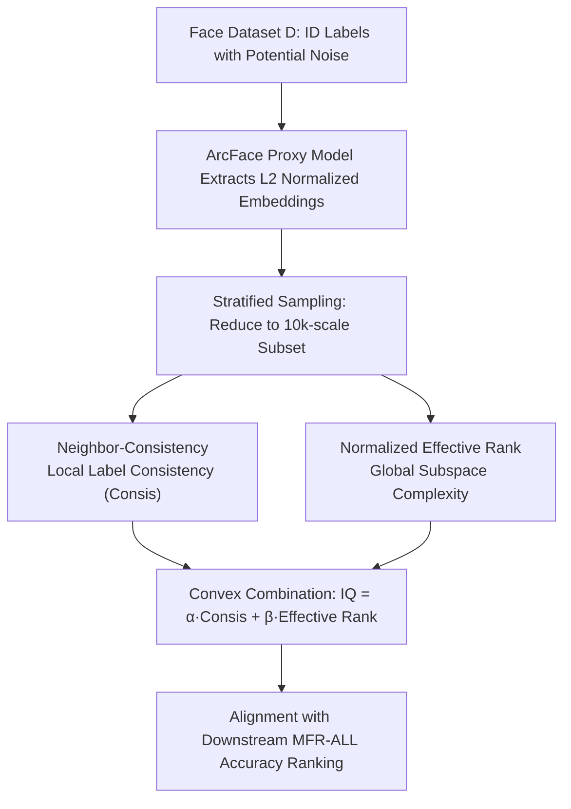

# Efficient, Validation-Free Intrinsic Quality Estimation for Large-Scale Face Recognition Datasets

**Conference**: ICML 2026  
**arXiv**: [2605.29720](https://arxiv.org/abs/2605.29720)  
**Code**: None  
**Area**: Face Recognition / Dataset Quality Evaluation / Representation Learning Diagnostics  
**Keywords**: Intrinsic Quality, Effective Rank, Neighborhood Consistency, Face Recognition Datasets, Validation-Free Evaluation

## TL;DR
This paper proposes Intrinsic Quality (IQ): by extracting embeddings using a proxy model, it performs a weighted fusion of "neighborhood label consistency (Consis)" and "normalized spectral entropy effective rank $\tilde{r}_{\mathrm{ent}}$." Without requiring full training or a clean validation set, it assigns a "trainability" score to million-scale face recognition datasets. It achieves a Spearman correlation of 1.0 with downstream MFR-ALL validation accuracy rankings across WebFace4/12/42M and noise-injected settings.

## Background & Motivation

**Background**: Modern face recognition (FR) training relies heavily on million-scale weakly supervised web data (MS-Celeb-1M, VGGFace2, WebFace260M/42M). Combined with angular margin classification losses like ArcFace, performance is tightly coupled with data scale, shifting the research paradigm from "model-centric" to "data-centric."

**Limitations of Prior Work**: To determine if a dataset variant is worth the computational cost of large-scale training, traditional methods are limited to two options: performing full training to observe downstream validation accuracy, or relying on a clean held-out validation set. The former consumes thousands of GPU hours, while the latter is often unattainable due to privacy and licensing constraints. Additionally, automatic cleaning pipelines like WebFace still contain residual noise, identity merges/splits, and long-tail distributions. While training-time denoising methods (Co-Mining, Global-Local GCN, etc.) can mitigate these issues, they still require training for validation.

**Key Challenge**: There is a critical confounder in weakly supervised web data—global spectral complexity (effective rank) increases in both "benign data expansion" and "label contamination" scenarios. Consequently, a global metric alone (such as RankMe) cannot distinguish between "more diverse" and "dirtier" data. A diagnostic signal capable of decoupling these two sources is needed.

**Goal**: To provide a "trainability" proxy metric for ranking candidate FR datasets without full training, clean validation sets, or dataset-specific hyperparameter tuning, and to verify its correlation and ranking consistency with downstream MFR-ALL accuracy.

**Key Insight**: The authors observe that local signals (label consistency within a k-NN neighborhood) and global signals (effective rank of the embedding covariance spectrum) respond differently to "data expansion" versus "noise injection." Under clean expansion, neighborhood consistency remains stable while the spectrum expands; under noise injection, the spectrum continues to expand, but neighborhood consistency collapses. Together, they form a complementary 2D plane that geometrically separates these two regimes.

**Core Idea**: Use a convex combination of "Local Consis × Global Normalized Effective Rank" as a dataset-level intrinsic quality score, letting Consis serve as a correction term to suppress "pseudo-complexity" caused by noise.

## Method

### Overall Architecture
The problem addressed is: assigning a scalar "trainability" score (IQ) to a face training set $\mathcal{D}=\{(x_i,y_i)\}_{i=1}^N$ with potentially noisy identity labels to rank multiple dataset variants, without full training or a clean validation set. The authors transform the expensive training problem into a post-hoc fusion of two complementary geometric statistics on proxy embeddings. First, a lightweight proxy model is trained on $\mathcal{D}$ using ArcFace to extract $\ell_2$-normalized embeddings. Then, identity-stratified sampling reduces the computation to the 10k scale. Finally, "local label consistency" and "global subspace complexity" are measured as opposing signals and fused via convex combination to align with downstream MFR-ALL accuracy rankings.

### Key Designs

**1. Neighbor-Consistency: Probing Noise via Local Label Consistency**

This addresses the pain point of label flips and identity merges/splits in weakly supervised web data, which damage the "neighborhood identity homogeneity" that global spectra fail to capture. Specifically, for each sampled embedding $e_i$, the $k$ nearest neighbors are retrieved by cosine similarity (excluding itself, default $k=10$). The proportion of neighbors sharing the same label $y_i$ is calculated as $c_i=\frac{1}{k}\sum_{j\in\mathcal{N}_k(i)}\mathbf{1}\{y_j=y_i\}$, and the average $\bar c$ is computed over the subset. This is effective because clean expansion rarely disperses "tight local clusters," whereas contamination directly reduces the within-neighborhood label ratio. Thus, $\bar c$ is sensitive to pollution but insensitive to scale, perfectly complementing the global spectral dimension.

**2. Normalized Effective Rank $\tilde{r}_{\mathrm{ent}}$: Quantifying Global Subspace Expansion via Spectral Entropy**

This term characterizes the number of dimensions the embeddings actually span, reflecting data diversity and representation richness. The mean-centered subset embeddings are used to compute the covariance $C=\frac{1}{n}\tilde E^\top \tilde E$. Eigenvalues $\{\lambda_\ell\}$ are normalized into probabilities $p_\ell$. Following the definition of spectral entropy effective rank by Roy & Vetterli, $r_{\mathrm{ent}}=\exp\left(-\sum_\ell p_\ell\log p_\ell\right)$ is calculated, followed by log-normalization $\tilde{r}_{\mathrm{ent}}=\log r_{\mathrm{ent}}/\log Q$ where $Q=\min(n,d)$. This ensures comparability across different $(n,d)$ and compresses the near-saturation zone. While benign expansion spreads the spectrum into more directions, increasing $\tilde{r}_{\mathrm{ent}}$, noise also injects "pseudo-variance" that flattens the spectrum and inflates the rank. This ambiguity necessitates the combination with Consis.

**3. Convex Combination IQ: Correcting Pseudo-Complexity with Consistency**

Finally, the local and global signals are merged into a single scalar $\mathrm{IQ}=\alpha\cdot\bar c+\beta\cdot\tilde{r}_{\mathrm{ent}}$ ($\alpha+\beta=1$). The weights are fixed at $\alpha=0.2, \beta=0.8$ across all datasets, noise levels, and proxies without tuning. The weight favors $\tilde{r}_{\mathrm{ent}}$ because Consis saturates with a small dynamic range under clean expansion; under pollution, Consis pulls the score down to prevent $\tilde{r}_{\mathrm{ent}}$ from being falsely inflated by pseudo-complexity. Crucially, these weights are not tuned per-dataset—Section 5.4 demonstrates a broad plateau of high correlation for $\beta$ rather than a sharp peak.

### Loss & Training
The proxy model $f_\theta$ is trained directly on $\mathcal{D}$ using standard ArcFace (ResNet-50 or ResNet-100, $d=1024$). Trend analysis is fixed on ResNet-100. IQ itself contains no learnable parameters and is a post-hoc geometric statistic.

## Key Experimental Results

### Main Results: Clean Expansion + Noise Injection

Under clean expansion (WebFace 4M → 12M → 42M), IQ increases alongside downstream MFR-ALL accuracy. When closed-set label flips are injected into WebFace12M at rates of {2%, 5%, 10%, 20%, 40%}, downstream accuracy drops monotonically. While $\tilde{r}_{\mathrm{ent}}$ is inflated by noise, Consis collapses significantly, allowing IQ to follow the downstream ranking.

| Dataset | Noise | Acc(MFR-ALL) | $\tilde{r}_{\mathrm{ent}}$ | Consis | IQ |
| :--- | :--- | :--- | :--- | :--- | :--- |
| WebFace4M | 0 | 90.36 | 0.882 | 0.980 | 0.902 |
| WebFace12M | 0 | 94.37 | 0.916 | 0.987 | 0.930 |
| WebFace42M | 0 | 96.26 | 0.964 | 0.986 | 0.968 |
| WebFace12M | 5% | 94.21 | 0.927 | 0.897 | 0.921 |
| WebFace12M | 20% | 90.76 | 0.959 | 0.676 | 0.903 |
| WebFace12M | 40% | 72.01 | 0.994 | 0.401 | 0.875 |

### Comparison with Validation-Free Baselines (Union of scaling + noise)

| Metric | Spearman | Pearson | Kendall τ |
| :--- | :--- | :--- | :--- |
| RankMe | 0.418 | 0.752 | 0.300 |
| ER-only ($\tilde{r}_{\mathrm{ent}}$) | 0.286 | 0.398 | 0.190 |
| Consis-only ($\bar c$) | 0.607 | 0.491 | 0.429 |
| **IQ (ours)** | **1.000** | **0.891** | **1.000** |

### Key Findings
- **Spectral complexity is ambiguous**: At 40% noise on WebFace12M, $\tilde{r}_{\mathrm{ent}}=0.994$ is the highest in the table, yet accuracy is only 72.01%. This confirms that noise inflates effective rank, explaining why RankMe and ER-only fail.
- **Robustness to $\beta$**: Sensitivity sweeps show Spearman/Pearson correlations remain near IQ's peak across a wide interval, indicating the weight is not "overfitted." Stability tests across sampling scales (2k to 100k) show convergence for $\tilde{r}_{\mathrm{ent}}$ and Consis at $\geq 10\text{k}$.
- **Proxy Robustness**: Relative rankings remain consistent across ResNet-50 and ResNet-100 proxies, suggesting IQ captures intrinsic dataset structure rather than architecture-specific artifacts.
- **Subset Sorting**: In experiments sorting WebFace12M, HighVar, and LowVar (all 12M subsets), IQ maintains the downstream ranking (HighVar 94.45 > 12M 94.37 > LowVar 93.04; IQ 0.932 > 0.930 > 0.913), supporting its use for "rank-then-train" workflows.

## Highlights & Insights
- The observation that "global spectral complexity increases under both expansion and noise" is remarkably clean, revealing why single-spectrum metrics (RankMe / Effective Rank) fail on weakly supervised data. Decoupling these directions using a local k-NN consistency rate provides a simple and visual geometric interpretation on the $(\tilde{r}_{\mathrm{ent}}, \mathrm{Consis})$ plane.
- The use of fixed weights ($\alpha=0.2, \beta=0.8$) without per-dataset tuning makes the metric highly credible for real-world data iteration.
- By using lightweight proxies and stratified 10k subsets, the authors reduce the diagnostic cost for million-scale datasets. This "diagnostic-training decoupling" can be transferred to other domains dependent on large-scale weakly supervised data (e.g., retrieval, re-ID, video identity understanding), provided the "local label homogeneity vs. global subspace expansion" axes exist.
- The per-sample $c_i$ distribution (shifting from a saturated peak to a long-tail distribution under noise) provides a natural data debugging perspective that can guide automatic cleaning pipelines.

## Limitations & Future Work
- **Dependency on Proxy Embeddings**: Extremely weak proxies or strong domain shifts may distort IQ; the paper does not define a minimum threshold for proxy capability.
- **Artificial Noise Models**: Experiments primarily use uniform closed-set label flips, which do not cover realistic web data issues like identity merge/split, near-duplicate clusters, or structured confusion of visually similar identities.
- **Single Downstream Benchmark**: Evaluations only focus on MFR-ALL. Trainability is tied to a specific training/evaluation protocol, and its generalization across different benchmarks or architectures remains a hypothesis.
- **Perfect Statistics**: The perfect Spearman/Kendall τ (1.000) results are somewhat suspicious, likely due to a limited number of test cases and strong monotonicity. Robustness should be re-evaluated with more mixed-regime points (finer noise grids and varied base scales).

## Related Work & Insights
- **vs. RankMe (Garrido et al., 2023)**: RankMe is also a validation-free effective rank metric but only considers the global spectrum. The performance gap (Spearman 0.418 vs. 1.000) highlights that spectral measures are easily fooled by noise-induced pseudo-complexity.
- **vs. Image-Level Quality (SER-FIQ / MagFace)**: Those focus on sample-level identifiability to select "good images." IQ focuses on dataset-level trainability to select "good datasets," making them complementary.
- **vs. Robust Training (Co-Mining / RepFace)**: These methods mitigate noise during training but still require full training to evaluate a dataset variant. IQ acts as a pre-training filter.
- **vs. Transfer Learning Metrics (LEEP / TransRate)**: While LEEP/TransRate predict transferability for source-target pairs, IQ focuses on trainability for dataset variants within the same task, specifically addressing weakly supervised label noise in FR.

## Rating
- **Novelty**: ⭐⭐⭐⭐ Explicitly decoupling the "expansion vs. noise" confounder using k-NN consistency is a clear and insightful approach.
- **Experimental Thoroughness**: ⭐⭐⭐ Good coverage of scaling, 6-level noise injection, proxy robustness, and stability, though limited by a single downstream benchmark and idealized noise models.
- **Writing Quality**: ⭐⭐⭐⭐ The logic chain (Motivation → Hypothesis → Two Signals → Fusion → Validation) is very smooth, with clear justifications for each design choice.
- **Value**: ⭐⭐⭐⭐ Provides a lightweight diagnostic tool for cost-sensitive million-scale FR engineering. The "score-then-train" paradigm is directly applicable to data-driven pipelines.

<!-- RELATED:START -->

## Related Papers

- [\[CVPR 2026\] OpenT2M: No-frill Motion Generation with Open-source, Large-scale, High-quality Data](../../CVPR2026/human_understanding/opent2m_no-frill_motion_generation_with_open-source_large-scale_high-quality_dat.md)
- [\[CVPR 2026\] LCA: Large-scale Codec Avatars - The Unreasonable Effectiveness of Large-scale Avatar Pretraining](../../CVPR2026/human_understanding/lca_large-scale_codec_avatars_the_unreasonable_effectiveness_of_large-scale_avata.md)
- [\[CVPR 2026\] ImmerIris: A Large-Scale Dataset and Benchmark for Off-Axis and Unconstrained Iris Recognition in Immersive Applications](../../CVPR2026/human_understanding/immeriris_a_large-scale_dataset_and_benchmark_for_off-axis_and_unconstrained_iri.md)
- [\[CVPR 2026\] Reference-Free Image Quality Assessment for Virtual Try-On via Human Feedback](../../CVPR2026/human_understanding/reference-free_image_quality_assessment_for_virtual_try-on_via_human_feedback.md)
- [\[ICCV 2025\] LVFace: Progressive Cluster Optimization for Large Vision Models in Face Recognition](../../ICCV2025/human_understanding/lvface_progressive_cluster_optimization_for_large_vision_models_in_face_recognit.md)

<!-- RELATED:END -->
