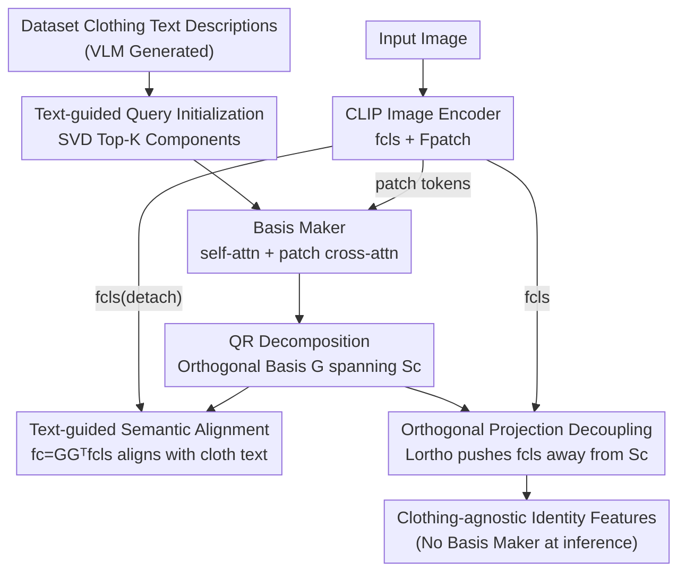

# Learning Instance-Adaptive Low-Rank Orthogonal Subspaces for Clothes-Changing Person Re-Identification

**Conference**: ICML2026  
**arXiv**: [2606.11661](https://arxiv.org/abs/2606.11661)  
**Code**: Undisclosed  
**Area**: Human Understanding / Person Re-Identification  
**Keywords**: Clothes-Changing Person Re-ID, Low-Rank Subspaces, Vision-Language Models, Orthogonal Projection, Decoupled Representation

## TL;DR
The "clothing" semantic concept is explicitly modeled as an **instance-adaptive low-rank subspace** (initialized using the SVD principal components of CLIP text descriptions and refined via cross-attention with image patches). Identity features are then forced to be strictly orthogonal to this subspace through geometric constraints, achieving SOTA results in clothes-changing re-identification (PRCC +5.9% Rank-1) without the need for adversarial training.

## Background & Motivation

**Background**: Clothes-Changing Person Re-Identification (CC-ReID) aims to recognize the same individual across different cameras even when they change clothes and their appearance varies significantly. In this context, prominent visual cues like "clothing color/style" become interference and must be stripped from the identity features. Mainstream approaches fall into two categories: those relying on external modalities (3D body shape, gait, pose) to supplement clothing-agnostic information, and those performing feature decoupling via adversarial learning, causal debiasing, or network architecture modifications. Recently, text-guided routes using CLIP text priors to supervise "clothing" semantics have emerged.

**Limitations of Prior Work**: Most existing methods **fail to explicitly exploit the geometric fact that the "clothing" concept in VLM representations inherently forms a low-rank linear structure**. They either crudely carve out a "clothing subspace" using a learned linear projection matrix or rely on adversarial objectives, which lack geometric interpretability and suffer from unstable training and difficult convergence. The most relevant method, DIFFER, also uses frozen CLIP text encoders for clothing supervision but still relies on adversarial learning rather than explicit low-rank subspace modeling.

**Key Challenge**: Recent research in representation learning suggests that high-level semantic concepts like "clothing" or "color" correspond to **structured low-dimensional linear subspaces** in the embedding space of large pre-trained VLMs. Since concepts are low-rank subspaces, they can be suppressed directly through geometric operations like orthogonal projection. However, existing CC-ReID methods bypass this clean geometric handle in favor of adversarial losses. The problem lies in defining the subspace: a fixed "clothing subspace" for the entire dataset is too coarse (given variations in visible areas, occlusions, and lighting), while a completely free-learned projection loses the semantic anchors of the CLIP text space.

**Goal**: ① Construct a low-rank clothing subspace for each query image that is both **semantically anchored and instance-adaptive**; ② Use geometric orthogonal constraints (instead of adversarial training) to push identity features away from this subspace.

**Key Insight**: The authors leverage two properties of VLM representations: first, clothing semantics can be captured by the principal components (SVD) of CLIP text embeddings, providing a semantically grounded global prior; second, this global prior can be refined instance-by-instance through cross-attention with local image patch tokens.

**Core Idea**: A Transformer-based **Basis Maker** refines "SVD-initialized learnable queries" into a set of orthogonal bases (ensured by QR decomposition) via cross-attention. These bases span the instance-adaptive clothing subspace. During training, identity features are constrained to be orthogonal to these bases. At inference, the Basis Maker is discarded, allowing the encoder to output clothing-agnostic features with zero additional cost.

## Method

### Overall Architecture

Ortho-ReID consists of three components: ① A CLIP image encoder (EVA-02-CLIP-L) that outputs the global CLS token $\mathbf{f}_{\text{cls}}$ and local patch tokens $\mathbf{F}_{\text{patch}}$; ② The **Basis Maker**, which learns an instance-adaptive clothing subspace $\mathcal{S}_c$ using cross-attention; ③ An orthogonal projection module that pushes identity features away from $\mathcal{S}_c$. During training, three losses work together: $\mathcal{L}_{\text{cloth}}$ aligns the component projected onto the clothing subspace with clothing text, $\mathcal{L}_{\text{reid}}$ handles identity discrimination, and $\mathcal{L}_{\text{ortho}}$ enforces geometric orthogonality between CLS features and the clothing component. A clever gradient isolation design is used: the Basis Maker "visualizes" what the clothes look like to the current encoder, while the encoder is pushed to "forget" the clothes; their goals are complementary but do not interfere due to the `detach` operation.

### Key Designs

**1. Text-guided SVD Query Initialization: Providing a grounded semantic prior**

A naive approach would randomly initialize the Basis Maker's queries to learn a clothing subspace from scratch, but this lacks semantic anchors in the CLIP space, leading to unstable optimization. Instead, the authors use a VLM (GPT-4o) to generate numerous natural language clothing descriptions for each dataset, encode them into $\{\mathbf{t}_c^{(i)}\}_{i=1}^M$ using a frozen CLIP text encoder, and perform Singular Value Decomposition (SVD) on these embeddings. The top $K$ principal components are taken as the initial values for the learnable queries:

$$\mathbf{Q}_{\text{init}}=\text{SVD}_K(\{\mathbf{t}_c^{(i)}\}_{i=1}^M)$$

This statistically identifies the dominant directions of the "clothing concept" in CLIP space, ensuring queries start in semantically meaningful low-dimensional regions. Crucially, the queries remain **fully learnable**, adapting from the text-based initialization to the specific clothing distribution and instance-level visual patterns of the target dataset.

**2. Patch-based Cross-attention Basis Maker + QR Orthogonalization: Refining global priors into instance-adaptive bases**

A fixed clothing prior is insufficient as clothing visibility, occlusions, and lighting vary per image. The Basis Maker uses a standard Transformer decoder (6 layers, 16 heads, $K=16$ queries): queries first exchange information via self-attention, then **attend to image patch tokens** (rather than just the CLS token) via multi-head cross-attention. Using patches preserves fine-grained spatial locality, capturing clothing features from different body regions and naturally focusing on visible areas during occlusion. The refined queries $\mathbf{Q}'$ are orthonormalized via QR decomposition:

$$\mathbf{G}=\text{QR}(\mathbf{Q}'^{\top})\quad\text{s.t.}\quad\mathbf{G}^{\top}\mathbf{G}=\mathbf{I}$$

$\mathbf{G}\in\mathbb{R}^{d\times K}$ represents the orthogonal basis for the clothing subspace $\mathcal{S}_c$. Orthonormalization forces each basis vector to capture independent, non-overlapping clothing attributes (color, texture, style), preventing redundancy.

**3. Text-guided Semantic Alignment (with Gradient Isolation): Training the Basis Maker without polluting the encoder**

To ensure the Basis Maker learns a subspace responsible for the clothing components in the CLS token, $\mathbf{f}_{\text{cls}}$ is projected onto $\mathcal{S}_c$ to extract the clothing component $\mathbf{f}_c=\mathbf{G}\mathbf{G}^{\top}\mathbf{f}_{\text{cls}}$, which is then aligned with corresponding clothing text embeddings using contrastive learning:

$$\mathcal{L}_{\text{cloth}}=-\frac{1}{B}\sum_{i=1}^{B}\log\frac{\exp(\cos(\mathbf{f}_c^{(i)},\mathbf{t}_c^{(i)})/\tau)}{\sum_{j=1}^{B}\exp(\cos(\mathbf{f}_c^{(i)},\mathbf{t}_c^{(j)})/\tau)}$$

Key detail: **$\mathbf{f}_{\text{cls}}$ is detached** when calculating this projection, so $\mathcal{L}_{\text{cloth}}$ only updates the Basis Maker. This separation of concerns allows the Basis Maker to "capture current clothing information" while the encoder is separately pushed to "remove clothing" via $\mathcal{L}_{\text{ortho}}$.

**4. Orthogonal Projection Decoupling Loss: Stripping clothing via geometric constraints**

With the subspace learned by the Basis Maker, a simple geometric loss is used to decouple identity from clothing by minimizing the squared dot product of the normalized CLS feature and the clothing component (where $\mathbf{G}$ is detached):

$$\mathcal{L}_{\text{ortho}}=\left\langle\frac{\mathbf{f}_{\text{cls}}}{\|\mathbf{f}_{\text{cls}}\|_2},\frac{\mathbf{f}_c}{\|\mathbf{f}_c\|_2}\right\rangle^2$$

Minimizing this normalized inner product forces the encoder to learn representations orthogonal to the clothing subspace. Compared to adversarial objectives, this is training-stable and geometrically interpretable.

### Loss & Training

The total loss optimizes the Basis Maker and encoder jointly: $\mathcal{L}_{\text{total}}=\mathcal{L}_{\text{cloth}}+\lambda_{\text{ortho}}\mathcal{L}_{\text{ortho}}+\lambda_{\text{reid}}\mathcal{L}_{\text{reid}}$. The ReID part is $\mathcal{L}_{\text{reid}}=\lambda_{id}\mathcal{L}_{id}+\lambda_{tri}\mathcal{L}_{tri}+\lambda_{intra}\mathcal{L}_{intra}$, where $\mathcal{L}_{intra}$ is a proposed intra-modal contrastive loss treating all clothes-changing variants of the same identity as uniform positive samples. All weights are set to $\lambda=1$. The encoder uses SGD ($lr=2\times10^{-6}$), and the Basis Maker uses Adam ($lr=2\times10^{-5}$) with a cosine schedule for 80 epochs on 2 A100 GPUs. No data augmentation, re-ranking, or post-processing is used.

## Key Experimental Results

### Main Results

Evaluated on 4 CC-ReID benchmarks (PRCC / LTCC / Celeb-reID-light / LaST), reporting Rank-1 and mAP.

| Dataset (Protocol) | Metric | Ortho-ReID | Prev. SOTA | Gain |
|--------------------|--------|------------|------------|------|
| PRCC (CC)          | R-1 / mAP | 74.4 / 70.2 | DIFFER 68.5 / 64.7 | +5.9 / +5.5 |
| LTCC (CC)          | R-1 / mAP | 56.1 / 30.2 | DIFFER 58.2 / 31.6 | Competitive |
| Celeb-reID-light   | R-1 / mAP | 79.1 / 59.0 | DIFFER 75.6 / 54.3 | +3.5 / +4.7 |
| LaST (228K id)     | R-1 / mAP | 84.3 / 53.5 | MADE 79.0 / 40.9 | +5.3 / +12.6 |

The method sets new SOTAs on PRCC, Celeb-reID-light, and LaST. On LTCC, it remains competitive with DIFFER.

### Ablation Study

| Configuration | PRCC R-1 | LTCC R-1 | Description |
|---------------|----------|----------|-------------|
| $\mathcal{L}_{\text{reid}}$ only | 70.6 | 52.2 | Standard ReID baseline |
| + $\mathcal{L}_{\text{ortho}}$ (Full) | 74.4 | 56.1 | Ortho loss adds +3.8 / +3.9 |
| Self-attn only (SVD) | 72.9 | 54.0 | No image patch attention |
| Self+Cross (CLS, SVD)| 72.5 | 53.3 | Attends to CLS only |
| Self+Cross (Patch, Random) | 72.3 | 52.5 | Patch with random init |
| Self+Cross (Patch, SVD) | 74.4 | 56.1 | Optimal (Full model) |

### Key Findings
- **Orthogonal loss is the core engine**: Adding $\mathcal{L}_{\text{ortho}}$ consistently improves results by +3.5–3.9% Rank-1, successfully regrouping features by identity rather than clothing color.
- **Patch cross-attention > CLS**: Fine-grained spatial interaction is crucial for capturing locally varying clothing, particularly in LTCC where clothing diversity is high.
- **SVD init + learnable queries are both necessary**: SVD provides a stable semantic start, while learnability allows adaptation to the target distribution. $K=16$ provides the optimal subspace rank.
- **QR decomposition prevents collapse**: Without it, basis vectors become highly correlated, leading to a drop in mAP.

## Highlights & Insights
- **Geometric Realization of Concepts**: Instead of adversarial "games," the discovery that concepts are low-rank subspaces is directly implemented as a geometric orthogonal projection, improving stability and interpretability.
- **Gradient Isolation for Complementary Goals**: The `detach` operation allows the Basis Maker to model interference while the encoder removes it, preventing them from destabilizing each other.
- **Training-only Overhead**: Since the Basis Maker is not used during inference, the model provides clothing-agnostic features with zero extra latency during deployment.
- **Value of Instance-Adaptivity**: Unlike fixed linear projection matrices, the cross-attention mechanism allows the clothing subspace to adapt per image, effectively handling visibility changes such as occlusions.

## Limitations & Future Work
- The method did not surpass DIFFER on LTCC, suggesting its advantages may narrow in scenarios with extreme clothing diversity (avg. 5 outfits per person).
- Reliance on an external VLM (GPT-4o) for generating descriptions creates a dependency on large secondary models.
- The subspace rank $K$ requires manual tuning (16 was optimal); adaptive $K$ for varying clothing diversity remains an open exploration.
- While effective for clothing, extending this to jointly decouple other concepts like background or viewpoint is a natural next step.

## Related Work & Insights
- **vs DIFFER (CVPR 25)**: Both use CLIP text supervision, but DIFFER relies on adversarial learning. Ortho-ReID uses explicit low-rank subspaces and geometric orthogonality, outperforming it on most benchmarks.
- **vs CSCI / Pathak & Rawat**: These also use orthogonal constraints but typically on fixed or heuristically defined subspaces. This work applies it to a **text-anchored, instance-adaptive** learned subspace.
- **vs Linear Projection VLM-ReID**: Earlier works used simple linear matrices to model clothing; this work uses the more expressive cross-attention Basis Maker for instance-adaptive modeling.

## Rating
- Novelty: ⭐⭐⭐⭐⭐ Translates "concepts = low-rank subspaces" into a clear geometric paradigm.
- Experimental Thoroughness: ⭐⭐⭐⭐ Extensive benchmarks and ablations provided.
- Writing Quality: ⭐⭐⭐⭐⭐ Clear progression from geometric intuition to mathematical formulation.
- Value: ⭐⭐⭐⭐ Provides a stable, interpretable template for decoupling representations that can be applied to other tasks.

<!-- RELATED:START -->

## Related Papers

- [\[CVPR 2026\] SSM-Aware Token-Efficient VMamba via Adaptive Patch Pruning and Merging for Person Re-Identification](../../CVPR2026/human_understanding/ssm-aware_token-efficient_vmamba_via_adaptive_patch_pruning_and_merging_for_pers.md)
- [\[CVPR 2026\] Spatial-Frequency Collaborative Learning for Occluded Visible-Infrared Person Re-Identification](../../CVPR2026/human_understanding/spatial-frequency_collaborative_learning_for_occluded_visible-infrared_person_re.md)
- [\[CVPR 2026\] Pose-guided Enriched Feature Learning for Federated-by-camera Person Re-identification](../../CVPR2026/human_understanding/pose-guided_enriched_feature_learning_for_federated-by-camera_person_re-identifi.md)
- [\[NeurIPS 2025\] DevFD: Developmental Face Forgery Detection by Learning Shared and Orthogonal LoRA Subspaces](../../NeurIPS2025/human_understanding/devfd_developmental_face_forgery_detection_by_learning_shared_and_orthogonal_lor.md)
- [\[AAAI 2026\] Modality-Aware Bias Mitigation and Invariance Learning for Unsupervised Visible-Infrared Person Re-Identification](../../AAAI2026/human_understanding/modality-aware_bias_mitigation_and_invariance_learning_for_unsupervised_visible-.md)

<!-- RELATED:END -->
