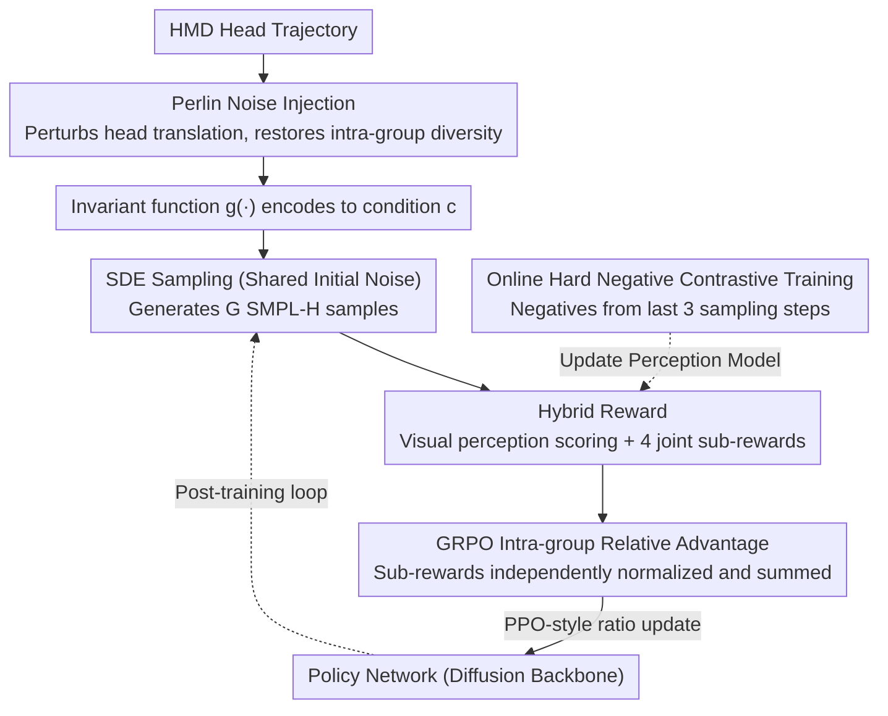

# MotionGRPO: Overcoming Low Intra-Group Diversity in GRPO-Based Egocentric Motion Recovery

**Conference**: ICML 2026  
**arXiv**: [2605.05680](https://arxiv.org/abs/2605.05680)  
**Code**: https://github.com/3DAgentWorld/MotionGRPO/ (Available)  
**Area**: Human Understanding / Egocentric 3D Motion Recovery / Diffusion Models + Reinforcement Learning  
**Keywords**: Full-body motion recovery, HMD, GRPO, Diffusion models, Perlin noise injection

## TL;DR
MotionGRPO reformulates egocentric full-body motion recovery from head-mounted devices (HMDs) as a Markov Decision Process (MDP) over diffusion sampling. It utilizes GRPO post-training with a hybrid reward system comprising a "trajectory-condition-aware perception model + 4 joint-level sub-rewards." Crucially, it identifies "vanishing advantage variance caused by strong input conditions and near-identical intra-group samples" as a fatal bottleneck. By injecting Perlin noise into conditions to restore intra-group diversity, it reduces MPJPE on AMASS/RICH from EgoAllo's 124.985 mm to 114.207 mm.

## Background & Motivation
**Background**: The mainstream approach for full-body motion recovery from HMDs (head SLAM signals) involves diffusion models (e.g., EgoEgo, EgoAllo). These use conditional diffusion to model the "distribution of possible human motions," performing reverse sampling starting from pure Gaussian noise.

**Limitations of Prior Work**: (1) The diffusion objective is essentially distribution matching, which lacks strong constraints on individual joint positions, leading to artifacts like joint offsets, foot skating, floor penetration, and jitter. (2) These visual/geometric flaws cannot be easily addressed by adding simple losses within the diffusion framework—early timesteps are mostly noise, and applying joint losses directly causes training instability. (3) Existing RL solutions (e.g., PPO trained in physical simulators) are unstable and computationally expensive.

**Key Challenge**: The trade-off lies between distribution matching (poor precision) and RL (unstable/expensive). GRPO appears to be an elegant RL variant that omits value networks, but the authors found that "motion recovery tasks are heavily conditioned → intra-group outputs are nearly identical → advantage std ≈ 0 → vanishing gradients," causing vanilla GRPO to fail.

**Goal**: (1) Introduce GRPO into diffusion-based motion recovery with meaningful hybrid rewards; (2) Overcome the new bottleneck of "low intra-group diversity leading to gradient disappearance."

**Key Insight**: The authors view diffusion sampling as a multi-step MDP where the state is $(c,t,x_t)$, the action is $x_{t-1}$, and a sparse reward is given only at $t=0$. They propose an inverse approach: since strong conditioning causes low output diversity, noise should be injected into the *condition* to restore the variance required for GRPO.

## Method

### Overall Architecture
MotionGRPO addresses HMD-based egocentric motion recovery by treating the entire diffusion sampling process as a multi-step MDP and performing RL post-training on a pre-trained EgoAllo model. The input is the HMD CPF head trajectory $\mathbf{H}_{cpf}^{1:T}=\{R^{1:T},\tau^{1:T}\}$, transformed by EgoAllo's invariant function $g(\cdot)$ into a condition $\mathbf{c}$. The diffusion backbone uses a transformer to output SMPL-H representations $\mathbf{M}=\{\Theta,\beta\}$. During post-training, the model generates a group of samples for each condition using SDE reverse sampling with shared initial noise. Samples are scored using a "learned visual perception model + 4 joint-level geometric metrics." Advantages are computed via intra-group relative normalization, and the policy is updated using a PPO-style importance ratio. Simultaneously, Perlin noise is injected into head conditions to restore the intra-group variance necessary for GRPO.

### Key Designs

**1. Hybrid Reward: Learned Visual Perception Model + 4 Joint Sub-rewards for "Naturalness" and "Accuracy"**

Since diffusion objectives do not strongly constrain individual joints, predictions often suffer from artifacts like foot skating or penetration which are hard to penalize via standard losses. Leveraging GRPO's ability to optimize non-differentiable objectives, MotionGRPO splits rewards into two paths. For the visual level, a trajectory-conditioned perception model $\phi$ (with spatial and temporal attention transformers) inputs the SMPL-H skeleton and head trajectory to output a plausibility score. The reward $\mathcal{R}_{vis}=\exp(\omega_{vis}\cdot s)$ specifically targets artifacts like jitter and floor penetration. The joint level directly aligns with GT using four metrics: $\mathcal{R}_{rot}$ (local rotation L1), $\mathcal{R}_{pos}$ (global position L2), $\mathcal{R}'_{pos}$ (per-frame Procrustes-aligned position L2), and $\mathcal{R}_{vel}$ (velocity difference L2), all mapped to $(0,1]$ via $\exp(-\omega\cdot\text{err})$.

Crucially, each sub-reward undergoes independent intra-group relative normalization to compute sub-advantages, which are then summed: $\hat A_i=\sum_k \hat A_{i,k}$. The total reward is $\mathcal{R}_{total}=\mathcal{R}_{vis}+\mathcal{R}_{joint}$. This ensures both visual naturalness and joint precision are optimized simultaneously.

**2. Online Hard Negative Contrastive Training to Prevent Reward Hacking**

A static perception model is prone to reward hacking by the policy. MotionGRPO evolves the perception model alongside the policy: positive samples are (GT motion, head), while hard negatives are sampled in real-time from the last 3 timesteps of the current policy's reverse sampling. These negatives are structurally similar to GT but contain the policy's typical flaws, making them "hard negatives." Training uses InfoNCE with temperature $\delta=0.07$:

$$\mathcal{L}_{NCE}=-\mathbb{E}\log\frac{\exp(\phi(J^+|H^+)/\delta)}{\exp(\phi(J^+|H^+)/\delta)+\sum_i\exp(\phi(J_i^-|H_i^-)/\delta)}$$

**3. Perlin Noise Injection into Head Conditions to Solve GRPO's Low Diversity Bottleneck**

This is the central diagnosis of the paper. Motion recovery is dominated by a strong condition $\mathbf{c}$. Samples generated under the same condition are often nearly identical, causing the advantage denominator $\sigma$ in $\hat A_i=(\mathcal{R}_i-\mu)/\sigma$ to approach zero, leading to numerical explosion or vanishing gradients. The solution is to inject temporally continuous Perlin noise $\mathcal{P}(t)$ into head translations: $\tilde{\mathbf{H}}=\{R,\tau+\lambda\mathcal{P}(t)\}$. This produces slightly out-of-distribution perturbed conditions, restoring output variance and non-zero $\sigma$. 

Perlin noise is preferred over Gaussian white noise because white noise introduces high-frequency jitter that violates the physical prior of smooth head movement. Perlin noise is naturally smooth and frequency-controllable.

### Loss & Training
The GRPO objective is $\mathcal{J}_{GRPO}(\theta)=\mathbb{E}\left[\frac{1}{G}\sum_i\frac{1}{n}\sum_t \frac{\pi_\theta(o_{i,t}|\mathbf{c})}{\pi_{old}(o_{i,t}|\mathbf{c})}\hat A_i\right]$, with sparse rewards at $t=0$. The training loop: sample a batch → duplicate old policy → inject Perlin noise into head conditions → SDE sampling with shared noise to get $G$ samples → compute $\mu/\sigma$ for sub-rewards → compute advantages → importance-weighted update across $n$ sampling steps. The perception model and policy are updated iteratively.

## Key Experimental Results

### Main Results

| Dataset | Method | MPJPE↓(mm) | PA-MPJPE↓(mm) | MPJVE↓(mm) | MPJRE↓(°) | Jitter↓ | GP↓(m) | FS↓(m) |
|--------|------|-----------|---------------|-------------|------------|---------|--------|--------|
| AMASS | EgoEgo | 177.231 | 152.125 | 588.661 | 9.457 | 2.643 | 1.331 | 1.241 |
| AMASS | EgoAllo | 124.985 | 103.958 | 553.221 | 8.777 | 2.394 | 1.143 | 1.290 |
| AMASS | EgoAllo$^\aleph$ (w/ TTO) | 121.651 | 101.034 | 483.471 | 8.728 | 1.455 | 1.099 | 0.479 |
| AMASS | **MotionGRPO** | **114.207** | **95.512** | 531.217 | **8.413** | 2.000 | **0.901** | 1.169 |
| AMASS | **MotionGRPO$^\aleph$** | **111.776** | **93.702** | **461.702** | **8.330** | **1.309** | 0.963 | **0.399** |
| RICH | EgoAllo | 192.686 | 172.724 | 506.992 | 12.734 | 4.135 | 4.145 | 1.094 |
| RICH | **MotionGRPO$^\aleph$** | **184.992** | **167.032** | **378.423** | **11.886** | **1.614** | **3.156** | **0.199** |

### Ablation Study

| Configuration | Key Metrics | Explanation |
|------|---------|------|
| Vanilla GRPO (No Perlin) | Intra-group dev ≈ 0, Adv std ≈ 0, loss stagnation | Validates the "vanishing gradient" hypothesis |
| Visual-only / Joint-only Reward | Good visuals but limited MPJPE gain / vice versa | Hybrid rewards are necessary |
| Online Negatives vs Static Negatives | Online negatives make model sensitive to policy-typical flaws | Prevents reward hacking |
| Perlin noise scaling $\lambda$ | Optimal $\lambda$ balance between diversity and priors | High $\lambda$ breaks priors, low $\lambda$ lacks diversity |

### Key Findings
- "Low intra-group diversity → vanishing advantage variance" is a critical bottleneck when moving GRPO from generation to reconstruction tasks.
- The combination of a learned perception model and explicit joint metrics suppresses artifacts better than manual loss terms.
- Test-time optimization ($\aleph$) further reduces Jitter (2.0 to 1.3) and Foot Skating (1.17 to 0.40), showing its complementarity with MotionGRPO's post-training.

## Highlights & Insights
- Provides a clear mathematical diagnosis for why GRPO fails in reconstruction tasks ($\sigma \to 0$ in the advantage formula), which is applicable to any RL task with strong constraints.
- Choosing Perlin noise over Gaussian is a highly domain-aware decision, preserving temporal smoothness and physical priors.
- Online contrastive reward modeling adopts a self-play mindset to solve reward hacking, transferable to other diffusion tasks like video generation or TTS.
- The framework serves as a paradigm for "Diffusion + RLHF" in structured reconstruction tasks.

## Limitations & Future Work
- Evaluation primarily uses synthetic (AMASS) and semi-real (RICH) data; lacks large-scale validation in real-world complex scenarios (e.g., Project Aria).
- The Perlin noise scale $\lambda$ is a manually tuned hyperparameter without an adaptive mechanism.
- The stability of online contrastive training depends on the policy's evolution speed.
- It does not yet fully utilize egocentric images or hand observations.

## Related Work & Insights
- **vs EgoAllo (Yi et al., 2025)**: MotionGRPO uses EgoAllo as a base policy and achieves ~8% MPJPE reduction via RL post-training alone.
- **vs PPO in Physical Simulators**: Traditional RL in physics simulators is slow and unstable; GRPO combined with diffusion SDE sampling is significantly more efficient.
- **vs DDPO / DPO for Image Generation**: While image generation has natural diversity, this work's core contribution is "adding back" diversity for reconstruction.

## Rating
- Novelty: ⭐⭐⭐⭐ One of the first to bring GRPO to diffusion motion recovery and solve the "low diversity" issue effectively.
- Experimental Thoroughness: ⭐⭐⭐⭐ Solid main results and ablations, though direct comparisons with PPO or DPO routes are missing.
- Writing Quality: ⭐⭐⭐⭐ Clearly articulates why GRPO fails; pipeline and pseudocode are well-presented.
- Value: ⭐⭐⭐⭐ Directly relevant to VR/AR tracking and the "Diffusion + RL post-training" paradigm.

<!-- RELATED:START -->

1. **EgoAllo**: Yi et al., "Egocentric Whole-body Motion Capture with Allo-centric Prior," CVPR 2025.
2. **GRPO**: Shao et al., "DeepSeekMath: Pushing the Limits of Mathematical Reasoning in Open Language Models," arXiv 2024.
3. **EgoEgo**: Li et al., "EgoEgo: Estimated Global Pose Case Study for Egocentric 3D Human Pose Estimation," ICCV 2023.

<!-- RELATED:END -->

## Related Papers

- [\[CVPR 2026\] Mocap-2-to-3: Multi-view Lifting for Monocular Motion Recovery with 2D Pretraining](../../CVPR2026/human_understanding/mocap-2-to-3_multi-view_lifting_for_monocular_motion_recovery_with_2d_pretrainin.md)
- [\[CVPR 2026\] EgoPoseFormer v2: Accurate Egocentric Human Motion Estimation for AR/VR](../../CVPR2026/human_understanding/egoposeformer_v2_accurate_egocentric_human_motion_estimation_for_arvr.md)
- [\[CVPR 2026\] Natural Human Motion Recovery by Aligning High-Order Temporal Dynamics from Monocular Videos](../../CVPR2026/human_understanding/natural_human_motion_recovery_by_aligning_high-order_temporal_dynamics_from_mono.md)
- [\[CVPR 2025\] HumanMM: Global Human Motion Recovery from Multi-shot Videos](../../CVPR2025/human_understanding/humanmm_global_human_motion_recovery_from_multi-shot_videos.md)
- [\[CVPR 2026\] Forecasting 3D Scanpaths in Egocentric Video](../../CVPR2026/human_understanding/forecasting_3d_scanpaths_in_egocentric_video.md)

<!-- RELATED:END -->
