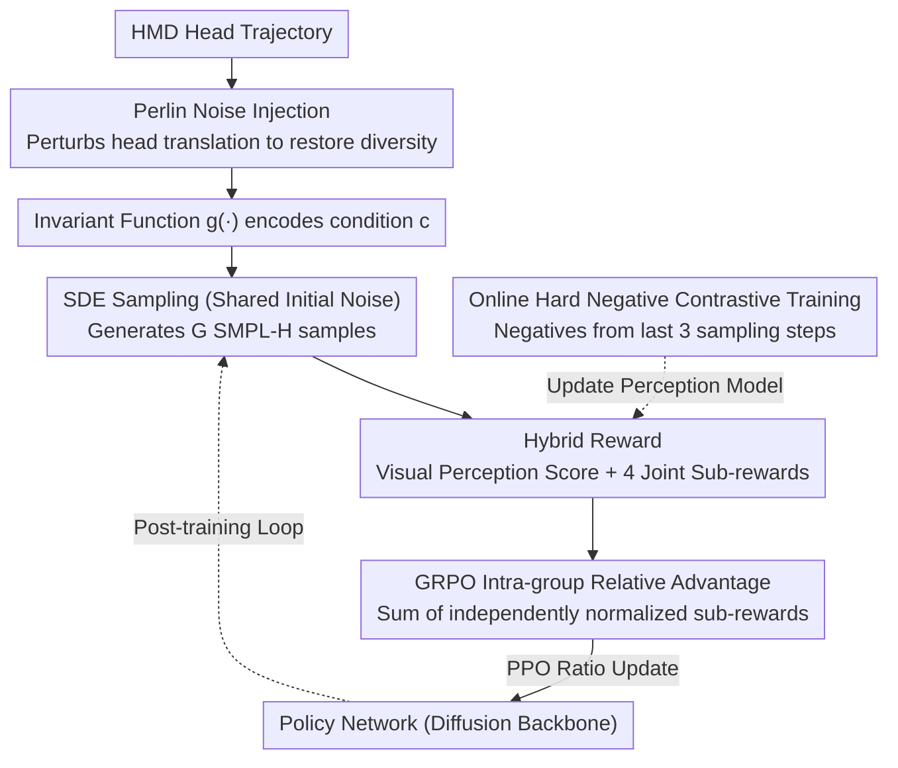

# MotionGRPO: Overcoming Low Intra-Group Diversity in GRPO-Based Egocentric Motion Recovery

**Conference**: ICML 2026  
**arXiv**: [2605.05680](https://arxiv.org/abs/2605.05680)  
**Code**: https://github.com/3DAgentWorld/MotionGRPO/ (Available)  
**Area**: Human Understanding / First-Person 3D Motion Recovery / Diffusion Models + Reinforcement Learning  
**Keywords**: Full-body Motion Recovery, HMD, GRPO, Diffusion Model, Perlin Noise Injection

## TL;DR
MotionGRPO reformulates first-person full-body motion recovery from head-mounted devices as a Markov Decision Process (MDP) over diffusion sampling. It utilizes Group Relative Policy Optimization (GRPO) post-training with a hybrid reward system consisting of a "trajectory condition-aware perception model + 4 joint-level sub-rewards." Crucially, it identifies that strong input conditions lead to nearly identical intra-group samples, causing advantage variance to vanish—a fatal bottleneck. To resolve this, it injects Perlin noise into the conditioning signal to restore intra-group diversity, reducing MPJPE from EgoAllo's 124.985 mm to 114.207 mm on AMASS/RICH.

## Background & Motivation
**Background**: The mainstream approach for first-person (HMD) full-body motion recovery relies on diffusion models based on head-SLAM signals (e.g., EgoEgo, EgoAllo). These models use conditional diffusion to simulate the "distribution of possible human motions," performing reverse sampling from pure Gaussian noise.

**Limitations of Prior Work**: (1) The diffusion objective is essentially distribution matching, which lacks strong constraints on individual joint positions, often resulting in joint offsets, foot skating, floor penetration, and jitter. (2) These visual/geometric artifacts cannot be easily addressed by adding losses within the diffusion framework—early timesteps are dominated by noise, and imposing hard joint losses leads to instability. (3) Existing RL solutions (e.g., training PPO in physical simulators) are unstable and computationally expensive.

**Key Challenge**: There is a trade-off between distribution matching (poor precision) and RL (unstable/expensive). While GRPO is an elegant RL framework that eliminates the value-net, the authors found that the "strong conditioning in motion recovery leads to nearly identical intra-group outputs → advantage std ≈ 0 → vanishing gradient," causing vanilla GRPO to fail.

**Goal**: (1) Integrate GRPO into diffusion-based motion recovery with meaningful hybrid rewards; (2) Overcome the new bottleneck of "low intra-group diversity causing vanishing gradients."

**Key Insight**: Diffusion sampling is viewed as a multi-step MDP where the state is $(c, t, x_t)$ and the action is $x_{t-1}$, with a sparse reward provided only at $t=0$. The research identifies that "strong conditions are the root cause of low output diversity," leading to the counter-intuitive approach of injecting noise into the condition.

**Core Idea**: SDE-based diffusion sampling with shared initial noise is used to generate a group of samples. Rewards are calculated via a perception model and 4 joint metrics. Spatio-temporally smooth Perlin noise is injected into the head condition to restore the intra-group variance required for GRPO.

## Method

### Overall Architecture
MotionGRPO addresses HMD first-person full-body motion recovery by treating the entire diffusion sampling process as a multi-step MDP, followed by RL post-training on a pre-trained EgoAllo model. The input consists of the HMD's CPF head trajectory $\mathbf{H}_{cpf}^{1:T}=\{R^{1:T},\tau^{1:T}\}$, converted into condition $\mathbf{c}$ via EgoAllo's invariant function $g(\cdot)$. The diffusion backbone uses a transformer to output the SMPL-H representation $\mathbf{M}=\{\Theta,\beta\}$. In the post-training phase, the model first performs SDE reverse sampling for each condition with shared initial noise to produce a group of samples. These samples are scored using a "learned visual perception model + 4 joint-level geometric metrics." Advantages are computed via intra-group relative normalization as per GRPO, and the policy is updated using PPO-style importance ratios. Simultaneously, Perlin noise is injected into the head condition to re-establish intra-group variance.

### Key Designs

**1. Hybrid Reward: Learned Visual Perception Model + 4 Joint Sub-rewards for both "Naturalness" and "Accuracy"**

Since the diffusion objective focuses on distribution matching, it lacks strong constraints on individual joints, often leading to artifacts like foot skating or jitter that are difficult to penalize via standard diffusion losses. MotionGRPO leverages GRPO's ability to optimize non-differentiable objectives by splitting rewards. The visual level uses a trajectory-conditioned perception model $\phi$ (spatial-temporal attention transformer) that inputs the SMPL-H skeleton and head trajectory to output a plausibility score, corresponding to reward $\mathcal{R}_{vis}=\exp(\omega_{vis}\cdot s)$. This specifically targets artifacts like "foot skating," "jitter," and "penetration." The joint level directly aligns with ground truth (GT) via four terms: $\mathcal{R}_{rot}$ (local rotation L1), $\mathcal{R}_{pos}$ (global position L2), $\mathcal{R}'_{pos}$ (per-frame Procrustes aligned position L2), and $\mathcal{R}_{vel}$ (velocity difference L2), all mapped to $(0,1]$ via $\exp(-\omega\cdot\text{err})$.

A key design is the normalization method: each sub-reward undergoes independent intra-group relative normalization to produce sub-advantages, which are then summed: $\hat A_i=\sum_k \hat A_{i,k}$, where total reward is $\mathcal{R}_{total}=\mathcal{R}_{vis}+\mathcal{R}_{joint}$. This allows visual naturalness and joint accuracy to be optimized simultaneously.

**2. Online Hard Negative Contrastive Training to Prevent Reward Hacking**

A static perception model is vulnerable to reward hacking by the policy. MotionGRPO evolves the perception model alongside the policy. While GT motion serves as positive samples, hard negatives are sampled in real-time from the current policy's last 3 sampling timesteps. These samples structurally resemble GT but contain the policy's current typical artifacts, making them "difficult but necessary to penalize." Training uses InfoNCE with temperature $\delta=0.07$:

$$\mathcal{L}_{NCE}=-\mathbb{E}\log\frac{\exp(\phi(J^+|H^+)/\delta)}{\exp(\phi(J^+|H^+)/\delta)+\sum_i\exp(\phi(J_i^-|H_i^-)/\delta)}$$

**3. Perlin Noise Injection into Head Conditions to Solve Low Intra-Group Diversity**

This is the study's most critical diagnosis. Motion recovery is dominated by a strong condition $\mathbf{c}$. Samples generated under the same condition are often nearly identical, causing the advantage formula $\hat A_i=(\mathcal{R}_i-\mu)/\sigma$ to explode as $\sigma\to 0$, leading to vanishing gradients. The solution involves injecting temporally continuous Perlin noise $\mathcal{P}(t)$ into the head translation to get a perturbed input $\tilde{\mathbf{H}}=\{R,\tau+\lambda\mathcal{P}(t)\}$. This produces slightly out-of-distribution conditions, restoring output variance and ensuring $\sigma$ is non-zero. Perlin noise is chosen over white noise because it preserves temporal smoothness and physical priors of head movement.

### Loss & Training
The GRPO objective is $\mathcal{J}_{GRPO}(\theta)=\mathbb{E}\left[\frac{1}{G}\sum_i\frac{1}{n}\sum_t \frac{\pi_\theta(o_{i,t}|\mathbf{c})}{\pi_{old}(o_{i,t}|\mathbf{c})}\hat A_i\right]$ (with clip and KL terms omitted), where rewards are sparse at $t=0$. The algorithm loop: sample a batch → copy old policy → inject Perlin noise → perform SDE sampling with shared noise to get $G$ samples → compute $\mu/\sigma$ for sub-rewards → calculate advantage → perform importance-weighted updates across $n$ sampling steps.

## Key Experimental Results

### Main Results

| Dataset | Method | MPJPE↓(mm) | PA-MPJPE↓(mm) | MPJVE↓(mm) | MPJRE↓(°) | Jitter↓ | GP↓(m) | FS↓(m) |
|--------|------|-----------|---------------|-------------|------------|---------|--------|--------|
| AMASS | EgoEgo | 177.231 | 152.125 | 588.661 | 9.457 | 2.643 | 1.331 | 1.241 |
| AMASS | EgoAllo | 124.985 | 103.958 | 553.221 | 8.777 | 2.394 | 1.143 | 1.290 |
| AMASS | EgoAllo$^\aleph$ (test-time opt) | 121.651 | 101.034 | 483.471 | 8.728 | 1.455 | 1.099 | 0.479 |
| AMASS | **Ours** | **114.207** | **95.512** | 531.217 | **8.413** | 2.000 | **0.901** | 1.169 |
| AMASS | **Ours$^\aleph$** | **111.776** | **93.702** | **461.702** | **8.330** | **1.309** | 0.963 | **0.399** |
| RICH | EgoAllo | 192.686 | 172.724 | 506.992 | 12.734 | 4.135 | 4.145 | 1.094 |
| RICH | **Ours$^\aleph$** | **184.992** | **167.032** | **378.423** | **11.886** | **1.614** | **3.156** | **0.199** |

### Ablation Study

| Config | Key Metrics | Explanation |
|------|---------|------|
| Vanilla GRPO (No Perlin) | Intra-group diversity near 0, loss doesn't converge | Confirms "low diversity → vanishing gradient" hypothesis. |
| Visual Reward Only / Joint Reward Only | Improved visual quality but lower MPJPE gain / vice versa | Hybrid reward is necessary for both metrics. |
| Online Negatives vs. Static Negatives | Policy-typical artifacts caught better | Prevents reward hacking and stabilizes long-term training. |

### Key Findings
- "Low intra-group diversity → vanishing advantage variance" is a structural deadlock when applying GRPO to reconstruction tasks. This work is among the first to solve it.
- The combination of a learned perception model and explicit joint metrics is more effective at suppressing "visibly wrong" artifacts like foot skating than manual loss terms.
- Test-time optimization ($\aleph$) further reduces Jitter (2.0 to 1.3) and FS (1.17 to 0.40), showing that MotionGRPO post-training is complementary to refinement techniques.

## Highlights & Insights
- Provides a clear mathematical diagnosis of GRPO's failure in reconstruction tasks ($\sigma \to 0$), applicable to any RL + strong-constraint task.
- Using Perlin noise instead of Gaussian is a domain-aware choice that preserves the temporal smoothness/physical priors of human motion.
- Online contrastive reward modeling adopts self-play concepts to solve reward hacking, a strategy transferable to other hard-to-score diffusion tasks like video generation.
- The paradigm (Diffusion Pre-training + RL Post-training with hybrid rewards) serves as a template for structured tasks in the "Diffusion + RLHF" era.

## Limitations & Future Work
- Evaluation is primarily on synthetic device poses (AMASS) and semi-real data (RICH); large-scale validation on real-world corner cases (complex lighting, multi-person) is needed.
- The Perlin noise scale $\lambda$ is a manual hyperparameter; an adaptive mechanism could be more robust.
- Reliance on head trajectory alone ignores potential multi-modal cues like egocentric images or hand observations.

## Related Work & Insights
- **vs EgoAllo (Yi et al., 2025)**: Ours uses EgoAllo as a base policy and achieves ~8% MPJPE reduction via RL post-training, showing significant untapped potential in pre-trained priors.
- **vs PPO in Simulators**: Traditional physics-based RL is slow; MotionGRPO trains directly in the action space via diffusion SDE sampling, offering much higher efficiency.
- **vs DDPO/DPO**: Unlike image generation where diversity is inherent, this work highlights the unique challenge of "restoring diversity" in reconstruction tasks.

## Rating
- Novelty: ⭐⭐⭐⭐ First to apply GRPO to diffusion motion recovery and solve the "low diversity" bottleneck via Perlin injection.
- Experimental Thoroughness: ⭐⭐⭐⭐ Comprehensive testing on AMASS/RICH, though direct comparison with PPO/Simulator-based RL is missing.
- Writing Quality: ⭐⭐⭐⭐ Clear explanation of the GRPO failure mechanism with proper pipeline and notation.
- Value: ⭐⭐⭐⭐ Significant for VR/AR tracking and the "Diffusion + RL" paradigm.

<!-- RELATED:START -->

## Related Papers

- [\[CVPR 2026\] Mocap-2-to-3: Multi-view Lifting for Monocular Motion Recovery with 2D Pretraining](../../CVPR2026/human_understanding/mocap-2-to-3_multi-view_lifting_for_monocular_motion_recovery_with_2d_pretrainin.md)
- [\[ICML 2026\] Learning Instance-Adaptive Low-Rank Orthogonal Subspaces for Clothes-Changing Person Re-Identification](learning_instance-adaptive_low-rank_orthogonal_subspaces_for_clothes-changing_pe.md)
- [\[CVPR 2026\] EgoPoseFormer v2: Accurate Egocentric Human Motion Estimation for AR/VR](../../CVPR2026/human_understanding/egoposeformer_v2_accurate_egocentric_human_motion_estimation_for_arvr.md)
- [\[CVPR 2025\] HumanMM: Global Human Motion Recovery from Multi-shot Videos](../../CVPR2025/human_understanding/humanmm_global_human_motion_recovery_from_multi-shot_videos.md)
- [\[CVPR 2026\] Forecasting 3D Scanpaths in Egocentric Video](../../CVPR2026/human_understanding/forecasting_3d_scanpaths_in_egocentric_video.md)

<!-- RELATED:END -->
## Related Papers

- [\[CVPR 2026\] Mocap-2-to-3: Multi-view Lifting for Monocular Motion Recovery with 2D Pretraining](../../CVPR2026/human_understanding/mocap-2-to-3_multi-view_lifting_for_monocular_motion_recovery_with_2d_pretrainin.md)
- [\[CVPR 2026\] EgoPoseFormer v2: Accurate Egocentric Human Motion Estimation for AR/VR](../../CVPR2026/human_understanding/egoposeformer_v2_accurate_egocentric_human_motion_estimation_for_arvr.md)
- [\[CVPR 2025\] HumanMM: Global Human Motion Recovery from Multi-shot Videos](../../CVPR2025/human_understanding/humanmm_global_human_motion_recovery_from_multi-shot_videos.md)
- [\[CVPR 2026\] Forecasting 3D Scanpaths in Egocentric Video](../../CVPR2026/human_understanding/forecasting_3d_scanpaths_in_egocentric_video.md)
- [\[CVPR 2025\] Ego4o: Egocentric Human Motion Capture and Understanding from Multi-Modal Input](../../CVPR2025/human_understanding/ego4o_egocentric_human_motion_capture_and_understanding_from_multi-modal_input.md)

<!-- RELATED:END -->
