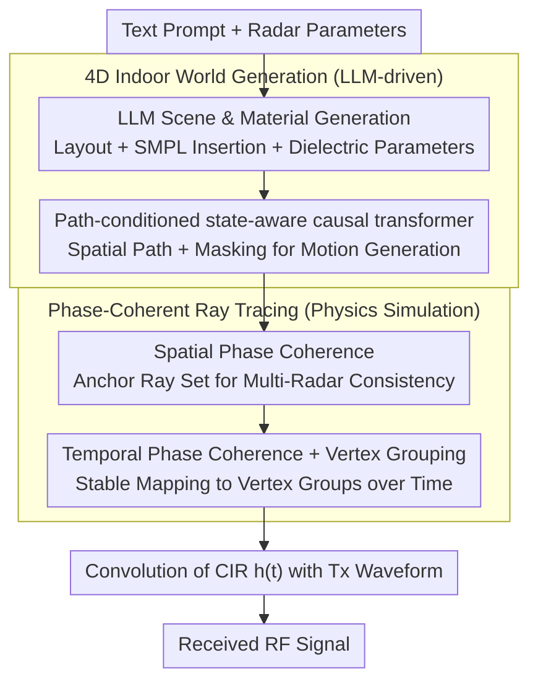

# WaveVerse: Scalable RF Simulation in Generative 4D Worlds

**Conference**: ICML 2026  
**arXiv**: [2508.12176](https://arxiv.org/abs/2508.12176)  
**Code**: Open-sourced (provided on paper webpage)  
**Area**: Signal and Communication / RF Sensing / Simulation Data Generation  
**Keywords**: RF Sensing, mmWave, Phase-Coherent Ray Tracing, 4D World Generation, Human Motion Generation

## TL;DR
WaveVerse integrates LLM-driven "4D indoor scene + human motion" generation with a physics-based ray tracer that preserves spatio-temporal phase coherence into a prompt-to-RF signal pipeline. Synthetic data significantly enhances downstream RF imaging and activity recognition tasks, with performance scaling continuously with simulation volume, unlike existing methods that saturate.

## Background & Motivation
**Background**: RF (Radio Frequency/mmWave) sensing is a privacy-friendly, occlusion-resistant, and low-visibility-robust sensing modality used for 3D imaging, human activity recognition (HAR), and respiration/sleep monitoring. However, RF data collection requires covering diverse room layouts, populations, and actions, which is hardware-expensive. Due to variations in bandwidth, antenna arrays, and modulation across RF systems, data is rarely reusable, resulting in the lack of a unified benchmark like ImageNet in the RF community.

**Limitations of Prior Work**: Existing mitigation strategies fall into two categories: pure physical simulation (Vid2Doppler, Midas, etc.), which only models signal-human interaction while ignoring environmental multipath (a major factor limiting RF generalization); and learned synthesis (RF Genesis, RF-Diffusion), which generates realistic signals but relies on large real-world training datasets and is tied to specific radar configurations, requiring retraining for new hardware. Professional full-wave solvers like HFSS offer high accuracy but take >1 hour per simulation, failing to scale for dynamic indoor scenes.

**Key Challenge**: To achieve scalability, the system must automatically produce "diverse environments × diverse motions × diverse radar hardware" at low cost. To be learnable, it must preserve the phase information essential for RF target differentiation. Existing simulators sacrifice either environmental complexity or phase coherence.

**Goal**: This work decomposes the challenge into two sub-problems: (1) How to populate LLM-generated rooms with spatially reasonable and diverse human behaviors without requiring manually drawn time-indexed trajectories? (2) How to perform ray tracing on room geometry such that phases are continuous and comparable between adjacent radar positions and timestamps?

**Key Insight**: The authors relax motion generation from "time-indexed trajectory" to "spatial path"—specifying the route without determining the exact timing. For signal simulation, instead of random ray sampling common in graphics, they use a fixed set of rays anchored to a reference radar and geometrically transformed to other radars, ensuring surface intersection stability.

**Core Idea**: A path-conditioned autoregressive transformer unlocks scalable environment-aware motion generation, followed by phase-coherent ray tracing that replaces "graphics-style sampling" with "communication-style propagation paths." These components form the WaveVerse generation-simulation pipeline.

## Method

### Overall Architecture
WaveVerse translates "a textual prompt + a set of radar parameters" into an RF received signal with usable phase. It splits the process into generation and simulation: the first half uses an LLM to build a 4D indoor world with people, actions, and materials; the second half "illuminates" this world into signals using a phase-coherent ray tracer. Specifically, text is processed via a scene generator (Yang et al., 2024) into a semantic mesh environment, followed by SMPL human insertion (shape parameters inferred by a fine-tuned BodyShapeGPT). The LLM provides action descriptions and start/end points; path planning generates $L=64$ 2D waypoints, and a state-aware causal transformer generates VQ-VAE encoded motion tokens. Each object is assigned one of 24 materials with specific dielectric properties. Given this dynamic world, the phase-coherent ray tracer outputs the channel impulse response $h(t)=\sum_k a_k G_{\text{Tx}}(\theta_k) G_{\text{Rx}}(\varphi_k)\delta(t-\tau_k)$ under given Tx/Rx parameters, which is convolved with the transmitted waveform to obtain the received signal.

### Key Designs

**1. Path-conditioned state-aware causal transformer: Relaxing constraints from "time" to "spatial path"**

Previous methods used time-indexed trajectories to constrain "where, when, and how fast," which requires frame-by-frame labeling and over-constrains diversity. This work uses only a spatial path (defining the line, not the arrival time), delegating rhythm and style to the generative model. Actions are quantized into tokens $X=[m_1,\dots,m_n,m_{\text{end}}]$ by a VQ-VAE. CLIP encodes text and MLPs encode 2D waypoints as conditions $c$. To prevent path deviation under relaxed constraints, the next-token probability $P(m_n\mid c, m_{<n})$ is rewritten as $P(m_n\mid c, m_0, s_0, \dots, m_{n-1}, s_{n-1})$, where $s_i$ is the Pelvis 2D position at the token's end frame, anchoring each prediction to the current spatial state. During training, waypoints are randomly masked at a ratio $r\in[0.5,0.9]$ to force the model to focus on the text rather than just the path.

**2. Spatial Phase Coherence: Isolating geometric phase shifts from sampling noise**

Traditional graphics ray tracing samples rays randomly for each radar. Consequently, two nearly overlapping radars might hit different surface points, introducing random phase noise that causes "ghosting" in beamforming. This work shares a set of "anchor" rays across $N$ radar poses $(\mathbf{t}_n,\mathbf{r}_n)$: a reference radar at the geometric center $(\mathbf{t}_0,\mathbf{r}_0)$ emits rays uniformly. For other radars, the endpoints are updated to $(\mathbf{t}_n,\mathbf{r}_n)$ while intermediate reflection points $\mathbf{p}_d$ are kept constant. After occlusion checks, the delay $\tau_k$, attenuation, and phase are recomputed. This ensures phase differences strictly correspond to geometric path differences, enabling accurate beamforming focus.

**3. Temporal Phase Coherence + Vertex Grouping: Enabling continuous phase evolution on dynamic humans**

When a human mesh deforms, random sampling per frame leads to hits on different skin patches, breaking phase continuity even for the $\mu$m–mm shifts required for Doppler and respiration sensing. WaveVerse partitions SMPL mesh vertices $\mathcal{V}$ into $G$ semantic/spatial groups using $\mathcal{G}:\mathcal{V}\to\{1,\dots,G\}$. When a ray hits $\mathbf{p}_d^{(t)}$ at frame $t$, it is expanded into a bundle of rays targeting all vertices $\mathbf{v}_m$ within the same group. Attenuations are normalized by the number of valid paths $N_{\text{valid}}$. Locking to vertex groups ensures stable phase evolution, supporting sub-millimeter signal inversion.

### Loss & Training
The motion token VQ-VAE uses standard reconstruction and codebook losses. The causal transformer utilizes next-token cross-entropy with path-masking augmentation (masking ratio $r\in[0.5,0.9]$, sequence length 5). Ray tracing is purely physical. The dielectric library consists of 24 materials proposed by the LLM and filtered by literature-based physical bounds.

## Key Experimental Results

### Main Results: Motion Generation Benchmark (HumanML3D)

| Method | Architecture | R-Prec ↑ | FID ↓ | Path Err ↓ | Ending Err ↓ |
|--------|------|------|----------|------|------|
| Ground Truth | – | 0.797 | 0.002 | 0 | 0 |
| MDM | Diffusion | 0.719 | 0.295 | 0.547 | 0.666 |
| OmniControl | Diffusion | 0.751 | 0.319 | 0.239 | 0.330 |
| MotionLCM | Diffusion | 0.739 | 0.754 | 0.315 | 0.468 |
| T2M-GPT | AR | 0.691 | 0.377 | 0.406 | 0.545 |
| **WaveVerse** | AR | **0.755** | **0.238** | **0.208** | **0.325** |

WaveVerse performs best or matches state-of-the-art in text alignment (R-Prec), quality (FID), and path/ending error, significantly outperforming its backbone T2M-GPT due to the state+mask design.

### Ablation Study: State-aware causal transformer components

| Configuration | R-Prec ↑ | FID ↓ | Path Err ↓ | Ending Err ↓ |
|------|---------|------|---------|---------|
| Full | 0.755 | 0.238 | 0.151 | 0.287 |
| w/o Mask | 0.643 | 0.747 | 0.192 | 0.325 |
| w/o State | 0.757 | 0.422 | 0.250 | 0.460 |

Removing masking primarily harms text alignment and quality, while removing the state component primarily degrades path tracking. Both are essential.

### Signal Fidelity
- **Spatial Phase**: Panoramic imaging with 1,200 array positions shows sharp images with multipath ghosts (indicating multipath capture), whereas the baseline without spatial coherence results in noise.
- **Temporal Phase**: Driving SMPL with real respiratory signals reduced chest distance RMSE from 0.14 to 0.08.
- **vs. Real Data**: Range–time spectrograms achieved 28.63 dB PSNR and 93.65% energy similarity compared to real mmWave captures.
- **vs. HFSS**: Average range–angle heatmap PSNR of 33.57 dB and normalized RMSE of 2.12%, while being several orders of magnitude faster (>1 hr vs <1 sec).

### Key Findings
- **Continuous Scaling**: WaveVerse synthetic data performance scales continuously with volume, whereas Standard RT and RF Genesis saturate or degrade. Hardware-agnostic physical fidelity is the key bottleneck for scalability.
- **Real-world Parity**: Using 4× synthetic data recovers 73.33% of the error reduction gain from 4× real data, with simulation providing more stable high-quality "pixels."
- **Robust Generation**: Scene generation success rate is 95.83%, with an average collision depth of 12.23 cm, confirming physical plausibility.

## Highlights & Insights
- **From Sampling to Geometry**: Sharing anchor rays transforms graphics-style random sampling into communication-style deterministic propagation. This solves both "phase-friendliness" and "computational efficiency" (saving $N-1$ ray traces).
- **Vertex Grouping Expansion**: Replacing a single ray-triangle hit with a semantic vertex group hit approximates surface integration without the massive overhead, allowing stable temporal phase evolution.
- **Path vs. Trajectory**: Removing time from the condition allows the AR model to determine rhythm/duration autonomously, an abstraction useful for any long-range spatially consistent generation (e.g., autonomous driving or robotics).
- **LLM-Dielectric Workflow**: Using LLMs to propose material properties followed by physical filtering provides a template for combining domain knowledge with structured physical constraints.

## Limitations & Future Work
- Vertex grouping is only applied to the first Tx bounce to avoid exponential complexity, potentially losing fidelity in scenarios with dominant high-order reflections.
- The 24-material library is limited; complex surfaces (carpets, glass curtains) are mapped to the nearest material, increasing error at higher frequencies.
- Scene collision rates are non-zero (2.35%), and multi-person interaction was not thoroughly explored.
- Pipeline reliance on LLMs for scene decomposition may inherit LLM biases regarding environment and lifestyle diversity.

## Related Work & Insights
- **vs. RF Genesis**: WaveVerse is fully physical and hardware-agnostic, whereas Genesis relies on real-world training and fixed hardware. WaveVerse performance continues to scale where Genesis saturates.
- **vs. Standard Ray Tracing**: Standard RT ignores phase coherence; this work demonstrates that such omission is the primary reason synthetic data can hurt downstream performance (increasing imaging MAE from 20.10 to 22.28).
- **vs. Motion Generation SOTA**: By relaxing constraints to paths, WaveVerse achieves better alignment for automated simulation compared to frame-by-frame trajectory matching.

## Rating
- Novelty: ⭐⭐⭐⭐⭐ First work to bridge path-conditioned LLM 4D generation with phase-coherent ray tracing for a complete prompt→RF pipeline.
- Experimental Thoroughness: ⭐⭐⭐⭐⭐ Includes benchmarks across motion generation, signal phase consistency, real-world/HFSS comparisons, and downstream task scaling.
- Writing Quality: ⭐⭐⭐⭐ Clear logic; though terminology may be dense for non-RF experts, Fig. 4 effectively illustrates phase coherence.
- Value: ⭐⭐⭐⭐⭐ Provides a "NeRF + ImageNet" style infrastructure for the RF community, lowering hardware barriers for medical, navigation, and HCI research.

<!-- RELATED:START -->

## Related Papers

- [\[CVPR 2026\] Beyond Scanpaths: Graph-Based Gaze Simulation in Dynamic Scenes](../../CVPR2026/human_understanding/beyond_scanpaths_graph-based_gaze_simulation_in_dynamic_scenes.md)
- [\[ICCV 2025\] EgoAgent: A Joint Predictive Agent Model in Egocentric Worlds](../../ICCV2025/human_understanding/egoagent_a_joint_predictive_agent_model_in_egocentric_worlds.md)
- [\[CVPR 2026\] Decoupled Generative Modeling for Human-Object Interaction Synthesis](../../CVPR2026/human_understanding/decoupled_generative_modeling_for_human-object_interaction_synthesis.md)
- [\[CVPR 2026\] SyncMos: Scalable Motion Synchronisation for Multi-Agent Scene Interaction](../../CVPR2026/human_understanding/syncmos_scalable_motion_synchronisation_for_multi-agent_scene_interaction.md)
- [\[ECCV 2024\] Diffusion Model is a Good Pose Estimator from 3D RF-Vision](../../ECCV2024/human_understanding/diffusion_model_is_a_good_pose_estimator_from_3d_rf-vision.md)

<!-- RELATED:END -->
