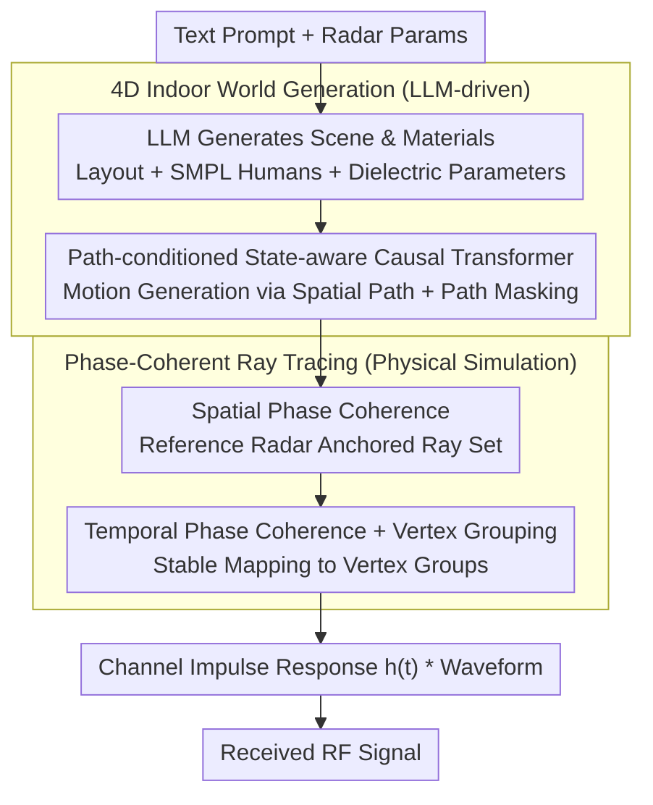

# WaveVerse: Scalable RF Simulation in Generative 4D Worlds

**Conference**: ICML 2026  
**arXiv**: [2508.12176](https://arxiv.org/abs/2508.12176)  
**Code**: Open-sourced (available via paper webpage)  
**Area**: Signal and Communication / RF Sensing / Synthetic Data Generation  
**Keywords**: RF Sensing, mmWave, Phase-Coherent Ray Tracing, 4D World Generation, Human Motion Generation

## TL;DR
WaveVerse integrates LLM-driven "4D indoor scene + human motion" generation with a physical ray tracer that preserves spatiotemporal phase coherence into a prompt-to-RF signal pipeline. It significantly enhances downstream RF imaging and activity recognition tasks using synthetic data, with performance scaling continuously as simulation volume increases, unlike existing methods that saturate.

## Background & Motivation
**Background**: RF (Radio Frequency/mmWave) sensing offers a privacy-friendly, occlusion-resistant alternative to computer vision, applicable in 3D imaging, human activity recognition (HAR), and vital sign monitoring. However, RF data collection is expensive due to the need for diverse room layouts and human subjects. Furthermore, differences in bandwidth, antenna arrays, and modulation schemes make data largely non-reusable across systems, resulting in a lack of a unified benchmark like ImageNet.

**Limitations of Prior Work**: Existing solutions fall into two categories: pure physical simulation (e.g., Vid2Doppler, midas), which mostly models signal-human interaction while ignoring environmental multi-path reflections (a key bottleneck for generalization), and learned synthesis (e.g., RF Genesis, RF-Diffusion), which generates realistic signals but requires massive real-world data for training and is tied to specific radar hardware. Professional full-wave solvers like HFSS are accurate but too slow for dynamic scenes, taking over an hour per simulation.

**Key Challenge**: To scale, the pipeline must automatically mass-produce "diverse environments × diverse motions × diverse radar hardware" at low cost. To be learnable, it must preserve the phase information essential for target distinction. Existing simulators typically sacrifice either environmental complexity or phase coherence.

**Goal**: The authors address two sub-problems: (1) How to populate LLM-generated rooms with spatially reasonable and diverse human behaviors without manual trajectory design? (2) How to perform ray tracing on room geometry such that phases are continuous and comparable across adjacent radar positions and timestamps?

**Key Insight**: The authors relax the condition for motion generation from "time-indexed trajectories" to "spatial paths"—specifying only the route without fixed timing. For signal simulation, instead of random ray sampling common in graphics, they employ a fixed ray set anchored to a reference radar, which is then geometrically transformed to other radars to ensure stable surface intersection points.

**Core Idea**: A path-conditioned autoregressive transformer enables scalable environment-aware motion generation, which is combined with phase-coherent ray tracing that replaces "graphical sampling" with "communication propagation paths" to form the WaveVerse pipeline.

## Method

### Overall Architecture
WaveVerse transforms a "text prompt + radar parameters" into phase-coherent RF signals. The process is divided into two stages: first, an LLM generates a 4D indoor world (mesh-based environment, SMPL humans with text-inferred shapes via BodyShapeGPT, and materials); second, a phase-coherent ray tracer "illuminates" this world. Text is processed into semantic meshes using (Yang et al., 2024). LLM-provided motion descriptions and endpoints are supplemented by a path planner with $L=64$ waypoints, which are then converted into VQ-VAE motion tokens by a state-aware causal transformer. Finally, each object is assigned one of 24 materials with specific dielectric properties. The ray tracer outputs the Channel Impulse Response (CIR) $h(t)=\sum_k a_k G_{\text{Tx}}(\theta_k) G_{\text{Rx}}(\varphi_k)\delta(t-\tau_k)$, which is convolved with the transmitted waveform to produce the received signal.

### Key Designs

**1. Path-conditioned state-aware causal transformer: Relaxing constraints from "Timeline" to "Spatial Path"**

Existing methods use time-indexed trajectories that over-constrain the generation. WaveVerse uses spatial paths, returning control over tempo and style to the generative model. Motion is quantized into tokens $X=[m_1,\dots,m_n,m_{\text{end}}]$. To ensure path adherence, the authors redefine next-token probability as $P(m_n\mid c, m_0, s_0, \dots, m_{n-1}, s_{n-1})$ where $s_i$ is the 2D pelvis position, anchoring each prediction to the current spatial state. During training, random waypoints are masked (ratio $r\in[0.5,0.9]$) to force the model to balance path following with text alignment.

**2. Spatial Phase Coherence: Geometric consistency for adjacent radars**

In traditional graphics, rays are sampled randomly for each radar, leading to stochastic noise in phase differences and "ghosting" in beamforming. WaveVerse shares a "set of anchored rays" across $N$ radar poses. Using the geometric center $(\mathbf{t}_0,\mathbf{r}_0)$ as a reference, reference paths $\mathcal{P}_k=[\mathbf{t}_0,\mathbf{p}_1,\dots,\mathbf{p}_{D_k},\mathbf{r}_0]$ are generated. For other radars, only the endpoints $(\mathbf{t}_n,\mathbf{r}_n)$ are updated while intermediate reflection points $\mathbf{p}_d$ are preserved. This ensures phase differences correspond strictly to geometric path differences, enabling sharp beamforming results.

**3. Temporal Phase Coherence + Vertex Grouping Extension: Continuous phase evolution for dynamic humans**

Random sampling on a deforming SMPL mesh causes phase discontinuities between frames, losing the $\mu$m-mm level phase changes needed for Doppler and vital sign sensing. WaveVerse partitions SMPL vertices into $G$ semantic groups. When a ray hits $\mathbf{p}_d^{(t)}$, it identifies the group $\mathcal{G}(\hat{\mathbf{p}}_d^{(t)})$ and expands the ray into a bundle hitting all vertices $\mathbf{v}_m$ in that group. This stable vertex tracking enables sub-millimeter phase signal retrieval.

### Loss & Training
The motion token VQ-VAE uses standard reconstruction and codebook losses. The causal transformer is trained with next-token cross-entropy and path-masking augmentation. The ray tracer is purely physical. The dielectric library consists of 24 materials proposed by LLM and validated against literature.

## Key Experimental Results

### Main Results: Motion Generation Benchmarks (HumanML3D)

| Method | Architecture | R-Prec ↑ | FID ↓ | Path Err ↓ | Ending Err ↓ |
|--------|--------------|----------|-------|------------|--------------|
| Ground Truth | – | 0.797 | 0.002 | 0 | 0 |
| MDM | Diffusion | 0.719 | 0.295 | 0.547 | 0.666 |
| OmniControl | Diffusion | 0.751 | 0.319 | 0.239 | 0.330 |
| MotionLCM | Diffusion | 0.739 | 0.754 | 0.315 | 0.468 |
| T2M-GPT | AR | 0.691 | 0.377 | 0.406 | 0.545 |
| **WaveVerse** | AR | **0.755** | **0.238** | **0.208** | **0.325** |

WaveVerse ranks first in text alignment (R-Prec), motion quality (FID), and path tracking, outperforming its backbone (T2M-GPT), indicating that the gains stem from the state+mask design.

### Ablation Study: State-aware Causal Transformer

| Configuration | R-Prec ↑ | FID ↓ | Path Err ↓ | Ending Err ↓ |
|---------------|----------|-------|------------|--------------|
| Full | 0.755 | 0.238 | 0.151 | 0.287 |
| w/o Mask | 0.643 | 0.747 | 0.192 | 0.325 |
| w/o State | 0.757 | 0.422 | 0.250 | 0.460 |
| w/o Both | 0.691 | 0.377 | 0.274 | 0.528 |

Removing masking degrades text alignment (R-Prec drops 14.8%), while removing state degrades path tracking (Path Err increases 65%). Both components are essential.

### Signal Fidelity
- **Spatial Phase**: Panoramic imaging with 1,200 circular array positions shows clear images with multipath artifacts in WaveVerse, whereas baseline simulation results in pure noise.
- **Temporal Phase**: Driving SMPL with real breathing signals, chest distance reconstruction RMSE improved from $0.14 \to 0.08$.
- **vs. Real Signal**: Achieved 28.63 dB PSNR and 93.65% energy similarity in range-time spectrograms compared to real mmWave captures.
- **vs. HFSS**: Average 33.57 dB PSNR across 16 setups with <1s computation time, compared to 1+ hour for HFSS.

### Main Results: Downstream Tasks & Key Findings

| Task | Baseline | +1× Sim | +2× Sim | +4× Sim | 4× Real | Mixed |
|--------|------|------|------|------|------|------|
| RF Imaging MAE (cm) ↓ | 20.10 | 19.29 | 19.12 | **18.08** | – | Best |
| Standard RT MAE ↓ | 20.10 | 21.45 | 21.89 | 22.28 | – | – |
| Activity Recognition Acc | 31.6% | 49.8% | 61.4% (+9×) | **71.6%** (+19×) | 75.6% | **81.0%** |
| RF Genesis Acc | 31.6% | 46.6% | 55.8% | 54.6% | – | – |

### Key Findings
- **Scalability**: WaveVerse synthetic data performance **scales continuously**, whereas Standard RT and RF Genesis saturate or degrade. This confirms that "physical fidelity + phase coherence" is the bottleneck for scaling, not data volume itself.
- **Data Value**: 4x synthetic data achieves 73.33% of the error reduction provided by 4x real data, with simulation quality proving more consistent at the 90th percentile.
- **Reliability**: Scene generation success rate is 95.83%, with a collision depth of 12.23 cm and collision frame ratio of 2.35%, indicating physical plausibility.

## Highlights & Insights
- **Geometry over Sampling**: Replacing random graphical sampling with fixed propagation paths anchored to a reference radar solves both noise and computational redundancy. This trick is transferable to any multi-view signal simulation requiring stable phases.
- **Vertex Grouping**: This represents a middle ground between "point sampling" and "area integration," avoiding the high cost of the latter while preserving temporal continuity.
- **Path vs. Trajectory**: Removing the temporal dimension from conditions allows the model to determine cadence autonomously. This abstraction shift is highly valuable for any generation task requiring long-range spatial consistency.
- **LLM-Physics Integration**: Using an LLM to propose material libraries and filtering them with physical bounds is a model workflow for combining broad knowledge with physical constraints.

## Limitations & Future Work
- **Approximation**: Vertex grouping is currently only applied to the first Tx hop, which might lose fidelity in scenes dominated by specular reflections or metallic scattering.
- **Material Granularity**: With only 24 materials, complex surfaces (e.g., carpets, clothing) are approximated, which may increase error at higher frequencies (>77 GHz).
- **Collision**: Physics collisions, though low (2.35%), still occur. The study also focuses primarily on single-person scenarios.
- **LLM Bias**: The pipeline relies on LLMs for scene decomposition; any bias in the LLM's scene generation will propagate directly to the RF data distribution.

## Related Work & Insights
- **vs. RF Genesis**: WaveVerse is fully physical and hardware-agnostic, whereas RF Genesis requires real data for training and saturates early (71.6% vs 54.6% accuracy).
- **vs. Standard Ray Tracing**: Standard RT ignores phase coherence, which WaveVerse proves actually harms imaging performance (MAE increases from 20.10 to 22.28).
- **vs. HFSS**: HFSS is the golden standard but 1,000x slower. WaveVerse provides high fidelity at scale.
- **vs. OmniControl**: WaveVerse simplifies the alignment task from frame-by-frame matching to path adherence, making it more suitable for automated data generation.

## Rating
- **Novelty**: ⭐⭐⭐⭐⭐ First work to bridge path-conditioned LLM 4D generation with phase-coherent ray tracing for a complete prompt-to-RF pipeline.
- **Experimental Thoroughness**: ⭐⭐⭐⭐⭐ Comprehensive motion baselines, three phase benchmarks, comparisons with real data and HFSS, and scaling curves for downstream tasks.
- **Writing Quality**: ⭐⭐⭐⭐ Very clear logic and motivation, though formulas may have a steep learning curve for those outside the RF field.
- **Value**: ⭐⭐⭐⭐⭐ Provides a "NeRF + ImageNet" style infrastructure for the data-starved RF sensing community, lowering the hardware barrier for future researchers in healthcare and HCI.

<!-- RELATED:START -->

## Related Papers

- [\[ICLR 2026\] Instilling an Active Mind in Avatars via Cognitive Simulation](../../ICLR2026/human_understanding/instilling_an_active_mind_in_avatars_via_cognitive_simulation.md)
- [\[ICCV 2025\] EgoAgent: A Joint Predictive Agent Model in Egocentric Worlds](../../ICCV2025/human_understanding/egoagent_a_joint_predictive_agent_model_in_egocentric_worlds.md)
- [\[CVPR 2026\] Beyond Scanpaths: Graph-Based Gaze Simulation in Dynamic Scenes](../../CVPR2026/human_understanding/beyond_scanpaths_graph-based_gaze_simulation_in_dynamic_scenes.md)
- [\[CVPR 2026\] SyncMos: Scalable Motion Synchronisation for Multi-Agent Scene Interaction](../../CVPR2026/human_understanding/syncmos_scalable_motion_synchronisation_for_multi-agent_scene_interaction.md)
- [\[ECCV 2024\] Diffusion Model is a Good Pose Estimator from 3D RF-Vision](../../ECCV2024/human_understanding/diffusion_model_is_a_good_pose_estimator_from_3d_rf-vision.md)

<!-- RELATED:END -->
