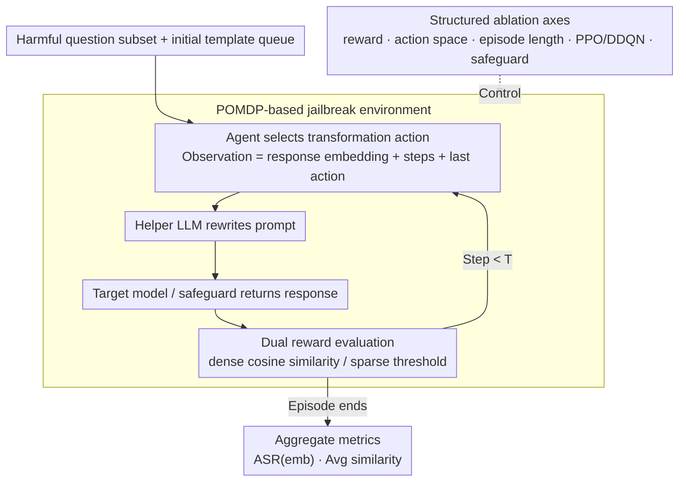

# A Systematic Investigation of RL-Jailbreaking in LLMs

**Conference**: ICML 2026  
**arXiv**: [2605.07032](https://arxiv.org/abs/2605.07032)  
**Code**: No public code / unconfirmed  
**Area**: LLM Security  
**Keywords**: LLM Security, Automated Red Teaming, Reinforcement Learning, Jailbreaking Evaluation, Reward Design  

## TL;DR
This paper investigates RL-based LLM jailbreaking as a decomposable POMDP system, finding that environment definition factors—such as reward functions, episode length, and the number of training questions—determine automated red teaming success rates more significantly than the choice of RL algorithm.

## Background & Motivation
**Background**: LLMs are increasingly utilized as agents capable of calling tools, planning multi-step tasks, and processing high-risk scenarios. Security assessments have evolved from manual prompts and static jailbreak templates toward automated red teaming and multi-turn interactive attacks.

**Limitations of Prior Work**: Existing RL jailbreaking research often treats RL agents as black-box attackers, focusing on whether they can bypass target models or safeguards without explaining the source of success. Components like rewards, action spaces, episode lengths, training data scale, and RL algorithms are often entangled, making it difficult for defenders to determine which link requires strengthening.

**Key Challenge**: The advantage of RL lies in sequential decision-making and exploration. However, the feedback in LLM safety environments is typically sparse, actions involve natural language template transformations, and target models combined with safeguards alter observable states. Without component-level analysis, attack success rates are neither replicable nor easily translated into defensive insights.

**Goal**: Rather than proposing a theoretically stronger jailbreak method, this paper systematically decomposes existing RL-jailbreaker frameworks to quantify the impact of environment formalization and algorithmic design on adversarial success.

**Key Insight**: The authors adopt an RL-centric perspective, conceptualizing the target LLM, helper LLM, prompt/reponse safeguards, and harmful question sets as an environment. The adversary is viewed as an agent learning template transformation policies within this environment.

**Core Idea**: By decomposing RL jailbreaking into controllable axes—reward, action, episode length, data volume, and algorithm—and performing ablation studies on each, the authors use aggregate metrics to understand the effectiveness of automated red teaming.

## Method
The core of the paper is an experimental decomposition framework. The authors follow existing RL-jailbreaker setups: the agent does not directly generate harmful content but selects template transformation actions; a helper model rewrites the template based on these actions; the modified prompt is sent to the target model or safeguard; and the environment provides feedback based on the similarity between the output and reference semantics. The paper focuses on statistical indicators and component impacts rather than specific successful prompts.

### Overall Architecture
The environment is formalized as a POMDP. Hidden states include the internal configurations of the target LLM, safeguards, and current prompt templates. The agent observes a vector encoded from the current text response, step count, termination flag, and the previous action ID. The action space is a fixed, discrete set of template transformations. Each episode begins with a harmful question subset and an initial template queue, where the agent interacts for a maximum of $T$ steps. For each step, a transformation is selected, rewritten by the helper LLM, and the target model or safeguard returns a response.

Target models include Llama-3.2-1B/3B-Instruct, Qwen3-4B-Instruct-2507, and Tiny-aya-global. Defensive environments include Llama-Guard or ShieldGemma filtering on both prompt and response sides. Training data is derived from an AdvBench subset containing harmful questions and reference answers from an unaligned Vicuna. The study uses 55 random seeds and reports bootstrap 95% confidence intervals.

### Key Designs
**1. POMDP-based jailbreak environment: Converting red teaming interactions into a standard RL problem for ablation.** Previous RL-jailbreakers often treated the agent as a black box. By formalizing multi-turn red teaming as a POMDP—where the hidden state comprises the target LLM and safeguards, and the agent observes only encoded responses and metadata—components like rewards, actions, and episodes can be isolated and ablated. This allows success rates to be attributed to specific components rather than generalized model fragility.

**2. Dual reward evaluation: Comparing dense vs. sparse signals to determine how feedback shapes learning.** Dense rewards are calculated using the average cosine similarity between model outputs and reference answers. Sparse rewards provide positive feedback only when similarity exceeds a threshold and the output contains no obvious refusal keywords. This contrast reveals that dense rewards provide continuous guidance necessary for credit assignment when facing strong refusal models, showing that environment definition is often more critical than algorithm choice.

**3. Structured ablation axes: Breaking down success factors into reproducible dimensions to guide defense.** Instead of reporting a single ASR, the authors vary action space size, episode length, reward shaping bonuses, training question volume, PPO vs. DDQN, and safeguard combinations independently. This allows the identification of specific vulnerabilities, such as finding that 20 training questions are superior to 5 or 520, or that expanding the action space under a limited interaction budget can actually make attacks more difficult.

### Loss & Training
Both PPO and DDQN are implemented using a two-layer feed-forward network for policy or Q-functions. PPO serves as the primary algorithm for existing RL-jailbreakers, while DDQN is used to test if value-based methods are suitable for red teaming. Results are reported using metrics like average cosine similarity and embedding-based ASR (requiring semantic similarity above a threshold plus absence of refusal phrases). The study explicitly avoids LLM-as-a-judge due to its vulnerability to degradation in adversarial scenarios.

## Key Experimental Results

### Main Results
The main table compares the original harmful prompt baseline with sparse reward RL and dense reward RL. ASR(emb) and average similarity are reported.

| Target Model | Configuration | ASR(emb) | Avg. Cosine Sim. | Conclusion |
|:---|:---|:---|:---|:---|
| Llama-3.2-1B | Baseline | 13.75% | 0.58 | Static inputs are mostly refused |
| Llama-3.2-1B | Sparse Reward | 32.4% | 0.61 | RL significantly improves success |
| Llama-3.2-1B | Dense Reward | 36.8% | 0.63 | Dense signals perform best |
| Llama-3.2-3B | Baseline | 25.0% | 0.54 | Safety alignment remains insufficient |
| Llama-3.2-3B | Dense Reward | 35.2% | 0.61 | Dense reward provides stable gains |
| Qwen3-4B | Baseline | 16.3% | 0.41 | Lowest baseline performance |
| Qwen3-4B | Sparse Reward | 63.1% | 0.65 | Sparse reward is most effective on this model |
| Tiny-aya-global | Baseline | 38.8% | 0.64 | High initial vulnerability |
| Tiny-aya-global | Sparse Reward | 59.2% | 0.68 | Short-path vulnerabilities are easily caught by sparse signals |

### Ablation Study

| Configuration | Key Metric | Description |
|:---|:---|:---|
| Dense reward + safeguard | Most target-safeguard combinations favor dense over sparse | Multi-layer defense makes feedback sparser; dense rewards provide more stable signals |
| Expanded action space | Both PPO / DDQN performance dropped | More transformations increase exploration and credit assignment difficulty |
| Episode length | Llama benefits from 20/50 steps; Qwen prefers 5 | Optimal interaction length depends on the target's security mechanism |
| Reward bonus | No significant gain with bonus=10/20 | Original dense reward is sufficient; high discrete rewards may disrupt optimization |
| Training question volume | 20 questions outperformed 5 and 520 | Too few leads to overfitting; too many dilutes patterns |
| DDQN vs PPO | DDQN performance comparable to PPO | Value-based RL is a viable but under-explored red teaming direction |

### Key Findings
- Environment formalization is the dominant factor: Reward density and episode horizons affect success more than the RL algorithm.
- Larger action spaces are not always beneficial, especially under finite interaction budgets, as they amplify exploration difficulty.
- Vulnerability patterns vary across target models: Some require long-term interaction for gradual bypass, while others exhibit failure modes in short interactions.
- Safeguards are not monolithic; intercept capabilities vary significantly, with ShieldGemma generally being harder to bypass in these experiments.

## Highlights & Insights
- The transition from attack research to "mechanism auditing" provides greater defensive value than simply pursuing higher ASR, as it identifies which environment designs amplify automated attack capabilities.
- Avoiding LLM-as-a-judge is a robust choice, as adversarial text is designed to deceive judges. Using embeddings and refusal rules is more controllable and reproducible.
- The finding that "20 training questions is optimal" suggests that red team training does not benefit from infinite data; excessively broad data distributions may dilute transferable attack strategies.

## Limitations & Future Work
- The evaluation covers only small-scale open-weight LLMs, without validating closed-source, large-scale, or multimodal models.
- ASR(embedding) remains a proxy metric that may conflate semantically similar but harm-distinct outputs or miss subtle violations.
- The study focuses on independent ablations and has not fully explored interaction effects between reward, episode length, and safeguard types.
- From a defensive perspective, these findings could be applied to co-evolutionary self-play, though dual-use risks must be strictly controlled.

## Related Work & Insights
- **vs Manual jailbreak / prompt engineering**: Traditional methods rely on human expertise; this study focuses on automated sequential decision-making for systematic search.
- **vs RLHF / attacker LLM fine-tuning**: While many works fine-tune attack models via PPO, this work acts as a mechanism audit for template-search agents with clearer interpretation boundaries.
- **vs Safeguard evaluation**: Typical benchmarks use static inputs; this work demonstrates that multi-turn optimization exposes new robustness gaps, suggesting that evaluations should include sequential adversaries.
- **Insight**: When conducting LLM safety evaluations, one should ask not only if a model refuses a single prompt, but whether an automated agent can move the model toward a failure state given an interaction budget and reward proxy.

## Rating
- Novelty: ⭐⭐⭐⭐☆ The focus is not a new method but a valuable systematic deconstruction of RL-jailbreaking.
- Experimental Thoroughness: ⭐⭐⭐⭐☆ Extensive ablation dimensions and seeds; limited by model scale and real-world deployment coverage.
- Writing Quality: ⭐⭐⭐⭐☆ Clear structure and safety boundary definitions; some chart results require textual context.
- Value: ⭐⭐⭐⭐☆ Provides direct insights for red teaming and safeguard design, though dual-use risks require careful management.

<!-- RELATED:START -->

## Related Papers

- [\[ICML 2026\] EvoGM: Learning to Merge LLMs via Evolutionary Generative Optimization](evogm_learning_to_merge_llms_via_evolutionary_generative_optimization.md)
- [\[ICML 2026\] Esoteric Language Models: A Family of Any-Order Diffusion LLMs](esoteric_language_models_a_family_of_any-order_diffusion_llms.md)
- [\[ICML 2026\] SpatialReward: Bridging the Perception Gap in Online RL for Image Editing via Explicit Spatial Reasoning](spatialreward_bridging_the_perception_gap_in_online_rl_for_image_editing_via_exp.md)
- [\[ICML 2026\] Principled RL for Flow Matching Emerges from the Chunk-level Policy Optimization](principled_rl_for_flow_matching_emerges_from_the_chunk-level_policy_optimization.md)
- [\[ICLR 2026\] EditScore: Unlocking Online RL for Image Editing via High-Fidelity Reward Modeling](../../ICLR2026/image_generation/editscore_unlocking_online_rl_for_image_editing_via_high-fidelity_reward_modelin.md)

<!-- RELATED:END -->
