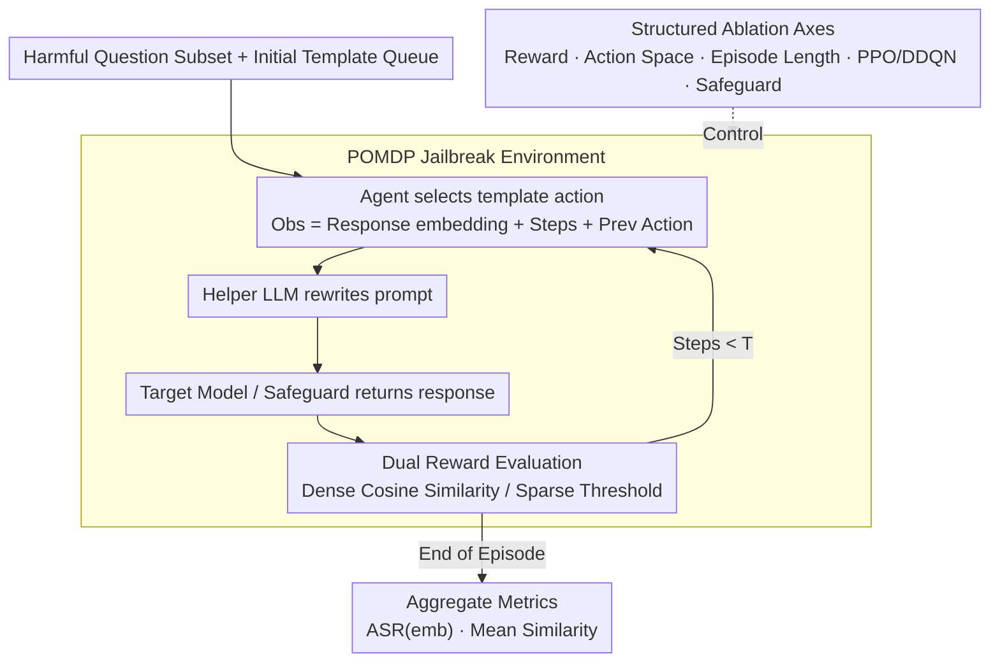

# A Systematic Investigation of RL-Jailbreaking in LLMs

**Conference**: ICML 2026  
**arXiv**: [2605.07032](https://arxiv.org/abs/2605.07032)  
**Code**: No public code / Unconfirmed  
**Area**: LLM Security  
**Keywords**: LLM Security, Automated Red Teaming, Reinforcement Learning, Jailbreak Evaluation, Reward Design  

## TL;DR
This paper investigates RL-based LLM jailbreaking as a decomposable POMDP system, finding that environment definition factors—such as reward functions, episode length, and the number of training questions—determine automated red teaming success rates more significantly than the choice of RL algorithm.

## Background & Motivation
**Background**: LLMs are increasingly utilized as agents capable of calling tools, planning multi-step tasks, and handling high-risk scenarios. Security assessments have evolved from manual prompts and static jailbreak templates toward automated red teaming and multi-round interactive attacks.

**Limitations of Prior Work**: Existing RL jailbreaking works often treat the RL agent as a black-box attacker, reporting whether it can bypass target models or safeguards without explaining the source of success. Components like rewards, action spaces, episode lengths, training data scales, and RL algorithms are conflated, making it difficult for defenders to determine which link to strengthen.

**Key Challenge**: The advantage of RL lies in sequential decision-making and exploration. However, the LLM safety environment features sparse feedback, actions consisting of natural language template transformations, and observable states altered by both target models and safeguards. Without component-level analysis, attack success rates are difficult to reproduce or translate into defensive insights.

**Goal**: The paper does not propose a stronger jailbreak method but rather systematically decomposes existing RL-jailbreaker frameworks to quantify the impact of environment formalization and algorithmic design on adversarial success.

**Key Insight**: A RL-centric perspective is adopted, treating the target LLM, helper LLM, prompt/response safeguards, and harmful question sets as an environment where the adversary learns template transformation strategies.

**Core Idea**: RL jailbreaking is decomposed into controllable axes—reward, action, episode, data volume, and algorithm—for item-by-item ablation to understand why automated red teaming is effective through aggregate metrics.

## Method
The core is an experimental decomposition framework. The authors follow existing RL-jailbreaker settings: the agent selects template transformation actions rather than directly generating harmful content; a helper model rewrites the template; the rewritten prompt is sent to the target model or safeguard; and the environment provides feedback based on semantic similarity between the output and a reference answer. The focus is on statistical metrics and component influence rather than specific successful prompts.

### Overall Architecture
The environment is formalized as a POMDP. Hidden states include the internal configurations of the target LLM, safeguard, and current prompt template. The agent observes a vector encoding the current text response, step count, termination flag, and the previous action index. The action space is a finite set of discrete template transformations. Each episode begins with a harmful question subset and an initial template queue, with the agent interacting for up to $T$ steps. At each step, the agent chooses a transformation, the helper LLM executes the rewrite, and the target model or safeguard returns a response.

Target models include Llama-3.2-1B/3B-Instruct, Qwen3-4B-Instruct-2507, and Tiny-aya-global. Defensive environments incorporate prompt/response filtering via Llama-Guard or ShieldGemma. Training data is sourced from an AdvBench subset containing harmful questions and reference answers from non-aligned Vicuna models. Results are reported with 55 random seeds and bootstrap 95% confidence intervals.

### Key Designs
**1. POMDP Jailbreak Environment: Transforming red teaming into a standard RL problem.** Existing RL-jailbreakers often treat agents as black boxes. By formalizing multi-round red teaming as a POMDP, environment boundaries are fixed. This allows reward, action, and episode components to be isolated and ablated, enabling success rates to be attributed to specific components rather than general model fragility.

**2. Dual Reward Evaluation: Comparing dense and sparse signals to see how feedback shapes learning.** Dense reward is defined as the mean cosine similarity between model output and reference answer embeddings, providing a continuous shaping signal. Sparse reward provides positive feedback only when similarity exceeds a threshold and the output contains no refusal keywords. For strong refusal models, sparse rewards remain zero for long periods, making credit assignment difficult. Dense rewards provide constant direction but may lead the agent toward outputs that are "similar" without achieving a true jailbreak.

**3. Structured Ablation Axes: Decomposing success factors into reproducible dimensions.** Rather than reporting a single aggregate ASR, the authors independently vary action space size, episode length, reward shaping bonuses, training question counts, PPO vs. DDQN, and safeguard combinations. This allows for defensive guidance, such as identifying whether to restrict interaction length or focus on reward proxies.

### Loss & Training
Both PPO and DDQN use two-layer feed-forward networks for the policy or Q-function. PPO serves as the primary algorithm for existing RL-jailbreakers, while DDQN tests whether value-based methods are suitable for red teaming. Metrics include mean cosine similarity and embedding-based ASR, where the latter requires semantic similarity to reach a threshold without common refusal phrases. The study explicitly avoids LLM-as-a-judge as judge reliability often degrades in adversarial scenarios.

## Key Experimental Results

### Main Results
The main table compares original harmful prompt baselines, sparse reward RL, and dense reward RL. ASR(emb) and mean similarity trends are highlighted.

| Target Model | Configuration | ASR(emb) | Avg. Cosine Sim. | Conclusion |
|--------|------|----------|------------------|------|
| Llama-3.2-1B | Baseline | 13.75% | 0.58 | Static inputs mostly rejected |
| Llama-3.2-1B | Sparse Reward | 32.4% | 0.61 | RL significantly improves success |
| Llama-3.2-1B | Dense Reward | 36.8% | 0.63 | Dense signal performs best |
| Llama-3.2-3B | Baseline | 25.0% | 0.54 | Safety alignment gaps exist |
| Llama-3.2-3B | Dense Reward | 35.2% | 0.61 | Dense reward yields stable gains |
| Qwen3-4B | Baseline | 16.3% | 0.41 | Lowest baseline |
| Qwen3-4B | Sparse Reward | 63.1% | 0.65 | Sparse strongest on this model |
| Tiny-aya-global | Baseline | 38.8% | 0.64 | High initial vulnerability |
| Tiny-aya-global | Sparse Reward | 59.2% | 0.68 | Short-path vulnerabilities caught by sparse |

### Ablation Study

| Configuration | Key Metric | Description |
|------|---------|------|
| Dense reward + safeguard | Most target-safeguard pairs favor dense | Multi-layer defense makes feedback sparser; dense reward provides stable signal |
| Expanded action space | PPO / DDQN lower than original | More transformations increase exploration/credit assignment difficulty |
| Episode length | Llama benefits from 20/50 steps; Qwen prefers 5 | Optimal interaction length relates to target model safety mechanisms |
| Reward bonus | No significant gain for bonus=10/20 | Original dense reward is sufficient; high discrete rewards may disrupt optimization |
| Training question count | 20 questions better than 5 or 520 | Too few leads to overfitting; too many dilutes patterns |
| DDQN vs PPO | DDQN performs similarly to PPO | Value-based RL is a viable but under-explored red teaming direction |

### Key Findings
- Environment formalization is the dominant factor: reward density and episode horizon often influence success more than the specific RL algorithm.
- Larger action spaces are not always beneficial; under limited interaction budgets, expanded actions increase exploration difficulty.
- Vulnerability patterns vary by target model: some require long interactions to bypass, while others trigger failure modes via short interactions.
- Safeguards are not uniform barriers; interception capabilities vary significantly, with ShieldGemma generally being harder to bypass in experiments.

## Highlights & Insights
- The transition from attack research to "mechanism auditing" provides defensive value by identifying environment designs that amplify automated attack capabilities.
- Avoiding LLM-as-a-judge is a robust choice, as adversarial text can deceive judges. Embedding and refusal-phrase rules are more controllable and reproducible.
- The "20 training questions" finding suggests that red teaming does not scale linearly with data; an overly broad distribution may dilute transferable attack strategies.

## Limitations & Future Work
- Evaluation is limited to small-scale open-weight LLMs; conclusions may not directly extrapolate to large-scale closed-source or multimodal models.
- ASR(embedding) remains a proxy metric that may conflate semantically similar but legally/ethically different outputs.
- Component interactions (e.g., between reward type and safeguard type) have not been fully explored beyond independent ablations.
- Future work could apply these findings to co-evolutionary self-play to train attack and mitigation agents simultaneously while strictly controlling dual-use risks.

## Related Work & Insights
- **vs. Manual Jailbreak / Prompt Engineering**: While traditional methods rely on human expertise, this work focuses on automated sequential decision-making to lower the barrier for systematic searching.
- **vs. RLHF / Attacker LLM Fine-tuning**: Unlike works that fine-tune attack models via PPO, this study acts as an environmental mechanism audit of template-searching agents with clearer interpretability.
- **vs. Safeguard Evaluation**: Standard benchmarks use static inputs; this study shows that multi-round optimization exposes new robustness gaps, suggesting that deployment evaluations should include sequential adversaries.
- **Insight**: LLM safety assessments should move beyond asking "does the model refuse a single prompt" to "can an automated agent approach a failure state within a given interaction budget and reward proxy."

## Rating
- Novelty: ⭐⭐⭐⭐☆ Focuses on systematic decomposition rather than just new methods.
- Experimental Thoroughness: ⭐⭐⭐⭐☆ Extensive ablation and high seed count; limited by model scale.
- Writing Quality: ⭐⭐⭐⭐☆ Clear structure and safety considerations.
- Value: ⭐⭐⭐⭐☆ Provides direct insights for red teaming and safeguard design.

<!-- RELATED:START -->

## Related Papers

- [\[ICML 2026\] EvoGM: Learning to Merge LLMs via Evolutionary Generative Optimization](evogm_learning_to_merge_llms_via_evolutionary_generative_optimization.md)
- [\[ICML 2026\] Esoteric Language Models: A Family of Any-Order Diffusion LLMs](esoteric_language_models_a_family_of_any-order_diffusion_llms.md)
- [\[ICML 2026\] SpatialReward: Bridging the Perception Gap in Online RL for Image Editing via Explicit Spatial Reasoning](spatialreward_bridging_the_perception_gap_in_online_rl_for_image_editing_via_exp.md)
- [\[ICML 2026\] AtelierEval: Agentic Evaluation of Humans & LLMs as Text-to-Image Prompters](ateliereval_agentic_evaluation_of_humans_llms_as_text-to-image_prompters.md)
- [\[ICML 2026\] Principled RL for Flow Matching Emerges from the Chunk-level Policy Optimization](principled_rl_for_flow_matching_emerges_from_the_chunk-level_policy_optimization.md)

<!-- RELATED:END -->
