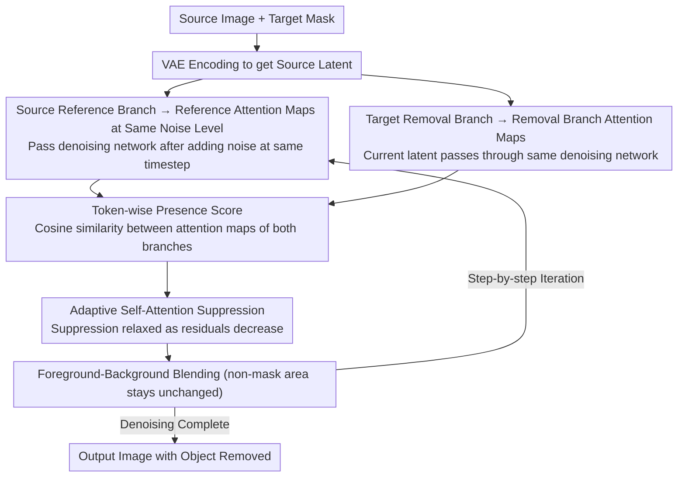

# AdaEraser: Training-Free Object Removal via Adaptive Attention Suppression

**Conference**: ICML 2026  
**arXiv**: [2605.15921](https://arxiv.org/abs/2605.15921)  
**Code**: None  
**Area**: Image Generation / Diffusion Image Editing  
**Keywords**: Object Removal, Training-Free Editing, Self-Attention Suppression, Diffusion Models, Image Inpainting

## TL;DR
AdaEraser adaptively modulates the self-attention suppression intensity of diffusion models based on the "object presence degree." It simultaneously improves object removal completeness and background reconstruction quality without training, outperforming both training-based and training-free object removal methods on Mulan and OABench.

## Background & Motivation
**Background**: Diffusion models have become the dominant foundation for image generation and editing. Object removal is typically treated as a specialized form of inpainting: given an image and a mask, the model must delete the target inside the mask while ensuring the hole blends naturally with the surrounding background.

**Limitations of Prior Work**: Training-based object removal methods rely on specialized datasets, adapters, or fine-tuning, which are costly. Training-free methods attempt to directly leverage the generative prior of pre-trained diffusion models. Recent strong methods like AttentiveEraser block attention from image tokens to the target region tokens in self-attention; while this removes the object, it often disrupts background generation within the mask because background repair requires global self-attention between the interior and exterior.

**Key Challenge**: Object removal encompasses two simultaneous goals: suppressing the target concept and recovering a reasonable background. Strong suppression favors object removal but leaves the background without context; weak suppression preserves generative capability but may result in object residuals. Fixed intensity or uniform suppression across the entire region fails to handle variations across different tokens, timesteps, and layers.

**Goal**: Design a training-free adaptive self-attention modulation method that applies strong suppression when the object is still prominent and relaxes suppression once the object begins to disappear, allowing the pre-trained diffusion model to regain its background generation capability.

**Key Insight**: The authors observe that the self-attention maps of target region tokens gradually reflect semantic content during denoising. The similarity between the attention maps of a token in the source reference branch and the removal branch is highly correlated with whether the target concept corresponding to that token still exists.

**Core Idea**: Use the token-wise cosine similarity between the source reference attention map and the current removal process attention map as a presence score $p(i)$, then transform $1-p(i)$ into an adaptive suppression coefficient for each key token.

## Method
AdaEraser does not modify diffusion model parameters or train additional networks. At each denoising step, it simultaneously runs a source reference branch and a target removal branch: the source branch passes the original image latent (added to the same noise level) through the denoising network once to obtain reference self-attention maps; the target branch performs the object removal. The attention maps of both branches are compared at the same timestep, layer, and token to estimate object residuals.

### Overall Architecture
Given a source image $I^{src}$ and a target mask $M$, the VAE encoder first yields the latent $x_0^{src}$. For each timestep $t$, the source branch constructs $x_t^{src}=\sqrt{\bar\alpha_t}x_0^{src}+\sqrt{1-\bar\alpha_t}\epsilon$ and extracts self-attention maps $SA^{src}_{t,l}$ via the denoising network. The target branch is initialized from the noisy source image to get the current $x_t^{tgt}$, and produces $SA^{tgt}_{t,l}$ through the same denoising network.

For each token $i$ within the mask, the method calculates $p(i)=Sim(SA^{tgt}_{t,l}(i),SA^{src}_{t,l}(i))$. If the target branch attention map still resembles the object token in the source image, it indicates high residual concept; if similarity drops, the position is more likely background or new content. Subsequently, $\eta(i)=1-p(i)$ is computed and multiplied by the key token weights in the self-attention softmax. Finally, the method follows standard foreground-background blending using the mask to maintain consistency in non-edited regions. The pipeline loops at each denoising step as follows:

### Key Designs

**1. Noise-Aligned Reference Attention Maps**: The presence score must compare the current denoising state against "what the attention should look like if the target were still there." Self-attention maps are strongly correlated with noise intensity—if the reference uses the wrong noise level, the score reflects noise scale differences rather than semantic residuals. Thus, AdaEraser does not use a full DDIM inversion or a fixed noise layer; instead, it passes the source latent at the same noise level through the denoising network at each timestep $t$ to obtain a reference $SA^{src}_{t,l}$ strictly aligned with the removal branch by $t$ and layer. Ablations replacing this with fixed low-noise $x_1$, mid-noise $x_{T/2}$, or high-noise $x_T$ underperformed compared to the step-aligned $x_t$, confirming that noise alignment provides a stable residual signal.

**2. Token-wise Presence Score**: Objects cannot be directly detected in the latent space, and source tokens versus denoising tokens reside in different feature spaces, preventing direct comparison. The key observation is that self-attention maps normalized by Softmax are comparable across branches. By flattening and calculating the cosine similarity $p(i)$ for each token $i$ inside the mask, a relative control metric is established. This is done at token granularity rather than region averaging because self-attention patterns for different parts of an object (e.g., head vs. body) vary significantly; region averaging would erase these distinctions. Token-wise measures outperformed region-based and timestep-based alternatives in ablations.

**3. Adaptive Self-Attention Suppression**: Strong suppression removes the target but destroys background generation, while weak suppression preserves generation but leaves residuals—fixed intensity cannot satisfy both. AdaEraser uses the presence score for dynamic adjustment: for key tokens $i$ inside the mask, let $\eta(i)=1-p(i)$, and for others $\eta(i)=1$. The attention is rewritten as $\widetilde{SA}(i)=\eta(i)\exp(QK_i^\top/\sqrt d)/\sum_j\eta(j)\exp(QK_j^\top/\sqrt d)$, effectively adding a monotonic logit bias to object-related keys. When the object persists ($p$ is high), $\eta$ is small, leading to strong suppression; as the object vanishes ($p$ is low), $\eta\to1$, allowing the pre-trained model to generate the background normally. Compared to the hard blocking in AttentiveEraser, this achieves a dynamic compromise between "removing the target" and "reconstructing the background."

### Loss & Training
AdaEraser is a training-free method with no additional training loss. At inference, it uses the VAE, denoising UNet, and decoder of a pre-trained text-to-image diffusion model. The main experiments use SDXL as the backbone with an empty prompt as the text condition. The additional overhead comes from the parallel denoising of two latents (source and target) and presence score calculations, which the authors handle via concatenation, maintaining the overhead within approximately 15% relative to AttentiveEraser.

## Key Experimental Results

### Main Results
The paper compares training-based and training-free methods on the Mulan and OABench object removal benchmarks. AdaEraser achieves state-of-the-art results across FID, LPIPS, PSNR, ReMOVE, CFD, and human ranking (AHR).

| Method | Training | Mulan FID↓ | Mulan PSNR↑ | Mulan ReMOVE↑ | Mulan AHR↑ | OABench FID↓ | OABench PSNR↑ | OABench ReMOVE↑ | OABench AHR↑ |
|------|----------|------------|-------------|---------------|------------|--------------|---------------|-----------------|--------------|
| AttentiveEraser | No | 54.040 | 22.7771 | 0.9000 | 5.46 | 40.373 | 23.2670 | 0.8215 | 5.43 |
| RORem | Yes | 53.470 | 23.5275 | 0.9048 | 6.22 | 39.215 | 23.4126 | 0.8281 | 6.23 |
| OmniPaint | Yes | 59.996 | 21.4493 | 0.8706 | 5.07 | 38.903 | 22.9257 | 0.7991 | 4.59 |
| AdaEraser | No | 51.108 | 23.5871 | 0.9065 | 7.08 | 38.472 | 23.5047 | 0.8316 | 6.81 |

### Ablation Study
Core ablations center on the suppression strategy and reference selection. Results indicate that token-wise adaptation and same-timestep referencing are essential designs.

| Configuration | FID↓ | PSNR↑ | ReMOVE↑ | CFD↓ | Description |
|------|------|-------|---------|------|------|
| Timestep-based suppression | 38.831 | 23.4697 | 0.8263 | 0.2517 | Only linear decay over time, lacks semantic awareness |
| Region-based suppression | 38.945 | 23.4674 | 0.8261 | 0.2499 | One score for the whole mask, lacks token granularity |
| Token-wise suppression | 38.472 | 23.5047 | 0.8316 | 0.2450 | Ours, best metrics |
| Reference $x_1^{src}$ | 38.595 | 23.4262 | 0.8223 | 0.2658 | Fixed low-noise reference is worse than step-alignment |
| Reference $x_T^{src}$ | 38.829 | 23.4808 | 0.8241 | 0.2507 | Fixed high-noise reference is unstable |
| Reference $x_{T/2}^{src}$ | 38.713 | 23.4872 | 0.8262 | 0.2514 | Mid-noise reference still worse than same-timestep |
| Reference $x_t^{src}$ | 38.472 | 23.5047 | 0.8316 | 0.2450 | Noise alignment yields the most accurate presence score |

### Key Findings
- AdaEraser’s advantage stems not from new training data, but from better utilization of the internal self-attention dynamics of pre-trained diffusion models.
- Compared to AttentiveEraser, AdaEraser’s inference time increases from 13.98s to 15.41s, and VRAM usage from 7966 MiB to 9014 MiB, a relatively limited cost.
- The presence score decreases gradually over timesteps, and different layers/tokens exhibit different decay patterns, justifying token-wise adaptive schedules over global ones.
- The method is robust to slightly loose masks, but incomplete masks leave residuals of shadows, reflections, or uncovered parts.

## Highlights & Insights
- This paper identifies the genuine conflict in object removal: suppression should not be maximized throughout, but rather applied when the target exists and released once it vanishes to allow background generation.
- Using self-attention map similarity as a proxy signal is clever, as the Softmax-normalized maps are comparable across branches, proving more stable than detecting objects directly within noisy latents.
- The token-wise design avoids a "one-size-fits-all" approach within the mask. This is particularly important for large objects, multi-part objects, or scenes with complex local textures.
- The KL-regularized interpretation provided in the appendix suggests that attention reweighting is not just an engineering trick but can be understood as an adjustment of the attention distribution with semantic penalties.

## Limitations & Future Work
- The presence score is a heuristic proxy rather than a strict semantic probability. In scenarios with similar textures, repeating backgrounds, or overlapping identical objects, attention similarity might not sufficiently distinguish target from background.
- The method depends on mask quality. If the mask misses shadows, reflections, or object edges, AdaEraser can only process the explicitly marked region.
- Performance drops on highly distilled few-step diffusion models because the method relies on the gradual evolution of attention dynamics over multiple denoising steps.
- Future work could integrate automatic mask expansion, structural constraints, or scene-level priors to improve background recovery in complex structures and under-masked cases.

## Related Work & Insights
- **vs AttentiveEraser**: AttentiveEraser forcibly blocks target region attention, removing tokens cleanly but often distorting the background; AdaEraser adjusts intensity based on residuals, leading to better background quality.
- **vs RORem / SmartEraser (Training-based)**: These methods rely on specialized data and training; AdaEraser outperforms them without training, suggesting pre-trained diffusion models already contain sufficient object/background priors.
- **vs text-driven suppression**: Manipulating cross-attention or text embeddings alone is unstable for small or multiple similar targets; this work looks directly at image token self-attention for finer localization.
- **Insight**: For training-free diffusion editing, the temporal evolution of internal attention can serve as a control signal, potentially eliminating the need for external classifiers or segmenters.

## Rating
- Novelty: ⭐⭐⭐⭐ Uses token-wise attention similarity for adaptive suppression; simple and effective.
- Experimental Thoroughness: ⭐⭐⭐⭐⭐ Comprehensive metrics, user studies, ablations, efficiency, mask quality, and cross-backbone analysis.
- Writing Quality: ⭐⭐⭐⭐ Clear motivation and illustrations; theoretical appendix is explanatory rather than a strict guarantee; dense tables in main text.
- Value: ⭐⭐⭐⭐⭐ highly practical for training-free image editing and diffusion model attention control.

<!-- RELATED:START -->

## Related Papers

- [\[CVPR 2026\] Precise Object and Effect Removal with Adaptive Target-Aware Attention](../../CVPR2026/image_generation/precise_object_and_effect_removal_with_adaptive_target-aware_attention.md)
- [\[CVPR 2026\] Object-WIPER: Training-Free Object and Associated Effect Removal in Videos](../../CVPR2026/image_generation/object-wiper_training-free_object_and_associated_effect_removal_in_videos.md)
- [\[ICML 2026\] CLEAR: Context-Aware Learning with End-to-End Mask-Free Inference for Adaptive Video Subtitle Removal](clear_context-aware_learning_with_end-to-end_mask-free_inference_for_adaptive_vi.md)
- [\[ICLR 2026\] ReFocusEraser: Refocusing for Small Object Removal with Robust Context-Shadow Repair](../../ICLR2026/image_generation/refocuseraser_refocusing_for_small_object_removal_with_robust_context-shadow_rep.md)
- [\[AAAI 2026\] Melodia: Training-Free Music Editing Guided by Attention Probing in Diffusion Models](../../AAAI2026/image_generation/melodia_training-free_music_editing_guided_by_attention_probing_in_diffusion_mod.md)

<!-- RELATED:END -->
