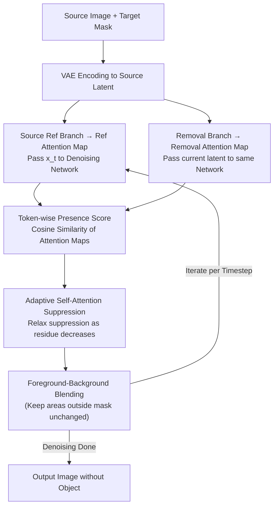

# AdaEraser: Training-Free Object Removal via Adaptive Attention Suppression

**Conference**: ICML 2026  
**arXiv**: [2605.15921](https://arxiv.org/abs/2605.15921)  
**Code**: None  
**Area**: Image Generation / Diffusion Image Editing  
**Keywords**: Object Removal, Training-Free Editing, Self-Attention Suppression, Diffusion Models, Image Inpainting  

## TL;DR
AdaEraser adaptively modulates the suppression intensity of self-attention in diffusion models based on "object presence." This approach simultaneously improves object removal completeness and background reconstruction quality without training new models, outperforming both training-based and training-free object removal methods on Mulan and OABench.

## Background & Motivation
**Background**: Diffusion models have become the dominant foundation for image generation and editing. Object removal is typically treated as a specialized form of inpainting: given an image and a mask, the model must delete the object within the mask while ensuring the hole connects naturally with the surrounding background.

**Limitations of Prior Work**: Training-based object removal methods rely on specialized datasets, adapters, or fine-tuning, which are costly. Training-free methods attempt to directly utilize the generative prior of pre-trained diffusion models. Recent strong methods like AttentiveEraser block the attention of image tokens toward the target region in self-attention; while effective at deleting objects, this often disrupts background generation within the mask because background restoration requires global self-attention across regions.

**Key Challenge**: Object removal involves two simultaneous goals: suppressing the object concept and recovering a plausible background. Strong suppression facilitates object deletion but deprives the background of context; weak suppression preserves generative capacity but may leave object residues. Fixed suppression intensities or uniform region-wide suppression fail to handle variations across different tokens, timesteps, and layers.

**Goal**: To design a training-free adaptive self-attention modulation method that applies strong suppression when the object remains prominent and relaxes suppression as the object gradually disappears, allowing the pre-trained diffusion model to re-exert its background generation capabilities.

**Key Insight**: The authors observe that self-attention maps of target region tokens gradually reflect semantic content during denoising. The similarity between the attention maps of a token in the original image reference branch and the removal branch is highly correlated with whether the corresponding object concept still exists.

**Core Idea**: Use the token-wise cosine similarity between the original image reference attention map and the current removal process attention map as a presence score $p(i)$, then convert $1-p(i)$ into an adaptive suppression coefficient for each key token.

## Method
AdaEraser does not modify diffusion model parameters or train additional networks. It runs a source reference branch and a target removal branch simultaneously at each denoising step: the source branch passes the original latent (added with noise to the same level) through the denoising network to obtain reference self-attention maps; the target branch performs the object removal. The attention maps of both branches are compared at the same timestep, layer, and token to estimate object residue.

### Overall Architecture
Given a source image $I^{src}$ and a target mask $M$, the latent $x_0^{src}$ is obtained via a VAE encoder. For each timestep $t$, the source branch constructs $x_t^{src}=\sqrt{\bar\alpha_t}x_0^{src}+\sqrt{1-\bar\alpha_t}\epsilon$ and extracts self-attention maps $SA^{src}_{t,l}$ via the denoising network. The target branch starts from the noisy source image to get current $x_t^{tgt}$, and produces $SA^{tgt}_{t,l}$ through the same network.

For each token $i$ within the mask, the method calculates $p(i)=Sim(SA^{tgt}_{t,l}(i),SA^{src}_{t,l}(i))$. If the attention map in the target branch still resembles the object tokens in the original image, it indicates high object residue; if similarity decreases, it suggests the location looks more like background or new content. Then, $\eta(i)=1-p(i)$ is applied as a weight to the key tokens in the self-attention softmax. Finally, foreground-background blending is performed to maintain consistency in non-edited regions. The pipeline iterates as follows:

### Key Designs

**1. Same-noise-level reference maps**: The presence score compares the current denoising state with "how the attention should look when the object is present." Since self-attention maps are strongly correlated with noise levels, choosing the wrong noise level for reference would introduce noise-scale bias rather than semantic signal. AdaEraser uses the source latent at the same noise level at each timestep to obtain $SA^{src}_{t,l}$. Ablations show that using fixed noise levels ($x_1$, $x_{T/2}$, $x_T$) as a reference is inferior to timestep-aligned $x_t$, confirming that noise alignment is crucial for stable presence signals.

**2. Token-wise presence score**: Objects cannot be directly detected in the latent, and original tokens vs. denoising tokens exist in different feature spaces. A key observation is that self-attention maps normalized by Softmax are comparable across branches. Thus, for each token $i$ in the mask, the cosine similarity between flattened attention maps across branches yields $p(i)$. This is used as a relative control index rather than a strict semantic probability. Using token-level granularity instead of region averaging preserves variances between different parts (head, body, tail) of an object; ablation results show token-wise performs better than region-based or timestep-based approaches.

**3. Adaptive self-attention suppression**: Strong suppression removes objects but destroys background, while weak suppression preserves generation but leaves residues; a fixed intensity cannot achieve both. AdaEraser dynamically adjusts via the presence score: for key tokens $i$ within the mask, $\eta(i)=1-p(i)$ is set (and $\eta(i)=1$ otherwise), rewriting attention as $\widetilde{SA}(i)=\eta(i)\exp(QK_i^\top/\sqrt d)/\sum_j\eta(j)\exp(QK_j^\top/\sqrt d)$. This acts as a monotonic logit bias for object-related keys. When the object persists ($p$ is high), $\eta$ is small for strong suppression; once the object vanishes ($p$ is low), $\eta\to1$, allowing the model to generate the background normally. 

### Loss & Training
AdaEraser is a training-free method with no additional training loss. At inference, it uses the VAE, denoising UNet, and decoder of a pre-trained text-to-image diffusion model. Main experiments use SDXL as the backbone with an empty prompt. Additional overhead comes from parallel denoising of two latents and presence score calculation, handled by concatenation to keep costs within ~15% compared to AttentiveEraser.

## Key Experimental Results

### Main Results
The paper compares training-based and training-free methods on the Mulan and OABench benchmarks. AdaEraser achieves state-of-the-art results across FID, LPIPS, PSNR, ReMOVE, CFD, and human ranking (AHR).

| Method | Trained | Mulan FID↓ | Mulan PSNR↑ | Mulan ReMOVE↑ | Mulan AHR↑ | OABench FID↓ | OABench PSNR↑ | OABench ReMOVE↑ | OABench AHR↑ |
|------|----------|------------|-------------|---------------|------------|--------------|---------------|-----------------|--------------|
| AttentiveEraser | No | 54.040 | 22.7771 | 0.9000 | 5.46 | 40.373 | 23.2670 | 0.8215 | 5.43 |
| RORem | Yes | 53.470 | 23.5275 | 0.9048 | 6.22 | 39.215 | 23.4126 | 0.8281 | 6.23 |
| OmniPaint | Yes | 59.996 | 21.4493 | 0.8706 | 5.07 | 38.903 | 22.9257 | 0.7991 | 4.59 |
| AdaEraser | No | 51.108 | 23.5871 | 0.9065 | 7.08 | 38.472 | 23.5047 | 0.8316 | 6.81 |

### Ablation Study
Core ablations focus on suppression strategy and reference selection. Results indicate that token-wise adaptation and same-timestep references are essential.

| Configuration | FID↓ | PSNR↑ | ReMOVE↑ | CFD↓ | Description |
|------|------|-------|---------|------|------|
| Timestep-based suppression | 38.831 | 23.4697 | 0.8263 | 0.2517 | Linear decay only, lacks semantic awareness |
| Region-based suppression | 38.945 | 23.4674 | 0.8261 | 0.2499 | Single score for entire mask, lacks granularity |
| Token-wise suppression | 38.472 | 23.5047 | 0.8316 | 0.2450 | Ours, best metrics |
| Reference $x_1^{src}$ | 38.595 | 23.4262 | 0.8223 | 0.2658 | Fixed low-noise reference is inferior |
| Reference $x_T^{src}$ | 38.829 | 23.4808 | 0.8241 | 0.2507 | Fixed high-noise reference is unstable |
| Reference $x_{T/2}^{src}$ | 38.713 | 23.4872 | 0.8262 | 0.2514 | Mid-noise reference still inferior |
| Reference $x_t^{src}$ | 38.472 | 23.5047 | 0.8316 | 0.2450 | Noise-level alignment provides best presence score |

### Key Findings
- AdaEraser's advantage stems from better utilization of the internal self-attention dynamics of pre-trained diffusion models rather than new data.
- Compared to AttentiveEraser, inference time increases from 13.98s to 15.41s, and VRAM from 7966 MiB to 9014 MiB, posing a limited overhead.
- The presence score decreases gradually over timesteps, with different layers/tokens showing distinct decay patterns, justifying token-wise adaptive control over global schedules.
- The method is robust to slightly loose masks, but incomplete masks leave residues of shadows or reflections.

## Highlights & Insights
- The paper identifies the fundamental trade-off in object removal: suppression should be high when the object exists and low when restoring the background.
- Using self-attention map similarity as a proxy signal is clever, as the Softmax-normalized maps are comparable across branches and more stable than direct detection in noisy latents.
- The token-wise design avoids "one-size-fits-all" suppression within the mask, which is critical for large objects or scenes with complex local textures.
- The KL-regularized interpretation in the appendix elevates the attention reweighting from an engineering trick to a theoretically grounded adjustment of the attention distribution with semantic penalties.

## Limitations & Future Work
- The presence score is a heuristic proxy, not a strict semantic probability. Similarity might fail to distinguish objects from similar background textures or repetitive patterns.
- It relies on mask quality; shadows, reflections, or edges not covered by the mask will result in residues.
- Performance drops on highly distilled few-step models, as the method depends on the gradual evolution of attention dynamics over multiple denoising steps.
- Future work could combine automatic mask expansion or structural priors to improve background restoration in complex scenes.

## Related Work & Insights
- **vs AttentiveEraser**: AttentiveEraser uses hard blocking of attention, which cleans objects but distorts backgrounds; AdaEraser dynamically adjusts intensity for better background quality.
- **vs RORem / SmartEraser**: These training-based methods depend on specific data; AdaEraser outperforms them without training, suggesting pre-trained models already contain sufficient object/background priors.
- **vs text-driven suppression**: Manipulating cross-attention or text embeddings is unstable for small or multiple similar objects; this method looks directly at image token self-attention for finer localization.
- **Insight**: For training-free diffusion editing, the temporal evolution of internal attention can serve as a control signal, potentially bypassing the need for external classifiers or segmenters.

## Rating
- Novelty: ⭐⭐⭐⭐ Adaptive suppression using token-wise attention similarity is simple yet effective.
- Experimental Thoroughness: ⭐⭐⭐⭐⭐ Metrics, user studies, ablations, efficiency, mask quality, and backbone analyses are comprehensive.
- Writing Quality: ⭐⭐⭐⭐ Motivation and illustrations are clear; theoretical appendix provides explanation rather than strict guarantees.
- Value: ⭐⭐⭐⭐⭐ Highly practical for training-free image editing and diffusion attention control.

<!-- RELATED:START -->

## Related Papers

- [\[CVPR 2026\] Precise Object and Effect Removal with Adaptive Target-Aware Attention](../../CVPR2026/image_generation/precise_object_and_effect_removal_with_adaptive_target-aware_attention.md)
- [\[CVPR 2026\] Object-WIPER: Training-Free Object and Associated Effect Removal in Videos](../../CVPR2026/image_generation/object-wiper_training-free_object_and_associated_effect_removal_in_videos.md)
- [\[ICML 2026\] CLEAR: Context-Aware Learning with End-to-End Mask-Free Inference for Adaptive Video Subtitle Removal](clear_context-aware_learning_with_end-to-end_mask-free_inference_for_adaptive_vi.md)
- [\[AAAI 2026\] Melodia: Training-Free Music Editing Guided by Attention Probing in Diffusion Models](../../AAAI2026/image_generation/melodia_training-free_music_editing_guided_by_attention_probing_in_diffusion_mod.md)
- [\[CVPR 2026\] HAM: A Training-Free Style Transfer Approach via Heterogeneous Attention Modulation for Diffusion Models](../../CVPR2026/image_generation/ham_a_training-free_style_transfer_approach_via_heterogeneous_attention_modulati.md)

<!-- RELATED:END -->
