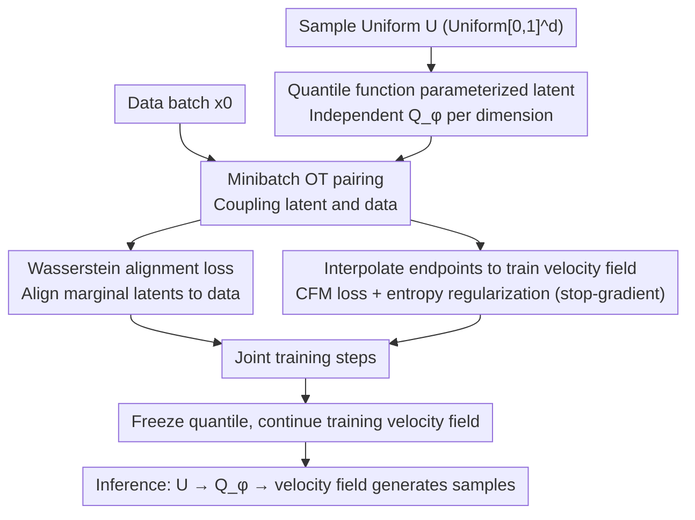

# Adapting Noise to Data: Generative Flows from Learned 1D Processes

**Conference**: ICML 2026  
**arXiv**: [2510.12636](https://arxiv.org/abs/2510.12636)  
**Code**: https://github.com/TUB-Angewandte-Mathematics/Adapting-Noise  
**Area**: Image Generation / Flow Matching  
**Keywords**: flow matching, data-adaptive noise, quantile function, non-Gaussian prior, heavy-tailed generative modeling  

## TL;DR
This paper argues that the default Gaussian latent in flow/diffusion models is not always suitable for the data distribution. It proposes constructing a data-adaptive product prior using learnable 1D quantile functions to jointly learn the noise and velocity field in flow matching, thereby shortening the transport path and improving performance on heavy-tailed weather data and low-capacity image generation.

## Background & Motivation
**Background**: Flow matching, diffusion, and consistency-style models typically start from a simple latent/noise distribution and learn a velocity field or score to push the latent toward the data distribution. The default choice is almost always Gaussian due to ease of sampling, mature theory, and independence across dimensions.

**Limitations of Prior Work**: Gaussian latents may be unsuitable for data with heavy tails, compact support, or strong edge structures. For targets like heavy-tailed weather data or Neal's funnel, a Gaussian starting point results in long transport paths, forcing the model to handle both marginal tail behavior and cross-dimensional dependencies via the velocity field. Existing heavy-tailed diffusion works manually select Student-t or alpha-stable noise, but tail parameters require tuning and may not match the data margins of each dimension.

**Key Challenge**: The latent needs to be simple enough for sampling and training, yet close enough to the data marginal structure to reduce the difficulty of learning the flow. Learning a full high-dimensional prior might introduce complex correlations into the latent, leading to instability; conversely, fixing a Gaussian prior wastes model capacity on structures that could be explained by marginal priors.

**Goal**: To learn a latent distribution that remains independent, sampleable, and lightweight, but allows the marginal distribution of each dimension to adapt to the data, delegating cross-dimensional correlations to the velocity field and marginal support/tails to the quantile prior.

**Key Insight**: A 1D distribution can be fully represented by its quantile function, and the Wasserstein-2 distance in 1D is equivalent to the $L_2$ distance between quantile functions. The authors parameterize the quantile of each dimension using rational quadratic splines, keeping the product latent simple while expressing heavy-tailed, compactly supported, and multimodal margins.

**Core Idea**: Use 1D quantile functions to learn data-adaptive noise $\mathbf{Q}_\phi(\mathbf{U})$, optimized jointly with the velocity field through Wasserstein alignment and flow matching loss.

## Method
The paper establishes a general view: a high-dimensional noising process can be constructed from independent 1D processes. As long as each 1D process has an accessible velocity field, a conditional velocity for multidimensional flow matching can be constructed. The authors further formulate the 1D process as a quantile process to make the final latent distribution learnable.

### Overall Architecture
Traditional flow matching often uses linear interpolation $X_t=(1-t)X_0+tX_1$, where $X_1$ is Gaussian noise. This work replaces $X_1$ with $\mathbf{Q}_\phi(\mathbf{U})=(Q^1_\phi(U^1),\ldots,Q^d_\phi(U^d))$, where $U^i\sim\mathcal{U}(0,1)$. Each $Q^i_\phi$ is a monotonic 1D quantile function, ensuring a valid output distribution.

During training, the method calculates a minibatch OT assignment between a data batch and a quantile latent batch. This coupling is used for two purposes: minimizing the Wasserstein alignment loss between the latent and data, and training the velocity field using OT-coupled endpoints. After a certain number of steps, the quantile is frozen, and only the velocity field optimization continues, resulting in almost no additional cost during inference.

The method also discusses more general 1D processes, such as the Kac process and MMD gradient flow, and how quantile interpolants can be connected to few-step/IMM methods. However, the main experiments focus on the learned static quantile prior. The training pipeline is shown below: the data path and uniform latent path meet at the minibatch OT, followed by joint optimization of the quantile and velocity field.

### Key Designs

**1. Decomposition of 1D processes to high-dimensional product prior**: To introduce non-Gaussian latents without manually designing high-dimensional noise PDEs, the authors set the dimensions of the multidimensional noise $\mathbf{N}_t=(N_t^1,\ldots,N_t^d)$ to be independent. Each dimension has its own 1D velocity $v_t^i$, and the high-dimensional velocity is constructed by concatenation. Cross-dimensional correlations are handled by the learned velocity field rather than the noise. This allows 1D processes like Kac or uniform/MMD to be used for generative modeling in arbitrary dimensions while keeping the latent independent and simple to sample.

**2. Quantile function parameterization of the latent**: To allow each marginal latent to adapt to the data's scale, support, and tail without excessive complexity, the method uses rational quadratic splines for $Q^i_\phi$. Monotonicity constraints ensure it is a valid quantile. Sampling involves drawing $U^i\sim\mathcal{U}(0,1)$ and passing it through $Q^i_\phi$. Quantiles are chosen because they are universal representations for 1D distributions and naturally align with Wasserstein-2 geometry; they allow the model to learn different tail behaviors per dimension compared to the fixed degrees of freedom in a Student-t distribution.

**3. Joint training with Wasserstein alignment and FM**: Training the latent based solely on the FM loss can lead to degeneracy—the quantile may opportunistically reduce the loss by shrinking endpoint displacements. Thus, the objective function is $\mathcal{L}(\theta,\phi)=\mathcal{L}_{CFM}(\theta,\phi)+\lambda\mathcal{L}_{AN}(\phi)-\beta\mathcal{R}(\phi)$, where $\mathcal{L}_{AN}=W_2^2(\mu_0,\nu_\phi)$ performs marginal matching and $\mathcal{R}$ is a log-det/entropy regularizer. The same minibatch OT coupling is used for both alignment and OT-FM. A stop-gradient $\mathrm{sg}(\mathbf{y}-\mathbf{x})$ is applied to the velocity target, ensuring the quantile only receives gradients through the interpolated states. This provides a direct marginal matching signal while entropy regularization prevents quantile collapse under high-dimensional small-batch conditions.

### Loss & Training
In practice, each batch samples data $\{\mathbf{x}_i\}$ and uniform latents $\{\mathbf{u}_j\}$, calculates $\mathbf{y}_j=\mathbf{Q}_\phi(\mathbf{u}_j)$, and finds the assignment that minimizes $\|\mathbf{x}_i-\mathbf{y}_j\|^2$. For matched endpoints, the interpolation is $\mathbf{z}_j=(1-t_j)\mathbf{x}_{P(j)}+t_j\mathbf{y}_j$, and the velocity target is $\mathrm{sg}(\mathbf{y}_j-\mathbf{x}_{P(j)})$.

The parameter count for the quantile is small: for CIFAR-10 with $d=3072$ and 32 spline bins, it is approximately 300,000 parameters, much smaller than a U-Net. The paper reports approximately 2.7% overhead during joint training and 0.5% overhead after freezing the quantile.

## Key Experimental Results

### Main Results
The most convincing results come from HRRR-mini weather data, which exhibits strong heavy tails. Metrics focus on extreme event frequency, intensity, and tail distribution fitting.

| Metric | Gaussian baseline↓ | Student-t baseline↓ | Quantile (Ours)↓ | Interpretation |
|------|--------------------|---------------------|------------------|------|
| Extreme event frequency error | 0.9689 | 0.8859 | 0.7550 | Learned quantile better generates extreme precipitation events |
| Extreme event magnitude error | 0.2455 | 0.1482 | 0.0634 | Most significant improvement in extreme event intensity |
| Spectral distance | 3.1836 | 2.0719 | 1.1063 | Spatial spectrum closer to real weather fields |
| Tail KS distance | 0.2067 | 0.1014 | 0.0393 | Tail fitting superior to manually tuned Student-t |
| Kurtosis deviation | 4.930 | 2.890 | 1.588 | Reduced kurtosis deviation |
| Skewness deviation | 1.157 | 0.830 | 0.580 | Reduced skewness deviation |

In image generation, where MNIST has strong marginal structures, the learned latent significantly reduces FID for low-capacity U-Nets. For CIFAR-10, the product prior shows smaller improvements due to strong spatial/channel correlations but remains competitive. With a larger 55M parameter model, the quantile prior achieves an FID of 3.25 compared to 3.37 for Gaussian.

### Ablation Study
The authors scanned the entropy regularization strength $\beta$ on CIFAR-10. Most settings outperformed the Gaussian baseline for 20-step and 100-step Euler sampling, indicating the stability of quantile learning, though excessive regularization leads to degradation.

| Configuration | FID @ 20 steps↓ | FID @ 100 steps↓ | Description |
|------|-----------------|------------------|------|
| Quantile, $\beta=0.2$ | 7.81 | 4.75 | Outperforms baseline |
| Quantile, $\beta=0.3$ | 7.48 | 4.53 | Best at 20 steps |
| Quantile, $\beta=0.5$ | 7.66 | 4.49 | Near best at 100 steps |
| Quantile, $\beta=0.8$ | 7.77 | 4.42 | Best at 100 steps |
| Quantile, $\beta=1.0$ | 8.35 | 4.66 | Strong regularization, 20-step degradation |
| Gaussian baseline | 8.42 | 4.63 | Default Gaussian starting point |

### Key Findings
- Learned quantiles are most valuable for heavy-tailed data. In HRRR, all tail-centric metrics significantly outperform Gaussian and Student-t, demonstrating that automatic marginal tail learning is more robust than manual distribution selection.
- The product prior does not learn cross-dimensional correlations; thus, smaller gains on CIFAR-10 are expected, as it primarily alleviates the burden of marginal distributions, support, and tails.
- In low-dimensional examples like checkerboard and funnel, the learned latent markedly shortens the transport path, leading to faster velocity field convergence.
- The regularization term $\beta$ is critical for stable training. Without proper entropy/log-det constraints, the quantile may over-contract or produce unstable gradients under high-dimensional small-batch conditions.

## Highlights & Insights
- The paper transforms "noise distribution selection" from a manual hyperparameter into a learnable component while keeping the latent simple and sampleable.
- The quantile function is an elegant entry point: it offers strong 1D expressivity, controllable monotonicity, and clear Wasserstein geometry, avoiding the complexity of learning a full high-dimensional prior.
- Utilizing the same minibatch OT coupling for both alignment and OT-FM is efficient and reduces additional algorithmic components.
- Experiments on heavy-tailed scientific data demonstrate the method's value more effectively than image FID, as Gaussian prior limitations are amplified in extreme event modeling.

## Limitations & Future Work
- The learned latent is a product distribution and cannot directly represent inter-departmental correlations. Gains are limited for data dominated by such correlations, like natural images.
- Quantile learning signals come from minibatch OT in high dimensions, which may be noisy for fixed batch sizes, requiring regularization and freezing strategies for stability.
- The paper has not yet systematically tested higher resolutions or text-to-image conditional generation; whether gains hold in large-scale diffusion systems remains to be verified.
- Future work could explore time-dependent quantile processes to optimize the entire path or conditional quantiles to adjust latent margins based on class or text conditions.

## Related Work & Insights
- **vs. Gaussian diffusion/FM**: Standard Gaussian is simple but light-tailed, making it a poor match for heavy-tailed targets. Ours uses learned quantiles to automatically adjust tail/support.
- **vs. Student-t / alpha-stable noise**: Heavy-tailed noise families require manual selection and parameter tuning; Ours learns per-dimension quantiles directly from data.
- **vs. normalizing-flow prior**: Full flow priors are more expressive but complex; Ours deliberately restricts itself to a product prior, delegating correlations to the velocity field to keep training lightweight.
- **Insight**: Paths and priors should not always default to Gaussian. Allowing the latent to capture simple marginal structures first, then letting the main network model dependencies, may be a more efficient division of labor.

## Rating
- Novelty: ⭐⭐⭐⭐⭐ SYSTEMATIC integration of quantile functions for data-adaptive noise within the FM/1D process framework.
- Experimental Thoroughness: ⭐⭐⭐⭐ Broad coverage of synthetic, image, and weather data, though large-scale conditional generation is lacking.
- Writing Quality: ⭐⭐⭐⭐ Rich theoretical framework and clear main line, though heavy use of symbols in appendices raises the entry barrier.
- Value: ⭐⭐⭐⭐⭐ Strong implications for flow matching, diffusion prior design, and heavy-tailed scientific generative modeling.

<!-- RELATED:START -->

## Related Papers

- [\[ICML 2026\] Compositional Generative Modeling from Decentralized Data](compositional_generative_modeling_from_decentralized_data.md)
- [\[ICLR 2026\] Mitigating Noise Shift in Denoising Generative Models with Noise Awareness Guidance](../../ICLR2026/image_generation/mitigating_noise_shift_in_denoising_generative_models_with_noise_awareness_guida.md)
- [\[ICLR 2026\] Forward-Learned Discrete Diffusion: Learning how to noise to denoise faster](../../ICLR2026/image_generation/forward-learned_discrete_diffusion_learning_how_to_noise_to_denoise_faster.md)
- [\[ICML 2026\] The Coupling Within: Flow Matching via Distilled Normalizing Flows](the_coupling_within_flow_matching_via_distilled_normalizing_flows.md)
- [\[ICML 2026\] Path-Coupled Bellman Flows for Distributional Reinforcement Learning](path-coupled_bellman_flows_for_distributional_reinforcement_learning.md)

<!-- RELATED:END -->
