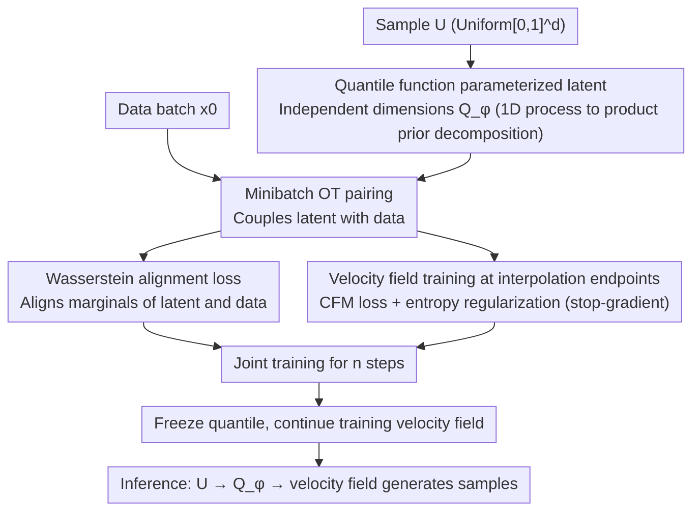

# Adapting Noise to Data: Generative Flows from Learned 1D Processes

**Conference**: ICML 2026  
**arXiv**: [2510.12636](https://arxiv.org/abs/2510.12636)  
**Code**: https://github.com/TUB-Angewandte-Mathematik/Adapting-Noise  
**Area**: Image Generation / Flow Matching  
**Keywords**: flow matching, data-adaptive noise, quantile function, non-Gaussian prior, heavy-tailed generative modeling  

## TL;DR
This paper argues that the default Gaussian latent in flow/diffusion models is not always suitable for data distributions. It proposes constructing a data-adaptive product prior using learned 1D quantile functions to jointly learn the noise and velocity field in flow matching. This approach shortens the transport path and improves performance on heavy-tailed weather data and low-capacity image generation.

## Background & Motivation
**Background**: Flow matching, diffusion, and consistency-style models typically start from a simple latent/noise distribution and learn a velocity field or score to push the latent to the data distribution. The default choice is almost always Gaussian due to ease of sampling, mature theory, and independence across dimensions.

**Limitations of Prior Work**: Gaussian latents are not necessarily suitable for data with heavy tails, compact support, or strong edge structures. For targets like heavy-tailed weather or Neal's funnel, a Gaussian starting point leads to long transport paths, requiring the velocity field to simultaneously handle marginal tail behavior and cross-dimensional dependencies. Existing heavy-tailed diffusion methods manually pick Student-t or alpha-stable noise, but tail parameters require tuning and may not match the data marginals for each dimension.

**Key Challenge**: The latent needs to be simple enough for sampling and training, yet close enough to the marginal structure of the data to reduce the difficulty of flow learning. Directly learning a full high-dimensional prior might encapsulate correlations into the latent, making it complex and unstable; fixing it as Gaussian wastes model capacity on structures that could be explained by marginal priors.

**Goal**: To learn a latent distribution that remains independent, samppable, and lightweight, but allows the marginal distribution of each dimension to adapt to the data. This leaves cross-dimensional correlations to the velocity field while marginal support/tails are handled by the quantile prior.

**Key Insight**: 1D distributions can be fully represented by quantile functions, and the Wasserstein-2 distance in 1D is equivalent to the $L_2$ distance of quantile functions. The authors parameterize the quantile of each dimension using rational quadratic splines, keeping the product latent simple while expressing heavy-tailed, compact support, and multimodal marginals.

**Core Idea**: Use 1D quantile functions to learn data-adaptive noise $\mathbf{Q}_\phi(\mathbf{U})$, optimized jointly with the velocity field via Wasserstein alignment and flow matching loss.

## Method
The paper first establishes a more general view: a high-dimensional noising process can be constructed from independent 1D processes. As long as each 1D process has an accessible velocity field, the conditional velocity for multidimensional flow matching can be constructed. The authors then formulate the 1D process as a quantile process to make the final latent distribution learnable.

### Overall Architecture
Traditional flow matching often uses linear interpolation $X_t=(1-t)X_0+tX_1$, where $X_1$ is Gaussian noise. This work replaces $X_1$ with $\mathbf{Q}_\phi(\mathbf{U})=(Q^1_\phi(U^1),\ldots,Q^d_\phi(U^d))$, where $U^i\sim\mathcal{U}(0,1)$. Each $Q^i_\phi$ is a monotonic 1D quantile function, ensuring a valid output distribution.

During training, the method computes minibatch OT assignments between data batches and quantile latent batches. This coupling is used for two purposes: minimizing the Wasserstein alignment loss between the latent and the data, and training the velocity field with OT-coupled endpoints. After several training steps, the quantile is frozen, and only the velocity field continues to be optimized, resulting in almost no extra cost during inference.

The method also discusses more general 1D processes, such as Kac processes and MMD gradient flow, and how to connect quantile interpolants to few-step/IMM-style methods. However, the main experiments focus on the learned static quantile prior. The training pipeline is shown below:

### Key Designs

**1. Decomposition from 1D processes to high-dimensional product priors**: To introduce non-Gaussian latents without manually designing high-dimensional noise PDEs, the authors ensure the dimensions of the multidimensional noise $\mathbf{N}_t=(N_t^1,\ldots,N_t^d)$ are independent. If each dimension has a 1D velocity $v_t^i$, the high-dimensional velocity is constructed by concatenation. Cross-dimensional correlations are handled by the learned velocity field rather than the noise. This allows 1D processes (like Kac or uniform/MMD) to be used for generative modeling while the latent remains independent and simple.

**2. Latent parameterization via quantile functions**: To allow marginal latents to automatically adapt to data scale, support, and tail without excessive complexity, the method uses rational quadratic splines for $Q^i_\phi$. Monotonicity constraints ensure a valid quantile. Quantile functions are chosen because they are universal representations for 1D distributions and naturally align with Wasserstein-2 (1D $W_2$ is equivalent to $L_2$ distance of quantiles), allowing different tail behaviors per dimension.

**3. Joint training of Wasserstein alignment and FM**: Training the latent based only on FM loss can lead to degeneracy—the quantile might shrink endpoint displacement to artificially lower the loss. The objective is $\mathcal{L}(\theta,\phi)=\mathcal{L}_{CFM}(\theta,\phi)+\lambda\mathcal{L}_{AN}(\phi)-\beta\mathcal{R}(\phi)$, where $\mathcal{L}_{AN}=W_2^2(\mu_0,\nu_\phi)$ performs marginal matching, and $\mathcal{R}$ is an entropy/log-det regularizer. The same minibatch OT coupling is used for both alignment and OT-FM. A stop-gradient $\mathrm{sg}(\mathbf{y}-\mathbf{x})$ is applied to the velocity target to prevent trivial collapse.

### Loss & Training
In practice, each batch samples data $\{\mathbf{x}_i\}$ and uniform latents $\{\mathbf{u}_j\}$, calculates $\mathbf{y}_j=\mathbf{Q}_\phi(\mathbf{u}_j)$, and finds the assignment minimizing $\|\mathbf{x}_i-\mathbf{y}_j\|^2$. For matched endpoints, the interpolation is $\mathbf{z}_j=(1-t_j)\mathbf{x}_{P(j)}+t_j\mathbf{y}_j$, and the velocity target is $\mathrm{sg}(\mathbf{y}_j-\mathbf{x}_{P(j)})$. The stop-gradient prevents the quantile from lowering FM loss by reducing endpoint displacement.

Quantile parameterization is lightweight: for CIFAR-10 with $d=3072$ and 32 spline bins, it involves ~300k parameters. Joint training introduces ~2.7% overhead, and freezing the quantile reduces this to ~0.5%.

## Key Experimental Results

### Main Results
The most compelling results come from HRRR-mini weather data, which exhibits strong heavy tails in total precipitation. Indicators focus on extreme event frequency, intensity, and tail distribution fit.

| Indicator | Gaussian baseline↓ | Student-t baseline↓ | Quantile (Ours)↓ | Interpretation |
|------|--------------------|---------------------|------------------|------|
| Extreme event frequency error | 0.9689 | 0.8859 | 0.7550 | Learned quantile better generates extreme precipitation |
| Extreme event magnitude error | 0.2455 | 0.1482 | 0.0634 | Significant improvement in extreme event intensity |
| Spectral distance | 3.1836 | 2.0719 | 1.1063 | Spatial spectrum is closer to real weather fields |
| Tail KS distance | 0.2067 | 0.1014 | 0.0393 | Tail distribution fit is superior to manual Student-t |
| Kurtosis deviation | 4.930 | 2.890 | 1.588 | Reduced kurtosis deviation |
| Skewness deviation | 1.157 | 0.830 | 0.580 | Reduced skewness deviation |

In image generation, for MNIST with strong marginal structures, the learned latent significantly reduces FID with low-capacity U-Nets. On CIFAR-10, where spatial/channel correlations dominate, the product prior shows smaller Gains but remains competitive. Using a larger 55M parameter model, the quantile prior achieves an FID of 3.25 vs 3.37 for Gaussian.

### Ablation Study
On CIFAR-10, the authors scan the entropy regularization strength $\beta$. Most settings outperform the Gaussian baseline at both 20-step and 100-step Euler sampling.

| Configuration | FID @ 20 steps↓ | FID @ 100 steps↓ | Description |
|------|-----------------|------------------|------|
| Quantile, $\beta=0.2$ | 7.81 | 4.75 | Better than baseline |
| Quantile, $\beta=0.3$ | 7.48 | 4.53 | Best at 20-step |
| Quantile, $\beta=0.5$ | 7.66 | 4.49 | Near best at 100-step |
| Quantile, $\beta=0.8$ | 7.77 | 4.42 | Best at 100-step |
| Quantile, $\beta=1.0$ | 8.35 | 4.66 | Strong regularization, 20-step regression |
| Gaussian baseline | 8.42 | 4.63 | Default Gaussian starting point |

### Key Findings
- Learned quantiles are most valuable for heavy-tailed data. In HRRR, all tail-centric indicators are significantly better than Gaussian and Student-t.
- The product prior does not learn inter-dimensional correlations, so smaller gains on CIFAR-10 are expected; it primarily eases the burden of modeling marginal distributions and support.
- In low-dimensional examples like checkerboard and Neal's funnel, the learned latent significantly shortens the transport path.
- Regularization $\beta$ is critical; without appropriate entropy/log-det constraints, the quantile may collapse or generate unstable gradients.

## Highlights & Insights
- The paper transforms "noise distribution selection" from a manual hyperparameter into a learnable object while keeping the latent simple and samppable.
- Quantile functions provide an elegant entry point: they are expressive in 1D, offer controlled monotonicity, and have clear Wasserstein geometry.
- Using the same minibatch OT coupling for both alignment and OT-FM is efficient.
- Experiments on heavy-tailed scientific data demonstrate the value of the method more clearly than image FID, as Gaussian limitations are magnified in extreme event modeling.

## Limitations & Future Work
- The learned latent is a product distribution and cannot directly represent correlations between dimensions.
- The signal for high-dimensional quantile learning comes from minibatch OT, which can be noisy and requires regularization and freezing strategies.
- The method has not yet been tested on higher resolutions or text-to-image conditional generation.
- Future work could explore time-dependent quantile processes or conditional quantiles to modulate latent marginals based on class or text.

## Related Work & Insights
- **vs Gaussian diffusion/FM**: Standard Gaussian is simple but light-tailed; this work uses learned quantiles to automatically adapt tail/support.
- **vs Student-t / alpha-stable noise**: Heavy-tailed noise requires manual family and parameter selection; this work learns the quantile per dimension.
- **vs normalizing-flow prior**: Full flow priors are more expressive but complex; this work restricts to product priors to keep training lightweight while leaving correlations to the velocity field.
- **Insight**: For generative models, paths and priors should not always default to Gaussian. Letting the latent capture simple marginal structures while the network models dependencies may be a more efficient division of labor.

## Rating
- Novelty: ⭐⭐⭐⭐⭐ 
- Experimental Thoroughness: ⭐⭐⭐⭐ 
- Writing Quality: ⭐⭐⭐⭐ 
- Value: ⭐⭐⭐⭐⭐ 

<!-- RELATED:START -->

## Related Papers

- [\[ICML 2026\] The Coupling Within: Flow Matching via Distilled Normalizing Flows](the_coupling_within_flow_matching_via_distilled_normalizing_flows.md)
- [\[ICML 2026\] Path-Coupled Bellman Flows for Distributional Reinforcement Learning](path-coupled_bellman_flows_for_distributional_reinforcement_learning.md)
- [\[CVPR 2026\] Improved Mean Flows: On the Challenges of Fastforward Generative Models](../../CVPR2026/image_generation/improved_mean_flows_on_the_challenges_of_fastforward_generative_models.md)
- [\[NeurIPS 2025\] Flow Matching Neural Processes](../../NeurIPS2025/image_generation/flow_matching_neural_processes.md)
- [\[ICML 2025\] Normalizing Flows are Capable Generative Models](../../ICML2025/image_generation/normalizing_flows_are_capable_generative_models.md)

<!-- RELATED:END -->
