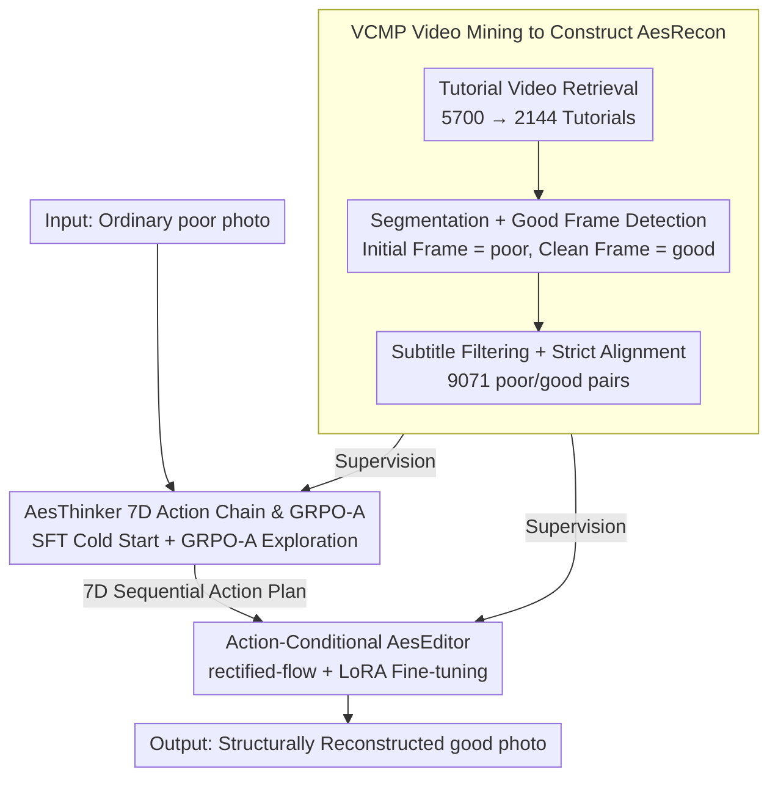

# AesFormer: Transform Everyday Photos into Beautiful Memories

**Conference**: ICML 2026  
**arXiv**: [2605.22126](https://arxiv.org/abs/2605.22126)  
**Code**: https://github.com/PKU-ICST-MIPL/AesFormer_ICML2026  
**Area**: Image Generation / Image Editing  
**Keywords**: Aesthetic Photo Reconstruction, Image Editing, Structural Reconstruction, GRPO-A, AesRecon  

## TL;DR
AesFormer defines aesthetic photo enhancement as Aesthetic Photo Reconstruction (APR). It introduces a two-stage framework that first generates a photography action plan and then executes structural editing, transforming errors in composition, perspective, and pose into executable edits. It significantly outperforms open-source editors on AesRecon and approaches the performance of Nano Banana Pro.

## Background & Motivation
**Background**: Photo post-processing has long been divided into two categories: retouching, which primarily adjusts exposure, contrast, color, and overall style; and portrait enhancement, which focuses on skin, face, and detail modification. Recent diffusion and flow-matching image editing models can modify images based on text instructions but focus more on semantic consistency and instruction following.

**Limitations of Prior Work**: Issues in many casual photos are not due to poor color but poor structural decisions at the moment of capture, such as off-center subjects, distracting backgrounds, ruined depth from camera angles, stiff poses, or imbalanced composition. Traditional retouching cannot "re-shoot" the composition. Even when general image editors receive instructions like "make it look better," they often only make local appearance adjustments, struggling to diagnose and fix structural photography issues.

**Key Challenge**: APR requires the model to reconstruct structural attributes like composition, perspective, pose, and depth of field while maintaining person identity and scene semantics. It is neither simple beautification nor arbitrary new image generation; it must find a balance between "fidelity" and "aesthetic re-shooting."

**Goal**: The authors propose the Aesthetic Photo Reconstruction task, construct a strictly aligned poor/good image pair dataset, and train a system capable of first understanding photography aesthetics and then executing structural editing.

**Key Insight**: The paper decomposes the problem into two models: AesThinker, which analyzes the input photo like a photographer and outputs sequential editing actions; and AesEditor, which translates these actions into pixel-level structural reconstruction. This avoids requiring a single image editor to handle both aesthetic diagnosis and complex execution simultaneously.

**Core Idea**: Use photography tutorial videos to mine before/after pairs to learn "action plans from poor to good photos," then execute these plans with an action-conditional editor, decoupling aesthetic planning from image reconstruction.

## Method
The core of AesFormer consists of three parts: data, planning, and editing. On the data side, VCMP is used to mine AesRecon from tutorial videos; on the planning side, AesThinker is trained to generate sequential actions across seven photography dimensions; on the editing side, AesEditor is trained to perform structural reconstruction based on these actions.

### Overall Architecture
The input is a poor photo taken by an ordinary user. In Stage 1, AesThinker reads the photo and prompt to output a sequential action plan covering seven progressive dimensions: aspect ratio, framing/composition, camera viewpoint, subject placement, pose/action, focus/depth-of-field, and color/light. In Stage 2, AesEditor receives the original image and the action plan to generate the reconstructed photo using a flow-matching editor. During training, action supervision comes from poor/good pairs and tutorial video text cues in AesRecon; editing supervision comes from strictly aligned poor/good/action triplets.

### Key Designs

**1. VCMP Video Mining for AesRecon: Extracting "Same Subject, Same Scene" Paired Training Data from Tutorials**

Training data for APR is demanding—it requires poor/good pairs of the same subject in the same scene, where aesthetic differences stem from photography structure (composition, pose) rather than changing the person or environment. VCMP exploits the fact that photography tutorial videos naturally record the process of a single shooting event from "poorly shot" to "well shot." First, 5,700 candidate videos are retrieved from Rednote, TikTok, and YouTube using photography teaching keywords. After removing duplicates and filtering out ads or non-step-by-step demos, 2,144 tutorials remain. Frames are sampled at 2 fps for each event. Qwen2.5-VL-72B identifies clean good frames and treats initial event frames as poor images to form coarse pairs. Following this, three refinement stages are applied: filtering low-quality good images using aesthetic scorers and VLMs; removing subtitles and camera UIs from poor images using Qwen-Image-Edit (with GPT-4o verifying identity/scene consistency); and finally, VLM verification of the same person/scene/event. This results in 9,071 strictly aligned pairs. Multi-stage filtering is essential because raw videos contain ads, transition blurs, and UI overlays that would otherwise hinder training structural differences.

**2. AesThinker 7D Sequential Action Chain & GRPO-A: Translating Vague "Better" into Executable Sequential Photography Actions**

General editors struggle with instructions like "make the photo more beautiful" because they do not know what is structurally wrong or in what order to fix it. AesThinker formalizes aesthetic planning into a 7D sequential action chain: aspect ratio → framing/composition → camera viewpoint → subject placement → pose/action → focus/depth-of-field → color/light, progressing from global composition to local lighting. This order is not arbitrary—while these decisions are largely separable, unidirectional dependencies exist (e.g., discussing depth of field is ill-posed before the subject’s position is determined). A fixed order stabilizes the planning and yields a decomposable action space. Training involves two steps: first, distilling ground-truth actions using GPT-5.2 based on poor/good/text cues and verifying them with Gemini 3, followed by SFT cold-starting Qwen3-VL-8B. However, SFT alone overfits to single annotated trajectories, whereas aesthetic solutions are multi-modal. Thus, GRPO-A is used: multiple action plans are sampled per poor image, and a total reward is calculated based on "format reward + semantic alignment with reference + creativity/aesthetic gain" (evaluated by Qwen2.5-VL-32B as a training-free reward model). Using relative advantages within groups to update the policy encourages diverse yet executable solutions, breaking the limits of single-trajectory imitation.

**3. Action-Conditional AesEditor: Reliably Mapping High-Level Actions to Pixel-Level Reconstruction**

Given an action plan, an executor is needed to map "improve composition/viewpoint/pose" to pixel changes. Generic editors might follow instructions but often fail structural ones. AesEditor uses Qwen-Image-Edit-2511 as a base, freezing the multimodal encoder and VAE while performing LoRA fine-tuning on the MMDiT. Given a poor image and action sequence, it learns the action-conditional velocity field in a rectified-flow framework, predicting $v_t=x_0-x_1$. Tuning on APR triplets helps the editor learn the mapping between "photography actions $\leftrightarrow$ structural reconstruction" rather than just general instruction following.

### Loss & Training
Stage 1(a) uses standard autoregressive SFT to maximize the conditional probability of the action sequence. Stage 1(b) utilizes GRPO-A: multiple action sequences are sampled for the same input, advantages are calculated via group reward normalization, and a KL penalty is applied relative to the reference policy. Reward weights are $\lambda_f=0.1$, $\lambda_a=0.5$, and $\lambda_c=0.4$. Stage 2 uses the flow-matching loss $\mathcal{L}_{edit}=\mathbb{E}\|v_\psi(x_t,t,h)-v_t\|_2^2$. Experiments were conducted on 10 NVIDIA A40 48GB GPUs.

## Key Experimental Results

### Main Results

| Method | Thinker | GPT-4o win vs. Poor↑ | Human win vs. Poor↑ | GPT-4o win vs. Good↑ | Human win vs. Good↑ | ArtiMuse↑ | LAION-V2↑ | Q-ALIGN↑ |
|------|---------|-----------------|-----------------|-----------------|-----------------|-----------|-----------|----------|
| Nano Banana Pro | None | 54.44 | 72.55 | 16.67 | 21.95 | 50.90 | 5.59 | 3.24 |
| FLUX.1 Kontext | None | 12.96 | 5.88 | 2.66 | 3.66 | 38.34 | 5.07 | 2.83 |
| Bagel | None | 12.40 | 17.65 | 7.75 | 12.20 | 37.69 | 4.94 | 2.58 |
| Step1X-Edit-v1.1 | None | 15.28 | 11.76 | 13.84 | 13.41 | 37.14 | 5.33 | 3.37 |
| Qwen-Image-Edit-2511 | None | 16.50 | 9.80 | 7.64 | 12.20 | 46.65 | 5.44 | 3.20 |
| **Ours** | AesThinker | 65.33 | 68.63 | 26.25 | 24.39 | 47.76 | 5.60 | 3.51 |

### Ablation Study

| Configuration | GPT-4o win vs. Poor↑ | GPT-4o win vs. Good↑ | ArtiMuse↑ | LAION-V2↑ | Q-ALIGN↑ | Description |
|------|-----------------|-----------------|-----------|-----------|----------|------|
| Baseline (Edit-2511) | 16.50 | 7.64 | 46.65 | 5.44 | 3.20 | Base editor only |
| S1a shuffle | 58.69 | 18.60 | 46.16 | 5.49 | 3.36 | Shuffled 7D action order |
| S1a | 61.04 | 24.58 | 47.70 | 5.58 | 3.48 | SFT AesThinker only |
| S1a + S2 | 61.13 | 24.14 | 47.74 | 5.58 | 3.46 | Action-conditional editor w/o GRPO-A |
| S1a + S1b + S2 | 65.33 | 26.25 | 47.76 | 5.60 | 3.51 | Full AesFormer |

### Key Findings
- APR is difficult for general open-source editors: FLUX, Bagel, Step1X, and Qwen-Image-Edit show GPT-4o win rates vs. poor of only 12–17%, indicating they rarely improve structural aesthetics.
- AesFormer achieves a GPT-4o win rate vs. poor of 65.33%, surpassing Nano Banana Pro's 54.44%; human win rate vs. good is 24.39%, also slightly higher than Nano Banana Pro’s 21.95%. This shows specialized APR data and decoupling planning from editing can close the gap with high-end closed-source systems.
- External general Thinkers are unstable. In Table 1, adding Qwen3 or GPT-4o planners to FLUX or Bagel did not yield consistent improvements, suggesting both the planner and editor need specialized APR alignment.
- The 7D order is an important inductive bias. Shuffling lowered the win rate vs. poor from 61.04 to 58.69, confirming that global-to-local sequencing helps the model form a photography workflow.

## Highlights & Insights
- The paper decomposes "making photos better" into structural photography decisions rather than vague aesthetic descriptions, turning APR into a trainable and evaluatable action-conditioned editing task.
- Mining data from tutorial videos is clever: tutorials naturally contain before/after transitions and action explanations for the same shooting event, which is more reliable than hard-matching poor/good pairs from static sets.
- The reward design for GRPO-A balances format, alignment, and creativity, matching the multi-solution nature of aesthetic tasks. It rewards executable plans that bring aesthetic gains rather than just one correct answer.
- The comparison between AesFormer and general editors suggests that strong editing ability $\neq$ photography aesthetic ability. Editors need to know "how to change pixels," but more importantly, the upstream planner must know "why to change them."

## Limitations & Future Work
- AesRecon is derived from tutorials, potentially biasing styles towards portraits, street photography, and social media content; coverage of journalism, commercial studio work, or non-portrait scenes is less clear.
- Evaluation relies heavily on GPT-4o and aesthetic scorers. Despite human validation, aesthetic preferences may still be affected by evaluator bias. More granular user studies would be beneficial.
- Nano Banana Pro was only evaluated on a 10% subset due to API costs, making closed-source comparisons not perfectly equivalent.
- Structural reconstruction may alter documented reality, raising authenticity and ethical concerns, especially in documentary photography. Future work should address controllable editing intensity and provenance marking.

## Related Work & Insights
- **vs. photo retouching**: Retouching improves appearance but cannot change composition/viewpoint; AesFormer directly addresses structural reconstruction.
- **vs. portrait enhancement**: Enhancement focuses on skin and facial details (appearance-centric), while APR focuses on subject placement, pose, and scene relationships.
- **vs. instruction image editing**: General models require explicit user instructions; AesFormer diagnoses issues and generates plans independently, acting as a "photography assistant."
- **vs. EditThinker / iterative editing agents**: While related works emphasize reasoning or multi-round tools, this paper defines an ordered action space and strictly aligned data specifically for photography aesthetics.

## Rating
- Novelty: ⭐⭐⭐⭐ APR task definition, tutorial mining, and the 7D photography action chain are integrated innovatively. GRPO-A is a reasonable enhancement.
- Experimental Thoroughness: ⭐⭐⭐⭐ Includes a new benchmark, closed/open-source comparisons, automatic and manual evaluations, and stage ablations; though closed-source models were evaluated on a subset.
- Writing Quality: ⭐⭐⭐⭐ Clear storyline, logically progressing from data bottlenecks to decoupled planning and editing.
- Value: ⭐⭐⭐⭐ Inspires a shift from "instruction following" to "aesthetic diagnosis and proactive repair" in image editing, with reusable data construction methods.

<!-- RELATED:START -->

## Related Papers

- [\[CVPR 2025\] Memories of Forgotten Concepts](../../CVPR2025/image_generation/memories_of_forgotten_concepts.md)
- [\[CVPR 2025\] h-Edit: Effective and Flexible Diffusion-Based Editing via Doob's h-Transform](../../CVPR2025/image_generation/h-edit_effective_and_flexible_diffusion-based_editing_via_doobs_h-transform.md)
- [\[AAAI 2026\] Beautiful Images, Toxic Words: Understanding and Addressing Offensive Text in Generated Images](../../AAAI2026/image_generation/beautiful_images_toxic_words_understanding_and_addressing_offensive_text_in_gene.md)
- [\[ICML 2026\] SpatialReward: Bridging the Perception Gap in Online RL for Image Editing via Explicit Spatial Reasoning](spatialreward_bridging_the_perception_gap_in_online_rl_for_image_editing_via_exp.md)
- [\[ICML 2026\] Unified Masked Diffusion Models with Diverse Generation Orders](unifying_masked_diffusion_models_with_various_generation_orders_and_beyond.md)

<!-- RELATED:END -->
