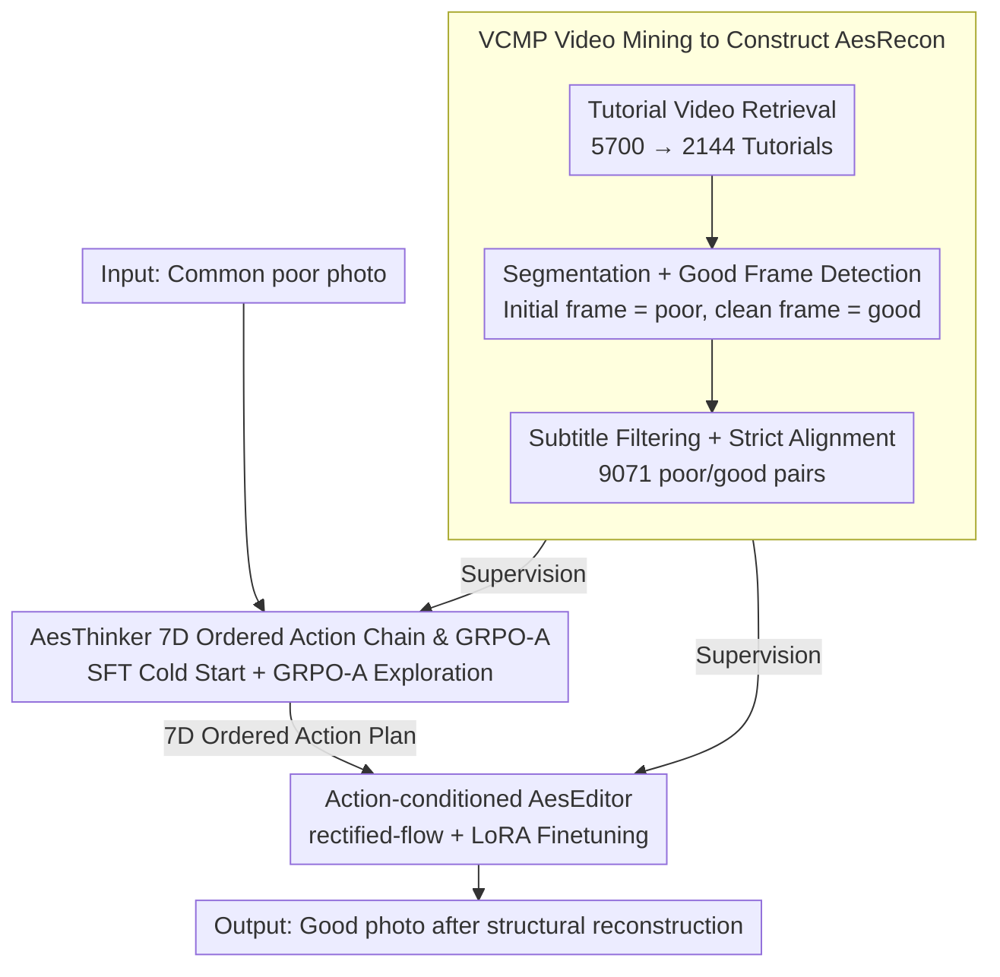

# AesFormer: Transform Everyday Photos into Beautiful Memories

**Conference**: ICML 2026  
**arXiv**: [2605.22126](https://arxiv.org/abs/2605.22126)  
**Code**: https://github.com/PKU-ICST-MIPL/AesFormer_ICML2026  
**Area**: Image Generation / Image Editing  
**Keywords**: Aesthetic Photo Reconstruction, Image Editing, Structural Reconstruction, GRPO-A, AesRecon  

## TL;DR
AesFormer defines everyday photo enhancement as Aesthetic Photo Reconstruction (APR). By employing a two-stage framework that first generates a photographic action plan and then executes structural editing, it transforms photographic errors in composition, perspective, and pose into executable edits. It significantly outperforms open-source editors and approaches Nano Banana Pro on the AesRecon dataset.

## Background & Motivation
**Background**: Photo post-processing has long been divided into two categories: retouching, which primarily adjusts exposure, contrast, color, and overall style; and portrait enhancement, which focuses on skin, face, and detail refinement. Recent diffusion and flow-matching image editing models can modify images based on text instructions but focus more on semantic consistency and instruction following.

**Limitations of Prior Work**: Issues in many common photos stem not from poor color, but from suboptimal structural decisions at the moment of capture, such as off-center subject placement, distracting backgrounds, perspective-ruining depth, stiff poses, or imbalanced composition. Traditional retouching cannot "reshoot" the composition. General image editors, even when given instructions like "make it look better," often only perform local appearance adjustments and fail to diagnose or repair structural photography problems.

**Key Challenge**: APR requires the model to reconstruct structural attributes like composition, perspective, pose, and depth of field while maintaining identity and scene semantics. This is neither simple beautification nor arbitrary new image generation; it requires finding a balance between fidelity and "aesthetic reshooting."

**Goal**: The authors propose the Aesthetic Photo Reconstruction task, construct a strictly aligned poor/good image pair dataset, and train a system capable of first understanding photographic aesthetics and then executing structural edits.

**Key Insight**: The problem is decomposed into two models: AesThinker analyzes the input photo like a photographer and outputs sequential editing actions; AesEditor transforms these actions into pixel-level structural reconstructions. This avoids burdening a single image editor with both aesthetic diagnosis and complex execution.

**Core Idea**: Use photography tutorial videos to mine before/after pairs to learn "action plans" from poor to good photos, then use an action-conditioned editor to execute these plans, decoupling aesthetic planning from image reconstruction.

## Method
The core of AesFormer consists of three parts: data, planning, and editing. On the data side, VCMP mines AesRecon from tutorial videos; on the planning side, AesThinker is trained to generate ordered actions across seven photographic dimensions; on the editing side, AesEditor is trained to execute structural reconstruction based on these actions.

### Overall Architecture
The input is a "poor" photo captured by an ordinary user. Stage 1's AesThinker reads the photo and prompt to output an ordered action plan covering seven progressive dimensions: aspect ratio, framing/composition, camera viewpoint, subject placement, pose/action, focus/depth-of-field, and color/light. Stage 2's AesEditor receives the original image and the action plan to generate the reconstructed photo using a flow-matching editor. During training, action supervision comes from poor/good pairs and tutorial video text cues in AesRecon; editing supervision comes from strictly aligned poor/good/action triplets. The entire pipeline connects data, planning, and editing, corresponding to the three key designs below.

### Key Designs

**1. VCMP Video Mining to Construct AesRecon: Extracting "same subject, same scene" paired training data from tutorial videos**

Training data for APR is demanding—it requires poor/good pairs of the same subject in the same scene, where aesthetic differences stem from photographic structure (composition, pose) rather than scene changes or simple color grading. Such pairs are virtually non-existent in current datasets. VCMP exploits the fact that photography tutorials naturally record the full process of a single shooting event from "poor" to "good." It retrieves 5,700 candidate videos using photography keywords from Rednote, TikTok, and YouTube, retaining 2,144 tutorials after deduplication and filtering for ads or non-demonstration content. Frames are sampled at 2 fps, and Qwen2.5-VL-72B is used to identify clean good frames, while initial event frames are treated as poor images to form coarse pairs. These undergo three refinement stages: using quality/aesthetic scorers and VLMs to filter low-quality good images; using Qwen-Image-Edit to remove subtitles and camera UIs from poor images (with GPT-4o verifying identity and scene consistency); and finally using VLMs for strict verification of identity, scene, and event. This results in 9,071 strictly aligned pairs. This multi-stage filtering is essential because raw videos contain transitions, blurs, and UI overlays that would otherwise prevent training on structural differences.

**2. AesThinker 7D Ordered Action Chain & GRPO-A: Translating vague "make it better" into executable, sequential photographic actions**

General editors struggle with instructions like "beautify this photo" because they lack a diagnosis of structural flaws and an execution order. AesThinker formulates aesthetic planning as an ordered chain across seven dimensions: aspect ratio $\to$ framing/composition $\to$ camera viewpoint $\to$ subject placement $\to$ pose/action $\to$ focus/depth-of-field $\to$ color/light, progressing from global composition to local lighting. This order is not arbitrary—while these decisions are largely separable, unidirectional dependencies exist (e.g., depth of field is ill-posed before subject placement is determined); a fixed order stabilizes planning into a decomposable action space. Training occurs in two steps: first, distilling ground-truth actions using GPT-5.2 based on poor/good/text cues and verifying integrity with Gemini 3, followed by SFT cold-starting Qwen3-VL-8B. Since SFT overfits to single annotation trajectories and photography is inherently multi-solution, GRPO-A is used for reinforcement. For each poor image, multiple action plans are sampled, and a total reward is calculated based on "format reward + semantic alignment with reference + creativity/aesthetic gain" (evaluated by Qwen2.5-VL-32B as a training-free reward model). Using relative group advantage to update the policy encourages diverse yet executable solutions, moving beyond SFT's single-trajectory imitation.

**3. Action-conditioned AesEditor: Mapping high-level photographic actions to pixel-level structural reconstruction**

With an upstream action plan, an executor is needed to map "improve composition/perspective/pose" to pixel changes. Standard editors often fail these structural commands. AesEditor uses Qwen-Image-Edit-2511 as a backbone, freezing the multimodal encoder and VAE while performing LoRA fine-tuning on the MMDiT. Given the poor image, good reference, and action sequence, it learns an action-conditioned velocity field in a rectified-flow framework, predicting $v_t=x_0-x_1$. During inference, it generates reconstruction results based on AesThinker's output plan. Finetuning on APR triplets ensures the editor learns the correspondence between photographic actions and structural changes.

### Loss & Training
Stage 1(a) uses standard autoregressive SFT to maximize the conditional probability of the action sequence given the input photo and prompt. Stage 1(b) utilizes GRPO-A: sampling multiple sequences per input, normalizing rewards within the group to obtain advantage, and adding a KL penalty relative to the reference policy; reward weights are set to $\lambda_f=0.1$, $\lambda_a=0.5$, and $\lambda_c=0.4$. Stage 2 employs the flow-matching loss $\mathcal{L}_{edit}=\mathbb{E}\|v_\psi(x_t,t,h)-v_t\|_2^2$. Experiments were conducted on 10 NVIDIA A40 48GB GPUs.

## Key Experimental Results

### Main Results
| Method | Thinker | GPT-4o Win vs. Poor↑ | Human Win vs. Poor↑ | GPT-4o Win vs. Good↑ | Human Win vs. Good↑ | ArtiMuse↑ | LAION-V2↑ | Q-ALIGN↑ |
|------|---------|-----------------|-----------------|-----------------|-----------------|-----------|-----------|----------|
| Nano Banana Pro | None | 54.44 | 72.55 | 16.67 | 21.95 | 50.90 | 5.59 | 3.24 |
| FLUX.1 Kontext | None | 12.96 | 5.88 | 2.66 | 3.66 | 38.34 | 5.07 | 2.83 |
| Bagel | None | 12.40 | 17.65 | 7.75 | 12.20 | 37.69 | 4.94 | 2.58 |
| Step1X-Edit-v1.1 | None | 15.28 | 11.76 | 13.84 | 13.41 | 37.14 | 5.33 | 3.37 |
| Qwen-Image-Edit-2511 | None | 16.50 | 9.80 | 7.64 | 12.20 | 46.65 | 5.44 | 3.20 |
| AesFormer | AesThinker | 65.33 | 68.63 | 26.25 | 24.39 | 47.76 | 5.60 | 3.51 |

### Ablation Study
| Configuration | GPT-4o Win vs. Poor↑ | GPT-4o Win vs. Good↑ | ArtiMuse↑ | LAION-V2↑ | Q-ALIGN↑ | Description |
|------|-----------------|-----------------|-----------|-----------|----------|------|
| Baseline (Edit-2511) | 16.50 | 7.64 | 46.65 | 5.44 | 3.20 | Base editor only |
| S1a shuffle | 58.69 | 18.60 | 46.16 | 5.49 | 3.36 | Shuffled action order; lower than ordered chain |
| S1a | 61.04 | 24.58 | 47.70 | 5.58 | 3.48 | Added SFT AesThinker only |
| S1a + S2 | 61.13 | 24.14 | 47.74 | 5.58 | 3.46 | Added action-conditioned editor, no GRPO-A |
| S1a + S1b + S2 | 65.33 | 26.25 | 47.76 | 5.60 | 3.51 | Full AesFormer; GRPO-A provides further gains |

### Key Findings
- APR is difficult for general open-source editors: GPT-4o win rates vs. poor for FLUX, Bagel, Step1X, and Qwen-Image-Edit are within 12–17%, indicating they rarely improve structural aesthetics.
- AesFormer achieves a GPT-4o win rate vs. poor of 65.33%, surpassing Nano Banana Pro (54.44%); its human win rate vs. good is 24.39%, also slightly higher than Nano Banana Pro (21.95%). This demonstrates that specialized APR data and planning-editing decoupling can bridge the gap between open-source and strong closed-source systems.
- Attaching external general Thinkers is unstable. In Table 1, providing Qwen3 or GPT-4o planners to FLUX, Bagel, Step1X, or Qwen-Image-Edit does not consistently improve performance (sometimes decreasing it), suggesting that both the planner and editor require specific APR alignment.
- The 7D sequence is a crucial inductive bias. Shuffling it reduces the GPT-4o win rate vs. poor from 61.04 to 58.69, confirming that a "global to local" workflow helps the model form a valid photographic process.

## Highlights & Insights
- The paper decomposes "better photos" into structural photographic decisions rather than vague aesthetic descriptions. This transforms APR from a subjective slogan into a trainable, evaluable action-conditioned editing task.
- Mining tutorial videos is highly effective: tutorials naturally provide before/after states, action explanations, and consistent events, which is more reliable than forced poor/good pairings from static image sets.
- GRPO-A reward design balances format, alignment, and creativity, matching the multi-solution nature of aesthetic tasks. It rewards solutions that are executable and yield aesthetic gains rather than just a single ground truth.
- The success/failure contrast of AesFormer highlights that strong editing capability does not equate to photographic aesthetic capability. An editor needs to know "how to change pixels," but the upstream planner must know "why to change them."

## Limitations & Future Work
- AesRecon originates from tutorial videos; styles and subjects may lean toward portraits, street photography, and social media content favored by creators. Coverage of news, documentary, or commercial studio photography is unclear.
- Evaluation relies heavily on GPT-4o and aesthetic scorers. While validated by human subsets, aesthetic preferences may still be influenced by evaluator bias.
- Nano Banana Pro was only evaluated on a 10% test subset due to API costs, making the comparison somewhat limited.
- Structural reconstruction may alter the truth of a record, raising authenticity and ethical concerns, especially in documentary photography. Future work should allow for controllable intensity, change explanations, and provenance marking.

## Related Work & Insights
- **vs photo retouching**: Retouching primarily adjusts color and light to improve look but cannot change composition or perspective; AesFormer directly targets structural reconstruction.
- **vs portrait enhancement**: Portrait enhancement focuses on skin, face, and details (appearance-centric); APR focuses on subject placement, pose, depth, and scene relationships.
- **vs instruction image editing**: General editing models require explicit user instructions; AesFormer diagnoses photo issues and generates action plans independently, acting as a "photography assistant."
- **vs EditThinker / iterative editing agents**: While related works emphasize reasoning or iterative tool use, this work defines a specific ordered action space and strictly aligned data sources for photographic aesthetics.

## Rating
- Novelty: ⭐⭐⭐⭐ The combination of APR task definition, tutorial video mining, and 7D action chains is novel; GRPO-A is a reasonable enhancement.
- Experimental Thoroughness: ⭐⭐⭐⭐ Includes a new benchmark, closed/open source comparisons, and comprehensive ablations, though closed-source comparison uses a subset.
- Writing Quality: ⭐⭐⭐⭐ Clear storyline from data bottlenecks to planning-editing decoupling; tables are well-explained.
- Value: ⭐⭐⭐⭐ Insightful for moving image editing from "following instructions" to "aesthetic diagnosis and proactive repair"; the data construction method is reusable.

<!-- RELATED:START -->

## Related Papers

- [\[CVPR 2025\] Memories of Forgotten Concepts](../../CVPR2025/image_generation/memories_of_forgotten_concepts.md)
- [\[CVPR 2025\] h-Edit: Effective and Flexible Diffusion-Based Editing via Doob's h-Transform](../../CVPR2025/image_generation/h-edit_effective_and_flexible_diffusion-based_editing_via_doobs_h-transform.md)
- [\[AAAI 2026\] Beautiful Images, Toxic Words: Understanding and Addressing Offensive Text in Generated Images](../../AAAI2026/image_generation/beautiful_images_toxic_words_understanding_and_addressing_offensive_text_in_gene.md)
- [\[ICML 2026\] SpatialReward: Bridging the Perception Gap in Online RL for Image Editing via Explicit Spatial Reasoning](spatialreward_bridging_the_perception_gap_in_online_rl_for_image_editing_via_exp.md)
- [\[ICML 2026\] 统一不同生成顺序的掩码扩散模型](unifying_masked_diffusion_models_with_various_generation_orders_and_beyond.md)

<!-- RELATED:END -->
