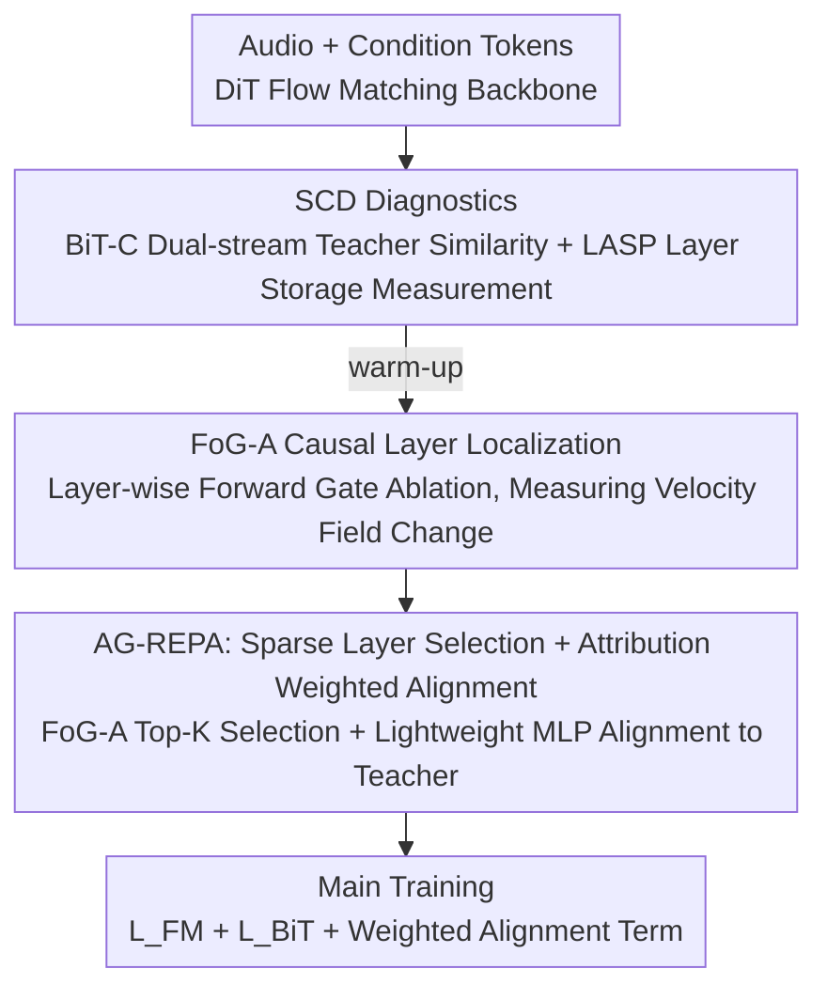

# AG-REPA: Causal Layer Selection for Representation Alignment in Audio Flow Matching

**Conference**: ICML 2026  
**arXiv**: [2603.01006](https://arxiv.org/abs/2603.01006)  
**Code**: https://github.com/zpforlove/AG-REPA  
**Area**: Audio Generation / Flow Matching  
**Keywords**: REPA, Audio Generation, Flow Matching, Causal Attribution, Layer Selection  

## TL;DR
AG-REPA discovers that in audio Flow Matching, the "layers storing semantic information" and the "layers actually driving the velocity field" do not coincide. It proposes using forward-only gate ablation to select layers with the highest causal contribution for representation alignment, achieving faster convergence and lower FAD than fixed-layer REPA in speech and general audio generation.

## Background & Motivation
**Background**: Flow Matching has become an important paradigm for speech synthesis and general audio generation, learning samples by modeling a continuous velocity field from noise to the audio data distribution. REPresentation Alignment (REPA) is a technique used in recent years to accelerate generative model training by aligning intermediate hidden states with pre-trained teacher features, allowing the model to acquire useful representations faster.

**Limitations of Prior Work**: In the vision domain, REPA typically selects an intermediate layer or a fixed depth for alignment based on empirical rules. However, the architecture of audio Flow Matching differs. Token-conditioned audio generation requires decoding from sparse discrete tokens to continuous waveforms, lacking the dense spatial anchors found in images or videos. Following fixed middle-layer alignment might supervise layers that "represent features similar to the teacher but contribute little to the velocity field."

**Key Challenge**: Representational similarity does not equal functional contribution. A layer might be proficient at storing semantic or acoustic information but might not be the layer that most influences the velocity field in the current generation dynamics. Aligning such layers makes training appear to acquire teacher information without applying supervision to the positions that actually control the generation trajectory.

**Goal**: The authors aim to answer "which layers should be aligned in audio Flow Matching REPA." They intend to identify not only information storage locations but also locations with causal influence on the velocity field output, constructing more effective layer selection and weighting strategies based on this.

**Key Insight**: The paper introduces the Store-Contribute Dissociation (SCD) viewpoint: deep layers are often "semantic storage," while shallow or intermediate transition layers are likely the "causal drivers." Thus, the approach shifts from representation diagnostics to causal attribution, using forward-only gate ablation to directly measure the change in the velocity field after removing a specific layer.

**Core Idea**: Instead of applying REPA to layers with the highest teacher similarity, use FoG-A to identify the Top-K layers that most significantly change the velocity field and assign alignment weights according to their attribution strength.

## Method

### Overall Architecture
AG-REPA addresses which layers should be aligned in audio Flow Matching. Traditional methods use empirical fixed-layer alignment, but the authors found that "layers most similar to the teacher" and "layers most affecting the velocity field" do not overlap. The approach first uses diagnostic tools to separate these two properties, then performs sparse, weighted alignment only on layers that truly drive generation. The model itself is a unified audio generation framework for both TTS and Text-to-Audio. The speech side uses semantic tokens, and the general audio side uses event/acoustic tokens, sharing a DiT-based Flow Matching backbone. In the warm-up phase, the authors measure similarity between various layer representations and Whisper/BEATs teachers, then perform gate ablation on each layer to observe velocity field changes, finally selecting high-contribution layers for alignment via lightweight projection heads.

### Key Designs

**1. SCD Diagnostic: Separating "Representation Storage" and "Functional Contribution"**

This step addresses the pain point where layers with high teacher similarity are assumed to be the most effective for supervision. Since generative models predict a velocity field, information storage in a layer does not guarantee that optimization there is most effective. The authors use two probes: BiT-C establishes a dual-stream cosine alignment with Whisper and BEATs, while LASP compares information storage across layers using a shared frozen projection head in the same teacher space. The results are clear: semantic similarity (Cos-SEM) peaks in deep layers (L22–L24), while event similarity (Cos-EVT) varies between deep or middle layers depending on the token topology. Thus, similarity-based metrics would direct alignment toward the deep "representation reservoir," which might not be the leverage points in generation dynamics. This "Store-Contribute Dissociation" (SCD) phenomenon justifies moving away from fixed-layer alignment.

**2. FoG-A: Localizing Causal Layers via Forward-only Gate Ablation**

After diagnosing that "looking like a teacher" is not the same as "driving generation," a tool is needed to measure functional necessity. FoG-A writes the DiT residual layer as $h_l=h_{l-1}+m_l f_l(h_{l-1},t,c)$, where $m_l=1$ in standard forward passes. To test layer $k$, $m_k$ is set to 0 to "remove" it from the forward pass without backpropagating gradients. The normalized difference between the ablated velocity field $v_\theta^{\setminus k}$ and the original $v_\theta$ is measured—higher difference indicates the layer significantly changes the generation direction and is thus a causal driver. Unlike gradient norms (reflecting current updates) or LASP (reflecting storage), FoG-A answers "how necessary is this layer for the final generation function" through direct intervention, making it more relevant to where alignment should act. It requires no additional probes or backpropagation, incurring minimal cost.

**3. AG-REPA: Sparse Layer Selection + Attribution Weighted Alignment**

With FoG-A scores, REPA is transformed from a fixed-depth heuristic to adaptive causal supervision. The authors select the Top-K layers based on FoG-A scores to form set $\mathcal{S}$, and assign alignment weights proportional to attribution strength: $\lambda_k=\mathrm{FoG\text{-}A}_k/\sum_{j\in\mathcal{S}}\mathrm{FoG\text{-}A}_j$. Each selected layer is followed by a lightweight two-layer MLP that aligns the temporal-pooled hidden state with the frozen teacher embedding. The final objective adds the BiT-C anchor and these alignment terms to the Flow Matching loss: $\mathcal{L}_{FM}+\lambda_{BiT}\mathcal{L}_{BiT}+\sum_{k\in\mathcal{S}}\lambda_k(1-\cos(h_{\phi_k}(\bar{h}_k),\mathcal{T}(x)))$. This design handles scenarios where generation is controlled by multiple layers with uneven contributions, outperforming single-layer REPA or fixed L1–L3 heuristics.

### Loss & Training
AG-REPA is computationally efficient. FoG-A is triggered every 200 steps during a 5,000-step warm-up phase, using small batches without gradients on a single GPU (approx. 41 equivalent forward passes total), adding less than 0.5% in wall-clock time. Main training adds only $K=3$ lightweight MLP heads (less than 0.5% extra parameters), with per-step overhead under 2%. Thus, causal layer selection and alignment are achieved with almost no additional cost.

## Key Experimental Results

### Main Results

| Method | Speech WER↓ | Speech FAD↓ | Audio FAD↓ | Speech MOS↑ | Audio MOS↑ |
|------|-------------|-------------|------------|-------------|------------|
| Base (no layer align.) | 5.82 | 1.84 | 3.45 | 3.62±0.08 | 3.45±0.09 |
| REPA @ Layer 4 | 5.15 | 1.65 | 3.12 | 3.75±0.07 | 3.58±0.08 |
| REPA @ Layer 8 | 4.93 | 1.58 | 3.05 | 3.79±0.06 | 3.64±0.08 |
| REPA @ L4,8,12 | 4.21 | 1.45 | 2.88 | 3.92±0.06 | 3.77±0.07 |
| REPA @ Deep (L20–L22) | 5.60 | 1.79 | 3.39 | 3.64±0.08 | 3.48±0.09 |
| REPA @ Shallow (L1–L3) | 3.62 | 1.36 | 2.68 | 4.05±0.06 | 3.87±0.07 |
| AG-REPA (Top-3) | 3.45 | 1.29 | 2.56 | 4.12±0.05 | 3.94±0.07 |

### Ablation Study

| Selection Strategy | Top-3 Layers | Speech FAD↓ | Audio FAD↓ | Gain | Convergence Steps |
|----------|---------|-------------|------------|----------|----------|
| Base | None | 1.84 | 3.45 | 0.0% | N/A |
| Random Control | L5,L14,L19 | 1.75 | 3.32 | +4.9% | 850k |
| Highest LASP | L22,L23,L24 | 1.68 | 3.21 | +8.7% | 720k |
| Gradient Norm | L1,L2,L4 | 1.35 | 2.71 | +26.6% | 260k |
| Highest FoG-A | L1,L2,L7 | 1.29 | 2.56 | +29.9% | 220k |

### Key Findings
- SCD is prominent: In Config B, top layers for Cos-SEM are L23/L22/L24 and for Cos-EVT are L14/L13/L15, yet FoG-A selects L1/L2/L7 for speech and L1/L7/L2 for audio. deep layers are more "teacher-like," while shallow/middle layers more significantly influence the velocity field.
- Compared to the best fixed-layer REPA, AG-REPA reduces speech FAD by approx. 18% and audio FAD by approx. 16%; it also holds an 11% advantage over the L4,8,12 heuristic.
- "Doing" is better than "Knowing": Highest LASP only reduced Speech FAD to 1.68, while Highest FoG-A reached 1.29 and accelerated convergence to Speech FAD=1.5 from 720k steps to 220k (approx. 3.3× speedup).
- Generalization tests show AG-REPA is not limited to the papers' DiT. Voicebox FAD improved from 1.20 to 0.95, CosyVoice from 0.88 to 0.72, and F5-TTS from 1.45 to 1.15.

## Highlights & Insights
- The critical insight is the decoupling of "representational similarity" from "causal contribution." While most alignment methods assume layers most similar to the teacher are best for supervision, this work shows the actual leverage points in generation dynamics can be entirely different.
- FoG-A is a practical causal probe: it requires neither backpropagation nor additional probe training. It intervenes by gating a layer and observing the velocity field change, making it low-cost and directly interpretable.
- AG-REPA's selection rules can be rerun across architectures, proving more stable than shallow heuristics like fixed L1–L3. In Table 5, shallow REPA only reduced F5-TTS FAD from 1.45 to 1.34, whereas AG-REPA reached 1.15.
- This paper offers inspiration for other generative models: when performing representation alignment or distillation, one should ask where supervision most changes the final generation function, not just which layer looks like the teacher.

## Limitations & Future Work
- FoG-A currently relies on layer-wise forward ablation. While low-cost, it requires access to internal layers and forward gate modification, making it less applicable to closed-source models or highly encapsulated inference frameworks.
- Experiments focus on audio Flow Matching; whether conclusions transfer seamlessly to image, video, or autoregressive audio models remains to be verified.
- Top-K layer sets were stable in these settings, but further testing is needed to see if warm-up selection remains sufficient under massive changes in training distribution, model scale, or tokenization.
- AG-REPA still depends on Whisper/BEATs as external teachers; teacher bias could influence model preferences for semantic or acoustic attributes. Future work could investigate teacher-less or multi-teacher uncertainty weighting.

## Related Work & Insights
- **vs REPA**: Standard REPA uses empirical heuristics for layer selection; AG-REPA uses FoG-A to automatically select layers based on functional contribution.
- **vs iREPA / vision REPA variants**: Vision methods emphasize spatial structures or visual teacher features, which do not translate directly to 1D temporal audio; this work redesigns layer diagnostics and projection heads for token-conditioned audio.
- **vs HASTE**: HASTE concerns capacity mismatch in late-stage alignment; AG-REPA focuses on which layers to align. Both are complementary.
- **vs interpretability probes**: LASP/BiT-C are representation probes, while FoG-A is an intervention probe. This work converts interpretability metrics directly into training strategies, adding value beyond pure analysis.

## Rating
- Novelty: ⭐⭐⭐⭐ The SCD perspective and FoG-A driven layer selection are insightful cases of turning interpretability into training algorithms.
- Experimental Thoroughness: ⭐⭐⭐⭐⭐ Comprehensive主 results, layer selection ablations, cross-architecture generalization, and efficiency/stability analyses.
- Writing Quality: ⭐⭐⭐⭐ Clear method narrative and strong tabular support; some theoretical motivations and symbols are dense, presenting a slight barrier for non-audio readers.
- Value: ⭐⭐⭐⭐⭐ Highly practical for accelerating audio generation training and provides a transferable methodology for representation alignment in other generative models.

<!-- RELATED:START -->

## Related Papers

- [\[ICML 2026\] Stable Velocity: A Variance Perspective on Flow Matching](stable_velocity_a_variance_perspective_on_flow_matching.md)
- [\[ICML 2026\] The Coupling Within: Flow Matching via Distilled Normalizing Flows](the_coupling_within_flow_matching_via_distilled_normalizing_flows.md)
- [\[ICLR 2026\] DenseGRPO: From Sparse to Dense Reward for Flow Matching Model Alignment](../../ICLR2026/image_generation/densegrpo_from_sparse_to_dense_reward_for_flow_matching_model_alignment.md)
- [\[ICML 2026\] Alignment-Guided Score Matching for Text-to-Image Alignment in Diffusion Models](alignment-guided_score_matching_for_text-to-image_alignment_in_diffusion_models.md)
- [\[ICML 2026\] A Kinetic Energy Perspective of Flow Matching](a_kinetic_energy_perspective_of_flow_matching.md)

<!-- RELATED:END -->
