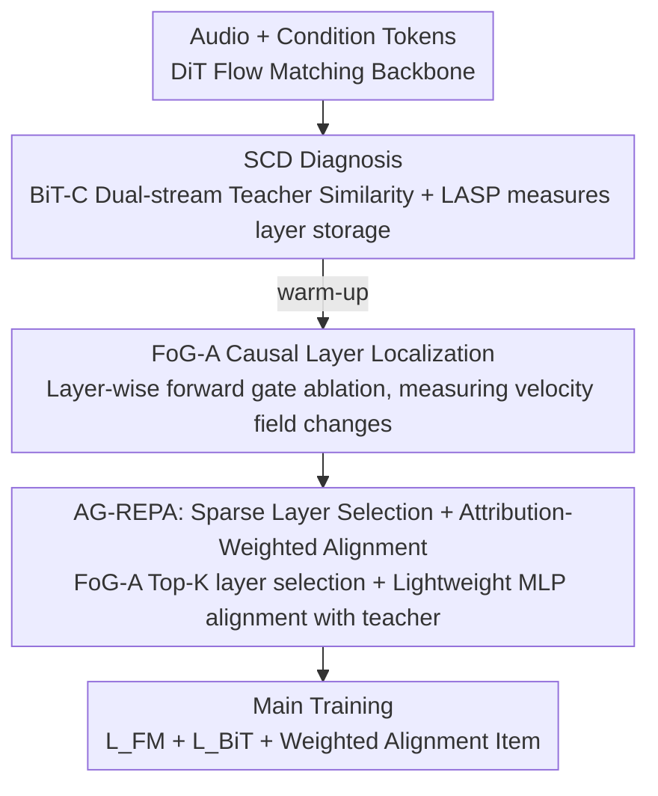

# AG-REPA: Causal Layer Selection for Representation Alignment in Audio Flow Matching

**Conference**: ICML 2026  
**arXiv**: [2603.01006](https://arxiv.org/abs/2603.01006)  
**Code**: https://github.com/zpforlove/AG-REPA  
**Area**: Audio Generation / Flow Matching  
**Keywords**: REPA, Audio Generation, Flow Matching, Causal Attribution, Layer Selection  

## TL;DR
AG-REPA discovers that the "layers storing semantic information" and the "layers actually driving the velocity field" in audio Flow Matching do not coincide. It proposes using forward-only gate ablation to select layers with the highest causal contribution for representation alignment, achieving faster convergence and lower FAD than fixed-layer REPA in speech and general audio generation.

## Background & Motivation
**Background**: Flow Matching has become a significant paradigm for speech synthesis and general audio generation, synthesizing samples by learning a continuous velocity field from noise to the audio data distribution. REPresentation Alignment (REPA) is a technique used recently to accelerate generative model training by aligning intermediate hidden states with pretrained teacher features, allowing the model to acquire useful representations more quickly.

**Limitations of Prior Work**: ใน In the vision domain, REPA typically selects a specific intermediate layer or a fixed depth for alignment based on experience. However, the structure of audio Flow Matching differs. Token-conditioned audio generation requires decoding from sparse discrete tokens to continuous waveforms, lacking the dense spatial anchors found in video or images. Adopting fixed middle-layer alignment might supervise layers that "have representations similar to the teacher but have little effect on the velocity field."

**Key Challenge**: Representation similarity does not equal functional contribution. A specific layer might be excellent at storing semantic or acoustic information, yet it may not be the layer that most effectively influences the velocity field within the current generation dynamics. Aligning such a layer makes training appear to gain teacher information without applying supervision to the positions that truly control the generation trajectory.

**Goal**: The authors aim to answer "which layers should be aligned for REPA in audio Flow Matching." They intend to identify not only information storage locations but also positions with causal influence on the velocity field output, thereby constructing more effective layer selection and weighting strategies.

**Key Insight**: The paper introduces the Store-Contribute Dissociation (SCD) perspective: deeper layers are often semantic storage, while shallow or intermediate transition layers are likely to be causal drivers. Consequently, the approach shifts from representation diagnosis to causal attribution, using forward-only gate ablation to directly measure how much the velocity field changes after a specific layer is removed.

**Core Idea**: Do not apply REPA to the layers with the highest teacher similarity; instead, use FoG-A to identify the Top-K layers that most significantly change the velocity field and assign alignment weights based on attribution strength.

## Method

### Overall Architecture
AG-REPA addresses the issue of which layers to align for REPA in audio Flow Matching. Previously, layers were fixed empirically, but the authors found that the "layers most similar to the teacher" and "layers most affecting the velocity field" do not overlap. The method first uses a set of diagnostic tools to separate these two aspects, then performs sparse, weighted alignment only on the layers that truly drive generation. The model itself is a unified audio generation framework performing both TTS and Text-to-Audio. The speech side uses semantic tokens, and the general audio side uses event/acoustic tokens, sharing a DiT-based Flow Matching backbone. During the warm-up phase, the authors measure the similarity of each layer's representation with Whisper/BEATs teachers, then perform gate ablation on each layer to observe velocity field changes, finally selecting the Top-K layers with the highest contribution to add lightweight projection heads for alignment.

### Key Designs

**1. SCD Diagnosis: Separating "Representation Storage" and "Functional Contribution"**

This step addresses the limitation where layers with high teacher similarity were previously assumed to be worth supervising. Since generative models ultimately predict a velocity field, storing information in a layer does not imply that optimizing it is most effective. The authors use two representation probes: BiT-C establishes dual-stream cosine alignment with Whisper and BEATs, while LASP uses shared frozen projection heads to compare information storage quantities in the same teacher space. Results clearly show that semantic similarity (Cos-SEM) is typically highest in deep layers (L22–L24), while event similarity (Cos-EVT) is biased toward deep or middle layers depending on token topology. This "Store-Contribute Dissociation" (SCD) phenomenon provides the basis for moving away from fixed middle-layer alignment.

**2. FoG-A: Locating Causal Layers via Forward Gate Ablation**

After diagnosing that being "like a teacher" does not equal "driving generation," a tool is needed to directly measure functional necessity. FoG-A formulates the DiT residual layer as $h_l=h_{l-1}+m_l f_l(h_{l-1},t,c)$, where all $m_l=1$ in standard forward passes. When testing layer $k$, $m_k=0$ is set to "pluck" it from the forward pass without backpropagating gradients, comparing the normalized difference between the ablated velocity field $v_\theta^{\setminus k}$ and the original $v_\theta$. A larger difference indicates that removing this layer significantly changes the generation direction, marking it as a causal driver. Compared to gradient norms (which reflect current optimizer updates) or LASP (which reflects storage), FoG-A identifies causal necessity through intervention, making it more relevant for alignment.

**3. AG-REPA: Sparse Layer Selection + Attribution-Weighted Alignment**

With FoG-A scores, REPA is transformed from a fixed-depth heuristic to adaptive causal supervision. The authors select the Top-K layers based on FoG-A scores to form set $\mathcal{S}$, and set the alignment weight for each layer proportional to its attribution strength: $\lambda_k=\mathrm{FoG\text{-}A}_k/\sum_{j\in\mathcal{S}}\mathrm{FoG\text{-}A}_j$. Each selected layer is followed by a lightweight two-layer MLP to align temporal-pooled hidden states with frozen teacher embeddings. The final objective adds the input-side BiT-C anchor and these layer alignment terms to the Flow Matching main loss: $\mathcal{L}_{FM}+\lambda_{BiT}\mathcal{L}_{BiT}+\sum_{k\in\mathcal{S}}\lambda_k(1-\cos(h_{\phi_k}(\bar{h}_k),\mathcal{T}(x)))$. This design is used because generation is often jointly controlled by multiple layers with uneven contributions.

### Loss & Training
AG-REPA is computationally conservative. FoG-A is triggered only once every 200 steps during a 5,000-step warm-up, involving small batches, no gradients, and a single GPU, totaling approximately 41 equivalent single forward passes with a wall-clock increment of less than 0.5%. Main training only adds $K=3$ lightweight MLP heads, representing less than 0.5% extra parameters and less than 2% time overhead per step, thus completing causal layer selection and alignment with almost no increase in training cost.

## Key Experimental Results

### Main Results

| Method | Speech WER↓ | Speech FAD↓ | Audio FAD↓ | Speech MOS↑ | Audio MOS↑ |
|------|-------------|-------------|------------|-------------|------------|
| Base (no layer align.) | 5.82 | 1.84 | 3.45 | 3.62±0.08 | 3.45±0.09 |
| REPA @ Layer 4 | 5.15 | 1.65 | 3.12 | 3.75±0.07 | 3.58±0.08 |
| REPA @ Layer 8 | 4.93 | 1.58 | 3.05 | 3.79±0.06 | 3.64±0.08 |
| REPA @ L4,8,12 | 4.21 | 1.45 | 2.88 | 3.92±0.06 | 3.77±0.07 |
| REPA @ Deep (L20–L22) | 5.60 | 1.79 | 3.39 | 3.64±0.08 | 3.48±0.09 |
| REPA @ Shallow (L1–L3) | 3.62 | 1.36 | 2.68 | 4.05±0.06 | 3.87±0.07 |
| AG-REPA (Top-3) | 3.45 | 1.29 | 2.56 | 4.12±0.05 | 3.94±0.07 |

### Ablation Study

| Selection Strategy | Top-3 Layers | Speech FAD↓ | Audio FAD↓ | Relative Gain | Convergence Steps |
|----------|---------|-------------|------------|----------|----------|
| Base | None | 1.84 | 3.45 | 0.0% | N/A |
| Random Control | L5,L14,L19 | 1.75 | 3.32 | +4.9% | 850k |
| Highest LASP | L22,L23,L24 | 1.68 | 3.21 | +8.7% | 720k |
| Gradient Norm | L1,L2,L4 | 1.35 | 2.71 | +26.6% | 260k |
| Highest FoG-A | L1,L2,L7 | 1.29 | 2.56 | +29.9% | 220k |

### Key Findings
- SCD is highly distinct: Under Config B, the top layers for Cos-SEM are L23/L22/L24 and for Cos-EVT are L14/L13/L15, while FoG-A selects L1/L2/L7 for speech and L1/L7/L2 for audio. Deep layers resemble the teacher, but shallow/middle layers influence the velocity field.
- Compared to the best fixed single-layer REPA, AG-REPA reduces speech FAD by ~18% and audio FAD by ~16%; it also outperforms the L4,8,12 multi-layer heuristic by ~11%.
- "Knowing" is not as good as "Doing": Highest LASP only reduces Speech FAD to 1.68, whereas Highest FoG-A reaches 1.29 and achieves a 3.3× speedup in reaching Speech FAD=1.5 (from 720k to 220k steps).
- Generalization experiments show that AG-REPA is not limited to the DiT in this paper. Stable improvements were observed in Voicebox (FAD: 1.20 to 0.95), CosyVoice (0.88 to 0.72), and F5-TTS (1.45 to 1.15).

## Highlights & Insights
- The most critical insight is dissociating "representation similarity" from "causal contribution." While many alignment methods assume layers with high teacher similarity deserve supervision, this paper demonstrates that the leverage points in generation dynamics can be entirely different.
- FoG-A is a practical causal probe: it requires no backpropagation or additional probe training, identifying necessity through layer gating and observing changes in the velocity field, making it low-cost and direct.
- The AG-REPA selection rule can be rerun across architectures, proving more stable than shallow heuristics like fixed L1–L3. In Table 5, shallow REPA on F5-TTS only reduced FAD from 1.45 to 1.34, while AG-REPA reached 1.15.
- This paper offers inspiration for other generative models: when performing representation alignment or distillation, one should not only ask "which layer is most like the teacher," but also "supervising which layer most effectively changes the final generation function."

## Limitations & Future Work
- FoG-A currently relies on layer-by-layer forward ablation. Although the cost is low, it requires access to the model's internal layers and the ability to modify forward gates, which is not directly applicable to black-box models or highly encapsulated inference frameworks.
- Experiments focus on audio Flow Matching; whether conclusions migrate seamlessly to image, video, or autoregressive audio models remains to be verified.
- While the Top-K layer set is stable in this setting, it may need further testing if training distributions, model scales, or tokenization change significantly.
- AG-REPA relies on Whisper/BEATs as external teachers; teacher bias may influence the model's preference for semantic or acoustic attributes. Future work could investigate teacher-less or multi-teacher uncertainty weighting.

## Related Work & Insights
- **vs REPA**: Standard REPA uses empirical heuristics for layer selection; AG-REPA automatically selects layers based on functional contribution using FoG-A.
- **vs iREPA / vision REPA variants**: Vision methods emphasize spatial structures or visual teacher features which cannot be directly applied to 1D temporal audio representations; this work redesigns layer diagnosis and projection heads for token-conditioned audio.
- **vs HASTE**: HASTE focuses on capacity mismatch during late-stage training; AG-REPA focuses on which layers alignment should target. The two are complementary.
- **vs interpretability probes**: LASP/BiT-C are representation probes, while FoG-A is an intervention probe. This paper translates interpretability metrics directly into training strategies, which is where its value exceeds pure analysis.

## Rating
- Novelty: ⭐⭐⭐⭐ The SCD perspective and FoG-A-driven REPA layer selection are insightful, representing a clear case of turning interpretability into training algorithms.
- Experimental Thoroughness: ⭐⭐⭐⭐⭐ The main model, layer selection ablation, cross-architecture generalization, efficiency, and stability analyses are comprehensive.
- Writing Quality: ⭐⭐⭐⭐ The methodology is clear with strong supporting diagrams; however, the theoretical motivations and dense notations may pose a slight barrier for non-audio researchers.
- Value: ⭐⭐⭐⭐⭐ Highly practical for accelerating audio generation training and provides a transferable methodology for representation alignment in other generative models.

<!-- RELATED:START -->

## Related Papers

- [\[ICML 2026\] Stable Velocity: A Variance Perspective on Flow Matching](stable_velocity_a_variance_perspective_on_flow_matching.md)
- [\[ICML 2026\] The Coupling Within: Flow Matching via Distilled Normalizing Flows](the_coupling_within_flow_matching_via_distilled_normalizing_flows.md)
- [\[ICLR 2026\] DenseGRPO: From Sparse to Dense Reward for Flow Matching Model Alignment](../../ICLR2026/image_generation/densegrpo_from_sparse_to_dense_reward_for_flow_matching_model_alignment.md)
- [\[ICML 2026\] Alignment-Guided Score Matching for Text-to-Image Alignment in Diffusion Models](alignment-guided_score_matching_for_text-to-image_alignment_in_diffusion_models.md)
- [\[NeurIPS 2025\] Value Gradient Guidance for Flow Matching Alignment](../../NeurIPS2025/image_generation/value_gradient_guidance_for_flow_matching_alignment.md)

<!-- RELATED:END -->
