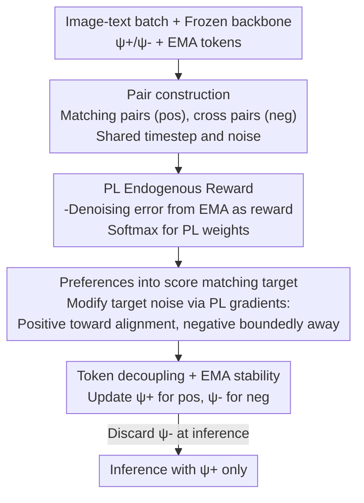

# Alignment-Guided Score Matching for Text-to-Image Alignment in Diffusion Models

**Conference**: ICML 2026  
**arXiv**: [2605.30038](https://arxiv.org/abs/2605.30038)  
**Code**: No public code; Project Page: https://jaayeon.github.io/AGSM/  
**Area**: Image Generation / Diffusion Models / Text-Image Alignment  
**Keywords**: Text-image alignment, diffusion models, score matching, soft token, Plackett-Luce  

## TL;DR
This paper proposes Alignment-Guided Score Matching, which utilizes a reward-free Plackett-Luce alignment reward to directly incorporate positive and negative text-image matching signals into the diffusion score matching objective. By training lightweight soft tokens, it improves T2I semantic alignment while mitigating common repetition and counting errors found in SoftREPA.

## Background & Motivation
**Background**: Diffusion models such as SD1.5, SDXL, and SD3 can generate high-fidelity images but often struggle with missing attributes, incorrect quantities, and relationship errors under complex text constraints. Post-training methods typically employ human preference data or external reward models for diffusion RL/DPO to improve aesthetics or preference scores.

**Limitations of Prior Work**: Reward-based methods highly depend on reward quality and preference data, and they do not necessarily directly address text-image representation alignment within the diffusion process. Reward-free methods like SoftREPA attempt to optimize soft text tokens using contrastive learning to increase mutual information between text and image representations, but their negative sample terms continuously drive up the denoising error of mismatched pairs. This easily pushes soft tokens into off-manifold regions, leading to repeated objects, over-counting, and semantic incoherence.

**Key Challenge**: Text-image alignment requires utilizing both positive and negative pairing signals without infinitely penalizing negative samples like a standard contrastive loss. Score matching in diffusion models requires predicted noise to stay within reasonable denoising dynamics; if negative samples are pushed too far, the training objective improves superficial contrastive loss while damaging generation quality.

**Goal**: The authors aim to retain the lightweight, reward-free, and soft-token advantages of SoftREPA while rewriting the contrastive push-pull mechanism as a bounded, normalized guidance term that directly acts on the score matching target, thereby improving T2I alignment without training the full model or depending on external rewards.

**Key Insight**: Drawing inspiration from Diffusion-DPO/DSPO, preference modeling is placed at the level of the diffusion score. Unlike methods using human preferences, this approach constructs an alignment reward using the model's own denoising log-likelihood and employs the Plackett-Luce model to handle one positive text and multiple in-batch negative texts.

**Core Idea**: The concept is to formulate "positive samples should move toward higher alignment rewards, and negative samples should be pushed away boundedly" as an objective noise correction for score matching, rather than using an unbounded contrastive loss to directly increase negative sample denoising error.

## Method
AGSM freezes the main diffusion model and only trains a small number of soft tokens. During training, an image $x_i$ and its original text $c_i$ in a batch form a positive pair, while pairings with other texts $c_j$ form negative pairs. Instead of only minimizing the distance between the positive pair's denoising prediction and the real noise, the model modifies the target noise according to the PL reward gradient: the positive sample target shifts toward better alignment, while the negative sample target shifts in the opposite direction, controlled by a normalized weight to prevent divergence.

### Overall Architecture
The input consists of image-text datasets, a frozen diffusion backbone, positive/negative soft tokens $\psi^+$ and $\psi^-$, EMA soft tokens, and guidance scales $\gamma^+$ and $\gamma^-$. Each training iteration samples a batch, using matching indices $(x_i,c_i)$ as positive pairs and cross-indices $(x_i,c_j)$ as negative pairs; all pairs share the same timestep and noise to compute predictions under current and EMA soft tokens. EMA predictions estimate the alignment reward in the form of denoising error, which is normalized into PL weights via softmax to construct target noise and update the corresponding soft tokens. During inference, negative tokens are discarded, using only positive soft tokens for conditional and unconditional generation.

### Key Designs

**1. PL Endogenous Alignment Reward: Scoring candidates without external rewards**

This step addresses the source of alignment signals. While reward-based methods depend on external models or human labels, AGSM uses the diffusion model's own denoising capability as a reward. Reward is defined as the expected log-likelihood of the reverse transition, equivalently implemented as the negative denoising error $r(x_t,c)=-\frac{A(t)}{2}\|\epsilon_{\theta}^{\hat{\psi}}(x_t,t,c)-\epsilon\|_2^2$. Better text-image matches result in more accurate denoising predictions and higher rewards. The Plackett-Luce (PL) model $p(z=1|x_t,c)=\frac{\exp(r(x_t,c))}{\sum_i\exp(r(x_t,c_i))}$ calculates the probability that the current text matches the image better than other in-batch candidates. PL is chosen over pairwise Bradley-Terry because it naturally supports the "one-to-many" normalization required for in-batch negatives.

**2. Incorporating Preference into score matching target: Bounded correction instead of infinite pushing**

To utilize the PL probability, AGSM modifies the score layer. The target distribution for positive pairs shifts toward $p_t^+(x_t|c)\propto p_t(x_t|c)\,p(z=1|x_t,c)^{\gamma^+}$, and for negative pairs toward $p_t^-(x_t|c)\propto p_t(x_t|c)\,p(z=1|x_t,c)^{-\gamma^-}$. Taking the gradient, the target score equals the original diffusion score plus $\gamma_z\nabla\log p(z=1|x_t,c)$. This translates to adding or subtracting a correction term based on PL reward differences to the real noise. Consequently, negative samples are not pushed indefinitely but are fine-tuned along a normalized, bounded preference gradient. This form maintains consistency with the original denoising dynamics, offering significantly better stability than unbounded contrastive losses.

**3. Soft Token Decoupling + EMA Stability: Negative tokens for training, positive for inference**

If a shared soft token receives gradients from both positive and negative pairs, semantic enhancement and suppression conflict—experiments show this can crash the ImageReward from 103 to 47 and drop CLIP scores. AGSM updates $\psi^+$ for positive pairs and $\psi^-$ for negative pairs separately. Furthermore, reward estimation and target correction use EMA soft token predictions to prevent noisy early-stage tokens from contaminating the target. During sampling, negative tokens in the CFG unconditional branch would over-suppress background and detail; thus, $\psi^-$ is discarded during inference, using only $\psi^+$ to maintain a balance between stability and generation quality.

### Loss & Training
The primary loss remains the squared error of noise prediction, but the target shifts from real noise $\epsilon_t$ to the alignment-corrected $\epsilon_{\mathrm{tgt}}$. SD1.5 and SDXL use $\gamma^+=1, \gamma^-=1$, while SD3 uses $\gamma^+=1, \gamma^-=0.1$. The batch size is 16, with 3 in-batch negatives per positive pair. SD1.5 and SD3 are trained for 100k iterations, and SDXL for 1k iterations, using AdamW with a learning rate of $10^{-3}$ and weight decay of $10^{-4}$. Soft tokens are added to UNet Down/Middle blocks for SD1.5/SDXL and to the top 5 transformer layers for SD3.

## Key Experimental Results

### Main Results
T2I generation is evaluated on COCO-val 5K and GenEval. AGSM excels by resolving SoftREPA's failure cases while achieving a superior FID trade-off.

| Model / Method | ImageReward | CLIP | HPSv2 | FID | GenEval Mean | Counting | Conclusion |
|----------------|-------------|------|-------|-----|--------------|----------|------------|
| SD1.5 | 17.72 | 26.40 | 25.08 | 24.59 | - | - | Weak baseline alignment |
| SD1.5 + SoftREPA | 40.02 | 27.09 | 26.05 | 29.25 | - | - | High preference, poor FID |
| SD1.5 + Ours | 34.50 | 27.23 | 25.66 | 25.94 | - | - | Higher CLIP, better FID than SoftREPA |
| SDXL | 75.06 | 26.76 | 27.35 | 24.69 | - | - | Strong baseline |
| SDXL + Ours | 84.22 | 26.86 | 27.96 | 24.83 | - | - | Improved alignment, little FID loss |
| SD3 | 94.27 | 26.30 | 28.09 | 31.59 | 0.68 | 0.56 | Inherently strong |
| SD3 + SoftREPA | 108.50 | 26.91 | 28.91 | 36.21 | 0.70 | 0.29 | High ImageReward, severe counting degradation |
| SD3 + Ours | 103.30 | 27.00 | 28.22 | 34.08 | 0.72 | 0.64 | Counting improved (0.29 to 0.64), reduced repetition |

### Ablation Study
The paper analyzes training/sampling strategies, negative guidance scales, PL vs. BT, and complementarity with diffusion RL.

| Configuration | Key Metrics | Note |
|---------------|-------------|------|
| Train $\psi^+$ on $\mathcal{D}^+$ | ImageReward 94.79, CLIP 26.93, FID 34.46 | Gains from positive samples, underutilizes negatives |
| Shared $\psi$ on $\mathcal{D}^+, \mathcal{D}^-$ | ImageReward 47.33, CLIP 25.68, FID 31.20 | Conflicting signals degrade quality/alignment |
| Separate $\psi^+, \psi^-$ (Ours) | ImageReward 103.30, CLIP 27.00, FID 34.08 | Token decoupling is critical |
| Inference with $\psi^+, \psi^-$ | ImageReward 84.53, FID 36.47 | Neg tokens in uncondition branch suppress details |
| Inference with $\psi^+$ (Ours) | ImageReward 103.30, FID 34.08 | Use neg to bound during training, discard at inference |
| SD3 $\gamma^-=0$ | ImageReward 94.79 | Limited gains without negative guidance |
| SD3 $\gamma^-=0.1$ | ImageReward 103.30, CLIP 27.00 | Moderate negative guidance is optimal |
| BT loss | ImageReward 29.67, CLIP 27.13, FID 24.76 | Pairwise less effective than multi-sample PL |
| PL loss (Ours) | ImageReward 34.50, CLIP 27.23, FID 25.94 | Multi-candidate normalization fits in-batch negatives |

### Key Findings
- SoftREPA's validation ImageReward eventually drops despite training loss decreasing (over-optimization); AGSM is more stable and less dependent on early stopping.
- In image editing, AGSM forms a better Pareto front between CLIP alignment and background LPIPS. For SD3 RF-Inversion, ImageReward improves from 128.0 to 132.3 and CLIP/Whole from 27.26 to 29.07.
- AGSM complements DiffusionDPO, SPO, and InPO. For SD1.5, combining AGSM with DiffusionDPO raises ImageReward from 29.09 to 42.47.
- Effective on long prompts: In UniGenBench++, SD3+AGSM achieves the highest scores across CLIP, PickScore, HPSv2, and ImageReward (98.01).

## Highlights & Insights
- The paper correctly identifies SoftREPA's issue: negative samples should not be pushed indefinitely. Pushing the denoising error of mismatched pairs too far breaks the score manifold, resulting in repetition and counting errors.
- AGSM elegantly treats alignment as a directional correction of the score target rather than as an auxiliary representation loss. This aligns the method with diffusion training dynamics and improves stability.
- The decouple soft token strategy is practical: negative samples define alignment boundaries during training, but negative tokens should not "remove" content during inference. This is a valuable insight for other adapter-based post-training.

## Limitations & Future Work
- Since only soft tokens are trained, the capacity for correction is lightweight but limited. Soft tokens might be insufficient for complex relations requiring significant shifts in model knowledge.
- AGSM still relies on automated benchmarks which may not fully represent human preference or safety.
- Negative samples primarily come from in-batch mismatching. While efficient, they may not cover hard semantic confusions (e.g., specific attribute swaps). Future work could integrate hard negatives.
- The use of only positive tokens during inference is empirically optimal, but the role of negative tokens in fine-grained control or concept erasure warrants investigation.

## Related Work & Insights
- **vs SoftREPA**: SoftREPA uses contrastive learning but over-penalizes negatives; AGSM converts guidance into bounded score matching corrections to reduce counting failures.
- **vs Diffusion-DPO / DSPO**: These rely on human preference pairs; AGSM uses endogenous denoising likelihood for reward-free alignment signals.
- **vs CaPO / RankDPO / InPO**: AGSM acts as a complementary soft-token module for these preference optimization methods.
- **vs negative prompt / CFG**: AGSM's negative branch provides a repulsive direction in the score target during training rather than manual prompt engineering during inference, making it more learnable.

## Rating
- Novelty: ⭐⭐⭐⭐ Combines PL preference modeling, score matching, and decoupled soft tokens in a reward-free framework to fix SoftREPA's issues.
- Experimental Thoroughness: ⭐⭐⭐⭐⭐ Comprehensive verification across SD1.5, SDXL, SD3, long prompts, and editing.
- Writing Quality: ⭐⭐⭐⭐ Dense derivation, but follows a clear logical flow from SoftREPA's failures to AGSM's solutions.
- Value: ⭐⭐⭐⭐ Highly practical for lightweight post-training and alignment, especially when combined with existing preference optimization.

<!-- RELATED:START -->

## Related Papers

- [\[ICML 2026\] Pareto-Guided Optimal Transport for Multi-Reward Alignment](pareto-guided_optimal_transport_for_multi-reward_alignment.md)
- [\[ICML 2026\] Restoring Initial Noise Sensitivity in Text-to-Image Distillation via Geometric Alignment](restoring_initial_noise_sensitivity_in_text-to-image_distillation_via_geometric_.md)
- [\[ICML 2026\] AG-REPA: Causal Layer Selection for Representation Alignment in Audio Flow Matching](ag-repa_causal_layer_selection_for_representation_alignment_in_audio_flow_matchi.md)
- [\[CVPR 2025\] Diff2Flow: Training Flow Matching Models via Diffusion Model Alignment](../../CVPR2025/image_generation/diff2flow_training_flow_matching_models_via_diffusion_model_alignment.md)
- [\[ICML 2026\] Rao-Blackwellized Score Matching on Manifolds](rao-blackwellized_score_matching_on_manifolds.md)

<!-- RELATED:END -->
