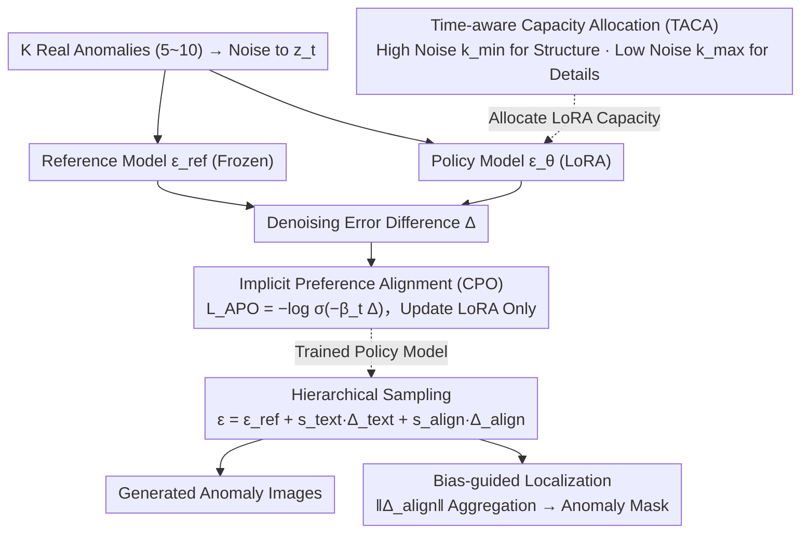

# Anomaly-Preference Image Generation (APO)

**Conference**: ICML 2026  
**arXiv**: [2605.02439](https://arxiv.org/abs/2605.02439)  
**Code**: Not explicitly released  
**Area**: Diffusion Models / Industrial Anomaly Detection / Preference Alignment  
**Keywords**: Few-shot Anomaly Generation, DPO, Implicit Preference, Time-aware LoRA, Hierarchical Sampling

## TL;DR
The authors reformulate "few-shot anomaly image generation" as a "preference optimization problem without manual annotation." Using real anomalies as positive samples and the denoising bias of a reference model at the same timestep as implicit negative samples, they align the diffusion model with the anomaly distribution via a DPO-style loss. Combined with Time-Aware Capacity Allocation (TACA) to adjust LoRA rank by timestep for structural diversity and hierarchical CFG for text-anomaly alignment, APO achieves state-of-the-art results in both realism and diversity on benchmarks like MVTec.

## Background & Motivation
**Background**: Industrial visual anomaly detection is limited by "scarcity of defect samples + expensive annotation." The mainstream approach is to synthesize more samples from a few real anomalies using diffusion models to augment detectors. Solutions are divided into fine-tuning methods (e.g., AnomalyDiffusion, DualAnoDiff, SeaS) and training-free methods (e.g., AnomalyAny).

**Limitations of Prior Work**: Fine-tuning methods often learn appearance and location decoupled, leading to semantic inconsistency, while dual-stream architectures experience feature conflicts and gradient interference. Training-free methods push all computation to inference time, leading to high latency. Both categories lack explicit constraints to "align the generated distribution with the real anomaly distribution," resulting in either overfitting (poor diversity) or distribution drift (poor realism).

**Key Challenge**: There is a trade-off between realism and diversity. Directly applying DPO requires paired preference data (both positive and negative samples generated by the model), but in few-shot scenarios, manual preference pairs are unavailable. The challenge is to perform distribution alignment without manual preference signals.

**Goal**: (1) Construct a stable optimization objective without manual annotation for direct distribution alignment; (2) Maintain diversity during alignment; (3) Enable controllable weighting between "base model coherence" and "anomaly pattern alignment" during inference.

**Key Insight**: The core of DPO is KL-regularized policy optimization, where the reward is reparameterized as $\beta\log\frac{p_\theta}{p_\text{ref}}$. By using real anomalies as positive samples and the "denoising error of the reference model at the same $\mathbf{z}_t$" as an implicit baseline, preference gradients can be obtained without manual negative samples.

**Core Idea**: Replace the paired preference log-ratio in DPO with "the denoising bias of the policy model relative to the reference model $\Delta = \|\hat\epsilon_\theta-\epsilon\|^2 - \|\hat\epsilon_\text{ref}-\epsilon\|^2$," converting few-shot anomaly generation into an analytical and stable implicit preference optimization problem.

## Method

### Overall Architecture
APO addresses the challenge of generating realistic and diverse new anomalies given only $K$ (approx. 5–10) real samples. It reformulates the task as an implicit preference optimization problem. During training, real anomalies are diffused to an arbitrary timestep, and both a frozen reference model $\epsilon_\text{ref}$ and a trainable policy model $\epsilon_\theta$ perform denoising. The difference in denoising errors serves as a preference signal to update time-aware LoRA. During inference, denoising predictions are split into "unconditional + text-conditional + anomaly-alignment" components with independent weights, while the alignment component's intensity is aggregated for pixel-level anomaly localization. The three components—CPO, TACA, and Hierarchical Sampling—correspond to "distribution alignment," "diversity preservation," and "controllable inference + free localization."

### Key Designs

**1. Implicit Preference Alignment (CPO): DPO without Paired Annotation**

This addresses the inability to obtain manual preference pairs $(\mathbf{z}^w, \mathbf{z}^l)$ in few-shot scenarios while retaining the stability of KL-regularized optimization. Starting from the constrained optimization $\max_\theta \mathbb{E}[\mathcal{R}] - \beta D_\text{KL}(p_\theta \| p_\text{ref})$, which yields the optimal policy $p^*_\theta \propto p_\text{ref}\exp(\mathcal{R}/\beta)$, reward is reparameterized as $\mathcal{R} = \beta\log\frac{p_\theta}{p_\text{ref}}$. Using variational ELBO, the "KL difference along the diffusion trajectory" simplifies to a closed-form $\delta = \frac{1}{2}\mathbb{E}_t[\lambda'_t(\|\hat\epsilon_\theta-\epsilon\|^2 - \|\hat\epsilon_\text{ref}-\epsilon\|^2)]$, where $\lambda'_t$ is the derivative of log-SNR. Negative samples are not generated by the model; instead, the "denoising expectation of the reference model at the same $\mathbf{z}_t$" serves as a natural baseline—effectively declaring that any real anomaly is preferred over the reference model's prediction at that noise level.

Let the difference in denoising errors be $\Delta = \|\hat\epsilon_\theta-\epsilon\|^2 - \|\hat\epsilon_\text{ref}-\epsilon\|^2$. The final loss is $\mathcal{L}_\text{APO} = -\log\sigma(-\beta_t\Delta)$, with time-adaptive weight $\beta_t = -\frac{1}{2}\beta\lambda'_t$. $\Delta < 0$ implies the policy model is closer to the real anomaly distribution than the reference model. The log-sigmoid prevents overfitting on small samples compared to pure L2, ensuring stability without labeling costs.

**2. Time-Aware Capacity Allocation (TACA): Redistributing LoRA Capacity by Noise Level**

Uniform fine-tuning across all timesteps often causes high-noise steps to overfit to the background of training samples, suppressing structural diversity. TACA observes that diffusion decided global structure at high noise levels and texture details at low noise levels; thus, model capacity should be allocated along the time axis. The LoRA weight update is written as $\Delta W_t = B \cdot G_t \cdot A$, where $G_t$ is a diagonal mask selecting dimensions. The number of active dimensions is $k(t) = \lfloor k_\text{min} + (k_\text{max}-k_\text{min})(T-t)/T \rfloor$: as $t\to T$ (high noise), $k\to k_\text{min}$ to preserve structural diversity; as $t\to 0$ (low noise), $k\to k_\text{max}$ to adapt to fine-grained anomaly details.

**3. Hierarchical Sampling + Bias-guided Localization: Controllable Inference and Free Anomaly Masks**

Traditional CFG uses a single scale, making it impossible to separate "textual semantic strength" from "anomaly pattern strength." Hierarchical sampling decomposes the denoising prediction as $\hat\epsilon = \epsilon_\text{ref}(\mathbf{z}_t, t) + s_\text{text}\Delta_\text{text} + s_\text{align}\Delta_\text{align}$, where $\Delta_\text{text} = \epsilon_\text{ref}(\mathbf{z}_t, \mathbf{c}, t) - \epsilon_\text{ref}(\mathbf{z}_t, t)$ controls text condition strength and $\Delta_\text{align} = \epsilon_\theta(\mathbf{z}_t, \mathbf{c}, t) - \epsilon_\text{ref}(\mathbf{z}_t, \mathbf{c}, t)$ controls anomaly alignment strength. These independent scales allow sampling from the guided distribution $p_\text{ref} \cdot (p_\text{ref}^{\mathbf{c}}/p_\text{ref})^{s_\text{text}} \cdot (p_\theta^{\mathbf{c}}/p_\text{ref}^{\mathbf{c}})^{s_\text{align}}$. Furthermore, anomaly localization is a free byproduct: aggregating $\|\Delta_\text{align}\|$ weighted by $k(t)$ followed by bilinear upsampling and Gaussian smoothing yields a pixel-level anomaly mask $\mathbf{P}_\text{anomaly}$.

### Loss & Training
Only the LoRA adapters are trained; the reference model $\epsilon_\text{ref}$ is frozen. The single loss term is $\mathcal{L}_\text{APO} = -\log\sigma(-\beta_t\Delta)$, with timesteps $t \sim \mathcal{U}(0,T)$ and noise $\epsilon \sim \mathcal{N}(0,\mathbf{I})$. $\beta$ controls KL intensity, and $\beta_t$ automatically scales with log-SNR.

## Key Experimental Results

### Main Results (MVTec Realism + Diversity)
Comparison against Crop&Paste, DFMGAN, AnomalyDiffusion, DualAnoDiff, AnomalyAny, and SeaS. Core metrics: IS (Inception Score, higher is better) and IC-LPIPS (Intra-Class LPIPS, higher is better).

| Category | Metric | AnomalyDiff | DualAnoDiff | SeaS | APO (Ours) |
|------|------|-------------|-------------|------|------------|
| bottle | IS / IC-L | 1.58 / 0.19 | 2.17 / 0.43 | 1.78 / 0.21 | **2.19 / 0.45** |
| cable | IS / IC-L | 2.13 / 0.41 | 2.15 / 0.43 | 2.09 / 0.42 | **2.20 / 0.45** |
| capsule | IS / IC-L | 1.59 / 0.21 | 1.62 / 0.32 | 1.56 / 0.26 | **2.18 / 0.34** |
| carpet | IS / IC-L | 1.16 / 0.24 | 1.36 / 0.29 | 1.13 / 0.25 | **1.39 / 0.36** |

APO improves both realism and diversity simultaneously across almost every category.

### Ablation Study

| Config | Key Observation | Description |
|------|----------|------|
| CPO only (no TACA) | High realism, low diversity | Validates TACA as the key for diversity. |
| TACA only (no CPO) | High diversity, distribution drift | Validates CPO as the key for realism. |
| Full APO | Superior in both | Modules are complementary. |
| Tuning $s_\text{text}, s_\text{align}$ | Smooth trade-off | Hierarchical sampling provides fine-grained control. |

### Key Findings
- **Orthogonal Contributions**: CPO handles "target distribution alignment" while TACA preserves "generative diversity." Combining them achieves SOTA in both.
- **Localization as a Free Lunch**: No localization supervision is used during training, yet $\|\Delta_\text{align}\|$ naturally reflects anomaly regions, usable as pseudo-labels for downstream detectors.
- **Time-adaptive Weights**: The $\beta_t$ scaling based on log-SNR derived from DPO reparameterization is significantly more stable than a fixed $\beta$ for preference learning in diffusion models.

## Highlights & Insights
- **Generalizing DPO to Unpaired Diffusion**: Replacing model-generated negative samples with reference model denoising error is a powerful and concise signal design applicable to any few-shot distribution alignment task.
- **Time-step Specific Capacity Allocation**: TACA is a simple one-line code change (adjusting LoRA mask via $t$) that effectively mitigates overfitting of background patterns in high-noise steps.
- **Alignment Deviation as Saliency**: The automatic production of pixel-level masks via distribution alignment logic eliminates the need for an explicit segmentation head in industrial deployments.

## Limitations & Future Work
- Evaluation is limited to industrial anomalies (MVTec, VisA); generalizability to medical or natural scene anomalies requires further study.
- Inference requires double the forward passes (both $\epsilon_\theta$ and $\epsilon_\text{ref}$), potentially requiring model distillation for real-time applications.
- TACA uses a manual schedule for $k_\text{min}, k_\text{max}$; data-driven learning of the optimal allocation schedule is an open problem.

## Related Work & Insights
- **vs AnomalyDiffusion / DualAnoDiff**: Compared to textual inversion or dual-stream fine-tuning, APO's preference learning + LoRA framework is lighter and more stable.
- **vs SeaS**: SeaS uses a unified multi-task approach; APO uses distribution alignment followed by hierarchical sampling, achieving a superior realism-diversity Pareto front.
- **vs Diffusion-DPO (Wallace 2024)**: While original Diffusion-DPO requires human-ranked image pairs, APO is the first diffusion method to apply DPO logic to scenarios where no preference pairs are available.

## Rating
- **Novelty**: ⭐⭐⭐⭐⭐ Cleverly adapts DPO for "no-paired preference" scenarios.
- **Experimental Thoroughness**: ⭐⭐⭐⭐ Solid results across MVTec categories; sensitivity analysis on extremely small $K$ is missing.
- **Writing Quality**: ⭐⭐⭐⭐ Clear mathematical derivations and pseudocode.
- **Value**: ⭐⭐⭐⭐⭐ High potential for industrial deployment in anomaly generation and augmentation.

<!-- RELATED:START -->

## Related Papers

- [\[CVPR 2025\] DualAnoDiff: Dual-Interrelated Diffusion Model for Few-Shot Anomaly Image Generation](../../CVPR2025/image_generation/dual-interrelated_diffusion_model_for_few-shot_anomaly_image_generation.md)
- [\[ICML 2025\] Preference Adaptive and Sequential Text-to-Image Generation](../../ICML2025/image_generation/preference_adaptive_and_sequential_text-to-image_generation.md)
- [\[CVPR 2025\] Boost Your Human Image Generation Model via Direct Preference Optimization](../../CVPR2025/image_generation/boost_your_human_image_generation_model_via_direct_preference_optimization.md)
- [\[ICML 2026\] E²PO: Embedding-perturbed Exploration Preference Optimization for Flow Models](embedding-perturbed_exploration_preference_optimization_for_flow_models.md)
- [\[ICML 2026\] Offline Preference Optimization for Rectified Flow with Noise-Tracked Pairs](offline_preference_optimization_for_rectified_flow_with_noise-tracked_pairs.md)

<!-- RELATED:END -->
