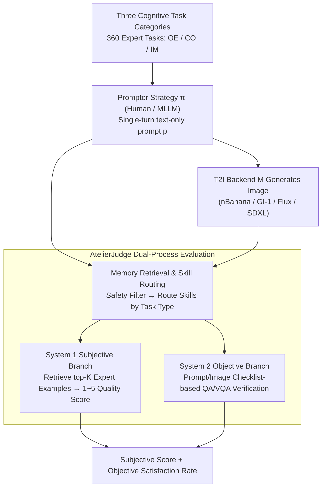

# AtelierEval: Agentic Evaluation of Humans & LLMs as Text-to-Image Prompters

**Conference**: ICML2026  
**arXiv**: [2605.22645](https://arxiv.org/abs/2605.22645)  
**Code**: The paper indicates that tools and data have been released, but the cached text does not provide a repository URL.  
**Area**: Image Generation / T2I Evaluation  
**Keywords**: Text-to-Image, Prompting Proficiency Evaluation, Agent-as-a-Judge, Multimodal Large Language Models, Human-AI Comparison

## TL;DR
AtelierEval is the first to evaluate the "prompter" in the text-to-image workflow. Using 360 expert tasks, three cognitive task categories, and the AtelierJudge agentic evaluator system, it quantitatively measures the prompting proficiency of humans and MLLMs, discovering that image-mimicry prompting is often more reliable than pure text-planning prompting.

## Background & Motivation
**Background**: As text-to-image systems become increasingly powerful, user inputs typically do not enter the generative model directly; instead, they are rewritten into more executable prompts by human prompt engineers or MLLM middleware. Many commercial systems already use MLLMs as implicit middleware, and advanced creators explicitly use MLLMs to decompose scenes, styles, and constraints.

**Limitations of Prior Work**: Most mainstream T2I benchmarks fix the prompt and evaluate the generative model itself. This ignores the capability of the upstream prompter: for the same user intent, the final image quality and constraint satisfaction rate can vary significantly if translated into prompts by different humans or MLLMs.

**Key Challenge**: Existing evaluations conflate "whether the model can execute a prompt" with "whether the prompter can translate intent into a prompt." Prompt optimizers also typically perform local polishing on existing prompts rather than assessing the general translation capability from abstract intent to executable prompts.

**Goal**: This paper aims to establish a unified benchmark to specifically measure the intrinsic abilities of humans and MLLMs as T2I prompters, simultaneously evaluating subjective aesthetic quality and objective constraint satisfaction.

**Key Insight**: The authors formalize prompting proficiency as the capability of a strategy $\pi: I \rightarrow p$, where $I$ is the user intent, $p$ is the executable prompt, and the T2I backend $M$ is responsible for generating the image from the prompt. The evaluation goal is not to find which model is stronger under a fixed prompt, but whether the prompter strategy can stably translate intent across different tasks and backends.

**Core Idea**: Use cognitive-science-inspired task partitioning to cover three types of prompting abilities, and employ an AtelierJudge with skill routing and memory retrieval to perform both subjective scoring and objective checklist verification.

## Method
The core contribution of AtelierEval consists of two parts: a benchmark oriented toward prompters and an agentic evaluator for scalable scoring. The benchmark generates realistic and diagnostic tasks, while AtelierJudge splits each prompt-image pair into subjective quality and objective constraint streams for evaluation.

### Overall Architecture
AtelierEval contains 360 expert-designed tasks, with 120 tasks per category, covering Open-ended Creation, Constrained Creation, and Imitation. OE tests the extraction of atmosphere, theme, and style from abstract, narrative requirements; CO tests the organization of prompts under explicit multiple constraints; IM tests deriving prompts from images, encoding visual content into text.

Task construction is based on two sets of challenge primitives: semantic understanding (S1 abstract intent, S2 audience intent, S3 implicit style, S4 semantic negation) and constraint realization (C1 attribute binding, C2 spatial relations, C3 quantity, C4 text, C5 hard constraints). Experts combine these primitives into real T2I application scenarios, covering 24 labels including object, character, environment, style, structure, and theme.

The interaction protocol is strictly unified as single-turn, text-only prompts. Humans input prompts through a simplified Gradio UI, and MLLMs receive the same task instructions via standard APIs. No real-time image feedback or multi-turn refinement is allowed to isolate the "first translation of intent to prompt" capability.

### Key Designs
1.  **Three Cognitive Task Categories: Decomposing Prompting Ability into Diagnostic Dimensions**
    Existing T2I benchmarks provide only a total score, failing to show whether a prompter excels at creative expansion, constraint execution, or visual description. Borrowing from the Structure of Intellect cognitive theory, the authors decompose the prompter strategy $\pi: I \to p$ into three constructive cognitive operations: Open-ended Creation (OE, corresponding to divergent production), Constrained Creation (CO, corresponding to convergent production), and Imitation (IM, corresponding to cognition). Each category reveals specific failure modes, allowing for a direct assessment of human and model strengths and weaknesses.

2.  **AtelierJudge Dual-Process Evaluation: Decoupling Subjective and Objective**
    Pure MLLM judges often mistake "aesthetic beauty" for "constraint satisfaction," leading to high scores for pretty images that miss text or spatial requirements (high-quality hallucination). AtelierJudge uses Dual-Process Theory to split scoring into two parallel paths: the System 1 Subjective path uses memory-augmented skills to grade dimensions like clarity, creativity, and composition on a 1~5 scale, while the System 2 Objective path breaks every task constraint into independent checkpoints for QA/VQA verification using a checklist.

3.  **Memory Retrieval and Skill Routing: Anchoring Scores with Expert Examples**
    Direct MLLM scoring often suffers from over-optimism and a flattened gradient between high scores. AtelierJudge binds each subjective skill to a memory of expert-annotated "gold" exemplars. During evaluation, it retrieves top-K similar examples using text or image embeddings. This provides a scoring anchor "near" the current task, stretching the score gradient back out. Ablations show that semantic similarity retrieval increases Spearman rank correlation from 0.56 (zero-shot) to 0.79.

### Loss & Training
This paper does not train a new generative model but designs an evaluation protocol and automatic scoring system. Subjective metrics use MAE, Within-1 accuracy, and Spearman $\rho$ for alignment with expert scores; objective metrics use checkpoint-level Acc and F1. Benchmark results aggregate prompt-side/image-side subjective scores and objective satisfaction rates.

In the main experiment, each prompter-task pair generates one prompt, and each prompt generates 4 images per backend. The top-1 image based on AtelierJudge's score is kept for aggregation. Stability analysis in the appendix shows that increasing the number of prompts or images results in plateaus for subjective and objective scores, suggesting the "one prompt, four images" setting is a reasonable balance.

## Key Experimental Results

### Main Results
The experiment consists of two layers: verifying if AtelierJudge aligns with expert scores, and using AtelierEval to compare 8 MLLMs, 48 humans (24 novices, 24 skilled), and 4 T2I backends (nBanana, GI-1, Flux Pro, SDXL).

| Targeted Subject | Metric | Key Value | Conclusion |
| :--- | :--- | :--- | :--- |
| Subjective meta-eval, GPT-5.4 | MAE / W1-A / Spearman $\rho$ | 0.33 / 0.95 / 0.81 | Close to human experts ($\rho=0.83$), much higher than base ($\rho=0.55$) |
| Objective meta-eval, GPT-5.4 | Overall Acc / F1 | 95.5% / 93.9% | High reliability reached for both prompt and image checklists |
| Prompt objective, skilled human | Avg prompt Obj. | 80.6% | Skilled humans are significantly better at explicitly writing constraints |
| Image objective, skilled human | Avg Image Obj. | 76.7% | Skilled human prompts lead to the highest image constraint satisfaction |
| nBanana backend, skilled human | Obj. | 84.9% | Strong middleware backend + skilled human achieves highest objective performance |
| T0 MLLMs vs novice humans | Multi-backend aggregate | T0 MLLMs > Novice | MLLMs significantly raise the starting point for average users |

### Ablation Study

| Configuration | Key Metrics | Note |
| :--- | :--- | :--- |
| Zero-shot judge | MAE 0.72, $\rho=0.56$ | Direct scoring is over-optimistic with poor discrimination |
| Fixed Few-shot | MAE 0.55, $\rho=0.68$ | Provides a scale but lacks task-dependent calibration |
| Similarity Retrieval | MAE 0.34, $\rho=0.79$ | Task-relevant exemplars are key to expert alignment |
| K=3 | MAE 0.34, $\rho=0.79$ | Optimal retrieval count adopted by the paper |
| CO on GI-1 | Direct 69.6% vs MLLM ~48% | External MLLM reasoning can conflict with strong internal middleware |
| IM on GI-1 | MLLM > Skilled Human | MLLMs outperform humans in visual-to-text imitation |

### Key Findings
- Memory retrieval in AtelierJudge is the core driver of performance, not just using a "stronger MLLM."
- Strong T2I middleware masks subjective image quality differences between prompters, but aesthetic success does not equate to constraint satisfaction.
- A "Constraint Paradox" occurs: on strong middleware like GI-1, simply inputting a task description outperforms external MLLM reasoning, suggesting conflicting optimization logic.
- Skilled humans remain superior in hard constraint integration for prompts (CO tasks).
- Imitation tasks reveal that MLLMs are exceptionally good at encoding fine-grained visual structures into prompts, supporting the potential for image-augmented prompting.

## Highlights & Insights
- Shifting the evaluation target from the "generative model" to the "prompter" is a critical contribution. Many generation failures are failures in intent translation.
- The cognitive task division provides high interpretability regarding failure modes (creative expansion vs. constraint integration vs. visual encoding).
- Decoupling subjective and objective metrics avoids the trap of rewarding "pretty but wrong" images.
- "Mimicry over planning" is a provocative insight: agents may perform better by retrieving visual exemplars rather than planning complex scenes purely in text.

## Limitations & Future Work
- Human experiments may have demographic biases; expert memories in AtelierJudge might inherit specific aesthetic preferences.
- The benchmark is limited to single-turn text-to-image and does not cover multi-turn iteration or tool-use.
- There is no objective unified metric for task difficulty itself.
- Future work could extend to image-augmented prompting and collaborative human-LLM workflows.

## Related Work & Insights
- **vs. Fixed-prompt T2I benchmarks**: AtelierEval complements these by evaluating the upstream translation capability.
- **vs. Prompt optimization**: AtelierEval focuses on the zero-to-one translation from intent to prompt.
- **vs. CLIPScore/VQA**: AtelierJudge provides better interpretability and correlation with human experts through skill decomposition.

## Rating
- Novelty: ⭐⭐⭐⭐⭐ 
- Experimental Thoroughness: ⭐⭐⭐⭐⭐ 
- Writing Quality: ⭐⭐⭐⭐☆ 
- Value: ⭐⭐⭐⭐⭐ 

<!-- RELATED:START -->

## Related Papers

- [\[CVPR 2026\] OctoT2I: A Self-Evolving Agentic Text-to-Image Router](../../CVPR2026/image_generation/octot2i_a_self-evolving_agentic_text-to-image_router.md)
- [\[CVPR 2026\] Agentic Retoucher for Text-To-Image Generation](../../CVPR2026/image_generation/agentic_retoucher_for_texttoimage_generation.md)
- [\[CVPR 2026\] Self-Evaluation Unlocks Any-Step Text-to-Image Generation](../../CVPR2026/image_generation/self-evaluation_unlocks_any-step_text-to-image_generation.md)
- [\[ICML 2026\] WISE: A World Knowledge-Informed Semantic Evaluation for Text-to-Image Generation](wise_a_world_knowledge-informed_semantic_evaluation_for_text-to-image_generation.md)
- [\[CVPR 2026\] Vinedresser3D: Agentic Text-guided 3D Editing](../../CVPR2026/image_generation/vinedresser3d_agentic_text-guided_3d_editing.md)

<!-- RELATED:END -->
