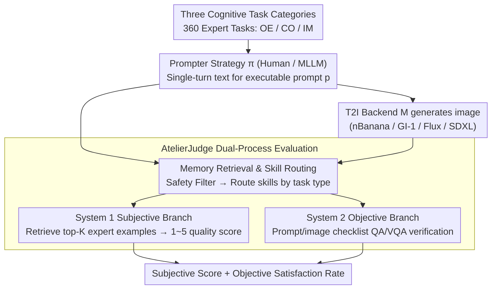

# AtelierEval: Agentic Evaluation of Humans & LLMs as Text-to-Image Prompters

**Conference**: ICML2026  
**arXiv**: [2605.22645](https://arxiv.org/abs/2605.22645)  
**Code**: Paper descriptions mention released tools and data, but the URL is not provided in the cache.  
**Area**: Image Generation / T2I Evaluation  
**Keywords**: Text-to-Image, Prompting Proficiency, Agent-as-a-Judge, Multimodal Large Language Models (MLLM), Human-machine Comparison  

## TL;DR
AtelierEval is the first to treat "prompt writers" in the text-to-image workflow as the evaluation target. It quantitatively measures prompting proficiency for both humans and MLLMs using 360 expert tasks across three cognitive categories and the AtelierJudge agentic evaluator, finding that image-imitation prompting is often more reliable than text-only planning.

## Background & Motivation
**Background**: As text-to-image systems grow more powerful, user inputs are rarely directly fed into generative models. Instead, they are first rewritten by human prompt engineers or MLLM middleware. Many commercial systems use MLLMs as implicit middleware, while advanced creators explicitly use MLLMs to decompose scenes, styles, and constraints.

**Limitations of Prior Work**: Most T2I benchmarks fix the prompts and evaluate the generative model itself. This ignores the capabilities of the upstream prompter. For the same intent, final image quality and constraint satisfaction can vary significantly depending on which human or MLLM translates the intent into a prompt.

**Key Challenge**: Existing evaluations conflate "the model's ability to execute a prompt" with "the prompter's ability to translate intent into a prompt." Furthermore, prompt optimizers often perform local polishing on existing prompts rather than assessing the general translation capability from abstract intent to executable prompt.

**Goal**: This paper aims to establish a unified benchmark to specifically measure the intrinsic ability of humans and MLLMs as T2I prompters, assessing both subjective aesthetic quality and objective constraint satisfaction.

**Key Insight**: Prompting proficiency is formalized as the capability of a strategy $\pi: I \rightarrow p$, where $I$ represents the user intent, $p$ is the executable prompt, and the T2I backend $M$ generates the image from $p$. The evaluation goal is not to find which model is stronger under fixed prompts, but whether a prompter's strategy consistently translates intent well across tasks and backends.

**Core Idea**: The benchmark covers three prompting dimensions inspired by cognitive science, using AtelierJudge—an agentic evaluator with skill routing and memory retrieval—to perform simultaneous subjective scoring and objective checklist verification.

## Method
The core contribution of AtelierEval consists of two parts: a prompter-oriented benchmark and a scalable agentic evaluator. The benchmark generates realistic, diagnostic tasks, while AtelierJudge splits each prompt-image pair into subjective quality and objective constraint tracks.

### Overall Architecture
AtelierEval includes 360 expert-designed tasks (120 per category), covering Open-ended Creation (OE), Constrained Creation (CO), and Imitation (IM). OE tests atmospheric and stylistic extraction from abstract narrative needs; CO tests prompt organization under explicit multiple constraints; IM tests reverse-prompting by encoding visual content into text.

Task construction is based on two sets of challenge primitives: semantic understanding (S1 Abstract Intent, S2 Audience Intent, S3 Implicit Style, S4 Semantic Negation) and constraint implementation (C1 Attribute Binding, C2 Spatial Relations, C3 Count, C4 Text, C5 Hard Constraints). Experts combined these primitives into real T2I scenarios using 24 labels covering objects, characters, environments, styles, structures, and themes.

The interaction protocol is strictly unified as single-turn, text-only prompting. Humans use a simplified Gradio UI, and MLLMs receive task instructions via standard APIs. No immediate image feedback or refinement rounds are allowed to isolate the "first-pass" translation capability.

### Key Designs
1.  **Three Cognitive Task Categories: Decomposing Prompting Ability into Diagnostic Dimensions**
    Existing T2I benchmarks provide a single total score, failing to diagnose whether a prompter excels at creative expansion, constraint execution, or visual description. Borrowing from the Structure of Intellect cognitive theory, the prompter strategy $\pi: I \to p$ is decomposed into three operations: Open-ended Creation (OE, divergent production), Constrained Creation (CO, convergent production), and Imitation (IM, cognition). This allows identifying specific capability gaps rather than providing a generic ranking.

2.  **AtelierJudge Dual-Process Evaluation: Decoupling Subjectivity and Objectivity**
    Pure MLLM judges often mistake "beauty" for "compliance," giving high scores to attractive images that miss text, count, or spatial requirements (high-quality hallucination). AtelierJudge adopts Dual-Process Theory to split scoring into parallel branches. The System 1 Subjective branch uses memory-augmented skills to grade dimensions like clarity, technical skill, and atmosphere on a 1-5 scale. The System 2 Objective branch decomposes constraints into independent checkpoints, using a prompt/image checklist via QA/VQA to verify if constraints are documented and visualized.

3.  **Memory Retrieval & Skill Routing: Anchoring Scores with Expert Examples**
    Direct MLLM scoring tends to be inflated and lacks granularity between scores (e.g., 4 vs 5). AtelierJudge binds each subjective skill to a gold exemplar memory annotated by experts. During evaluation, it retrieves the top-K similar examples using text/image embeddings and provides scores based on those anchors. Ablations show that semantic retrieval improves Spearman correlation from 0.56 (zero-shot) to 0.79, reaching expert-level consistency without needing a significantly more powerful model.

### Loss & Training
This paper does not train a new generative model but instead designs an evaluation protocol and automated scoring system. Subjective metrics use MAE, Within-1 accuracy, and Spearman $\rho$ for expert alignment. Objective metrics use checkpoint-level Accuracy and F1. Benchmark results aggregate prompt-side and image-side subjective scores with objective satisfaction rates.

Each prompter-task pair generates one natural language prompt. Each prompt generates 4 images per T2I backend, with the top-1 image (highest AtelierJudge score) selected for aggregation.

## Key Experimental Results

### Main Results
The experiment compared 8 MLLMs, 48 humans (24 novice, 24 skilled), and 4 T2I backends (nBanana, GI-1, Flux Pro, SDXL).

| Targeted Subject | Metric | Value | Conclusion |
| :--- | :--- | :--- | :--- |
| Subjective meta-eval, GPT-5.4 | MAE / W1-A / Spearman $\rho$ | 0.33 / 0.95 / 0.81 | Near human expert levels ($\rho=0.83$) |
| Objective meta-eval, GPT-5.4 | Overall Acc / F1 | 95.5% / 93.9% | High reliability for checklists |
| Prompt objective, skilled human | Avg Prompt Obj. | 80.6% | Humans excel at explicitly writing constraints |
| Image objective, skilled human | Avg Image Obj. | 76.7% | Skilled human prompts yield highest satisfaction |
| nBanana backend, skilled human | Obj. | 84.9% | Best performance combining middleware and skill |
| T0 MLLMs vs novice humans | Comprehensive | MLLMs > Novices | MLLMs significantly lift the floor for average users |

### Ablation Study

| Configuration | Key Metrics | Note |
| :--- | :--- | :--- |
| Zero-shot judge | MAE 0.72, $\rho=0.56$ | Overly optimistic with poor differentiation |
| Fixed Few-shot | MAE 0.55, $\rho=0.68$ | Missing task-specific calibration |
| Similarity Retrieval | MAE 0.34, $\rho=0.79$ | Best alignment with experts |
| K=3 | MAE 0.34, $\rho=0.79$ | Optimal retrieval count |
| CO Task on GI-1 | Direct 69.6% vs Skilled 81.5% | External MLLM reasoning can conflict with middleware |
| IM Task on GI-1 | MLLM Skilled ~77% vs Human 70.4% | MLLMs outperform humans in visual mimicry |

### Key Findings
*   AtelierJudge’s memory retrieval is the core performance driver, not just model scale. Similarity-based exemplars significantly reduce MAE and boost Spearman correlation.
*   Strong T2I middleware compresses subjective quality gaps between prompters, but does not necessarily ensure higher constraint satisfaction.
*   A "Constraint Paradox" exists: In Constrained Creation on strong middleware (like GI-1), direct task descriptions sometimes outperform prompts rewritten by external MLLMs due to logical conflicts between the two reasoning systems.
*   Skilled humans remain superior at weaving hard constraints into prompts, maintaining a lead in CO objective scores.
*   The Imitation task shows MLLMs can match or beat skilled humans at encoding visual structures into text, suggesting the value of image-augmented prompting.

## Highlights & Insights
*   Ours shifts the T2I evaluation focus from "image generator" to "prompter." Many generation failures result from intent translation errors rather than model execution errors.
*   The three cognitive task categories provide high diagnostic value: OE for creativity, CO for integration, and IM for encoding.
*   The subjective/objective decoupling allows detection of "high-quality hallucinations" where an image is beautiful but fails to meet specific requirements.
*   "Mimicry over planning" is a key insight: Agents should prioritize observing visual examples over pure text planning for complex scenes.
*   Novelty: Identifies the interaction between skilled humans, T0 MLLMs, and T2I middleware across different cognitive operations.

## Limitations & Future Work
*   The human sample reflects active T2I users, potentially introducing demographic or aesthetic biases.
*   Benchmark restricted to single-turn text-to-image; it does not cover iterative refinement, visual feedback loops, or search-based prompt optimization.
*   No explicit unified metric for task difficulty itself.
*   Future work includes extending to image-augmented prompting, human-LLM collaboration, and unified multimodal models that act as both prompter and generator.

## Related Work & Insights
*   **vs Fixed-prompt T2I Benchmarks**: Traditional benchmarks measure generator execution; AtelierEval measures upstream translation. They are complementary.
*   **vs Prompt Optimization**: Optimization often polishes prompts for a specific model; AtelierEval focuses on general translation from intent.
*   **vs CLIPScore/VQA-based Evaluators**: Traditional metrics correlate poorly with complex spatial relations or aesthetics. AtelierJudge improves interpretability through skill decomposition.
*   **Related Work**: Highlights that T2I agents should not just optimize final image scores but also monitor intent alignment and utilize visual exemplars to reduce text-only planning overhead.

## Rating
*   Novelty: ⭐⭐⭐⭐⭐ 
*   Experimental Thoroughness: ⭐⭐⭐⭐⭐ 
*   Writing Quality: ⭐⭐⭐⭐☆ 
*   Value: ⭐⭐⭐⭐⭐ 

<!-- RELATED:START -->

## Related Papers

- [\[CVPR 2026\] Agentic Retoucher for Text-To-Image Generation](../../CVPR2026/image_generation/agentic_retoucher_for_texttoimage_generation.md)
- [\[CVPR 2026\] OctoT2I: A Self-Evolving Agentic Text-to-Image Router](../../CVPR2026/image_generation/octot2i_a_self-evolving_agentic_text-to-image_router.md)
- [\[ICML 2026\] WISE: A World Knowledge-Informed Semantic Evaluation for Text-to-Image Generation](wise_a_world_knowledge-informed_semantic_evaluation_for_text-to-image_generation.md)
- [\[CVPR 2026\] Vinedresser3D: Agentic Text-guided 3D Editing](../../CVPR2026/image_generation/vinedresser3d_agentic_text-guided_3d_editing.md)
- [\[CVPR 2026\] GenColorBench: A Color Evaluation Benchmark for Text-to-Image Generation](../../CVPR2026/image_generation/gencolorbench_a_color_evaluation_benchmark_for_text-to-image_generation.md)

<!-- RELATED:END -->
