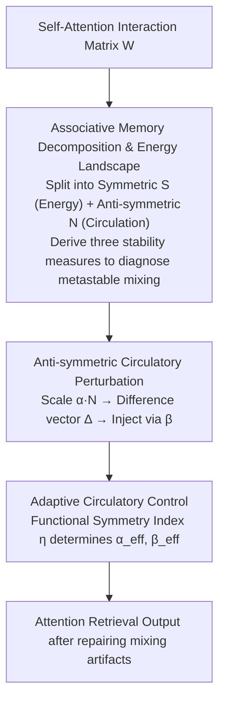

# Balancing Fidelity and Diversity in Diffusion Models via Symmetric Attention Decomposition: Hopfield Perspective

**Conference**: ICML 2026  
**arXiv**: [2605.27476](https://arxiv.org/abs/2605.27476)  
**Code**: https://github.com (Available)  
**Area**: Diffusion Models  
**Keywords**: Attention decomposition, Hopfield Network, Fidelity-diversity trade-off, Skew-symmetric perturbation, Associative memory  

## TL;DR
Decomposes the $\mathbf{QK}^\top$ attention matrix in diffusion models into symmetric components (energy landscape) and anti-symmetric components (circulatory dynamics), derives Hopfield-style stability measures to diagnose metastable mixing, and achieves a training-free controllable fidelity-diversity trade-off by regulating the anti-symmetric component.

## Background & Motivation

**Background**: Diffusion models (DDPM, SDXL, etc.) have become the mainstream paradigm for image generation, largely relying on attention mechanisms to establish global context and long-range dependencies during the denoising process. Attention allows models to establish rich compositional associations across spatial positions, enhancing generation diversity and novelty.

**Limitations of Prior Work**: However, global connectivity also easily leads to semantic leakage—materials and textures of different objects are improperly mixed (e.g., material fusion between two objects), producing structurally incoherent artifacts. Crucially, this beneficial contextual integration and harmful semantic leakage share the same underlying mechanism, making them difficult to distinguish.

**Key Challenge**: There is a fundamental trade-off between generated fidelity and diversity. High-stability retrieval tends to converge to repetitive perspectives and features, sacrificing diversity; while low-stability retrieval brings diversity but is accompanied by structural fragmentation and artifacts. Existing methods lack theoretical tools to (1) identify when attention falls into metastable mixing and (2) controllably regulate this trade-off.

**Goal**: Establish a principled framework to analyze the internal structure of the attention matrix, quantitatively diagnose metastable mixing, and provide a training-free adjustable knob to control the fidelity-diversity trade-off.

**Key Insight**: The authors observe that $\mathbf{QK}^\top$ is formally equivalent to the associative memory matrix of classical Hopfield networks. By decomposing it into symmetric and anti-symmetric parts, the symmetric part defines the energy landscape (determining retrieval stability), while the anti-symmetric part drives circulatory dynamics (capable of breaking metastability). This perfectly aligns with the theory in classical asymmetric Hopfield networks that "increasing asymmetry leads to an exponential decrease in attractors."

**Core Idea**: Use the symmetric-antisymmetric decomposition of the attention matrix to diagnose generation quality, and use the scaling of the anti-symmetric component as a "circulation knob" to regulate the fidelity-diversity trade-off at inference time.

## Method

### Overall Architecture
The method addresses the problem where "beneficial contextual integration" and "harmful semantic leakage" in diffusion self-attention share the same $\mathbf{QK}^\top$ mechanism and are difficult to separate. The core approach treats the attention matrix as Hopfield associative memory: the interaction matrix is first split into symmetric (S, determining energy landscape and retrieval stability) and anti-symmetric (N, driving circulation and breaking metastability) components. Three stability measures are derived from the symmetric half to diagnose the current retrieval state, and then the anti-symmetric component is scaled at inference time to inject controllable circulatory perturbations to repair mixing artifacts. The entire workflow requires no training and only modifies the attention matrix during the forward pass.

### Key Designs

**1. Associative Memory Decomposition and Energy Landscape: Splitting asymmetric attention into two analyzable halves**

Classical Hopfield theory is only defined for symmetric connection matrices, whereas $\mathbf{QK}^\top$ in diffusion models is generally asymmetric, precluding direct energy stability analysis. This work defines the interaction weight matrix $\mathbf{W} = \mathbf{W}_Q \mathbf{W}_K^\top$ and splits it into a symmetric part $\mathbf{S} = (\mathbf{W} + \mathbf{W}^\top)/2$ and an anti-symmetric part $\mathbf{N} = (\mathbf{W} - \mathbf{W}^\top)/2$, such that $\mathbf{QK}^\top = \mathbf{XSX}^\top + \mathbf{XNX}^\top$ naturally divides into two blocks. The symmetric block defines the Hopfield energy $E_\mathbf{X}(\xi) = -\frac{1}{2}\xi^\top \mathbf{M}_{\text{sym}}(\mathbf{X})\xi$, while the anti-symmetric block is identically zero in the quadratic form ($\xi^\top \mathbf{M}_{\text{skew}} \xi = 0$), thus not changing the energy but only driving circulation. Consequently, energy stability and circulatory dynamics are completely decoupled: the symmetric half captures global object structures, and the anti-symmetric half captures fine-grained irregular details. Based on the symmetric half, three Hopfield-style stability measures are derived—energy $E_\mathbf{X}$, instability ratio $r_\mathbf{X}$, and alignment score $\mathbf{Align}_\mathbf{X}$—to quantitatively diagnose if the attention is trapped in metastable mixing.

**2. Anti-symmetric Circulatory Perturbation: Breaking metastability with a scalar knob**

Once a problem is diagnosed, an intervention is needed to repair artifacts without destroying good structures. This work adopts the classical conclusion that "increasing asymmetry in asymmetric Hopfield networks exponentially reduces the number of attractors" and treats the anti-symmetric component as an adjustable knob: multiplying it by a scaling factor $\alpha$ to obtain the perturbed retrieval $\Xi_\alpha = \Phi(\mathbf{XSX}^\top + \alpha \cdot \mathbf{XNX}^\top) \mathbf{X}$, calculating its difference vector from the original retrieval $\Delta = \Xi_\alpha - \Xi$, and finally injecting it back with a blending coefficient $\beta$ as $\Xi_{\text{blended}} = \Xi + \beta \Delta$. $\alpha$ controls the intensity of circulatory perturbation, and $\beta$ controls the injection ratio. Moderate circulatory injection can "disperse" the metastable mixing caused by semantic leakage, thereby repairing artifacts like material fusion; however, excessive injection can destroy established good structures, making these two scalars the adjustable knobs for the fidelity-diversity trade-off.

**3. Adaptive Circulatory Control: Determining perturbation intensity based on sample status**

Applying a fixed set of $(\alpha, \beta)$ to all samples is sub-optimal—low-quality samples require stronger circulatory correction, while high-quality samples are already at good operating points and deteriorate under excessive perturbation. To address this, the paper defines a functional symmetry index $\eta_\mathbf{M}(\mathbf{X}) = (\|\mathbf{M}_{\text{sym}}\|_F^2 - \|\mathbf{M}_{\text{skew}}\|_F^2) / (\|\mathbf{M}_{\text{sym}}\|_F^2 + \|\mathbf{M}_{\text{skew}}\|_F^2)$ to measure how "symmetry-dominant" the current retrieval is. This index makes both scaling and blending adaptive: effective scaling $\alpha_{\text{eff}} = (\alpha - 1)\bar{\eta}_\mathbf{M}$ and effective blending $\beta_{\text{eff}} = \beta(1 - \bar{\eta}_\mathbf{M})$ (where $\bar{\eta}_\mathbf{M}$ is the mean across batch and head). Intuitively, symmetry-dominance (high $\eta$) implies the retrieval is stable, requiring less perturbation; conversely, low-performance samples receive stronger circulatory correction. In experiments, this mechanism proves critical in excessive perturbation settings, restoring the performance of static methods that would otherwise collapse.

## Key Experimental Results

### Main Results
Using 1K COCO2014 prompts on SDXL to generate 10K samples, the correlation between stability measures and external quality metrics, alongside the effects of circulatory perturbation, were evaluated.

| Metric | Baseline | $\alpha{=}1.05, \beta{=}5$ | $\alpha{=}1.10, \beta{=}5$ | $\alpha{=}1.15, \beta{=}4$ |
|------|----------|---------------------------|---------------------------|---------------------------|
| Aesthetic Score ↑ | 5.644 | 5.670 | 5.717 | 5.704 |
| ImageReward ↑ | 0.546 | 0.558 | 0.442 | 0.445 |
| CLIPScore ↑ | 0.264 | 0.263 | 0.259 | 0.260 |
| $\mathbf{Align}_\mathbf{X}$ | 0.669 | 0.651 | 0.650 | 0.637 |

### Ablation Study: Repair effect on low-quality subsets
Paired change $\Delta$ after applying perturbation $(\alpha{=}1.05)$ to the worst 20% baseline samples for each metric:

| Target Subset | $\Delta$ Aesthetic | $\Delta$ ImageReward | $\Delta$ CLIPScore |
|----------|-------------------|---------------------|-------------------|
| Worst 20% Aesthetic | +0.166 | +0.043 | +0.004 |
| Worst 20% ImageReward | +0.022 | +0.453 | +0.004 |
| Worst 20% CLIPScore | +0.019 | +0.116 | +0.0065 |

### Adaptive Control vs. Static Control (350 COCO samples)

| Method | IR ↑ | CLIP ↑ | HPS ↑ | AES ↑ |
|------|------|--------|-------|-------|
| Baseline | 0.487 | 0.264 | 0.270 | 5.64 |
| Static Moderate $(\alpha{=}1.05, \beta{=}3)$ | 0.546 | 0.262 | 0.273 | 5.66 |
| Adaptive Moderate | 0.522 | 0.264 | 0.272 | 5.64 |
| Static Excessive $(\alpha{=}1.20, \beta{=}5)$ | -1.486 | 0.207 | 0.157 | 5.23 |
| **Adaptive Excessive** | **0.568** | **0.264** | **0.274** | **5.65** |

### Key Findings
- Stability measures exhibit significant Spearman correlation with external quality metrics: $\mathbf{Align}_\mathbf{X}$ correlates positively with Aesthetic Score ($\rho = +0.296$) and negatively with LPIPS diversity ($\rho = -0.297$), validating the fidelity-diversity trade-off.
- Circulatory perturbation consistently improves the low-quality subset (worst 20%); for high-quality subsets (best 20%), excessive perturbation reduces quality, demonstrating state-dependent repair characteristics.
- Adaptive control excels in excessive perturbation settings: while the ImageReward of static methods drops to -1.486, the adaptive method recovers to 0.568, even exceeding the baseline.
- Compared to global attention temperature scaling $\mathbf{QK}^\top / \tau$, circulatory perturbation more selectively suppresses weakly supported mixing artifacts without inducing improper structural replication (e.g., extra limbs).

## Highlights & Insights
- **Insights from Symmetric-Antisymmetric Decomposition**: Treating $\mathbf{QK}^\top$ as an associative memory matrix and performing symmetric decomposition builds a bridge between attention and Hopfield networks. The symmetric component captures global object structures, while the anti-symmetric component captures fine-grained irregular details; this insight is potentially transferable to any Transformer-based generative model analysis.
- **Training-free Inference-time Controllable Generation**: Regulating generation quality by modifying the attention matrix during inference via only two scalar parameters $(\alpha, \beta)$, requiring no extra training or fine-tuning. This lightweight intervention framework can be generalized to LLMs and other Transformer architectures.
- **Adaptive Control Prevents Over-correction**: Utilizing the functional symmetry index $\eta_\mathbf{M}$ for sample-level adaptive perturbation addresses the limitations of "one-size-fits-all" fixed hyperparameters, showing significant robustness in over-perturbed scenarios.

## Limitations & Future Work
- Experiments were primarily validated on the SDXL UNet architecture and have not yet been extended to the latest Transformer-based diffusion models such as DiT (e.g., FLUX).
- The aggregation strategy for adaptive control (mean across batch and head) is relatively simple; more sophisticated head-level or layer-level adaptive strategies may exist.
- Currently, only self-attention is considered; $\mathbf{QK}^\top$ in cross-attention also possesses a symmetric-antisymmetric structure and warrants further investigation.
- The theoretical framework can naturally be extended to the attention analysis of LLMs to detect and regulate "metastable" behaviors during text generation.

## Related Work & Insights
- Ramsauer et al. (2021) formalized self-attention as a retrieval step in modern Hopfield networks; this work introduces a feature-level (rather than token-level) associative memory perspective.
- Singh et al. (1995) found that increasing asymmetry in asymmetric Hopfield networks leads to an exponential decrease in attractors, directly inspiring the circulatory perturbation mechanism.
- Hwang et al. (2019) studied the impact of connection matrix symmetry on attractor structures, providing a theoretical foundation for the design of $\eta_\mathbf{M}$ in adaptive control.

<!-- RELATED:START -->

## Related Papers

- [\[NeurIPS 2025\] T2SMark: Balancing Robustness and Diversity in Noise-as-Watermark for Diffusion Models](../../NeurIPS2025/image_generation/t2smark_balancing_robustness_and_diversity_in_noise-as-watermark_for_diffusion_m.md)
- [\[ICML 2026\] Enhancing Membership Inference Attacks on Diffusion Models from a Frequency-Domain Perspective](enhancing_membership_inference_attacks_on_diffusion_models_from_a_frequency-doma.md)
- [\[ICML 2026\] Stable Velocity: A Variance Perspective on Flow Matching](stable_velocity_a_variance_perspective_on_flow_matching.md)
- [\[ICML 2025\] Efficient Diffusion Models for Symmetric Manifolds](../../ICML2025/image_generation/efficient_diffusion_models_for_symmetric_manifolds.md)
- [\[ICML 2026\] Offline Multi-agent Reinforcement Learning via Sequential Score Decomposition](offline_multi-agent_reinforcement_learning_via_sequential_score_decomposition.md)

<!-- RELATED:END -->
