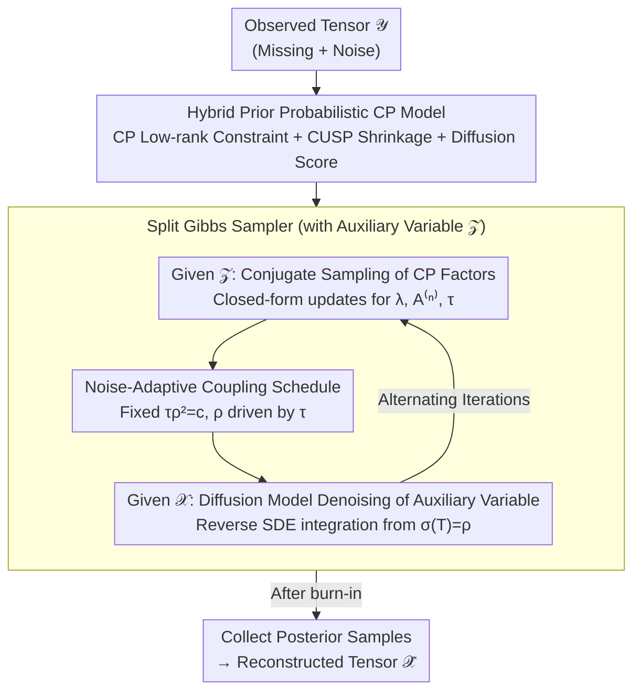

# Bayesian Tensor Decomposition with Diffusion Model Prior

**Conference**: ICML2026  
**arXiv**: [2606.03212](https://arxiv.org/abs/2606.03212)  
**Code**: [GitHub](https://github.com/taozerui/DiffBCP)  
**Area**: Image Restoration  
**Keywords**: Tensor Decomposition, Diffusion Model Prior, Bayesian Inference, Image Inpainting, Automatic Rank Selection

## TL;DR

DiffBCP injects pre-trained diffusion models as implicit data priors into Bayesian CP tensor decomposition. By employing a split Gibbs sampler to achieve tractable posterior inference, it substantially outperforms traditional and deep tensor decomposition baselines in image inpainting and denoising tasks (with a PSNR gain of up to +2.33 dB on FFHQ).

## Background & Motivation

**Background**: Low-rank tensor decomposition (TD) is a classical tool for multidimensional data analysis, achieving efficient representation and compression by contracting high-order tensors into small factors. When data is complete and clean, even the simplest CP decomposition performs effectively.

**Limitations of Prior Work**: When observed data suffers from severe missingness or noise, the low-rank assumption alone becomes insufficient as a structural prior. Existing methods often add hand-crafted priors (e.g., sparsity, smoothness), which fail to capture the rich statistical features of real-world data. Non-linear TD methods (e.g., DeepTensor) introduce deep network structures but lack a probabilistic modeling framework, while methods using fixed denoising networks as priors (e.g., GLON) are unstable under high missing rates.

**Key Challenge**: Diffusion models, the strongest current data-driven priors, cannot be directly integrated with tensor decomposition for tractable posterior inference. Diffusion priors are implicitly defined (via the score function) and are coupled with the likelihood functions of CP factors and low-rank constraints, causing standard sampling methods to fail.

**Goal**: Design a probabilistic framework that unifies structural low-rank priors with learned diffusion model priors within Bayesian tensor decomposition, while enabling automatic rank selection and tractable posterior sampling.

**Key Insight**: The authors observe that the noise precision $\tau$ and the coupling parameter $\rho$ always appear jointly in the likelihood term. Thus, by setting $\tau \rho^2 = c$ (constant), $\rho$ can automatically adjust to maintain the relative scale between the likelihood and coupling terms as $\tau$ is inferred during sampling.

**Core Idea**: Use auxiliary variables to decouple the joint distribution into two independent sub-steps: "conjugate update of CP factors" and "diffusion model-guided denoising," enabling Bayesian tensor decomposition with hybrid priors.

## Method

### Overall Architecture

The problem DiffBCP addresses is restoring a clean, complete tensor $\mathscr{X}$ from a noisy and partially observed tensor $\mathscr{Y}$ (e.g., a noisy image with missing pixels). The mechanism integrates "low-rank CP decomposition" and "pre-trained diffusion models" into a single Bayesian model. By using a split Gibbs sampler with auxiliary variables, the complex, entangled posterior is decomposed into "conjugate sampling of CP factors" and "diffusion denoising" sub-steps that alternates. Each iteration first updates all CP factors using closed-form conjugate distributions, then performs one denoising step on the auxiliary variable via the diffusion model. After burn-in, posterior samples are collected for the final reconstruction.

### Key Designs

**1. Hybrid Prior Probabilistic CP Model: Low-rank Skeleton + Diffusion Texture**

Low-rank priors excel at capturing global structure but fail to generate fine textures, while diffusion priors fit rich real-world data distributions but lack low-rank inductive bias—especially under high missing rates. DiffBCP incorporates both into a joint distribution $p(\mathscr{Y}, \mathscr{X}, \boldsymbol{\lambda}, \mathbf{A}^{(1:N)}, \tau)$ with three types of priors: a hard constraint $p(\mathscr{X} | \mathbf{A}, \boldsymbol{\lambda}) = \delta(\mathscr{X} - \mathrm{CP}(\boldsymbol{\lambda}, \mathbf{A}^{(1:N)}))$ to force the reconstruction onto the CP low-rank manifold; a CUSP shrinkage process prior $\lambda_r | \theta_r \sim \mathcal{N}(0, \theta_r)$ that shrinks component weights to zero as the rank index $r$ increases to automatically determine the effective rank; and a pre-trained diffusion model score $\nabla_{\mathscr{X}_t} \log p(\mathscr{X}_t; \sigma(t)) = s_\psi(\mathscr{X}_t, t)$ as an implicit data prior. The authors theoretically prove that the CUSP prior causes the tail probability of the $r$-th component to decay at a rate of $(\beta/(1+\beta))^r$, ensuring effective shrinkage.

**2. Split Gibbs Sampler: Decoupling Implicit Priors for Independent Denoising**

The difficulty lies in the fact that the diffusion prior is implicitly defined (only the score is available). Once coupled with CP likelihood and low-rank constraints, Langevin samplers cannot compute the required gradient, making direct sampling of the joint distribution infeasible. DiffBCP introduces an auxiliary variable $\mathscr{Z}$ and a coupling term $\phi(\mathscr{Z}, \mathscr{X}; \rho) = \frac{1}{2\rho^2}\|\mathscr{Z} - \mathscr{X}\|_F^2$, splitting the joint sampling into two solvable sub-problems: given $\mathscr{Z}$, the variables $\boldsymbol{\lambda}$, $\mathbf{A}^{(n)}$, and $\tau$ have closed-form conjugate distributions for direct sampling; given $\mathscr{X}$, the auxiliary variable update is equivalent to a denoising problem where $\mathscr{X}$ is the observation and $\rho$ is the noise level, solved by integrating the diffusion SDE from $\sigma(T) = \rho$ to $t=0$. Theoretically, as $\rho \to 0$, this smoothed posterior converges to the original posterior in TV distance, but extremely small $\rho$ makes denoising harder, presenting a bias-variance trade-off (Theorem 3.4 provides the bias bound).

**3. Noise-Adaptive Coupling Schedule: Let $\tau$ Drive $\rho$**

The coupling parameter $\rho$ controls the aforementioned trade-off. Methods like PnP-DM rely on deterministic annealing to manually tune $\rho$, which is highly sensitive to the value of $\rho_{\min}$; an incorrect schedule leads to performance collapse. DiffBCP leverages the full Bayesian framework by fixing $\tau \rho^2 = c$ ($c$ is a constant hyperparameter), allowing $\rho$ to follow the noise precision $\tau$. Since $\tau$ is automatically inferred in each Gibbs iteration from a conjugate Gamma distribution $\tau | \cdots \sim \mathrm{Gamma}(\alpha_0 + |\Omega|/2, \kappa_0 + \frac{1}{2}\sum(y - x)^2)$, $\rho$ adjusts adaptively. This replaces manual annealing schedules with learning from data, making the system more robust than fixed annealing strategies.

## Key Experimental Results

### Main Results (FFHQ + ImageNet Image Inpainting & Denoising)

Evaluated on 256×256 images, with 128 test images randomly selected per dataset. Gaussian noise with $\sigma=0.05$ was added:

| Dataset / Mask | Metric | DiffBCP | DeepTensor (Strongest Baseline) | BCP | Gain |
|----------------|--------|---------|----------------------|-----|------|
| FFHQ / Uniform(0.7) | PSNR↑ | **32.13** | 28.23 | 26.28 | +3.90 |
| FFHQ / Uniform(0.9) | PSNR↑ | **28.28** | 26.11 | 21.61 | +2.17 |
| FFHQ / Stripe | PSNR↑ | **27.91** | 26.44 | 9.26 | +1.47 |
| FFHQ / Irregular | PSNR↑ | **30.34** | 28.01 | 22.64 | +2.33 |
| ImageNet / Uniform(0.7) | PSNR↑ | **28.95** | 26.03 | 24.34 | +2.92 |
| ImageNet / Irregular | PSNR↑ | **27.02** | 25.16 | 21.33 | +1.86 |
| ImageNet / Average | SSIM↑ | **78.92** | 66.50 | — | +12.42 |

DiffBCP achieves the best performance across all datasets and mask types. LPIPS also leads significantly (e.g., FFHQ Irregular: 15.98 vs DeepTensor 26.19). GLON is highly unstable under high missing rates, often converging to all zeros.

### High-resolution OOD Image Experiments

Evaluated on 2048×2048 Out-of-Distribution (OOD) images (diffusion prior trained on 256×256):

| Image / Mask | Metric | DiffBCP | PuTT | BCP |
|--------------|--------|---------|------|-----|
| Marseille / Uniform(0.9) | PSNR↑ | **20.15** | 19.63 | 16.94 |
| Tokyo / Uniform(0.95) | PSNR↑ | **18.90** | 18.33 | 16.90 |
| Westerlund / Irregular | PSNR↑ | **25.27** | 24.38 | 22.26 |
| Tokyo / Irregular | SSIM↑ | **51.38** | 45.03 | 40.40 |

Even under severe distribution shift, DiffBCP outperforms PuTT, as the inductive bias provided by the low-rank structure partially compensates for the distribution mismatch. PnP-DM fails completely on high-resolution images.

## Highlights & Insights

- The first fully probabilistic framework to integrate pre-trained diffusion models as data priors into Bayesian tensor decomposition, extending the plug-and-play paradigm.
- CUSP prior enables bidirectional rank adaptation: shrinking redundant components and adding new ones as needed, remaining robust to initial rank settings.
- Low-rank constraints facilitate easier posterior sampling (faster mixing) while providing structural inductive bias for OOD generalization.
- Theoretical analysis provides a bias bound for the split Gibbs sampler (Theorem 3.4), revealing the bias-variance trade-off in $\rho$ selection.

## Limitations & Future Work

- Performance depends on the low-rank structural assumption of the underlying signal; the CP module's contribution vanishes if the data is not low-rank.
- The current implementation requires processing the full tensor, leading to high memory overhead for ultra-large tensors; stochastic mini-batch updates are a future direction.
- Only CP decomposition was used; exploring forms like tensor train or tensor ring, which might better fit specific data patterns, remains an open area.
- Verified only on image inpainting and denoising; expansion to other inverse problems like compressed sensing and super-resolution is yet to be explored.

## Related Work & Insights

- **PnP-DM (Wu et al., 2024)**: Also uses a split Gibbs sampler with diffusion priors but lacks tensor decomposition structural constraints, making it unstable for high resolution and high missing rates.
- **DPS (Chung et al., 2023)**: Diffusion posterior sampling, but employs approximate gradient guidance rather than exact Bayesian inference.
- **GLON (Zhao et al., 2022)**: TD combined with pre-trained denoising networks, but the denoiser is far less powerful than diffusion models, and the framework is non-probabilistic.
- **DeepTensor (Saragadam et al., 2024)**: TD with a deep network structure; generates finer details but suffers from artifacts.
- Insight: Injecting powerful generative priors into traditional structured models is a promising approach generalizable to other structured signal recovery problems.

## Rating
- Novelty: 8/10 — First to integrate diffusion priors into Bayesian TD with innovative algorithm and theory.
- Experimental Thoroughness: 8/10 — Covers multiple datasets, masks, OOD, and high-resolution scenarios with theoretical support.
- Writing Quality: 8/10 — Clear mathematical derivation and tight integration of theory and experiments.
- Value: 7/10 — Opens a new direction for TD + generative models, though application scenarios are relatively specific.

<!-- RELATED:START -->

## Related Papers

- [\[CVPR 2026\] Learning What to Trust: Bayesian Prior-Guided Optimization for Visual Generation](../../CVPR2026/image_generation/learning_what_to_trust_bayesian_prior-guided_optimization_for_visual_generation.md)
- [\[ICCV 2025\] Transformed Low-rank Adaptation via Tensor Decomposition and Its Applications to Text-to-image Models](../../ICCV2025/image_generation/transformed_low-rank_adaptation_via_tensor_decomposition_and_its_applications_to.md)
- [\[AAAI 2026\] Conditional Diffusion Model for Multi-Agent Dynamic Task Decomposition](../../AAAI2026/image_generation/conditional_diffusion_model_for_multi-agent_dynamic_task_dec.md)
- [\[CVPR 2026\] From Inpainting to Layer Decomposition: Repurposing Generative Inpainting Models for Image Layer Decomposition](../../CVPR2026/image_generation/from_inpainting_to_layer_decomposition_repurposing_generative_inpainting_models_.md)
- [\[ICML 2026\] Balancing Fidelity and Diversity in Diffusion Models via Symmetric Attention Decomposition: Hopfield Perspective](balancing_fidelity_and_diversity_in_diffusion_models_via_symmetric_attention_dec.md)

<!-- RELATED:END -->
