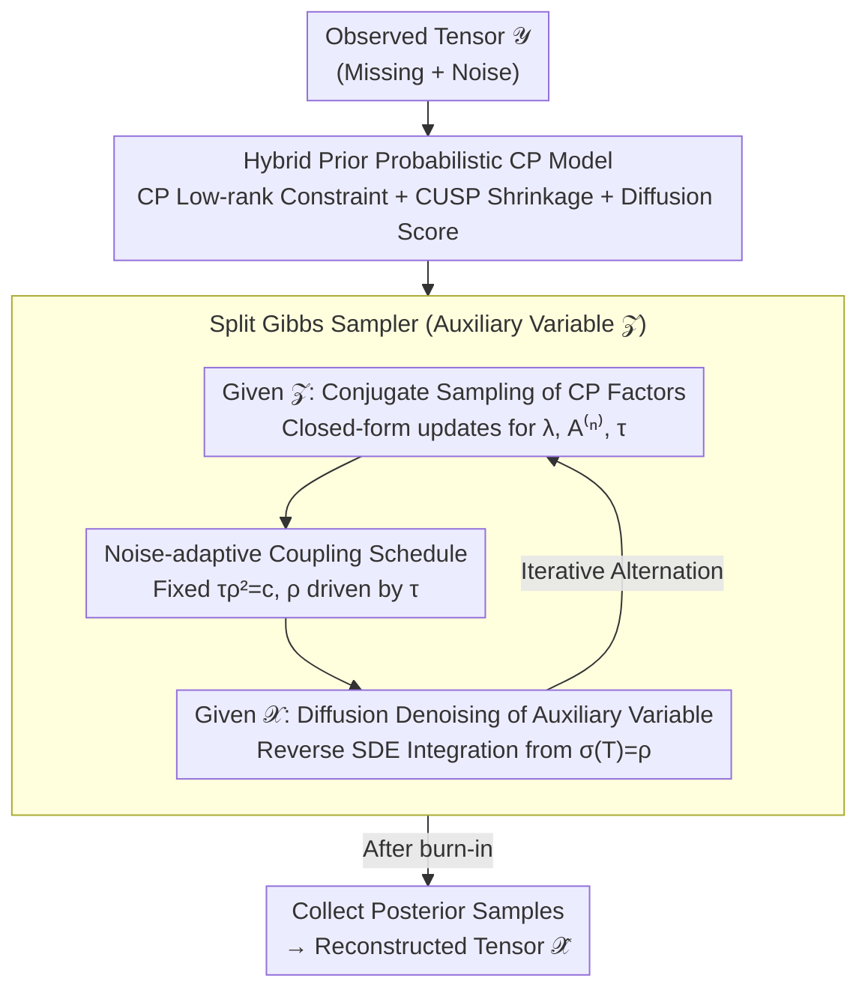

# Bayesian Tensor Decomposition with Diffusion Model Prior

**Conference**: ICML2026  
**arXiv**: [2606.03212](https://arxiv.org/abs/2606.03212)  
**Code**: [GitHub](https://github.com/taozerui/DiffBCP)  
**Area**: Image Restoration  
**Keywords**: Tensor Decomposition, Diffusion Model Prior, Bayesian Inference, Image Inpainting, Automatic Rank Selection  

## TL;DR

DiffBCP injects pre-trained diffusion models as implicit data priors into Bayesian CP tensor decomposition. By employing a split Gibbs sampler to achieve tractable posterior inference, it significantly outperforms traditional and deep tensor decomposition baselines in image inpainting and denoising tasks (matching a PSNR gain of up to +2.33 dB on FFHQ).

## Background & Motivation

**Background**: Low-rank tensor decomposition (TD) is a classic tool for multidimensional data analysis, achieving efficient representation and compression by decomposing high-order tensors into contractions of small factors. When data is complete and clean, even the simplest CP decomposition yields satisfactory results.

**Limitations of Prior Work**: When observations suffer from severe missingness or noise, the low-rank assumption as the sole structural prior becomes insufficient. Existing methods typically add handcrafted priors (e.g., sparsity, smoothness), which fail to capture the rich statistical features of real-world data. Nonlinear TD methods (e.g., DeepTensor) introduce deep network architectures but lack a probabilistic modeling framework, while methods using fixed denoising networks as priors (e.g., GLON) become unstable under high missing rates.

**Key Challenge**: The strongest state-of-the-art data-driven priors—diffusion models—are not directly compatible with tensor decomposition and tractable posterior inference. Diffusion priors are defined implicitly (via score functions) and are coupled with the likelihood of CP factors and low-rank constraints, causing standard sampling methods to fail.

**Goal**: Design a probabilistic framework that unifies structural low-rank priors with learned diffusion model priors within Bayesian tensor decomposition, while simultaneously achieving automatic rank selection and tractable posterior sampling.

**Key Insight**: The authors observe that the noise precision $\tau$ and the coupling parameter $\rho$ always appear jointly in the likelihood term. Therefore, by setting $\tau \rho^2 = c$ (a constant), $\rho$ automatically adjusts to maintain the relative scale between the likelihood and coupling terms as $\tau$ is inferred during sampling.

**Core Idea**: Use an auxiliary variable to decouple the joint distribution into two independent sub-steps: "conjugate update of CP factors" and "diffusion-model-guided denoising," enabling Bayesian tensor decomposition with hybrid priors.

## Method

### Overall Architecture

DiffBCP addresses the problem of recovering a clean, complete tensor $\mathscr{X}$ from an observed tensor $\mathscr{Y}$ containing missing values and noise. Its mechanism integrates "low-rank CP decomposition" and "pre-trained diffusion models"—two complementary priors—into a unified Bayesian model. A split Gibbs sampler involving an auxiliary variable decomposes the entangled posterior into two solvable sub-steps: conjugate sampling of CP factors and diffusion denoising. In each iteration, CP factors are updated via closed-form conjugate distributions, followed by a denoising step on the auxiliary variable using the diffusion model. Posterior samples are collected after burn-in for final reconstruction.

### Key Designs

**1. Hybrid Prior Probabilistic CP Model: Low-rank Skeleton + Diffusion Texture**

Low-rank priors excel at capturing global structures but lack textural detail, whereas diffusion priors fit rich real-world distributions but lack low-rank inductive bias—neither is sufficient alone under high missing rates. DiffBCP formulates these into a joint distribution $p(\mathscr{Y}, \mathscr{X}, \boldsymbol{\lambda}, \mathbf{A}^{(1:N)}, \tau)$ using three types of priors: a hard constraint $p(\mathscr{X} | \mathbf{A}, \boldsymbol{\lambda}) = \delta(\mathscr{X} - \mathrm{CP}(\boldsymbol{\lambda}, \mathbf{A}^{(1:N)}))$ to restrict the reconstruction to the CP low-rank manifold; a CUSP shrinkage process prior $\lambda_r | \theta_r \sim \mathcal{N}(0, \theta_r)$ that shrinks component weights as the rank index $r$ increases to automatically determine the effective rank; and the score of a pre-trained diffusion model $\nabla_{\mathscr{X}_t} \log p(\mathscr{X}_t; \sigma(t)) = s_\psi(\mathscr{X}_t, t)$ as an implicit data prior. The authors theoretically prove that the CUSP prior causes the tail probability of the $r$-th component to decay at a rate of $(\beta/(1+\beta))^r$, ensuring effective shrinkage.

**2. Split Gibbs Sampler: Isolating Implicit Priors for Denoising**

The difficulty lies in the implicit definition of the diffusion prior (accessible only via scores). Once coupled with the CP likelihood and low-rank constraints, Langevin samplers cannot compute the necessary gradients, making direct sampling from the joint distribution infeasible. DiffBCP introduces an auxiliary variable $\mathscr{Z}$ and a coupling term $\phi(\mathscr{Z}, \mathscr{X}; \rho) = \frac{1}{2\rho^2}\|\mathscr{Z} - \mathscr{X}\|_F^2$. This splits the difficult joint sampling into two solvable sub-problems: given $\mathscr{Z}$, parameters $\boldsymbol{\lambda}$, $\mathbf{A}^{(n)}$, and $\tau$ have closed-form conjugate distributions; given $\mathscr{X}$, the update for the auxiliary variable is equivalent to a denoising problem with observation $\mathscr{X}$ and noise level $\rho$, solved by integrating the diffusion SDE from $\sigma(T) = \rho$ to $t=0$. Theoretically, as $\rho \to 0$, this smoothed posterior converges to the original posterior in TV distance, though a small $\rho$ increases denoising difficulty, necessitating a bias-variance trade-off (Theorem 3.4 provides the bias bound).

**3. Noise-adaptive Coupling Schedule: Letting $\tau$ Drive $\rho$**

The coupling parameter $\rho$ controls the aforementioned trade-off. While methods like PnP-DM rely on manual tuning of $\rho$ via deterministic annealing—which is extremely sensitive to $\rho_{\min}$—DiffBCP leverages the fully Bayesian framework. By fixing $\tau \rho^2 = c$, $\rho$ fluctuates with the noise precision $\tau$. Since $\tau$ is automatically inferred in each Gibbs iteration from a conjugate Gamma distribution $\tau | \cdots \sim \mathrm{Gamma}(\alpha_0 + |\Omega|/2, \kappa_0 + \frac{1}{2}\sum(y - x)^2)$, $\rho$ adjusts adaptively. This replaces manual annealing schedules with data-driven learning, making it significantly more robust.

## Key Experimental Results

### Main Results (FFHQ + ImageNet Inpainting and Denoising)

Evaluated on 256×256 images, with 128 images randomly selected per dataset and Gaussian noise $\sigma=0.05$ added:

| Dataset / Mask | Metric | DiffBCP | DeepTensor (Strongest Baseline) | BCP | Gain |
|---------------|------|---------|----------------------|-----|------|
| FFHQ / Uniform(0.7) | PSNR↑ | **32.13** | 28.23 | 26.28 | +3.90 |
| FFHQ / Uniform(0.9) | PSNR↑ | **28.28** | 26.11 | 21.61 | +2.17 |
| FFHQ / Stripe | PSNR↑ | **27.91** | 26.44 | 9.26 | +1.47 |
| FFHQ / Irregular | PSNR↑ | **30.34** | 28.01 | 22.64 | +2.33 |
| ImageNet / Uniform(0.7) | PSNR↑ | **28.95** | 26.03 | 24.34 | +2.92 |
| ImageNet / Irregular | PSNR↑ | **27.02** | 25.16 | 21.33 | +1.86 |
| ImageNet / Avg. | SSIM↑ | **78.92** | 66.50 | — | +12.42 |

DiffBCP achieves optimal performance across all datasets and mask types, with LPIPS significantly leading (e.g., FFHQ Irregular: 15.98 vs. DeepTensor 26.19). GLON proved highly unstable under high missing rates, often converging to all zeros.

### High-Resolution OOD Image Experiments

Evaluated on 2048×2048 Out-of-Distribution (OOD) images (diffusion prior trained on 256×256):

| Image / Mask | Metric | DiffBCP | PuTT | BCP |
|-------------|------|---------|------|-----|
| Marseille / Uniform(0.9) | PSNR↑ | **20.15** | 19.63 | 16.94 |
| Tokyo / Uniform(0.95) | PSNR↑ | **18.90** | 18.33 | 16.90 |
| Westerlund / Irregular | PSNR↑ | **25.27** | 24.38 | 22.26 |
| Tokyo / Irregular | SSIM↑ | **51.38** | 45.03 | 40.40 |

Despite significant distribution shifts, DiffBCP still outperforms PuTT. The inductive bias provided by the low-rank structure partially compensates for the distribution mismatch. PnP-DM fails completely on high-resolution images.

## Highlights & Insights

- First fully probabilistic framework to integrate pre-trained diffusion models as data priors into Bayesian tensor decomposition, extending the plug-and-play paradigm to the tensor field.
- The CUSP prior achieves bidirectional rank adaptation: shrinking redundant components while adding new ones as needed, remaining robust to initial rank settings.
- Low-rank constraints make the posterior distribution easier to sample (faster mixing) while providing structural inductive bias for OOD generalization.
- Theoretical analysis establishes a bias bound for the split Gibbs sampler (Theorem 3.4), revealing the bias-variance trade-off in $\rho$ selection.

## Limitations & Future Work

- Performance depends on the low-rank structural assumption of the underlying signal; if the data is not low-rank, the contribution of the CP module diminishes.
- The current implementation processes the full tensor, leading to high memory overhead for extremely large tensors; stochastic mini-batch updates are a potential improvement.
- Explores only CP decomposition; other forms like tensor train or tensor ring, which might suit specific data patterns better, remain uninvestigated.
- Validated only on image inpainting and denoising; extension to other inverse problems like compressed sensing and super-resolution is yet to be explored.

## Related Work & Insights

- **PnP-DM (Wu et al., 2024)**: Also uses a split Gibbs sampler with diffusion priors but lacks structural constraints from tensor decomposition, becoming unstable at high resolutions or missing rates.
- **DPS (Chung et al., 2023)**: Diffusion Posterior Sampling, but uses approximate gradient guidance rather than exact Bayesian inference.
- **GLON (Zhao et al., 2022)**: TD combined with pre-trained denoising networks, but the denoiser is far less powerful than diffusion models, and the framework is non-probabilistic.
- **DeepTensor (Saragadam et al., 2024)**: TD with deep network architectures; generates finer details but suffers from artifacts.
- **Insight**: The strategy of injecting powerful generative priors into traditional structural models can be generalized to other structured signal recovery problems.

## Rating
- Novelty: 8/10 — First integration of diffusion priors into Bayesian tensor decomposition with innovative theoretical and algorithmic design.
- Experimental Thoroughness: 8/10 — Covers multiple datasets, mask types, OOD, and high-resolution scenarios, including theoretical analysis and ablations.
- Writing Quality: 8/10 — Clear mathematical derivations with strong alignment between theory and experiments.
- Value: 7/10 — Opens a new direction for Tensor Decomposition + Generative Models, though the practical application scope is currently specific.

<!-- RELATED:START -->

## Related Papers

- [\[CVPR 2026\] Reparameterized Tensor Ring Functional Decomposition for Multi-Dimensional Data Recovery](../../CVPR2026/image_generation/reparameterized_tensor_ring_functional_decomposition_for_multi-dimensional_data_.md)
- [\[CVPR 2026\] Learning What to Trust: Bayesian Prior-Guided Optimization for Visual Generation](../../CVPR2026/image_generation/learning_what_to_trust_bayesian_prior-guided_optimization_for_visual_generation.md)
- [\[ICCV 2025\] Transformed Low-rank Adaptation via Tensor Decomposition and Its Applications to Text-to-image Models](../../ICCV2025/image_generation/transformed_low-rank_adaptation_via_tensor_decomposition_and_its_applications_to.md)
- [\[AAAI 2026\] Conditional Diffusion Model for Multi-Agent Dynamic Task Decomposition](../../AAAI2026/image_generation/conditional_diffusion_model_for_multi-agent_dynamic_task_dec.md)
- [\[CVPR 2026\] From Inpainting to Layer Decomposition: Repurposing Generative Inpainting Models for Image Layer Decomposition](../../CVPR2026/image_generation/from_inpainting_to_layer_decomposition_repurposing_generative_inpainting_models_.md)

<!-- RELATED:END -->
