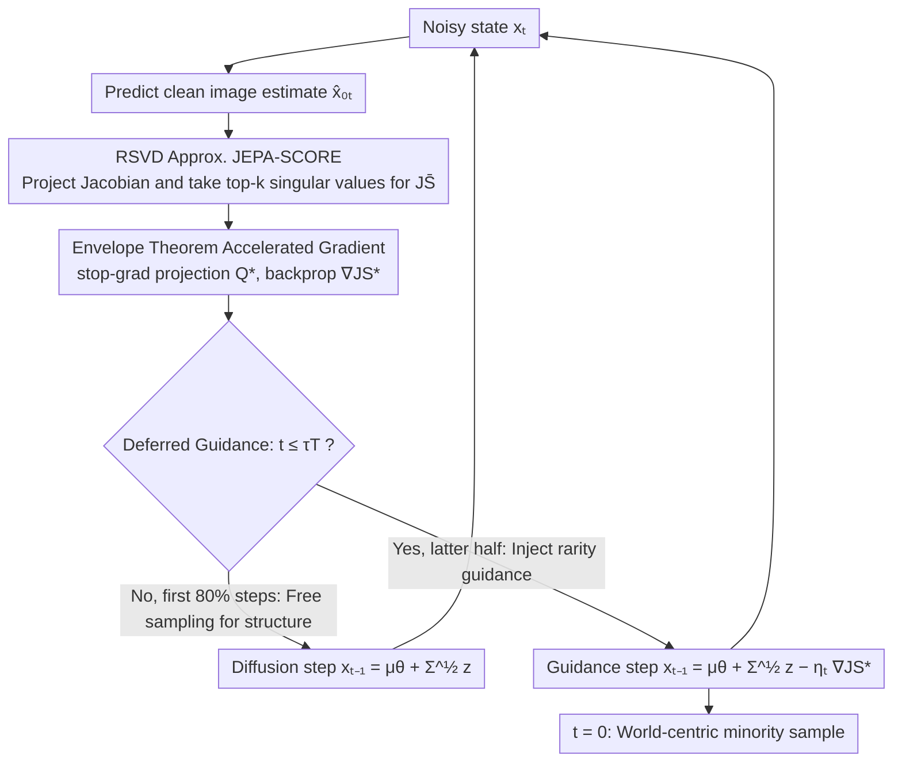

# Beyond Generative Priors: Minority Sampling with JEPA-Guided Diffusion

**Conference**: ICML2026  
**arXiv**: [2605.24631](https://arxiv.org/abs/2605.24631)  
**Code**: https://github.com/soobin-um/jepa-guidance  
**Area**: Image Generation  
**Keywords**: Minority Sampling, Diffusion Models, JEPA, World Model Prior, Randomized SVD  

## TL;DR

This work proposes JEPA Guidance, which leverages implicit density signals from JEPA (e.g., DINOv2) encoders to guide diffusion model sampling. It shifts the definition of "minority samples" from "low density under the generative model prior" to "low density under a world prior," achieving semantically meaningful rare sample generation in unconditional, class-conditional, and text-to-image scenarios.

## Background & Motivation

**Background**: Minority sampling aims to generate instances from low-density regions of the data manifold, a task with high demand in fields such as medical diagnosis, anomaly detection, and creative AI. Diffusion models, with their capacity for modeling complex distributions, have become the primary framework for this task, with existing methods including classifier-guidance and self-contained minority guidance.

**Limitations of Prior Work**: All existing methods define "minority samples" as low-density samples under the density $p_\theta$ learned by the generative model itself. This **generator-centric** definition is inherently tied to the training data, resulting in "rare samples" that are only rare for a specific model (e.g., a dog on a white background) rather than being semantically rare in the real world.

**Key Challenge**: The generator prior $p_\theta$ only captures the distribution of a specific training set and fails to reflect broader real-world semantics. When "world-level" rare samples are needed (e.g., stealth aircraft, atypical human figures), generator-centric methods are essentially powerless.

**Goal**: To shift the definition of minority samples from generator-centric to **world-centric**—measuring rarity using a world prior independent of the generative model—and achieving this goal within diffusion sampling.

**Key Insight**: JEPA (Joint-Embedding Predictive Architecture) such as DINOv2 is trained on large-scale data, and its representations implicitly encode data density (JEPA-SCORE), serving as a natural proxy for a world prior.

**Core Idea**: Use the Jacobian singular values of the JEPA encoder to estimate density under the world prior. Efficiently approximate this via randomized SVD and use gradients to guide diffusion sampling toward low-density regions, enabling world-centric minority sampling.

## Method

### Overall Architecture

The goal of this paper is to redefine "rarity" such that it is judged by an external world prior rather than the generator itself. This is implemented by allowing a JEPA encoder to "vote" at each step of diffusion sampling. Given a pre-trained diffusion model $\epsilon_\theta$ and a JEPA encoder $f_\phi$ (e.g., DINOv2), each step of the reverse process predicts a clean image estimate $\hat{x}_{0|t}$ from the current noisy state, intermittently calculates its JEPA-SCORE, and uses the negative gradient of this score to push sampling toward low-density regions under the world prior. This entire process requires no training; existing models are reused at inference time. The sampling update is expressed as $x_{t-1} = \mu_\theta(x_t, t) + \Sigma_\theta^{1/2} z - \eta_t \nabla_{x_t} \text{JS}^*(\hat{x}_{0|t})$, where the first two terms represent the original diffusion step and the last term is the force pulling the sample toward rare regions.

> JEPA-SCORE is the core metric here: it sums the logarithms of all singular values of the encoder Jacobian $J_f(x) \in \mathbb{R}^{d \times n}$, i.e., $\text{JS}(x) = \sum_{i=1}^r \log(\sigma_i(J_f(x)))$. Intuitively, the singular values of the Jacobian characterize the encoder's sensitivity to input perturbations near that point. High-density regions have flattened representations and small singular values, while low-density (rare) regions are the opposite. Thus, a lower JS indicates a rarer sample under the world prior, and the guidance direction aims to decrease JS.

### Key Designs

**1. Randomized SVD Approximation for JEPA-SCORE: Reducing an unmanageable density signal to practical use**

The original JEPA-SCORE requires a full SVD of the Jacobian $J_f(x) \in \mathbb{R}^{d \times n}$, which is computationally prohibitive when performed at every diffusion sampling step ($O(dn)$ cost). The method employs randomized SVD: a low-rank projection matrix $Q \in \mathbb{R}^{d \times l}$ ($l \ll d$) is constructed to compress the Jacobian into $\tilde{J}_f = Q^\top J_f \in \mathbb{R}^{l \times n}$, and only the top $k$ singular values are used to approximate the sum of logarithms. This reduces complexity from $O(dn)$ to $O(ln)$. This is not a heuristic reduction; the paper provides an upper bound for the approximation error $\text{JS} - \bar{\text{JS}} \leq \mathcal{E}_{\text{RSVD}} + \mathcal{E}_{\text{Trunc}}$ (Proposition 4.1), bounding both projection and truncation errors. Experiments show $k \approx 10$ is sufficient to approximate the true value, making a theoretically expensive density signal practical.

**2. Envelope Theorem Accelerated Gradient: Making rarity guidance backpropagation feasible**

Computing JS is not enough; guidance requires the gradient of $\bar{\text{JS}}(\hat{x}_{0|t})$ with respect to $x_t$. The difficulty is that the projection matrix $Q$ itself is calculated from $J_f(\hat{x}_{0|t})$ and thus depends indirectly on $x_t$. A naive implementation would require backpropagating through the entire randomized SVD computation graph, leading to memory exhaustion. The method invokes the Envelope Theorem: when the inner randomized SVD has obtained the optimal projection $Q^*$, it can be treated as a constant (stop-gradient), and the gradient is written as $\text{JS}^* = \sum_{i=1}^k \log(\tilde{\sigma}_i(\text{sg}(Q^{*\top}) J_f))$. Crucially, this is not a trade-off approximation—the Envelope Theorem guarantees the first-order gradient obtained this way remains correct at the optimal point, effectively removing the backpropagation cost of the SVD process.

**3. Deferred Guidance: Avoiding noisy inputs and ensuring conditional compatibility**

The JEPA encoder is trained on clean images, but the early diffusion estimate $\hat{x}_{0|t}$ is often blurry noise. Forcing the encoder to calculate density on unrecognizable inputs results in meaningless guidance. The method defers JEPA guidance until after a middle timestep $\tau T$ (default $\tau = 0.8$): the first $80\%$ of steps allow the diffusion model to sample freely and establish conditional structures (content corresponding to text/class), while the latter half uses JS gradients to pull samples into low-density regions. Ablations confirm this—without deferral ($\tau = 1.0$), both quality and text alignment deteriorate significantly. Furthermore, deferral solves conditional compatibility: while the JEPA encoder is agnostic to text or classes, the conditional information is integrated into the image during the early sampling phase, and the latter phase simply "finds rarity under existing conditions." This allows the condition-agnostic guidance to naturally extend to class-conditional and text-to-image scenarios.

## Key Experimental Results

### Main Results — Unconditional and Class-Conditional Generation

| Dataset | Method | cFID ↓ | sFID ↓ | Prec ↑ | Rec ↑ | JEPA-SCORE ↓ |
|--------|------|--------|--------|-------|-------|--------------|
| CelebA 64² | ADM | 12.11 | 6.35 | 0.85 | 0.57 | -221.67 |
| CelebA 64² | SGMS | 61.76 | 20.42 | 0.62 | 0.84 | -171.85 |
| CelebA 64² | **Ours** | **8.50** | **4.94** | **0.82** | 0.65 | **-300.79** |
| ImageNet 256² | ADM | 26.44 | 9.70 | 0.95 | 0.51 | -102.01 |
| ImageNet 256² | BnS | 32.01 | 10.61 | 0.92 | 0.56 | -125.77 |
| ImageNet 256² | **Ours** | **18.33** | **7.62** | 0.92 | **0.68** | **-241.62** |

### Text-to-Image Generation

| Model | Method | CLIP ↑ | PickScore ↑ | ImageReward ↑ | JEPA-SCORE ↓ |
|------|------|--------|-------------|---------------|--------------|
| SDv1.5 | DDIM | 31.52 | 21.49 | 0.21 | -292.27 |
| SDv1.5 | MinorityPrompt | 31.56 | 21.32 | 0.24 | -322.33 |
| SDv1.5 | **Ours** | 31.46 | **21.50** | 0.22 | **-355.40** |
| SDXL-Lightning | DDIM | 31.57 | 22.68 | 0.73 | -283.04 |
| SDXL-Lightning | MinorityPrompt | 31.36 | 22.62 | 0.71 | -302.17 |
| SDXL-Lightning | **Ours** | 31.52 | 22.63 | 0.73 | **-337.88** |

### Ablation Study

| Configuration | CLIP ↑ | PickScore ↑ | JEPA-SCORE ↓ | Description |
|------|--------|-------------|--------------|------|
| $\tau = 1.0$ (No delay) | 31.26 | 21.33 | -356.22 | Significant quality drop |
| $\tau = 0.9$ | 31.31 | 21.42 | -356.72 | Slight improvement |
| $\tau = 0.8$ (Default) | 31.40 | 21.46 | -360.82 | Best quality-rarity balance |
| $k = 3$ | 31.56 | 22.59 | -325.35 | Insufficient rank |
| $k = 9$ (Default) | 31.52 | 22.59 | -344.85 | Sufficiently effective |
| $k = 15$ | 31.53 | 22.58 | -335.28 | Diminishing returns |

### Downstream Application — Data Augmentation for Classification

| Training Data | Acc ↑ | F1 ↑ | Prec ↑ | Rec ↑ | Augmentation Vol. |
|----------|-------|------|--------|-------|--------|
| CelebA trainset | 0.898 | 0.746 | 0.815 | 0.710 | — |
| + SGMS | 0.903 | 0.757 | 0.822 | 0.724 | 50K |
| + BnS | 0.902 | 0.755 | 0.819 | 0.723 | 50K |
| + **Ours** | **0.902** | **0.775** | **0.824** | **0.731** | **30K** |

## Highlights & Insights

- **Paradigm Shift**: Redefining minority sampling from "finding rarity under the generator's distribution" to "finding rarity under a world prior" is conceptually more sound—generator-centric rarity may just be training set bias, while world-centric rarity reflects true semantics.
- **Theory and Engineering Balance**: The randomized SVD approximation has a strict error bound (Proposition 4.1), and the Envelope Theorem ensures gradient correctness.
- **Condition-Agnostic Design**: The JEPA encoder does not require conditional information (text/class). Compatibility with conditional generation is naturally achieved through deferred guidance, representing an elegant design.
- **Data Efficiency**: Surpassing baselines using only 30K augmented samples compared to 50K suggests that rare samples under the world prior contain higher information density.

## Limitations & Future Work

- Each guidance step requires Jacobian and randomized SVD calculations, introducing additional computational overhead; amortization or more efficient approximations could be explored.
- The quality of the world prior depends on the training data and capacity of the JEPA encoder; using different encoders will change the definition of "rarity."
- Only DINOv2/MetaCLIP encoders were explored; video models like V-JEPA or other modalities have not been verified.
- Reversing the guidance direction could generate high-density samples to reinforce biases, posing dual-use risks.

## Related Work & Insights

- **Minority Sampling Series** (Sehwag et al., Um et al.): The evolution from classifier-guided → self-contained → guidance-free methods. This work breaks the fundamental limitation of "only being able to define minorities under the generator prior."
- **JEPA-SCORE** (Balestriero et al., 2025): Proved that JEPA representations implicitly encode data density; this paper upgrades it from a posterior ranking tool to an online sampling guidance signal.
- **DINOv2** (Oquab et al., 2023): ViT encoder trained on 142M images, serving as a proxy for the world prior.
- **Insights**: This framework could be generalized to other scenarios requiring a definition of "rarity," such as fairness, robustness testing, and creative content generation.

## Rating
- Novelty: 9/10 — Paradigm shift from generator-centric to world-centric with significant conceptual contribution.
- Experimental Thoroughness: 8/10 — Covers unconditional/class-conditional/T2I and downstream applications with detailed ablations.
- Writing Quality: 9/10 — Clear concepts, rigorous theoretical derivation, and intuitive illustrations.
- Value: 8/10 — Opens new directions for minority sampling, though computational overhead limits large-scale adoption.

<!-- RELATED:START -->

## Related Papers

- [\[ICLR 2026\] Beyond Confidence: The Rhythms of Reasoning in Generative Models](../../ICLR2026/image_generation/beyond_confidence_the_rhythms_of_reasoning_in_generative_models.md)
- [\[CVPR 2025\] Learning Visual Generative Priors without Text](../../CVPR2025/image_generation/learning_visual_generative_priors_without_text.md)
- [\[ICML 2026\] Threshold-Guided Optimization for Visual Generative Models](threshold-guided_optimization_for_visual_generative_models.md)
- [\[CVPR 2026\] Efficient Weighted Sampling via Score-based Generative Models](../../CVPR2026/image_generation/efficient_weighted_sampling_via_score-based_generative_models.md)
- [\[CVPR 2026\] PhyCo: Learning Controllable Physical Priors for Generative Motion](../../CVPR2026/image_generation/phyco_learning_controllable_physical_priors_for_generative_motion.md)

<!-- RELATED:END -->
