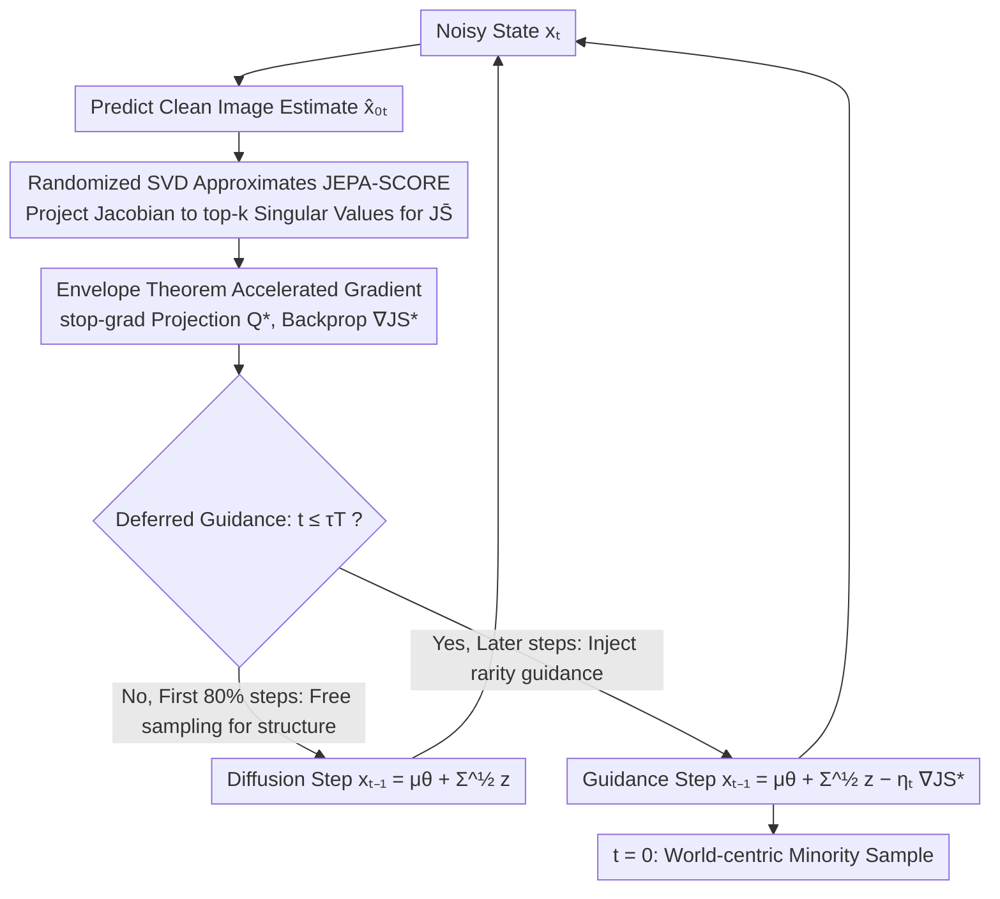

# Beyond Generative Priors: Minority Sampling with JEPA-Guided Diffusion

**Conference**: ICML2026  
**arXiv**: [2605.24631](https://arxiv.org/abs/2605.24631)  
**Code**: https://github.com/soobin-um/jepa-guidance  
**Area**: Image Generation  
**Keywords**: Minority sampling, Diffusion models, JEPA, World model prior, Randomized SVD  

## TL;DR

Ours proposes JEPA Guidance, utilizing implicit density signals from JEPA (e.g., DINOv2) encoders to guide the sampling of diffusion models. This shifts the definition of minority samples from "low density under the generative model's prior" to "low density under a world prior," achieving more semantically meaningful rare sample generation in unconditional, class-conditional, and text-to-image scenarios.

## Background & Motivation

**Background**: Minority sampling aims to generate instances from low-density regions of the data manifold, a task in high demand for fields such as medical diagnosis, anomaly detection, and creative AI. Diffusion models, with their capacity for modeling complex distributions, have become the primary framework for this task, with existing methods including classifier-guidance and self-contained minority guidance.

**Limitations of Prior Work**: All existing methods define "minority samples" as low-density instances under the generative model's own learned density $p_\theta$. This **generator-centric** definition is inherently tied to the training data, leading to "rare samples" that are only uncommon for a specific model (e.g., a dog on a white background) but do not correspond to semantic rarity in the real world.

**Key Challenge**: The generator prior $p_\theta$ only captures the distribution of a specific training set and cannot reflect broader real-world semantics. When "world-level" rare samples are required (e.g., stealth aircraft, atypical figures), generator-centric methods are completely ineffective.

**Goal**: Shift the definition of minority samples from generator-centric to **world-centric**—measuring rarity using a world prior independent of the generative model and achieving this goal within diffusion sampling.

**Key Insight**: JEPA (Joint-Embedding Predictive Architecture) models like DINOv2 are trained on massive scales of data, and their representations implicitly encode data density (JEPA-SCORE), serving as a natural proxy for a world prior.

**Core Idea**: Estimate the density under the world prior using the singular values of the JEPA encoder's Jacobian. Efficiently approximate this via randomized SVD and use gradients to guide diffusion sampling toward low-density regions, achieving world-centric minority sampling.

## Method

### Overall Architecture

This paper shifts the determination of "rarity" from the generator's internal logic to an external world prior by having the JEPA encoder "vote" at each step of diffusion sampling. Given a pre-trained diffusion model $\epsilon_\theta$ and a JEPA encoder $f_\phi$ (e.g., DINOv2), each step of the reverse process predicts a clean image estimate $\hat{x}_{0|t}$ from the current noisy state. Its JEPA-SCORE is intermittently calculated, and the negative gradient of this score pushes the sampling towards lower-density regions under the world prior. This pipeline requires no training; it reuses existing models at inference time. The sampling update is expressed as $x_{t-1} = \mu_\theta(x_t, t) + \Sigma_\theta^{1/2} z - \eta_t \nabla_{x_t} \text{JS}^*(\hat{x}_{0|t})$, where the first two terms represent the original diffusion step and the last term is the force pulling the sample toward the rare region.

> JEPA-SCORE is the core custom metric here: it sums the logarithms of all singular values of the encoder Jacobian $J_f(x) \in \mathbb{R}^{d \times n}$, $\text{JS}(x) = \sum_{i=1}^r \log(\sigma_i(J_f(x)))$. Intuitively, the singular values of the Jacobian characterize the encoder's sensitivity to input perturbations near that point. In high-density regions, representations are compressed (small singular values), while in low-density (rare) regions, they are the opposite. Thus, lower JS indicates higher rarity under the world prior, and the guidance direction aims to decrease JS.

### Key Designs

**1. Randomized SVD Approximation of JEPA-SCORE: Compressing an uncomputable density signal into usability**

The original JEPA-SCORE requires a full SVD on the Jacobian $J_f(x) \in \mathbb{R}^{d \times n}$. Calculating this at every diffusion step is computationally prohibitive due to the $O(dn)$ cost. The method shifts to randomized SVD: first constructing a low-rank projection matrix $Q \in \mathbb{R}^{d \times l}$ ($l \ll d$) to compress the Jacobian into $\tilde{J}_f = Q^\top J_f \in \mathbb{R}^{l \times n}$, then taking only the top $k$ singular values to approximate the log-sum. The complexity is reduced from $O(dn)$ to $O(ln)$. This is not a heuristic cut; the paper provides an upper bound for the approximation error $\text{JS} - \bar{\text{JS}} \leq \mathcal{E}_{\text{RSVD}} + \mathcal{E}_{\text{Trunc}}$ (Proposition 4.1), bounding both random projection and truncation errors. Experiments show $k \approx 10$ is sufficient to approximate the true value.

**2. Envelope Theorem to Accelerate Gradients: Making rarity guidance backproppable**

Computing JS is insufficient; guidance requires the gradient of $\bar{\text{JS}}(\hat{x}_{0|t})$ with respect to $x_t$. The complication is that $Q$ itself is derived from $J_f(\hat{x}_{0|t})$ and depends indirectly on $x_t$. A naive implementation would backprop through the entire randomized SVD computation, exhausting memory. The method utilizes the Envelope Theorem: when the inner randomized SVD has reached the optimal projection $Q^*$, it can be treated as a constant with a "stop-gradient." The gradient is written as $\text{JS}^* = \sum_{i=1}^k \log(\tilde{\sigma}_i(\text{sg}(Q^{*\top}) J_f))$. Crucially, this is not an approximation that sacrifices accuracy—the Envelope Theorem guarantees the first-order gradient remains correct at the optimum, effectively removing the backprop overhead of the SVD process.

**3. Deferred Guidance: Bypassing JEPA's noise blindness and enabling conditional generation**

JEPA encoders are trained on clean images, but early-stage diffusion $\hat{x}_{0|t}$ is mostly blurry noise. Forcing density calculations here yields meaningless signals. The method defers JEPA guidance until after a middle timestep $\tau T$ (default $\tau = 0.8$). During the first $80\%$ of steps, the diffusion model samples freely to establish conditional structures (content corresponding to text/class). Rarity guidance is injected in the later stages. Ablations confirm that without deferment ($\tau = 1.0$), quality and text alignment collapse. Serendipitously, deferment also resolves condition compatibility: while the JEPA encoder is condition-agnostic, the late-stage guidance merely pushes for rarity *within* the context already established by prior sampling steps.

## Key Experimental Results

### Main Results — Unconditional and Class-conditional Generation

| Dataset | Method | cFID ↓ | sFID ↓ | Prec ↑ | Rec ↑ | JEPA-SCORE ↓ |
|--------|------|--------|--------|-------|-------|--------------|
| CelebA 64² | ADM | 12.11 | 6.35 | 0.85 | 0.57 | -221.67 |
| CelebA 64² | SGMS | 61.76 | 20.42 | 0.62 | 0.84 | -171.85 |
| CelebA 64² | **Ours** | **8.50** | **4.94** | **0.82** | 0.65 | **-300.79** |
| ImageNet 256² | ADM | 26.44 | 9.70 | 0.95 | 0.51 | -102.01 |
| ImageNet 256² | BnS | 32.01 | 10.61 | 0.92 | 0.56 | -125.77 |
| ImageNet 256² | **Ours** | **18.33** | **7.62** | 0.92 | **0.68** | **-241.62** |

### Main Results — Text-to-Image Generation

| Model | Method | CLIP ↑ | PickScore ↑ | ImageReward ↑ | JEPA-SCORE ↓ |
|------|------|--------|-------------|---------------|--------------|
| SDv1.5 | DDIM | 31.52 | 21.49 | 0.21 | -292.27 |
| SDv1.5 | MinorityPrompt | 31.56 | 21.32 | 0.24 | -322.33 |
| SDv1.5 | **Ours** | 31.46 | **21.50** | 0.22 | **-355.40** |
| SDXL-Lightning | DDIM | 31.57 | 22.68 | 0.73 | -283.04 |
| SDXL-Lightning | MinorityPrompt | 31.36 | 22.62 | 0.71 | -302.17 |
| SDXL-Lightning | **Ours** | 31.52 | 22.63 | 0.73 | **-337.88** |

### Ablation Study

| Config | CLIP ↑ | PickScore ↑ | JEPA-SCORE ↓ | Note |
|------|--------|-------------|--------------|------|
| $\tau = 1.0$ (No delay) | 31.26 | 21.33 | -356.22 | Severe quality drop |
| $\tau = 0.9$ | 31.31 | 21.42 | -356.72 | Slight improvement |
| $\tau = 0.8$ (Default) | 31.40 | 21.46 | -360.82 | Best quality/rarity balance |
| $k = 3$ | 31.56 | 22.59 | -325.35 | Insufficient rank |
| $k = 9$ (Default) | 31.52 | 22.59 | -344.85 | Sufficiently effective |
| $k = 15$ | 31.53 | 22.58 | -335.28 | Diminishing returns |

### Downstream Application — Data Augmentation for Classification

| Training Data | Acc ↑ | F1 ↑ | Prec ↑ | Rec ↑ | Augmentation Vol. |
|----------|-------|------|--------|-------|--------|
| CelebA trainset | 0.898 | 0.746 | 0.815 | 0.710 | — |
| + SGMS | 0.903 | 0.757 | 0.822 | 0.724 | 50K |
| + BnS | 0.902 | 0.755 | 0.819 | 0.723 | 50K |
| + **Ours** | **0.902** | **0.775** | **0.824** | **0.731** | **30K** |

## Highlights & Insights

- **Paradigm Shift**: Redefining minority sampling from "finding rarity under the generator's distribution" to "finding rarity under a world prior" is conceptually more sound—generator-centric rarity might just be training set bias, whereas world-centric rarity reflects actual semantics.
- **Theory & Engineering Balance**: Randomized SVD approximation has a rigorous error upper bound (Proposition 4.1), and the Envelope Theorem ensures gradient correctness—not an ad-hoc hack.
- **Condition-agnostic Design**: The JEPA encoder does not need to know the conditional information (text/class). Through deferred guidance, it naturally becomes compatible with conditional generation, making the design highly elegant.
- **Data Efficiency**: In downstream classification, using only 30K augmented samples outperforms the 50K baseline, indicating that rare samples under the world prior contain higher information density.

## Limitations & Future Work

- Each guided step requires Jacobian calculation + randomized SVD, introducing additional computational overhead; amortization or more efficient approximations could be explored.
- The quality of the world prior depends on the training data and capacity of the JEPA encoder; different encoders will change the definition of "rarity."
- Only DINOv2/MetaCLIP encoders were explored; video models like V-JEPA or other modalities remain unvisited.
- Reversing the guidance direction could generate high-density samples to reinforce bias, presenting a dual-use risk.

## Related Work & Insights

- **Minority Sampling Series** (Sehwag et al., Um et al.): The evolution from classifier-guided → self-contained → guidance-free; this work breaks the fundamental limitation of "rarity must be defined under the generator's prior."
- **JEPA-SCORE** (Balestriero et al., 2025): Proved that JEPA representations implicitly encode data density; this work upgrades it from a posterior ranking tool to an online sampling guidance signal.
- **DINOv2** (Oquab et al., 2023): ViT encoders trained on 142 million images serve as the proxy for the world prior.
- **Insight**: This framework can be generalized to other scenarios requiring a "definition of rarity," such as fairness research, robustness testing, and creative content generation.

## Rating
- Novelty: 9/10 — Outstanding conceptual contribution with the shift from generator-centric to world-centric sampling.
- Experimental Thoroughness: 8/10 — Covers unconditional/class-conditional/T2I and downstream applications with detailed ablations.
- Writing Quality: 9/10 — Clear concepts, rigorous theoretical derivation, and intuitive illustrations.
- Value: 8/10 — Opens a new direction for minority sampling, though computational overhead limits practical scaling.

<!-- RELATED:START -->

## Related Papers

- [\[ICLR 2026\] Beyond Confidence: The Rhythms of Reasoning in Generative Models](../../ICLR2026/image_generation/beyond_confidence_the_rhythms_of_reasoning_in_generative_models.md)
- [\[CVPR 2025\] Learning Visual Generative Priors without Text](../../CVPR2025/image_generation/learning_visual_generative_priors_without_text.md)
- [\[ICML 2026\] Threshold-Guided Optimization for Visual Generative Models](threshold-guided_optimization_for_visual_generative_models.md)
- [\[CVPR 2026\] PhyCo: Learning Controllable Physical Priors for Generative Motion](../../CVPR2026/image_generation/phyco_learning_controllable_physical_priors_for_generative_motion.md)
- [\[CVPR 2026\] Efficient Weighted Sampling via Score-based Generative Models](../../CVPR2026/image_generation/efficient_weighted_sampling_via_score-based_generative_models.md)

<!-- RELATED:END -->
