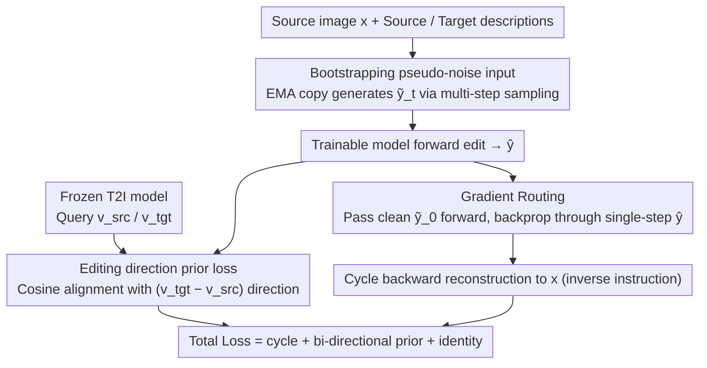

# Bootstrap Your Generator: Unpaired Visual Editing with Flow Matching

**Conference**: ICML2026  
**arXiv**: [2606.03911](https://arxiv.org/abs/2606.03911)  
**Code**: https://research.nvidia.com/labs/par/byg/ (Project Page)  
**Area**: Image Generation  
**Keywords**: Unpaired training, flow matching, image editing, video editing, cycle consistency  

## TL;DR
The authors propose Bootstrap Your Generator (ByG), an editing training framework for flow matching that does not require paired data. It extracts editing direction priors from a frozen base model, maintains source structure via cycle consistency, and bridges the training-inference gap using gradient routing. It outperforms supervised baselines trained on millions of paired samples in both image and video editing.

## Background & Motivation

**Background**: Current mainstream visual editing methods (e.g., FLUX-Kontext, Qwen-Image-Edit, Ditto) rely on large-scale paired datasets (millions of source-target pairs) for supervised training. While effective, the data acquisition cost is extremely high.

**Limitations of Prior Work**: Collecting paired data is almost impossible for long-tail editing scenarios (e.g., converting cartoons to realism, changing liquid viscosity) and video editing, as before-after pairs simply do not exist. Zero-shot methods (e.g., FlowEdit) do not require paired data but offer limited quality; NP-Edit avoids paired data but depends on external VLM feedback models and suffers from scalability issues regarding multi-step models and videos.

**Key Challenge**: Supervised methods require paired data that is hard to scale, while unsupervised methods lack effective training signals. Flow matching models face additional challenges: standard training requires adding noise to ground truth outputs, which is unavailable in unpaired settings. Furthermore, training occurs on intermediate noisy states, whereas losses like cycle consistency require clean, fully denoised outputs.

**Goal**: Design a general framework that utilizes only the knowledge of pre-trained generative models themselves to train flow matching editing models without any paired data or external models.

**Core Idea**: Visual editing has two objectives—following editing instructions and preserving source content. The former is achieved by extracting editing direction signals from the velocity field differences of a frozen T2I base model. The latter is implemented through cycle consistency constraints, with gradient routing (an STE variant) addressing the gap between noise prediction during training and clean outputs during inference.

## Method

### Overall Architecture
The core difficulty ByG solves is fine-tuning a pre-trained T2I model into an editing model that is both instruction-compliant and structure-preserving without source-target pairs. The strategy is to let the model "teach itself"—using an EMA copy of the editing model to generate noisy inputs for training, using a frozen T2I model to provide a prior on "which direction to edit," and using forward editing + backward reconstruction cycle constraints to force content preservation. These three signals combine into a total loss $\mathcal{L} = \mathcal{L}_{\text{cycle}} + \lambda_{\text{prior}}(\mathcal{L}_{\text{prior}}^{\text{fwd}} + \mathcal{L}_{\text{prior}}^{\text{rev}}) + \lambda_{\text{id}}\mathcal{L}_{\text{id}}$. Training requires only source images and their corresponding source/target captions.

### Key Designs

**1. Bootstrapping Pseudo-Noise Input: Filling the missing training inputs for flow matching**

Standard flow matching training requires adding noise to a ground truth output as input. In unpaired scenarios, there is no target image $\mathbf{y}$, meaning no legitimate noise input—a "chicken and egg" cycle where a good model is needed to create good inputs, but good inputs are needed to train the model. ByG breaks this by maintaining an EMA copy of the editing model. At each training step, the EMA model samples $n$ steps from pure noise ($t=1$) to time step $t$ to produce a pseudo-noise input $\tilde{\mathbf{y}}_t$ for the trainable model. The EMA copy smooths training fluctuations, and its generated inputs improve as the main model strengthens, creating a self-bootstrapping feedback loop. Removing this bootstrapping caused Edit Success to drop from 8.32 to 5.52 in ablations due to the severe distribution mismatch between training and inference.

**2. Editing Direction Prior Loss: Providing "instruction-following" signals unsupervised**

Unpaired training means no supervision specifies what the edited result should look like. ByG extracts this signal from a frozen T2I model: querying it with the same noise input using source prompts $p_{\text{src}}$ and target prompts $p_{\text{tgt}}$ yields two velocity fields $\mathbf{v}_{\text{src}}$ and $\mathbf{v}_{\text{tgt}}$. Instead of matching $\mathbf{v}_{\text{tgt}}$ directly—which would pull the model toward unconditional T2I reconstruction and cause content drift—the model is constrained to align its "editing direction." A cosine loss $\mathcal{L}_{\text{dir}} = 1 - \cos(\mathbf{v}_{\text{fwd}} - \mathbf{v}_{\text{src}},\; \mathbf{v}_{\text{tgt}} - \mathbf{v}_{\text{src}})$ ensures the model's velocity change matches the T2I difference $\mathbf{v}_{\text{tgt}} - \mathbf{v}_{\text{src}}$. An additional MSE term $\alpha\|\mathbf{v}_{\text{fwd}} - \mathbf{v}_{\text{tgt}}\|^2$ prevents velocity norm explosion. This difference-based formulation isolates semantic changes, letting cycle consistency handle shared structure.

**3. Gradient Routing: Bridging the gap between single-step prediction and multi-step inference**

The cycle's reverse pass requires reconstructing the source image using the forward edit result as a condition. During training, one can only use the single-step prediction $\hat{\mathbf{y}}$ as a condition, which is blurrier and more biased than the clean multi-step output $\tilde{\mathbf{y}}_0$ seen at inference. Models often learn to ignore blurry conditions. ByG adapts the Straight-Through Estimator (STE) to the continuous denoising setting: the forward pass uses the clean estimate $\tilde{\mathbf{y}}_0$ (sampled from the EMA to match inference distribution), while the backward pass routes gradients through the single-step prediction $\hat{\mathbf{y}}$. This is implemented as $\hat{\mathbf{y}}^{\text{hyb}} = \text{sg}(\tilde{\mathbf{y}}_0) + (\hat{\mathbf{y}} - \text{sg}(\hat{\mathbf{y}}))$ (where $\text{sg}$ is stop-gradient). This allows the model to "see" clean images while maintaining a differentiable path for updates. Removing gradient routing reduced Source Preservation from 7.62 to 7.18 in ablations.

### Loss & Training
The total loss consists of four synergistic terms: the cycle reconstruction loss (ensures source structure), bi-directional prior losses (ensures instruction following for both forward and reverse passes), and the identity loss (ensures source is preserved when the target prompt matches the source). Ablation shows that removing these regularizations leads to a collapse into an identity mapping (Edit Success of only 0.63). For video editing, the losses are applied directly to video latents without architectural changes.

## Key Experimental Results

### Main Results—Video Editing User Study

| Edit Direction | ByG Win Rate | Ditto Win Rate | Votes |
|----------------|--------------|----------------|-------|
| Cartoon → Photo | **80.5% ± 2.9%** | 19.5% | 119 |
| Photo → Cartoon | **70.0% ± 5.4%** | 30.0% | 119 |
| OOD 3D-CGI | **85.0%** | 15.0% | — |
| Overall | **75.3% ± 2.2%** | 24.7% | 238 |

Ours (ByG) was trained on ~330 unpaired videos, while Ditto was trained on millions of paired videos. Binomial test $p < 3 \times 10^{-15}$.

### Video Editing Quantitative Metrics

| Method | CLIP dir ↑ | DINO Sim. ↑ | Motion Fid. ↑ | Dyn. Deg. ↑ | Aesthetic ↑ | Temp. Flicker ↑ |
|--------|-----------|------------|--------------|------------|------------|----------------|
| **Ours (ByG)** | **0.104** | **0.718** | **0.715** | **0.597** | 0.574 | 0.967 |
| Ditto | 0.091 | 0.536 | 0.616 | 0.560 | **0.585** | **0.972** |

### Long-tail Style Editing (6 Unseen Styles: GTA V / Minecraft / American Comic / Low-poly / Voxel / Lego)

| Method | Style→Photo Semantic ↑ | Overall ↑ | Photo→Style Semantic ↑ | Overall ↑ |
|--------|----------------------|-----------|----------------------|-----------|
| **Ours (ByG)** | **7.67** | **8.30** | **5.22** | **6.33** |
| Kontext (Superv.) | 6.87 | 7.85 | 3.97 | 6.00 |
| Qwen-Image-Edit (Superv.) | 6.86 | 7.75 | 4.87 | 5.17 |
| FlowEdit (Zero-shot) | 4.27 | 6.20 | 1.46 | 3.64 |

### Ablation Study

| Configuration | Edit Success ↑ | Source Pres. ↑ | Description |
|---------------|---------------|---------------|-------------|
| Full Model | 8.317 | 7.617 | Best balance |
| w/o Gradient Routing | 8.917 | 7.183 | Aggressive editing but lower preservation |
| w/o Cycle Loss | 8.983 | 7.233 | Loses source structure constraint |
| w/o Direction Loss | 8.400 | 7.233 | MSE only; stronger source drift |
| w/o Bootstrapping | 5.517 | 7.050 | Distribution mismatch; both metrics drop |
| w/o Regularization | 0.633 | 9.767 | Collapse into identity mapping |

## Highlights & Insights
- **Key Innovation**: First flow matching editing training framework that requires neither paired data nor external models. The components (bootstrapping, direction prior, gradient routing) complement each other to solve the fundamental challenges of unsupervised training.
- **Gradient Routing** is a technical highlight: Adapting STE to continuous denoising enables clean image conditioning while flowing gradients back to update the forward pass, effectively eliminating the train-test gap.
- **Strong Generalization**: Achieved an 85% win rate on 330-CGI styles unseen during training; outperformed supervised baselines on 6 completely un-trained styles.
- **Extreme Data Efficiency**: Surpassed Ditto (trained on millions of pairs) using only ~330 unpaired videos.

## Limitations & Future Work
- Inherits the knowledge boundaries and biases of the base model—editing fails if the T2I model does not understand the target domain.
- **Object Removal** performance is weak (GEdit-Bench 1.91 vs. Kontext 6.94): target captions merely "omit" the object, providing no explicit removal signal.
- Weak text editing performance (2.10 vs. 5.44) due to current caption supervision limitations.
- Bootstrapping + EMA increases training computational costs due to multi-step sampling for pseudo-input generation.

## Related Work & Insights
- **CycleGAN** (Zhu et al., 2017): Classic source of cycle consistency, but only for two-domain transfer rather than open-instruction editing.
- **NP-Edit** (Kumari et al., 2025): Unpaired but relies on VLM feedback and single-step distillation, making it hard to scale to multi-step models and videos.
- **DDS** (Hertz et al., 2023): Pixel-space optimization of editing directions. ByG instead uses single-state dual-prompt queries for direction extraction.
- **STE** (Bengio et al., 2013): ByG’s gradient routing is inspired by STE but adapted from discrete quantization to continuous denoising.

## Rating
- Novelty: 9/10 — The first to combine bootstrapping, direction priors, and STE gradient routing for an unpaired flow matching editing framework.
- Experimental Thoroughness: 9/10 — Covers image and video modalities, long-tail and general benchmarks, with comprehensive user studies, automatic metrics, and ablations.
- Writing Quality: 9/10 — Clear logical chain with tight mappings between problems and solutions.
- Value: 8/10 — Significantly lowers the data bar for editing models, though a gap remains in scenarios where paired data excels, like object removal/text editing.

<!-- RELATED:START -->

## Related Papers

- [\[ICML 2026\] Shifting the Breaking Point of Flow Matching for Multi-Instance Editing](shifting_the_breaking_point_of_flow_matching_for_multi-instance_editing.md)
- [\[ICML 2026\] A Kinetic Energy Perspective of Flow Matching](a_kinetic_energy_perspective_of_flow_matching.md)
- [\[ICML 2026\] Principled RL for Flow Matching Emerges from the Chunk-level Policy Optimization](principled_rl_for_flow_matching_emerges_from_the_chunk-level_policy_optimization.md)
- [\[ICML 2026\] (HB-ARFM) History-Bootstrapped Flow Matching for Inverse Boiling Reconstruction](hb-arfm_history-bootstrapped_flow_matching_for_inverse_boiling_reconstruction.md)
- [\[CVPR 2026\] BiFM: Bidirectional Flow Matching for Few-Step Image Editing and Generation](../../CVPR2026/image_generation/bifm_bidirectional_flow_matching_for_few-step_image_editing_and_generation.md)

<!-- RELATED:END -->
