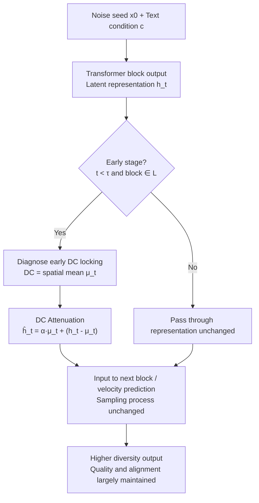

# Breaking the Lock-in: Diversifying Text-to-Image Generation via Representation Modulation

**Conference**: ICML 2026  
**arXiv**: [2606.06813](https://arxiv.org/abs/2606.06813)  
**Code**: To be confirmed  
**Area**: Image Generation / Diffusion Models  
**Keywords**: Text-to-image diversity, representation modulation, DC component, flow matching, training-free  

## TL;DR
The authors discover that Transformer-based text-to-image models cause the "zero-frequency spatial mean (DC component)" to rapidly align across different random seeds during the early stages of denoising, prematurely locking the global layout. Consequently, they propose DAVE—a lightweight attenuation of the DC component in intermediate representations during early generation stages. This approach unlocks sample diversity for the same prompt with almost zero overhead while maintaining image quality and text-image alignment.

## Background & Motivation

**Background**: Current mainstream text-to-image (T2I) models utilize large-scale Transformer backbones combined with flow matching objectives (e.g., SD3, Flux, SANA). They possess strong text-image alignment and realism, becoming the dominant paradigm for generative modeling.

**Limitations of Prior Work**: The reliability of quality has led to a collapse in diversity—sampling repeatedly with a fixed prompt often converges to highly similar compositions and styles. Diversity is not an optional ornament; it determines a user's ability to explore candidates, discover rare configurations, and construct synthetic datasets with broad distribution coverage, directly impacting downstream utility.

**Key Challenge**: Existing diversity enhancement methods suffer from two major flaws. First, they are **computationally expensive**: either requiring extra sampling steps, auxiliary optimization, or parallel execution of multiple seeds to repel each other (e.g., Particle Guidance, DiverseFlow, SPELL, OSCAR, SPARKE). These "intra-batch joint evaluation" methods increasingly consume VRAM and compute as model sizes expand. Second, they **lack an explanatory root cause**: they remain at the heuristic level of the sampling layer (e.g., CADS injecting scheduled noise into text conditions), "forcing back" diversity only during inference without answering where or why diversity collapse occurs internally.

**Goal**: To identify the mechanistic source of diversity collapse from the representation level (rather than the sampling level) and design an intervention that **requires no sampling pipeline changes, no retraining, and almost zero overhead**.

**Key Insight**: The authors examined the intermediate latent representations $h_t^{(\ell)}$ of Transformer blocks across different noise seeds and discovered a counter-intuitive phenomenon—the **zero-frequency component (DC component, i.e., the mean along the spatial token dimension) aligns almost perfectly across seeds early in denoising**, and this component accounts for 51.2% of the total energy, acting as a dominant signal rather than noise.

**Core Idea**: Since "early DC drift" acts like a seed-agnostic anchor that pins down the generation trajectory, **selectively weakening the DC component in early stages** allows the randomness of the initial noise seed to re-dominate structural variations, thereby breaking the homogeneity caused by the "conditional mean."

## Method

### Overall Architecture

The full process of DAVE (DC Attenuation for diVersity Enhancement) does not alter the sampler or model weights. It simply inserts a "DC attenuation" operation at the output of certain Transformer blocks during the early stages of the denoising loop. The logic follows three steps: first, **diagnosis**—analyzing intermediate representations to locate early cross-seed DC locking; second, **intervention**—attenuating the DC component by a coefficient $\alpha$ for selected blocks when time $t < \tau$; third, **sampling as usual**—the attenuated representations are fed into the next block, and the rest of the flow matching sampling process remains unchanged.

Text-to-image generation transports a source distribution $X_0 = \mathcal{N}(0, I)$ to the data distribution $X_1$ through a learned velocity field $v_\theta(x_t, t; c)$ along the ODE $\frac{dx_t}{dt} = v_\theta(x_t, t; c)$, discretized into $K$ steps of Euler iteration $x_{k+1} = x_k + \Delta t \, v_\theta(x_k, t_k; c)$. The velocity field is implemented with a Transformer, where each block updates the representation as $h_t^{(\ell+1)} = \mathrm{Block}^{(\ell+1)}(h_t^{(\ell)}, t, c)$. DAVE intervenes on this $h_t^{(\ell)}$.

### Key Designs

**1. Diagnosis of early DC locking: Localizing diversity collapse to the zero-frequency component**

Using SD3 with 100 random seeds per prompt, the authors analyzed representations from the 5th Transformer block. They found that the DC component (spatial mean along $D$ visual tokens) was highly consistent across seeds: pairwise cosine similarity was high, the coefficient of variation was low, and it accounted for $51.2\%$ of the total energy. This phenomenon is named "early DC drift." The authors further provide a mechanistic explanation: it arises from the **collusion of architectural bias and training objectives**. On one hand, neural networks have a spectral bias, naturally prioritizing low-frequency signals; DC, being the lowest frequency, is prioritized at the start of sampling, consistent with the empirical observation that global structure forms early. On the other hand, the signal-to-noise ratio (SNR) is low in early steps. The optimal solution for a flow matching objective (MSE form) under high uncertainty is to predict the **expectation of data given the text condition**—high-frequency, seed-specific textures are averaged out across seeds, while the DC component, as a global statistic, is strongly pulled toward the conditional mean, becoming a seed-agnostic anchor. Stepwise analysis confirms this DC alignment is concentrated in the earliest steps and decays toward the end of generation (see Table 3). This diagnosis is the foundation of the paper: it indicates the intervention should be "early and specifically targeted at DC."

**2. DC Attenuation intervention: Unlocking trajectories with a single spatial mean scaling**

To address the aforementioned anchor, DAVE weakens it directly. For latent representation $h_t^{(\ell)} \in \mathbb{R}^{D \times C}$ (where $D$ is the number of visual tokens and $C$ is the number of channels), the DC component does not require a frequency domain transform; it is simply the spatial mean:

$$\mu_t^{(\ell)} = \frac{1}{D} \sum_{d=1}^{D} h_t^{(\ell)}[d, :] \in \mathbb{R}^{1 \times C}.$$

Attenuation decomposes the representation into "DC + residual," scaling only the DC while leaving the full residual:

$$\hat{h}_t^{(\ell)} = \alpha \cdot \mu_t^{(\ell)} + \big(h_t^{(\ell)} - \mu_t^{(\ell)}\big), \quad \alpha \in (0, 1),$$

where $\mu_t^{(\ell)}$ is broadcast across all $D$ tokens during subtraction/addition. In multi-modal architectures like MMDiT, the authors only intervene on representations carrying visual information, leaving the text branch untouched. $\hat{h}_t^{(\ell)}$ replaces the original representation and is passed to the next block. This operation is effective because it **precisely dismantles the seed-agnostic global anchor**: by weakening DC, the relative impact of seed-specific spatial residuals in the initial noise is amplified, preventing global layouts from being locked prematurely. It is surgical, training-free, and seamlessly embeds into any pre-trained model without adding architecture or extra optimization. Thus, it incurs almost zero computational/VRAM overhead and does not constrain batch size—effectively bypassing the overhead bottlenecks of inter-batch repulsion methods like Particle Guidance.

**3. Selection of the Three Knobs: Attenuation intensity $\alpha$, Target block pool $\mathcal{L}$, and Time cutoff $\tau$**

DAVE has only three hyperparameters, each with clear physical meaning: $\alpha$ controls the strength of attenuation (lower values increase diversity but may hurt quality/alignment); $\mathcal{L}$ selects which blocks to intervene on (corresponding to the diagnosis that DC dominates around the 5th block); and $\tau$ determines the duration of intervention (corresponding to the discovery that DC locking is concentrated in early steps). Together, these limit the intervention to an "early + intermediate block + moderate intensity" window, allowing DC attenuation to enhance diversity without disrupting subsequent high-frequency details and text-image semantic alignment. The paper provides empirical guidance for selecting these knobs and includes a systematic configuration analysis in the experiments.

### Loss & Training
DAVE is a **training-free** inference-time intervention. it introduces no loss functions, requires no retraining or fine-tuning, and acts directly on frozen pre-trained models.

## Key Experimental Results

### Main Results

Evaluated under an independent sampling setting (no intra-batch interaction) across three backbones—SD3.5, Flux.1-dev, and SANA1.5—on ImageNet and MSCOCO datasets. The primary diversity metrics are **Vendi** (higher is more diverse) and **Recall/Coverage**, while quality is assessed via FID and Precision/Density, and semantics via CLIP. Representative results on ImageNet using SD3.5 are shown below ("Ours Random" is a randomized variant):

| Method | FID ↓ | Recall ↑ | Vendi ↑ | CLIP ↑ |
|------|-------|----------|---------|--------|
| Orig | 22.23 | 0.2589 | 1.71 | 0.2952 |
| CADS | 17.91 | 0.5698 | 2.09 | 0.2907 |
| SPARKE | 22.27 | 0.3136 | 1.77 | 0.3016 |
| **Ours (DAVE)** | 20.74 | **0.6489** | 2.33 | 0.2897 |
| **Ours Random** | 17.57 | 0.5422 | **2.50** | 0.2939 |

DAVE significantly increases Vendi from 1.71 to 2.33–2.50 and Recall from 0.26 to 0.54–0.65, while CLIP scores only slightly decrease from 0.2952 to around 0.29, and FID even improves. This indicates "significant diversity gains with almost no drop in alignment and no degradation in image quality."

### Comparison of Overhead and Mechanism

| Dimension | Intra-batch Repulsion (PG/DiverseFlow/SPARKE) | DAVE |
|------|-----------------------------------|------|
| Extra sampling steps / Auxiliary optimization | Required | Not required |
| VRAM and decoding overhead | Increases significantly with scale | Almost zero |
| Batch size constraints | Dependent on intra-batch joint evaluation | Unconstrained |
| Root cause explanation | No (sampling-layer heuristic) | Yes (localizing early DC locking) |

### Key Findings
- **DC component is the key bottleneck for diversity collapse**: It accounts for 51.2% of early representation energy and is highly aligned across seeds. Modifying this single component triggers changes in the entire image layout, suggesting collapse is concentrated in the "global mean" degree of freedom.
- **Intervene early**: Cross-seed DC alignment is concentrated in the earliest steps and decays toward the end; thus, $\tau$ must be set to an early window. Late-stage intervention is unnecessary and may damage details.
- **Almost "free" diversity**: Compared to intra-batch repulsion methods that multiply sampling/VRAM costs, DAVE achieves competitive diversity with a single spatial mean scaling, making it scaling-friendly.
- **CADS fails on strong backbones**: On Flux.1-dev and SANA1.5, CADS significantly worsens FID (e.g., 68.13 on SANA1.5), whereas DAVE remains robust, indicating that "injecting noise into conditions" has larger side effects on strong models compared to controllable representation-layer interventions.

## Highlights & Insights
- **Reduction of "diversity collapse" to an observable, intervenable internal signal**: Using spectral bias and the tendency of MSE solutions at low SNR toward the conditional mean, the paper provides a dual explanation for why DC is pinned. This mechanistic narrative is stronger than pure sampling heuristics.
- **Intervention simplicity is nearly "costless"**: DC is simply the spatial mean (no FFT required); attenuation is "decompose DC+residual, scale DC," a one-line tensor operation. It is training-free, has no batch constraints, and adds almost zero overhead.
- **Transferable logic**: The paradigm of "finding low-frequency/mean components aligned prematurely across samples and selectively attenuating them" can be extended to video generation, 3D generation, and any flow/diffusion model diversity control. It suggests that operating on the representation layer rather than the sampling layer is often more precise and efficient for controllable generation.

## Limitations & Future Work
- The intervention focuses on the "DC = spatial mean" global degree of freedom, which may be insufficient for finer-grained control (e.g., local diversity or specific attribute diversity).
- The three knobs $\alpha, \mathcal{L}, \tau$ need adjustment based on the backbone/dataset; while the paper provides empirical guidance, they are still manually tuned. Adaptive selection of attenuation strength per prompt or per step is a natural direction for improvement.
- The diagnosis is primarily based on the 5th block of SD3; whether DC locking is similarly concentrated and localized across other architectures (e.g., different MMDiT variants, non-Transformer backbones) requires further validation.
- There remains a trade-off between diversity metrics (Vendi/Recall) and slight CLIP decreases; extreme diversity may lead to lower alignment, requiring scenario-specific balancing.

## Related Work & Insights
- **vs. Particle Guidance / DiverseFlow / SPELL / OSCAR / SPARKE**: These methods create diversity by making samples repel each other within a batch. DAVE does not use intra-batch evaluation, attenuating DC on individual trajectories instead. Its advantage lies in zero overhead and no batch constraints, whereas those methods incur costs that scale with model size.
- **vs. CADS**: CADS injects scheduled noise into text conditions as a sampling-layer heuristic. DAVE intervenes at the internal representation layer with a mechanistic explanation. Experiments show CADS's FID tends to collapse on strong backbones, while DAVE is more stable.
- **vs. Internal Representation Analysis/Editing (e.g., C3, Attention Editing)**: These works also modify intermediate features but are mostly used for controllable editing or creativity enhancement. Few investigate exactly "at which step and why the trajectory is locked." DAVE identifies that early DC convergence is the representation bottleneck for seed-level diversity and designs an intervention accordingly.

## Rating
- Novelty: ⭐⭐⭐⭐⭐ Attributes diversity collapse to "early DC locking" and intervenes at the representation layer, providing a fresh perspective with mechanistic support.
- Experimental Thoroughness: ⭐⭐⭐⭐ Covers three backbones, two datasets, and multiple metrics, though it lacks deeper dives into fine-grained diversity and cross-architecture diagnostics.
- Writing Quality: ⭐⭐⭐⭐⭐ Seamless flow from phenomenon → mechanism → method → verification; equations align well with motivations.
- Value: ⭐⭐⭐⭐⭐ Almost zero overhead and plug-and-play; highly practical for diversifying sampling in real-world deployments.

<!-- RELATED:START -->

## Related Papers

- [\[CVPR 2026\] Premier: Personalized Preference Modulation with Learnable User Embedding in Text-to-Image Generation](../../CVPR2026/image_generation/premier_personalized_preference_modulation_with_learnable_user_embedding_in_text.md)
- [\[CVPR 2026\] Extending One-Step Image Generation from Class Labels to Text via Discriminative Text Representation](../../CVPR2026/image_generation/emf_meanflow_text_to_image.md)
- [\[AAAI 2026\] Unleashing the Potential of Large Language Models for Text-to-Image Generation through Autoregressive Representation Alignment](../../AAAI2026/image_generation/unleashing_the_potential_of_large_language_models_for_text-to-image_generation_t.md)
- [\[ICML 2026\] Shifting the Breaking Point of Flow Matching for Multi-Instance Editing](shifting_the_breaking_point_of_flow_matching_for_multi-instance_editing.md)
- [\[CVPR 2026\] Breaking Semantic Boundaries: Distribution-Guided Semantic Exploration for Creative Generation](../../CVPR2026/image_generation/breaking_semantic_boundaries_distribution-guided_semantic_exploration_for_creati.md)

<!-- RELATED:END -->
