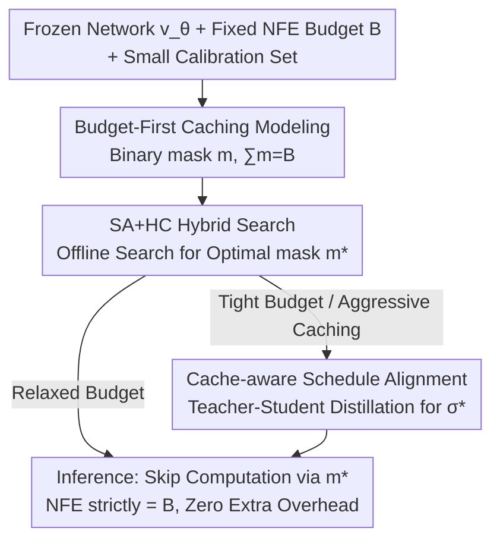

# Budget-Constrained Step-Level Diffusion Caching

**Conference**: ICML 2026  
**arXiv**: [2606.13496](https://arxiv.org/abs/2606.13496)  
**Code**: https://github.com/Westlake-AGI-Lab/BudCache  
**Area**: Diffusion Models / Image Generation / Inference Acceleration  
**Keywords**: Step-level caching, Budget-constrained, Combinatorial optimization, Simulated annealing, Schedule alignment

## TL;DR
BudCache transforms step-level caching for diffusion models from "passively triggered by thresholds with input-dependent latency" into "fixing a compute budget $B$ first, then searching for the optimal caching strategy offline." Using a hybrid of Simulated Annealing and Hill Climbing, it produces a static caching mask in minutes. For tight budgets, it employs teacher-student distillation to realign the schedule, outperforming heuristic caching methods like TeaCache and MagCache in quality across FLUX.1-dev and Wan2.1 under identical latency.

## Background & Motivation
**Background**: Generating an image with diffusion or flow-matching models requires solving a PF-ODE, which necessitates dozens to hundreds of network forward passes (NFE), resulting in high latency. Step-level caching is currently a popular training-free acceleration method—since feature evolution between adjacent denoising steps is slow, the network is only executed on a few key steps, while others reuse outputs or activations from the previous cache. TeaCache and MagCache belong to this category.

**Limitations of Prior Work**: Existing caching methods rely on **heuristic thresholds** to decide step-by-step during inference whether to compute or reuse. This introduces two practical issues: first, caching decisions are triggered by runtime signals, meaning NFE varies across different inputs, making **latency uncontrollable during deployment**; second, these step-wise decisions **do not directly optimize the final generation quality**, leading to suboptimal compute allocation for a given NFE budget.

**Key Challenge**: The threshold paradigm allows the "error threshold" to dictate the "compute cost," which reverses the causality. If a fixed cost is desired, one must indirectly tune thresholds, and the resulting strategies are often "myopic"—an early caching decision can cascade and amplify errors along the sampling trajectory.

**Goal**: (1) Ensure latency strictly equals the budget; (2) Maximize final output fidelity under that budget; (3) Further suppress trajectory drift introduced by caching when budgets are extremely tight.

**Key Insight**: Treat caching as a **resource allocation problem**—given a fixed compute budget, determine which denoising steps deserve fresh computation and which can be safely reused. Since the goal is the "optimal allocation for a fixed cost," rather than letting thresholds decide the cost online, one should adopt a **budget-first** approach: fix $B$ first and search for the caching strategy offline.

**Core Idea**: Replace online threshold triggering with a binary mask search under a fixed budget $B$. By searching for a static caching strategy $\mathbf{m}^*$ offline, there is zero search or threshold overhead during inference, and the latency is strictly $\text{NFE}=B$.

## Method

### Overall Architecture
The inputs to BudCache are a pre-trained (frozen) flow-matching network $\mathbf{v}_\theta$, a fixed NFE budget $B$, and a small calibration set. The output consists of two static components—a caching mask $\mathbf{m}^*$ and an aligned schedule $\boldsymbol{\sigma}^*$—which are applied directly during inference without any online overhead.

The pipeline consists of two stages of offline optimization: first, searching for the **caching strategy** on the fixed-budget manifold (using Simulated Annealing for global exploration and Hill Climbing for local refinement) to obtain the mask; when caching is aggressive (tight budget), a **cache-aware schedule alignment** is performed via teacher-student distillation to re-optimize the time discretization $\boldsymbol{\sigma}$ and compensate for trajectory drift. Both stages are completed before deployment.

### Key Designs

**1. Budget-First Caching Modeling: From "Threshold-defined Cost" to "Cost-defined Strategy"**

To address uncontrollable latency and lack of final output optimization in heuristic methods, BudCache models caching decisions as a binary mask $\mathbf{m}\in\{0,1\}^K$, where $m_k=1$ denotes fresh computation and $m_k=0$ denotes cache reuse. Letting $a(k)=\max\{j\le k\mid m_j=1\}$ be the index of the most recent computation, the cached Euler update is:

$$\mathbf{x}_{k+1}\leftarrow\mathbf{x}_k+(\sigma_{k+1}-\sigma_k)\cdot\mathbf{v}_\theta(\mathbf{x}_{a(k)},\sigma_{a(k)},c).$$

This step decouples the **discretization granularity $K$** from the **inference budget $B=\sum_k m_k$**: $K$ determines the trajectory resolution, while $B$ determines the number of computations. The optimization objective is to minimize the distillation loss $\mathcal L_{\text{distill}}$ between the cached output $x^{\mathsf S}$ and the full-compute output $x^{\mathsf T}$ under the constraint $\sum_k m_k=B, m_0=1$. The fundamental difference from the threshold paradigm is that latency is predetermined (strictly $\text{NFE}=B$), and the strategy is optimized end-to-end for the final output.

**2. SA+HC Hybrid Search: Escaping Local Optima and Locking the Global Minimum**

Mask searching is challenging: the space is discrete and massive ($\binom{K}{B}$ combinations), and the loss landscape is highly non-convex. Because sampling is sequential, early caching decisions alter the trajectory drift, cascading errors. Pure Hill Climbing (myopic local moves) easily gets stuck in local optima.

BudCache splits the search into two phases. **Phase 1: Global Exploration (Simulated Annealing, SA)**: Walking on the budget-constrained manifold $\mathcal M_B=\{\mathbf m\mid\sum m_k=B\}$ using two budget-preserving topological operators—Swap (swapping a compute bit with a reuse bit) and Shift (moving a compute bit to an adjacent position). Candidates are accepted per the Metropolis criterion:

$$P(\text{accept})=\min\!\Big(1,\exp\big(-\tfrac{\Delta\mathcal L}{T_t}\big)\Big).$$

**Phase 2: Deterministic Refinement (Hill Climbing, HC)**: As temperature $T_t\to0$, the search switches to greedy behavior—evaluating the entire Swap/Shift neighborhood $\mathcal N(\mathbf m)$ and deterministically moving to the neighbor with the largest loss reduction until convergence. This entire search completes in minutes on a small calibration set.

**3. Cache-aware Schedule Alignment: Rearranging Step Sizes Post-Mask Selection**

The searched $\mathbf m^*$ is initially applied to the original schedule designed for full computation. Under tight budgets, many steps use outdated vectors, altering the cumulative approximation error. The authors draw motivation from the drift term in the Euler update: using an expired vector $\mathbf v(\mathbf x_{a(k)})$ instead of the exact $\mathbf v(\mathbf x_k)$ introduces a local error $\mathbf e_k$:

$$\Delta\mathbf x_k=\underbrace{\Delta\sigma_k\,\mathbf v(\mathbf x_k)}_{\text{Ideal Update}}+\underbrace{\Delta\sigma_k\,\mathbf e_k}_{\text{Drift Term}}.$$

Crucially, the step size $\Delta\sigma_k$ performs **multiplicative amplification** on the error $\mathbf e_k$. By treating the schedule $\boldsymbol{\sigma}$ as a learnable parameter, **teacher-student distillation** is used to re-allocate time resolution:

$$\boldsymbol{\sigma}^*=\arg\min_{\boldsymbol{\sigma}}\,\mathbb E\big[\mathcal D\big(\mathbf x^{\mathsf S}(\mathbf m^*,\boldsymbol{\sigma}), \mathbf x^{\mathsf T}\big)\big].$$

This shrinks step sizes in regions with high caching errors and expands them where approximations are accurate.

### Loss & Training
Two separate optimization objectives are used, but neither modifies the network weights $\theta$ ($\mathbf{v}_\theta$ remains frozen throughout, enabling plug-and-play). In the search phase, the "loss" is the distillation distance $\mathcal L_{\text{distill}}(x^{\mathsf S},x^{\mathsf T})$. In the alignment phase, the loss is the output-level MSE $\mathcal D$, minimized via gradient descent only for the parameters $\boldsymbol{\sigma}$.

## Key Experimental Results

### Main Results
Evaluated on FLUX.1-dev (1024×1024 T2I, 28 steps), BudCache provides three budget tiers: ultra/fast/base (8/9/10 NFE). It consistently outperforms SOTA baselines at equivalent latencies, maintaining high-frequency details even at 3.73× acceleration (6 NFE).

| Method | NFE | Speedup↑ | LPIPS↓ | SSIM↑ | PSNR↑ | ImageReward↑ |
|------|-----|----------|--------|-------|-------|--------------|
| Original (28 steps) | 28 | 1.00× | – | – | – | 1.0138 |
| ERTACache | – | 3.00× | 0.3208 | 0.7603 | 20.343 | 0.9243 |
| TaylorSeer | – | 2.82× | 0.4490 | 0.6454 | 16.092 | 0.8857 |
| MagCache | – | 2.74× | 0.2498 | 0.7854 | 20.893 | 0.9544 |
| TeaCache | – | 2.51× | 0.3218 | 0.7362 | 18.401 | 0.9708 |
| **BudCache-ultra** | 8 | **3.00×** | 0.2479 | 0.7917 | 22.163 | 0.9495 |
| **BudCache-fast** | 9 | 2.74× | 0.2020 | 0.8201 | 23.586 | 0.9633 |
| **BudCache-base** | 10 | 2.51× | **0.1759** | **0.8374** | **24.903** | **0.9782** |

### Ablation Study
The main highlight is performance at the same acceleration ratio—a key selling point of the budget-first paradigm. On Wan2.1-T2V-1.3B (832×480, 81 frames, A800), BudCache achieves lower latency while exceeding TeaCache in PSNR/SSIM/LPIPS.

| Comparison (Same Speedup) | Metric | Heuristic Baseline | BudCache | Note |
|--------------------|------|-----------|----------|------|
| 2.74× | LPIPS↓ | 0.2498 (MagCache) | **0.2020** (fast) | Better reconstruction |
| 2.74× | PSNR↑ | 20.893 (MagCache) | **23.586** (fast) | +2.7 dB |
| 2.51× | LPIPS↓ | 0.3218 (TeaCache) | **0.1759** (base) | Significant lead |
| 3.00× | SSIM↑ | 0.7603 (ERTACache) | **0.7917** (ultra) | Outperforms at high tier |

### Key Findings
- The direct benefit of the budget-first paradigm is **strictly controllable latency** (NFE = $B$), outperforming heuristic baselines at every acceleration tier.
- BudCache-ultra (8 NFE) outperforms TeaCache running at a higher compute cost (2.51×), demonstrating that offline search for optimal compute allocation is more efficient than thresholding.
- Schedule alignment is most effective at **extremely tight budgets**, where each step carries a larger update and drift is most severe.
- The method is plug-and-play for multiple diffusion backbones, including various solvers, resolutions, and video models.

## Highlights & Insights
- **Correcting the Causality**: Flipping from "error threshold → compute cost" to "fixed cost → optimal strategy" addresses the root cause of variable latency and suboptimal allocation.
- **Optimization Strategy**: Applying SA+HC to depth generation acceleration avoids weight fine-tuning and produces a static mask, making it easy to deploy with zero inference overhead.
- **Multiplicative Error Observation**: The insight that step sizes amplify caching errors is transferable; any "stale value reuse" scheme can benefit from shrinking steps in high-error regions.

## Limitations & Future Work
- The caching strategy $\mathbf{m}^*$ is static for a **specific budget $B$ and calibration distribution**; changing the budget or distribution requires a re-search.
- Search quality depends on the representativeness of the calibration set relative to the deployment distribution.
- While offline, schedule alignment requires a distillation step, which adds a preprocessing stage compared to pure threshold methods.
- A static mask treats all inputs equally, unlike threshold methods that can adaptively compute more steps for "difficult" samples.

## Related Work & Insights
- **vs TeaCache / MagCache**: These use online thresholds for caching decisions, leading to variable latency and myopic decisions; BudCache fixes budget for an offline static strategy.
- **vs LeMiCa**: LeMiCa uses dynamic programming for global strategies; BudCache bypasses error estimation proxies by optimizing for final output fidelity directly via SA+HC.
- **vs Align-Your-Steps / LD3**: These optimize schedules for better discretization; BudCache uses schedule optimization specifically as a **compensation mechanism** for caching drift.

## Rating
- Novelty: ⭐⭐⭐⭐⭐ Paradigm shift from online thresholds to budget-first offline combinatorial search.
- Experimental Thoroughness: ⭐⭐⭐⭐ Extensive coverage across FLUX and Wan models, though focused on reconstruction fidelity.
- Writing Quality: ⭐⭐⭐⭐⭐ Logic flows clearly from motivation to architecture to compensation.
- Value: ⭐⭐⭐⭐⭐ High deployment value: training-free, plug-and-play, and strictly controllable latency.

<!-- RELATED:START -->

## Related Papers

- [\[ICML 2026\] DirectEdit: Step-Level Accurate Inversion for Flow-Based Image Editing](directedit_step-level_accurate_inversion_for_flow-based_image_editing.md)
- [\[CVPR 2026\] ResCa: Residual Caching for Diffusion Transformers Acceleration](../../CVPR2026/image_generation/resca_residual_caching_for_diffusion_transformers_acceleration.md)
- [\[NeurIPS 2025\] Diffusion Model as a Noise-Aware Latent Reward Model for Step-Level Preference Optimization](../../NeurIPS2025/image_generation/diffusion_model_as_a_noiseaware_latent_reward_model_for_step.md)
- [\[CVPR 2025\] Stretching Each Dollar: Diffusion Training from Scratch on a Micro-Budget](../../CVPR2025/image_generation/stretching_each_dollar_diffusion_training_from_scratch_on_a_micro-budget.md)
- [\[ICLR 2026\] Evolutionary Caching to Accelerate Your Off-the-Shelf Diffusion Model](../../ICLR2026/image_generation/evolutionary_caching_to_accelerate_your_off-the-shelf_diffusion_model.md)

<!-- RELATED:END -->
